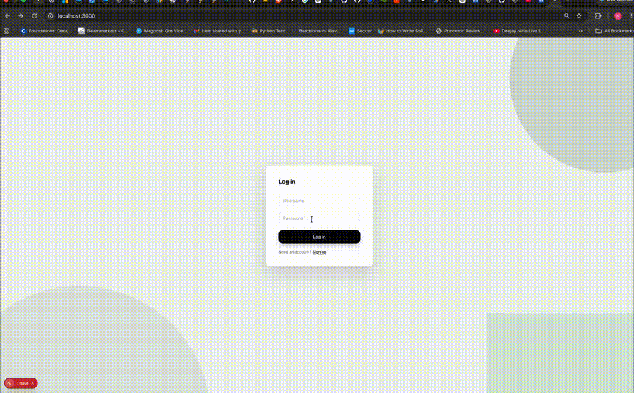

# CareerOS

An AI-powered platform that manages the complete software engineering job search lifecycle - job discovery, resume tailoring, cover letters, application tracking, and recruiter CRM.

## Demo

<b>End-to-end CareerOS demonstration showing resume upload, AI-ranked job matches, and per-job resume tailoring.</b>

[Watch the full demo video](docs/careeros-demo.mp4)

## Status
Platform is running as an MVP. README polish and supporting documentation will be updated soon.
