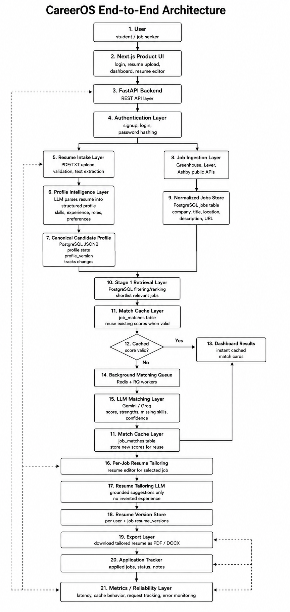

# CareerOS

> **A full-stack job search and matching platform that aggregates software engineering roles, ranks opportunities against a candidate profile, and manages the workflow from job discovery to application.**

CareerOS was built to solve a simple problem: searching for software engineering jobs across dozens of companies quickly becomes fragmented.

Jobs live across different applicant tracking systems. The same search is repeated across company career pages. Relevant roles have to be manually compared against a resume, and the information needed for an application ends up spread across multiple tools.

CareerOS brings that workflow into one system.

It continuously collects jobs from supported company sources, normalizes them into a common data model, stores them in PostgreSQL, and ranks relevant opportunities against a candidate profile.

---

## Demo

<p align="center">
<b>End-to-end CareerOS demonstration showing resume upload, AI-ranked job matches, and per-job resume tailoring.</b>
</p>


[Watch the full demo video](docs/careeros-demo.mp4)

---

## Key Capabilities

- **Job ingestion** - collects roles from supported company sources.
- **Source adapters** - normalizes Greenhouse, Lever, and Ashby jobs.
- **Resume parsing** - converts uploaded resumes into structured profiles.
- **Job matching** - ranks roles against candidate skills and experience.
- **Match caching** - reuses valid scores instead of recomputing.
- **Background workers** - moves slow ingestion and matching work out of API requests.
- **Resume tailoring** - creates per-job resume versions.
- **Application tracking** - stores applied jobs, status, and notes.

---

## Architecture

CareerOS separates external job ingestion, persistent storage, candidate matching, background processing, caching, API delivery, and the frontend application.



The architecture keeps the major workloads independent.

External source failures should not control frontend availability.

Matching should not require fetching jobs from external companies.

Background ingestion should not block API requests.

The frontend should not need to understand how individual applicant tracking systems represent jobs.

See [Architecture](docs/architecture.md) for the complete system design.

---

## Why CareerOS?

CareerOS started as a way to reduce the repetitive work involved in searching company career pages.

The interesting engineering problem quickly became larger than job scraping.

Different companies expose jobs differently.

External sources fail.

The same jobs can appear during multiple ingestion runs.

Job corpora grow continuously.

Matching becomes expensive if every request repeatedly loads and ranks thousands of records.

Long-running ingestion should not block user requests.

Cached results can become stale or invalid.

Those problems pushed CareerOS toward a system built around clear boundaries:

```text
Collect
   |
   v
Normalize
   |
   v
Persist
   |
   v
Match
   |
   v
Cache
   |
   v
Serve
```

Each stage solves a different problem.

---

## Job Ingestion Pipeline

CareerOS treats external job sources as unreliable systems.

The ingestion pipeline therefore separates source discovery from persistent job storage.

```text
Configured Companies
        |
        v
Source Resolution
        |
        v
ATS Adapter
        |
        v
Fetch Jobs
        |
        v
Normalize
        |
        v
Duplicate Detection
        |
        v
PostgreSQL
```

Source adapters isolate provider-specific formats.

The rest of CareerOS works with normalized job records rather than Greenhouse-, Lever-, or Ashby-specific payloads.

This makes additional sources easier to introduce without redesigning the matching system.

---

## Matching Engine

The matching system is designed around narrowing the candidate set before performing more expensive ranking work.

Instead of repeatedly loading the complete job corpus and filtering it entirely inside application code, database operations are used to eliminate irrelevant candidates earlier.

```text
Job Corpus
    |
    v
Database Filtering
    |
    v
Candidate Jobs
    |
    v
Matching / Ranking
    |
    v
Top Matches
```

This keeps the amount of data entering later matching stages small as the stored job corpus grows.

---

## Performance

CareerOS includes several performance-oriented design choices:

- database-side filtering and ranking,
- batched duplicate checks during ingestion,
- Redis-backed caching,
- asynchronous background workers,
- reusable cached match results,
- separation of external network work from request handling.

These optimizations focus on reducing unnecessary application work rather than simply adding more infrastructure.

Detailed measurements and methodology are documented in [Performance Baseline](docs/performance/baseline.md).

---

## Technology Stack

| Layer | Technology |
|---|---|
| Frontend | Next.js |
| Backend | FastAPI |
| Database | PostgreSQL |
| Cache | Redis |
| Background Jobs | RQ |
| Job Sources | Greenhouse, Lever, Ashby adapters |
| Containerization | Docker |
| API Style | REST |

---

## Repository Structure

```text
careeros/
|
+-- apps/
|   +-- api/                 # FastAPI backend
|   +-- web/                 # Next.js frontend
|
+-- docs/                    # Architecture and engineering documentation
+-- scripts/                 # Development and operational utilities
+-- docker-compose.yml
+-- docker-compose.prod.yml
+-- .env.example
+-- README.md
```

---

## Engineering Highlights

- Built a multi-source ingestion architecture that isolates ATS-specific behavior behind source adapters.
- Decoupled long-running ingestion from request handling using Redis-backed background workers.
- Moved matching filters and ranking closer to PostgreSQL to reduce unnecessary application-side processing.
- Added persistent caching for frequently requested matching results.
- Added duplicate detection and normalization to make repeated ingestion runs safer.
- Containerized application services for reproducible local and deployment environments.
- Structured the frontend and backend as independent applications with a REST API boundary.

---

## Development

Clone the repository:

```bash
git clone https://github.com/Nitin3560/careeros.git
cd careeros
```

Create the local environment configuration:

```bash
cp .env.example .env
```

Start the local services:

```bash
docker compose up --build
```

Quickstart documentation will be updated soon.

---

## Documentation

- [Architecture](docs/architecture.md)
- [Engineering Design Decisions](docs/design-decisions.md)
- [Job Ingestion Pipeline](docs/ingestion.md)
- [Candidate Matching Engine](docs/matching.md)
- [Performance Baseline](docs/performance/baseline.md)
- [Performance and Caching](docs/performance/caching.md)
- [Quickstart](docs/quickstart.md)

Background-worker documentation will be updated soon.

---

## Project Status

CareerOS is an actively developed MVP.

The core system includes job ingestion, persistent job storage, candidate matching, resume-aware workflows, background processing, caching, and the web application.

Current development is focused on hardening the system, improving observability and deployment workflows, and expanding measurable end-to-end evaluation.

---

## Closing Remarks

CareerOS began as a tool for finding relevant software engineering jobs.

The larger engineering problem became building a system that could continuously collect information from unreliable external sources, normalize it, process it asynchronously, efficiently rank a growing dataset, and expose the results through a responsive application.

The result is more than a job scraper.

> **CareerOS is a full-stack job search system that turns fragmented company job data into a persistent, searchable, and ranked candidate workflow.**

<!-- ENTRY_JOBS:START -->
## New Grad & Entry-Level Engineering Roles

Auto-updated hourly from CareerOS. Last run: **2026-09-19 21:12 UTC**. Showing U.S. software/AI/tech postings found in the last **7 days**.

Speed: CareerOS refreshes every hour from company career pages, then records the first time each posting was found. Current feed size: **26** roles.

Eligibility: U.S. full-time software/AI roles whose posting states **0–2 years** of professional experience. Internships and roles requiring more than 2 years are excluded.

Quick links: [Tier 1](#tier-1) · [Tier 2](#tier-2) · [Tier 3](#tier-3)

### Tier 1

Large public and established technology, financial, and enterprise companies.

| Company | Role | Experience | Posted | Found | Salary | Apply |
|---|---|---|---|---|---|---|
| pinterest | Software Engineer II, Data Analytics & Engineering<br><sub>San Francisco, CA, US; Remote, US</sub> | 2 years | 2026-09-19 | 1 hour ago |  | [Apply](https://www.pinterestcareers.com/jobs/?gh_jid=8213988) |
| reddit | Software Engineer, Ingestion Platform<br><sub>Remote - United States</sub> | 2 years | 2026-09-18 | 1 hour ago |  | [Apply](https://job-boards.greenhouse.io/reddit/jobs/8214910) |
| coinbase | Software Engineer, Developer Infrastructure<br><sub>Remote - USA</sub> | 2 years | 2026-09-18 | 3 days ago |  | [Apply](https://www.coinbase.com/careers/positions/7991839?gh_jid=7991839) |
| doordashusa | Software Engineer, Full Stack - Developer Insights<br><sub>San Francisco, CA; New York, NY; Los Angeles, CA; Seattle, WA</sub> | 2 years | 2026-09-17 | 1 hour ago |  | [Apply](https://job-boards.greenhouse.io/doordashusa/jobs/8207877) |
| esri | Software Developer II - Android Apps<br><sub>Portland, ME</sub> | 2 years | 2026-09-16 | 1 hour ago |  | [Apply](https://www.esri.com/careers/5040328007?gh_jid=5040328007) |
| amazon | Software Development Engineer, AWS Security<br><sub>Seattle, Washington, USA</sub> | 1 year | 2026-09-16 | 1 hour ago |  | [Apply](https://account.amazon.jobs/jobs/10544608/apply) |
| amazon | Software Dev Engineer II-TEST , Agentic Workspaces <br><sub>Seattle, Washington, USA</sub> | 1–2 years | 2026-09-16 | 1 hour ago |  | [Apply](https://account.amazon.jobs/jobs/10544628/apply) |
| esri | Software Developer I - Web Components<br><sub>Redlands, CA</sub> | 1 year | 2026-09-15 | 3 days ago |  | [Apply](https://www.esri.com/careers/5227685007?gh_jid=5227685007) |
| esri | Software Engineer I - Front-End Engineer for ArcGIS Enterprise<br><sub>Redlands, CA</sub> | 1 year | 2026-09-14 | 3 days ago |  | [Apply](https://www.esri.com/careers/5190253007?gh_jid=5190253007) |
| amazon | Software Development Engineer, Catalog System Services - SPCL <br><sub>Seattle, Washington, USA</sub> | 1 year | 2026-09-14 | 1 hour ago |  | [Apply](https://account.amazon.jobs/jobs/10539357/apply) |
| klaviyo | IT Systems Engineer <br><sub>Boston, MA</sub> | 2 years | 2026-09-11 | 3 days ago |  | [Apply](https://www.klaviyo.com/careers/jobs/7990570003?gh_jid=7990570003) |
| lyft | Machine Learning Engineer, Fulfillment<br><sub>San Francisco, CA</sub> | 2 years | 2026-09-11 | 3 days ago | $140,800 - $176,000 | [Apply](https://app.careerpuck.com/job-board/lyft/job/8688633002?gh_jid=8688633002) |
| esri | C++ Software Developer II - Raster Analysis<br><sub>Redlands, CA</sub> | 2 years | 2026-09-11 | 3 days ago |  | [Apply](https://www.esri.com/careers/5177200007?gh_jid=5177200007) |
| esri | Spatial Data Engineer II<br><sub>Redlands, CA</sub> | 2 years | 2026-09-11 | 3 days ago |  | [Apply](https://www.esri.com/careers/5230512007?gh_jid=5230512007) |
| robinhood | Software Engineer, Tokenization<br><sub>Menlo Park, CA; New York, NY</sub> | 2 years | 2026-09-11 | 3 days ago |  | [Apply](https://boards.greenhouse.io/robinhood/jobs/8189005?t=gh_src=&gh_jid=8189005) |
| coinbase | Software Engineer- Money Movement <br><sub>Remote - USA</sub> | 2 years | 2026-09-10 | 3 days ago |  | [Apply](https://www.coinbase.com/careers/positions/8177946?gh_jid=8177946) |
| amazon | Software Development Engineer, iOS<br><sub>Cambridge, Massachusetts, USA</sub> | 1 year | 2026-09-09 | 1 hour ago |  | [Apply](https://account.amazon.jobs/jobs/10535234/apply) |
| thenewyorktimes | Software Engineer, Growth Conversion<br><sub>New York, NY</sub> | 2 years | 2026-09-08 | 3 days ago |  | [Apply](https://job-boards.greenhouse.io/thenewyorktimes/jobs/4730745005) |
| amazon | Software Development Engineer, CreativeX<br><sub>New York, New York, USA</sub> | 1–2 years | 2026-09-08 | 1 hour ago |  | [Apply](https://account.amazon.jobs/jobs/10532554/apply) |
| lyft | Machine Learning Engineer<br><sub>New York, NY</sub> | 2 years | 2026-09-04 | 3 days ago | $140,800 - $176,000 | [Apply](https://app.careerpuck.com/job-board/lyft/job/8689127002?gh_jid=8689127002) |
| coinbase | Threat Intelligence Platform Engineer<br><sub>Remote - USA</sub> | 2 years | 2026-09-03 | 3 days ago |  | [Apply](https://www.coinbase.com/careers/positions/8177619?gh_jid=8177619) |
| amazon | Software Development Engineer, SageMaker HyperPod Data Plane<br><sub>Santa Clara, California, USA</sub> | 1 year | 2026-08-27 | 1 hour ago |  | [Apply](https://account.amazon.jobs/jobs/10517662/apply) |

### Tier 2

Established mid-sized companies with meaningful engineering organizations.

| Company | Role | Experience | Posted | Found | Salary | Apply |
|---|---|---|---|---|---|---|
| rdccareers | Full Stack Software Engineer <br><sub>Austin, Texas, United States</sub> | 2 years | 2026-09-19 | 1 hour ago |  | [Apply](https://boards.greenhouse.io/rdccareers/jobs/7997475003?gh_jid=7997475003) |
| abnormalsecurity | Software Engineer II - Insider Risk<br><sub>Hybrid - San Francisco, CA, USA</sub> | 2 years | 2026-09-11 | 3 days ago |  | [Apply](https://abnormal.ai/careers/jobs/7992780003?gh_jid=7992780003) |
| chime | Software Engineer, Growth<br><sub>San Francisco, CA, USA</sub> | 2 years | 2026-09-10 | 3 days ago |  | [Apply](https://boards.greenhouse.io/chime/jobs/8782503002?gh_jid=8782503002) |

### Tier 3

Startups, early-stage companies, and smaller technology businesses.

| Company | Role | Experience | Posted | Found | Salary | Apply |
|---|---|---|---|---|---|---|
| altentechnologyusa | Embedded Software Application Engineer<br><sub>Greensboro, North Carolina, United States</sub> | 2 years | 2026-09-09 | 3 days ago | $75,000 - $77,000 | [Apply](https://job-boards.greenhouse.io/altentechnologyusa/jobs/5233722007) |

<!-- ENTRY_JOBS:END -->
