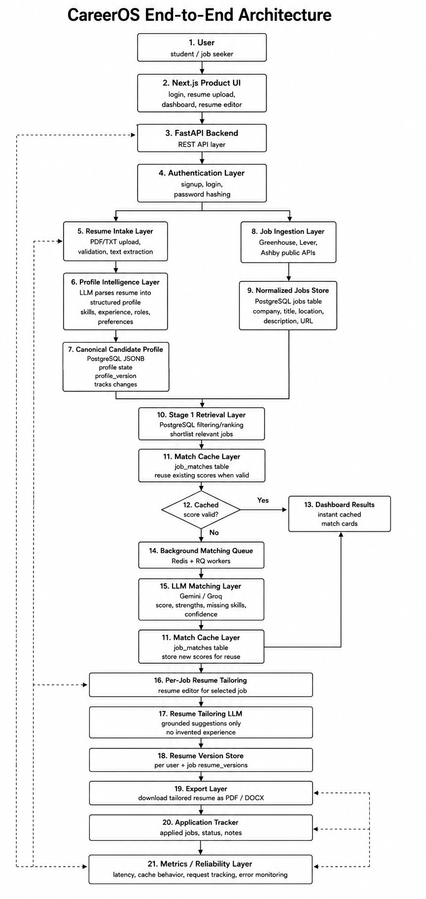

# CareerOS

> **A full-stack job search and matching platform that aggregates software engineering roles, ranks opportunities against a candidate profile, and manages the workflow from job discovery to application.**

> **Recent jobs:** [Browse the U.S. technology jobs feed](https://nitin3560.github.io/careeros/).

CareerOS was built to solve a simple problem: searching for software engineering jobs across dozens of companies quickly becomes fragmented.

Jobs live across different applicant tracking systems. The same search is repeated across company career pages. Relevant roles have to be manually compared against a resume, and the information needed for an application ends up spread across multiple tools.

CareerOS brings that workflow into one system.

It continuously collects jobs from supported company sources, normalizes them into a common data model, stores them in PostgreSQL, and ranks relevant opportunities against a candidate profile.

---

## Demo

<p align="center">
<b>End-to-end CareerOS demonstration showing resume upload, AI-ranked job matches, and per-job resume tailoring.</b>
</p>


[Watch the full demo video](docs/careeros-demo.mp4)

---

## Key Capabilities

- **Job ingestion** - collects roles from supported company sources.
- **Source adapters** - normalizes Greenhouse, Lever, and Ashby jobs.
- **Resume parsing** - converts uploaded resumes into structured profiles.
- **Job matching** - ranks roles against candidate skills and experience.
- **Match caching** - reuses valid scores instead of recomputing.
- **Background workers** - moves slow ingestion and matching work out of API requests.
- **Resume tailoring** - creates per-job resume versions.
- **Application tracking** - stores applied jobs, status, and notes.

---

## Architecture

CareerOS separates external job ingestion, persistent storage, candidate matching, background processing, caching, API delivery, and the frontend application.



The architecture keeps the major workloads independent.

External source failures should not control frontend availability.

Matching should not require fetching jobs from external companies.

Background ingestion should not block API requests.

The frontend should not need to understand how individual applicant tracking systems represent jobs.

See [Architecture](docs/architecture.md) for the complete system design.

---

## Why CareerOS?

CareerOS started as a way to reduce the repetitive work involved in searching company career pages.

The interesting engineering problem quickly became larger than job scraping.

Different companies expose jobs differently.

External sources fail.

The same jobs can appear during multiple ingestion runs.

Job corpora grow continuously.

Matching becomes expensive if every request repeatedly loads and ranks thousands of records.

Long-running ingestion should not block user requests.

Cached results can become stale or invalid.

Those problems pushed CareerOS toward a system built around clear boundaries:

```text
Collect
   |
   v
Normalize
   |
   v
Persist
   |
   v
Match
   |
   v
Cache
   |
   v
Serve
```

Each stage solves a different problem.

---

## Job Ingestion Pipeline

CareerOS treats external job sources as unreliable systems.

The ingestion pipeline therefore separates source discovery from persistent job storage.

```text
Configured Companies
        |
        v
Source Resolution
        |
        v
ATS Adapter
        |
        v
Fetch Jobs
        |
        v
Normalize
        |
        v
Duplicate Detection
        |
        v
PostgreSQL
```

Source adapters isolate provider-specific formats.

The rest of CareerOS works with normalized job records rather than Greenhouse-, Lever-, or Ashby-specific payloads.

This makes additional sources easier to introduce without redesigning the matching system.

---

## Matching Engine

The matching system is designed around narrowing the candidate set before performing more expensive ranking work.

Instead of repeatedly loading the complete job corpus and filtering it entirely inside application code, database operations are used to eliminate irrelevant candidates earlier.

```text
Job Corpus
    |
    v
Database Filtering
    |
    v
Candidate Jobs
    |
    v
Matching / Ranking
    |
    v
Top Matches
```

This keeps the amount of data entering later matching stages small as the stored job corpus grows.

---

## Performance

CareerOS includes several performance-oriented design choices:

- database-side filtering and ranking,
- batched duplicate checks during ingestion,
- Redis-backed caching,
- asynchronous background workers,
- reusable cached match results,
- separation of external network work from request handling.

These optimizations focus on reducing unnecessary application work rather than simply adding more infrastructure.

Detailed measurements and methodology are documented in [Performance Baseline](docs/performance/baseline.md).

---

## Technology Stack

| Layer | Technology |
|---|---|
| Frontend | Next.js |
| Backend | FastAPI |
| Database | PostgreSQL |
| Cache | Redis |
| Background Jobs | RQ |
| Job Sources | Greenhouse, Lever, Ashby adapters |
| Containerization | Docker |
| API Style | REST |

---

## Repository Structure

```text
careeros/
|
+-- apps/
|   +-- api/                 # FastAPI backend
|   +-- web/                 # Next.js frontend
|
+-- docs/                    # Architecture and engineering documentation
+-- scripts/                 # Development and operational utilities
+-- docker-compose.yml
+-- docker-compose.prod.yml
+-- .env.example
+-- README.md
```

---

## Engineering Highlights

- Built a multi-source ingestion architecture that isolates ATS-specific behavior behind source adapters.
- Decoupled long-running ingestion from request handling using Redis-backed background workers.
- Moved matching filters and ranking closer to PostgreSQL to reduce unnecessary application-side processing.
- Added persistent caching for frequently requested matching results.
- Added duplicate detection and normalization to make repeated ingestion runs safer.
- Containerized application services for reproducible local and deployment environments.
- Structured the frontend and backend as independent applications with a REST API boundary.

---

## Development

Clone the repository:

```bash
git clone https://github.com/Nitin3560/careeros.git
cd careeros
```

Create the local environment configuration:

```bash
cp .env.example .env
```

Start the local services:

```bash
docker compose up --build
```

Quickstart documentation will be updated soon.

### Bulk collection poller rollout

Run these steps in order from the repository root. The poller collects raw jobs and normalized descriptions only; classification and matching stay downstream.

```bash
# 1. Schema and legacy board links
cd apps/api && alembic upgrade head && cd ../..
python scripts/backfill_job_board_ids.py
python scripts/backfill_job_descriptions.py --batch-size 500 --sleep-between-batches 1.0
python scripts/assign_board_tiers.py

# 2. Capacity and real-source quality checks
python scripts/load_test_poller.py
python scripts/smoke_test_sources.py --database-url "$DATABASE_URL"

# 3. One full shadow sweep (expiry remains off)
POLLER_EXPIRY_ENABLED=false python scripts/run_poller.py

# 4. In another terminal, inspect coverage and quality
python scripts/coverage_report.py
```

Run either the Docker `poller` service or the manual command, never both. The
poller holds a PostgreSQL advisory lock and exits non-zero if another instance
is active. It claims due boards in batches of 300 by default
(`POLLER_BATCH_SIZE`) and caps Greenhouse detail requests at 200 per board
(`POLLER_DETAIL_CAP_PER_BOARD`).

Never run the description backfill during the first full poller sweep. Both
jobs write to the `jobs` table, and running them together can saturate
PostgreSQL WAL and Docker disk I/O. Finish the initial sweep first, then run
the resumable backfill by itself, preferably overnight.

Legacy Greenhouse rows are deliberately skipped by the normal sweep. Refresh
their descriptions separately with a resumable, rate-limited command:

```bash
python scripts/refresh_legacy_greenhouse.py --rate 5 --batch-size 500
```

`POLLER_CONCURRENCY` defaults to `64`. Use `POLLER_BOARD_LIMIT` and `POLLER_ATS` for bounded tests. After reviewing a clean full sweep, restart with `POLLER_EXPIRY_ENABLED=true`. Enable the daily cleanup only after that by setting `POLLER_RETENTION_ENABLED=true` and running `scripts/retain_expired_jobs.py`. The coverage report writes `reports/coverage_report.json`; focus on schedule lag, p50/p95 latency, source-level description quality, and first-seen freshness.

---

## Documentation

- [Architecture](docs/architecture.md)
- [Engineering Design Decisions](docs/design-decisions.md)
- [Job Ingestion Pipeline](docs/ingestion.md)
- [Candidate Matching Engine](docs/matching.md)
- [Performance Baseline](docs/performance/baseline.md)
- [Performance and Caching](docs/performance/caching.md)
- [Quickstart](docs/quickstart.md)

Background-worker documentation will be updated soon.

---

## Project Status

CareerOS is an actively developed MVP.

The core system includes job ingestion, persistent job storage, candidate matching, resume-aware workflows, background processing, caching, and the web application.

Current development is focused on hardening the system, improving observability and deployment workflows, and expanding measurable end-to-end evaluation.

---

## Closing Remarks

CareerOS began as a tool for finding relevant software engineering jobs.

The larger engineering problem became building a system that could continuously collect information from unreliable external sources, normalize it, process it asynchronously, efficiently rank a growing dataset, and expose the results through a responsive application.

The result is more than a job scraper.

> **CareerOS is a full-stack job search system that turns fragmented company job data into a persistent, searchable, and ranked candidate workflow.**

<!-- ENTRY_JOBS:START -->
## Recent U.S. Technology Job Openings

Auto-updated hourly from CareerOS. Last run: **2026-09-28 22:36 UTC**. Showing U.S. software/AI/tech postings found in the last **7 days**.

Speed: CareerOS refreshes every hour from company career pages, then records the first time each posting was found. Current feed size: **2089** roles.

Eligibility: recent software, AI/ML, data, infrastructure, security, embedded, and related engineering roles across experience levels. Internships, obvious non-technical roles, explicit non-U.S. postings, unclear locations, and defense/clearance-restricted roles are excluded. U.S. locations must be explicit in the posting or its application link.

Quick links: [Tier 1](#tier-1) · [Tier 2](#tier-2) · [Tier 3](#tier-3)

### Tier 1

Large public and established technology, financial, and enterprise companies.

| Company | Role | Experience | Posted | Found | Salary | Apply |
|---|---|---|---|---|---|---|
| Capital One | Full-stack Engineer 4<br><sub>New York, NY</sub> | 4 years | 2026-09-27 | 1 day ago |  | [Apply](https://capitalone.wd12.myworkdayjobs.com/Capital_One/job/New-York-NY/Full-stack-Engineer-4_R1001848-2) |
| Capital One | Full-stack Engineer 4 (Java, Python, AWS, Spark)<br><sub>Richmond, VA</sub> | 4 years | 2026-09-27 | 1 day ago |  | [Apply](https://capitalone.wd12.myworkdayjobs.com/Capital_One/job/Richmond-VA/Full-stack-Engineer-4--Java--Python--AWS--Spark-_R1001880-1) |
| Capital One | Data Engineer 5<br><sub>Richmond, VA</sub> | 6 years | 2026-09-27 | 1 day ago |  | [Apply](https://capitalone.wd12.myworkdayjobs.com/Capital_One/job/Richmond-VA/Data-Engineer-5_R1001478-1) |
| Capital One | Cloud Engineer 4  (Cloud Security for Multi Cloud) (Cloud Operations Resilience Engineering)<br><sub>McLean, VA</sub> | 5 years | 2026-09-26 | 2 days ago |  | [Apply](https://capitalone.wd12.myworkdayjobs.com/Capital_One/job/McLean-VA/Cloud-Engineer-4---Cloud-Security-for-Multi-Cloud---Cloud-Operations-Resilience-Engineering-_R1001691-1) |
| Capital One | Full Stack Engineer 4 (Bank Tech)<br><sub>United States (from job link)</sub> | 4 years | 2026-09-26 | 2 days ago |  | [Apply](https://capitalone.wd12.myworkdayjobs.com/Capital_One/job/McLean-VA/Full-Stack-Engineer-4--Bank-Tech-_R1001545-1) |
| Snowflake | Staff Software Engineer - Postgres Control Plane<br><sub>US-WA-Bellevue</sub> | 7+ years | 2026-09-26 | 2 days ago |  | [Apply](https://jobs.ashbyhq.com/snowflake/b99ba76c-0938-4a41-931b-d1fb2543126c) |
| Capital One | Senior Staff AI Engineer (Remote Eligible)<br><sub>United States (from job link)</sub> | 10 years | 2026-09-25 | 2 days ago |  | [Apply](https://capitalone.wd12.myworkdayjobs.com/Capital_One/job/San-Francisco--CA/Senior-Staff-AI-Engineer--Remote-Eligible-_R1001975-1) |
| Snowflake | Software Engineer - Postgres<br><sub>US-CA-Menlo Park</sub> | 2+ years | 2026-09-25 | 2 days ago |  | [Apply](https://jobs.ashbyhq.com/snowflake/6e96b818-2350-4601-8bdd-7ddd6c4a5f6d) |
| Roblox | Senior Software Engineer (Backend/Product focus, AIaaS)<br><sub>San Mateo, CA, United States</sub> | 5+ years | 2026-09-25 | 2 days ago |  | [Apply](https://careers.roblox.com/jobs/8231343?gh_jid=8231343) |
| Coinbase | Staff Software Engineer (Platform - Financial Engineering)<br><sub>Remote - USA</sub> | 8+ years | 2026-09-25 | 3 days ago |  | [Apply](https://www.coinbase.com/careers/positions/8204243?gh_jid=8204243) |
| Capital One | Applied Researcher 5 (AI Foundations - LLM, Optimization and Finetuning)<br><sub>United States (from job link)</sub> | 2 years | 2026-09-25 | 3 days ago |  | [Apply](https://capitalone.wd12.myworkdayjobs.com/Capital_One/job/New-York-NY/Applied-Researcher-5--AI-Foundations---LLM--Optimization-and-Finetuning-_R1001371-1) |
| Capital One | Full-stack Engineer 5 (Python, Typescript, React, AWS)<br><sub>United States (from job link)</sub> | 6 years | 2026-09-25 | 3 days ago |  | [Apply](https://capitalone.wd12.myworkdayjobs.com/Capital_One/job/Cambridge-MA/Full-stack-Engineer-5--Python--Typescript--React--AWS-_R1001614-1) |
| Capital One | Principal Data Scientist - AI for Data and Assessment<br><sub>United States (from job link)</sub> | 5 years | 2026-09-25 | 3 days ago |  | [Apply](https://capitalone.wd12.myworkdayjobs.com/Capital_One/job/McLean-VA/Principal-Data-Scientist---AI-Foundations--Specialist-Models_R1001731-2) |
| Capital One | Manager, Data Science - People Tech<br><sub>United States (from job link)</sub> | 6 years | 2026-09-25 | 3 days ago |  | [Apply](https://capitalone.wd12.myworkdayjobs.com/Capital_One/job/New-York-NY/Manager--Data-Science---People-Tech_R1001927-1) |
| Capital One | Full-stack Engineer 5  (Typescript/Nodejs/Python)<br><sub>United States (from job link)</sub> | 6 years | 2026-09-25 | 3 days ago |  | [Apply](https://capitalone.wd12.myworkdayjobs.com/Capital_One/job/Plano-TX/Full-stack-Engineer-5---Typescript-Nodejs-Python-_R1001688-1) |
| Capital One | Manager, Product Management - AI/ML, Enterprise Feature Platform<br><sub>United States (from job link)</sub> | 3 years | 2026-09-25 | 3 days ago |  | [Apply](https://capitalone.wd12.myworkdayjobs.com/Capital_One/job/McLean-VA/Manager--Product-Management---AI-ML--Enterprise-Feature-Platform_R1001394) |
| Instacart | Senior Software Engineer II - Ads Quality <br><sub>United States - Remote</sub> | 3+ years | 2026-09-25 | 3 days ago |  | [Apply](https://instacart.careers/job/?gh_jid=8234282) |
| Roblox | Software Engineer, GenAI Platform<br><sub>San Mateo, CA, United States</sub> | 1–3 years | 2026-09-25 | 3 days ago |  | [Apply](https://careers.roblox.com/jobs/8171283?gh_jid=8171283) |
| Roblox | Principal Software Engineer - Object Store<br><sub>San Mateo, CA, United States</sub> | 8+ years | 2026-09-25 | 3 days ago |  | [Apply](https://careers.roblox.com/jobs/8224135?gh_jid=8224135) |
| Intel | AI Performance Library Architect<br><sub>United States (from job link)</sub> | 5+ years | 2026-09-25 | 3 days ago |  | [Apply](https://intel.wd1.myworkdayjobs.com/External/job/US-Oregon-Hillsboro/AI-Performance-Library-Architect_JR0281978-1) |
| Capital One | Staff AI Engineer<br><sub>United States (from job link)</sub> | 8 years | 2026-09-25 | 3 days ago |  | [Apply](https://capitalone.wd12.myworkdayjobs.com/Capital_One/job/McLean-VA/Staff-AI-Engineer_R1001941) |
| Capital One | Full-stack Engineer 4 (Java, Python, Docker, AI) (Enterprise Platforms Technology)<br><sub>Plano, TX</sub> | 4 years | 2026-09-25 | 3 days ago |  | [Apply](https://capitalone.wd12.myworkdayjobs.com/Capital_One/job/Plano-TX/Full-stack-Engineer-4--Java--Python--Docker--AI---Enterprise-Platforms-Technology-_R1001749-1) |
| Capital One | AI Engineer 5 (Gen AI Platform Services)<br><sub>United States (from job link)</sub> | 6 years | 2026-09-25 | 3 days ago |  | [Apply](https://capitalone.wd12.myworkdayjobs.com/Capital_One/job/New-York-NY/AI-Engineer-5--Gen-AI-Platform-Services-_R1001173-1) |
| Capital One | Full-stack Engineer 4, Tech College Engineering<br><sub>United States (from job link)</sub> | 4 years | 2026-09-25 | 3 days ago |  | [Apply](https://capitalone.wd12.myworkdayjobs.com/Capital_One/job/Plano-TX/Full-stack-Engineer-4--Tech-College-Engineering_R1001831) |
| Capital One | Machine Learning Engineer 5<br><sub>United States (from job link)</sub> | 6 years | 2026-09-25 | 3 days ago |  | [Apply](https://capitalone.wd12.myworkdayjobs.com/Capital_One/job/New-York-NY/Machine-Learning-Engineer-5_R1001829-1) |
| Roblox | Senior Frontend Engineer, Discovery UX<br><sub>San Mateo, CA, United States</sub> | 3+ years | 2026-09-25 | 3 days ago |  | [Apply](https://careers.roblox.com/jobs/8168346?gh_jid=8168346) |
| Airbnb | Staff Data Scientist, Guest & Host<br><sub>United States</sub> | 9+ years | 2026-09-25 | 3 days ago |  | [Apply](https://careers.airbnb.com/positions/7705262?gh_jid=7705262) |
| Target | Senior Systems Engineer - Regional Distribution Center - Fridley, MN<br><sub>1090 73rd Ave NE, Fridley,MN 55432-3407</sub> | Not stated | 2026-09-25 | 3 days ago |  | [Apply](https://target.wd5.myworkdayjobs.com/targetcareers/job/1090-73rd-Ave-NE-FridleyMN-55432-3407/Senior-Systems-Engineer---Regional-Distribution-Center---Fridley--MN_R0000425193) |
| Stripe | Staff Software Engineer, Link - Bank Connections<br><sub>San Francisco, Seattle, New York</sub> | 10+ years | 2026-09-25 | 3 days ago |  | [Apply](https://stripe.com/jobs/search?gh_jid=8142952) |
| Capital One | Full-Stack Engineer 4 (Risk Tech)<br><sub>United States (from job link)</sub> | 4 years | 2026-09-25 | 3 days ago |  | [Apply](https://capitalone.wd12.myworkdayjobs.com/Capital_One/job/McLean-VA/Full-Stack-Engineer-4--Risk-Tech-_R1001842-1) |
| Capital One | Staff Full-Stack Engineer<br><sub>United States (from job link)</sub> | 7 years | 2026-09-25 | 3 days ago |  | [Apply](https://capitalone.wd12.myworkdayjobs.com/Capital_One/job/McLean-VA/Staff-Full-Stack-Engineer_R1001502-1) |
| Capital One | Staff AI Engineer (Remote Eligible)<br><sub>United States (from job link)</sub> | 8 years | 2026-09-25 | 3 days ago |  | [Apply](https://capitalone.wd12.myworkdayjobs.com/Capital_One/job/San-Francisco--CA/Staff-AI-Engineer--Remote-Eligible-_R1001914) |
| Capital One | Full Stack Engineer 4 - MLOps<br><sub>McLean, VA</sub> | 4 years | 2026-09-25 | 3 days ago |  | [Apply](https://capitalone.wd12.myworkdayjobs.com/Capital_One/job/McLean-VA/Full-Stack-Engineer-4---MLOps_R1001163-1) |
| Roblox | Distinguished Engineer, Machine Learning - Discovery<br><sub>San Mateo, CA, United States</sub> | 10+ years | 2026-09-25 | 3 days ago |  | [Apply](https://careers.roblox.com/jobs/8104808?gh_jid=8104808) |
| Workday | Machine Learning Engineer - Payroll<br><sub>USA, CA, Pleasanton</sub> | 5+ years | 2026-09-25 | 3 days ago |  | [Apply](https://workday.wd5.myworkdayjobs.com/Workday/job/USA-CA-Pleasanton/Machine-Learning-Engineer---Payroll_JR-0108977) |
| Capital One | Data Engineer 4 (Python, AWS, SQL, GenAI) (Enterprise Platforms Technology)<br><sub>United States (from job link)</sub> | 4 years | 2026-09-25 | 3 days ago |  | [Apply](https://capitalone.wd12.myworkdayjobs.com/Capital_One/job/McLean-VA/Data-Engineer-4--Python--AWS--SQL--GenAI---Enterprise-Platforms-Technology-_R1001761-1) |
| Capital One | Sr. Staff Software Engineer - Card Tech<br><sub>United States (from job link)</sub> | 9 years | 2026-09-25 | 3 days ago |  | [Apply](https://capitalone.wd12.myworkdayjobs.com/Capital_One/job/San-Francisco--CA/Sr-Staff-Software-Engineer---Card-Tech_R1001890-1) |
| Intel | Neuromorphic/AI Research Scientist<br><sub>United States (from job link)</sub> | 2+ years | 2026-09-25 | 3 days ago |  | [Apply](https://intel.wd1.myworkdayjobs.com/External/job/US-California-Santa-Clara/Neuromorphic-AI-Research-Scientist_JR0284193) |
| Intel | Mfg Systems Software Development Engineer<br><sub>United States (from job link)</sub> | Not stated | 2026-09-25 | 3 days ago |  | [Apply](https://intel.wd1.myworkdayjobs.com/External/job/US-Oregon-Hillsboro/Mfg-Systems-Software-Development-Engineer_JR0287195-1) |
| Roblox | Senior Software Engineer, Creator Services Translation <br><sub>San Mateo, CA, United States</sub> | 7+ years | 2026-09-25 | 3 days ago |  | [Apply](https://careers.roblox.com/jobs/8213903?gh_jid=8213903) |
| Workday | Senior Machine Learning Engineer - AI Platform<br><sub>United States (from job link)</sub> | 5+ years | 2026-09-25 | 3 days ago |  | [Apply](https://workday.wd5.myworkdayjobs.com/Workday/job/USA-CO-Boulder/Machine-Learning-Engineer-III---Senior-Machine-Learning-Engineer---AI-Platform_JR-0106812) |
| Capital One | Staff Software Engineer - Card Tech<br><sub>San Francisco,  CA</sub> | 7 years | 2026-09-25 | 3 days ago |  | [Apply](https://capitalone.wd12.myworkdayjobs.com/Capital_One/job/San-Francisco--CA/Staff-Software-Engineer---Card-Tech_R1000057-1) |
| Capital One | Machine Learning Engineer 4 (Manager, IC)<br><sub>United States (from job link)</sub> | 4 years | 2026-09-25 | 3 days ago |  | [Apply](https://capitalone.wd12.myworkdayjobs.com/Capital_One/job/Chicago-IL/Machine-Learning-Engineer-4--Manager--IC-_R1001677-1) |
| Capital One | Data Analysis Manager - Analysis Platform Product<br><sub>United States (from job link)</sub> | 6 years | 2026-09-25 | 3 days ago |  | [Apply](https://capitalone.wd12.myworkdayjobs.com/Capital_One/job/McLean-VA/Data-Analysis-Manager---Analysis-Platform-Product_R999597-1) |
| Capital One | Sr. Manager, Full-stack Engineer (Java, Python, Docker, AI) (Enterprise Platforms Technology)<br><sub>Plano, TX</sub> | 6 years | 2026-09-25 | 3 days ago |  | [Apply](https://capitalone.wd12.myworkdayjobs.com/Capital_One/job/Plano-TX/Sr-Manager--Full-stack-Engineer--Java--Python--Docker--AI---Enterprise-Platforms-Technology-_R1001642-1) |
| Capital One | Machine Learning Engineer 5 (IC)<br><sub>United States (from job link)</sub> | 6 years | 2026-09-25 | 3 days ago |  | [Apply](https://capitalone.wd12.myworkdayjobs.com/Capital_One/job/McLean-VA/Machine-Learning-Engineer-5--IC-_R1001797-1) |
| Capital One | Machine Learning Engineer 4 - Intelligent Foundations and Experiences (IFX)<br><sub>New York, NY</sub> | 4 years | 2026-09-25 | 3 days ago |  | [Apply](https://capitalone.wd12.myworkdayjobs.com/Capital_One/job/New-York-NY/Machine-Learning-Engineer-4---Intelligent-Foundations-and-Experiences--IFX-_R1001617-1) |
| Capital One | Full-stack Engineer 5 (GraphDB & API Platform) (Enterprise Platforms Technology)<br><sub>United States (from job link)</sub> | 6 years | 2026-09-25 | 3 days ago |  | [Apply](https://capitalone.wd12.myworkdayjobs.com/Capital_One/job/Richmond-VA/Full-stack-Engineer-5--GraphDB---API-Platform---Enterprise-Platforms-Technology-_R1001799-1) |
| Capital One | AI Engineer 4 (AI Foundations)<br><sub>United States (from job link)</sub> | 4 years | 2026-09-25 | 3 days ago |  | [Apply](https://capitalone.wd12.myworkdayjobs.com/Capital_One/job/San-Jose-CA/AI-Engineer-4--AI-Foundations-_R1001853-1) |
| The Home Depot | Senior Software Engineer - Mongo & Elastic (Remote)<br><sub>GEORGIA - VIRTUAL - GA01</sub> | 3+ years | 2026-09-25 | 3 days ago |  | [Apply](https://homedepot.wd5.myworkdayjobs.com/CareerDepot/job/GEORGIA---VIRTUAL---GA01/Senior-Software-Engineer--Remote-_Req193055) |
| Target | Lead UX Operations Manager, AI Enablement<br><sub>1000 Nicollet Mall, Minneapolis,MN 55403-2542</sub> | 7+ years | 2026-09-25 | 3 days ago |  | [Apply](https://target.wd5.myworkdayjobs.com/targetcareers/job/1000-Nicollet-Mall-MinneapolisMN-55403-2542/Lead-UX-Operations-Manager_R0000442540) |
| Capital One | Full-Stack Engineer 5 (Java, Python, Docker, AI) (Enterprise Platforms Technology)<br><sub>Plano, TX</sub> | 6 years | 2026-09-25 | 3 days ago |  | [Apply](https://capitalone.wd12.myworkdayjobs.com/Capital_One/job/Plano-TX/Full-Stack-Engineer-5--Java--Python--Docker--AI---Enterprise-Platforms-Technology-_R1001646-1) |
| Capital One | Full-stack Engineer 4 (Manager, IC)<br><sub>United States (from job link)</sub> | 4 years | 2026-09-25 | 3 days ago |  | [Apply](https://capitalone.wd12.myworkdayjobs.com/Capital_One/job/Richmond-VA/Full-stack-Engineer-4--Manager--IC-_R1001645) |
| Reddit | Staff Machine Learning Engineer, App Ads Modeling<br><sub>Remote - United States</sub> | 7+ years | 2026-09-25 | 3 days ago |  | [Apply](https://job-boards.greenhouse.io/reddit/jobs/8187652) |
| Workday | Sr. Software Engineer (Distributed Systems)<br><sub>USA, GA, Atlanta</sub> | 8+ years | 2026-09-25 | 3 days ago |  | [Apply](https://workday.wd5.myworkdayjobs.com/Workday/job/USA-GA-Atlanta/Sr-Software-Engineer--Distributed-Systems-_JR-0108061) |
| Amazon | Software Development Engineer II, Core Selection<br><sub>Bellevue, Washington, USA</sub> | 3+ years | 2026-09-25 | 3 days ago |  | [Apply](https://account.amazon.jobs/jobs/10560932/apply) |
| Amazon | Software Development Engineer II, Device OS<br><sub>Bellevue, Washington, USA</sub> | 3+ years | 2026-09-25 | 3 days ago |  | [Apply](https://account.amazon.jobs/jobs/10560873/apply) |
| Amazon | Software Development Engineer, Measurement, Ad Tech, and Data Science <br><sub>New York, New York, USA</sub> | 3+ years | 2026-09-25 | 3 days ago |  | [Apply](https://account.amazon.jobs/jobs/10560889/apply) |
| Amazon | Software Development Engineer, Devices Software & Services<br><sub>Irvine, California, USA</sub> | 3+ years | 2026-09-25 | 3 days ago |  | [Apply](https://account.amazon.jobs/jobs/10560848/apply) |
| Amazon | Software Development Engineer, Consumer Domains<br><sub>Newark, New Jersey, USA</sub> | 1+ years | 2026-09-25 | 3 days ago |  | [Apply](https://account.amazon.jobs/jobs/10560727/apply) |
| Amazon | Software Development Engineer, Amazon Quick <br><sub>New York, New York, USA</sub> | 3+ years | 2026-09-25 | 3 days ago |  | [Apply](https://account.amazon.jobs/jobs/10560707/apply) |
| Amazon | Software Development Engineer II, EC2 Core Platform<br><sub>Seattle, Washington, USA</sub> | 3+ years | 2026-09-25 | 3 days ago |  | [Apply](https://account.amazon.jobs/jobs/10560688/apply) |
| Amazon | Senior Software Development Engineer, Leo Manufacturing Software Systems<br><sub>Bellevue, Washington, USA</sub> | 5+ years | 2026-09-25 | 3 days ago |  | [Apply](https://account.amazon.jobs/jobs/10560667/apply) |
| Amazon | Software Development Engineer, AWS Marketing, Data Science & Engineering (D:SE)<br><sub>Seattle, Washington, USA</sub> | 3+ years | 2026-09-25 | 3 days ago |  | [Apply](https://account.amazon.jobs/jobs/10560626/apply) |
| Amazon | Software Development Engineer II, Agentic WorkSpaces Client<br><sub>Seattle, Washington, USA</sub> | 3+ years | 2026-09-25 | 3 days ago |  | [Apply](https://account.amazon.jobs/jobs/10560299/apply) |
| Amazon | Software Development Engineer, Amazon Leo<br><sub>Redmond, Washington, USA</sub> | 3+ years | 2026-09-25 | 3 days ago |  | [Apply](https://account.amazon.jobs/jobs/10560115/apply) |
| Amazon | Sr. Software Development Engineer, Leo Autopilot<br><sub>Redmond, Washington, USA</sub> | 5+ years | 2026-09-25 | 3 days ago |  | [Apply](https://account.amazon.jobs/jobs/10560117/apply) |
| Amazon | Senior Software Development Engineer, Leo Autopilot<br><sub>Redmond, Washington, USA</sub> | 5+ years | 2026-09-25 | 3 days ago |  | [Apply](https://account.amazon.jobs/jobs/10560116/apply) |
| Roblox | Senior Product Manager, Developer Monetization and Wallets<br><sub>San Mateo, CA, United States</sub> | 5+ years | 2026-09-24 | 5 days ago |  | [Apply](https://careers.roblox.com/jobs/8219437?gh_jid=8219437) |
| Airbnb | Senior Machine Learning Engineer, Trust<br><sub>San Francisco, CA</sub> | 5+ years | 2026-09-24 | 3 days ago |  | [Apply](https://careers.airbnb.com/positions/8232153?gh_jid=8232153) |
| Capital One | Full-Stack Engineer 4, DevOps (Network Automation)<br><sub>United States (from job link)</sub> | 4 years | 2026-09-24 | 4 days ago |  | [Apply](https://capitalone.wd12.myworkdayjobs.com/Capital_One/job/Plano-TX/Full-Stack-Engineer-4--DevOps--Network-Automation-_R1001428) |
| Capital One | Full-stack Engineer 4 - Intelligent Foundations and Experiences (IFX)<br><sub>United States (from job link)</sub> | 4 years | 2026-09-24 | 4 days ago |  | [Apply](https://capitalone.wd12.myworkdayjobs.com/Capital_One/job/McLean-VA/Full-stack-Engineer-4---Intelligent-Foundations-and-Experiences--IFX-_R1001576-1) |
| Workday | Senior Software Development Engineer<br><sub>USA, CA, San Francisco</sub> | 8+ years | 2026-09-24 | 4 days ago |  | [Apply](https://workday.wd5.myworkdayjobs.com/Workday/job/USA-CA-San-Francisco/Senior-Software-Development-Engineer_JR-0109928) |
| Capital One | Full-Stack Engineer 4 (Python, AWS, Network Automation)<br><sub>United States (from job link)</sub> | 4 years | 2026-09-24 | 4 days ago |  | [Apply](https://capitalone.wd12.myworkdayjobs.com/Capital_One/job/McLean-VA/Full-Stack-Engineer-4--Python--AWS--Network-Automation-_R1001554-1) |
| Capital One | Full-Stack Engineer 4 (Java, Spring, DynamoDB, S3, GraphQL, GenAL)<br><sub>United States (from job link)</sub> | 4 years | 2026-09-24 | 4 days ago |  | [Apply](https://capitalone.wd12.myworkdayjobs.com/Capital_One/job/McLean-VA/Full-Stack-Engineer-4--Java--Spring--DynamoDB--S3--GraphQL--GenAL-_R1001550-1) |
| Capital One | Full-Stack Engineer 4  (Java, Spring, DynamoDB, S3, GraphQL, GenAI)<br><sub>United States (from job link)</sub> | 4 years | 2026-09-24 | 4 days ago |  | [Apply](https://capitalone.wd12.myworkdayjobs.com/Capital_One/job/New-York-NY/Full-Stack-Engineer-4---Java--Spring--DynamoDB--S3--GraphQL--GenAI-_R1001551-1) |
| Capital One | Full Stack Engineer 4 (Python, AWS, AI, Snowflake, Databricks)<br><sub>United States (from job link)</sub> | 4 years | 2026-09-24 | 4 days ago |  | [Apply](https://capitalone.wd12.myworkdayjobs.com/Capital_One/job/Plano-TX/Full-Stack-Engineer-4--Python--AWS--AI--Snowflake--Databricks-_R1000984-1) |
| Capital One | AI Engineer 5 (MLX, Agentic AI, Gen AI platform Services)<br><sub>United States (from job link)</sub> | 6 years | 2026-09-24 | 4 days ago |  | [Apply](https://capitalone.wd12.myworkdayjobs.com/Capital_One/job/San-Jose-CA/AI-Engineer-5--MLX--Agentic-AI--Gen-AI-platform-Services-_R1001804-1) |
| Capital One | Full-stack Engineer 4 (IC)<br><sub>United States (from job link)</sub> | 4 years | 2026-09-24 | 4 days ago |  | [Apply](https://capitalone.wd12.myworkdayjobs.com/Capital_One/job/San-Jose-CA/Full-stack-Engineer-4--IC-_R1001535-1) |
| Capital One | Data Engineer 4 (Python, AWS, Kafka, Spark, SQL, Snowflake, Databricks, GenAI)<br><sub>United States (from job link)</sub> | 4 years | 2026-09-24 | 4 days ago |  | [Apply](https://capitalone.wd12.myworkdayjobs.com/Capital_One/job/McLean-VA/Data-Engineer-4--Python--AWS--Kafka--Spark--SQL--Snowflake--Databricks--GenAI-_R1001555-1) |
| Block | Data Scientist, Payments<br><sub>Bay Area, CA, United States of America</sub> | Not stated | 2026-09-24 | 4 days ago |  | [Apply](http://block.xyz/careers/jobs/5214784008?gh_jid=5214784008) |
| Roblox | Senior Data Scientist, Engine Infra<br><sub>San Mateo, CA, United States</sub> | Not stated | 2026-09-24 | 4 days ago |  | [Apply](https://careers.roblox.com/jobs/8193712?gh_jid=8193712) |
| Pinterest | Sr. Software Engineer, Web<br><sub>San Francisco, CA, US; Remote, US</sub> | 5+ years | 2026-09-24 | 4 days ago |  | [Apply](https://www.pinterestcareers.com/jobs/?gh_jid=5412514) |
| Snowflake | SENIOR SOFTWARE ENGINEER<br><sub>US-CA-Menlo Park</sub> | Not stated | 2026-09-24 | 4 days ago | $221,187 - $287,500 | [Apply](https://jobs.ashbyhq.com/snowflake/c03acc32-f60b-40de-9838-e954d3f419b9) |
| Workday | Machine Learning Engineer III<br><sub>United States (from job link)</sub> | 3+ years | 2026-09-24 | 4 days ago |  | [Apply](https://workday.wd5.myworkdayjobs.com/Workday/job/USA-CA-Pleasanton/Machine-Learning-Engineer_JR-0106147) |
| Mongodb | Senior Software Engineer, Cluster Scalability<br><sub>United States</sub> | 5+ years | 2026-09-24 | 4 days ago |  | [Apply](https://www.mongodb.com/careers/job/?gh_jid=8221182) |
| Capital One | Manager, Project Manager - AI Transformation & Delivery<br><sub>United States (from job link)</sub> | 5 years | 2026-09-24 | 4 days ago |  | [Apply](https://capitalone.wd12.myworkdayjobs.com/Capital_One/job/Richmond-VA/Manager--Project-Manager---AI-Transformation---Delivery_R1001728-1) |
| Capital One | Full Stack Engineer 5<br><sub>United States (from job link)</sub> | 6 years | 2026-09-24 | 4 days ago |  | [Apply](https://capitalone.wd12.myworkdayjobs.com/Capital_One/job/McLean-VA/Full-Stack-Engineer-5_R1001747-1) |
| Capital One | Senior Manager, Full-stack Engineer - GWS Automation<br><sub>United States (from job link)</sub> | 6 years | 2026-09-24 | 4 days ago |  | [Apply](https://capitalone.wd12.myworkdayjobs.com/Capital_One/job/Richmond-VA/Senior-Manager--Full-stack-Engineer---GWS-Automation_R1001597-1) |
| Capital One | Full-stack Engineer 5 (Senior Manager, IC)<br><sub>United States (from job link)</sub> | 6 years | 2026-09-24 | 4 days ago |  | [Apply](https://capitalone.wd12.myworkdayjobs.com/Capital_One/job/New-York-NY/Full-stack-Engineer-5--Senior-Manager--IC-_R1001206-2) |
| Capital One | Sr. Staff AI Engineer<br><sub>United States (from job link)</sub> | 10 years | 2026-09-24 | 4 days ago |  | [Apply](https://capitalone.wd12.myworkdayjobs.com/Capital_One/job/McLean-VA/Sr-Staff-AI-Engineer_R1001685-1) |
| Databricks | Staff Software Engineer, Agent Quality<br><sub>New York City, New York</sub> | 6+ years | 2026-09-24 | 4 days ago |  | [Apply](https://databricks.com/company/careers/open-positions/job?gh_jid=8842963002) |
| Block | Senior Analytics Engineer, AI & DX Analytics<br><sub>New York, NY, United States of America</sub> | Not stated | 2026-09-24 | 4 days ago |  | [Apply](http://block.xyz/careers/jobs/5434325008?gh_jid=5434325008) |
| Stripe | Senior Software Engineer, Backend<br><sub>Seattle, WA</sub> | 5 years | 2026-09-24 | 4 days ago |  | [Apply](https://stripe.com/jobs/search?gh_jid=8230952) |
| Capital One | Machine Learning Engineer 4<br><sub>United States (from job link)</sub> | 4 years | 2026-09-24 | 4 days ago |  | [Apply](https://capitalone.wd12.myworkdayjobs.com/Capital_One/job/McLean-VA/Machine-Learning-Engineer-4_R1001681-1) |
| Capital One | Data Engineer 5 - Enterprise Risk Management<br><sub>United States (from job link)</sub> | 6 years | 2026-09-24 | 4 days ago |  | [Apply](https://capitalone.wd12.myworkdayjobs.com/Capital_One/job/McLean-VA/Data-Engineer-5---Enterprise-Risk-Management_R1001577-1) |
| Capital One | AI Engineer 3<br><sub>United States (from job link)</sub> | 3 years | 2026-09-24 | 4 days ago |  | [Apply](https://capitalone.wd12.myworkdayjobs.com/Capital_One/job/San-Jose-CA/AI-Engineer-3_R1001740-1) |
| Capital One | Machine Learning Engineer 5 (Senior Manager, IC)<br><sub>Chicago, IL</sub> | 6 years | 2026-09-24 | 4 days ago |  | [Apply](https://capitalone.wd12.myworkdayjobs.com/Capital_One/job/Chicago-IL/Machine-Learning-Engineer-5--Senior-Manager--IC-_R1001279-1) |
| Capital One | Full-stack Engineer 5 ( Python, AWS)<br><sub>McLean, VA</sub> | 6 years | 2026-09-24 | 4 days ago |  | [Apply](https://capitalone.wd12.myworkdayjobs.com/Capital_One/job/McLean-VA/Full-stack-Engineer-5---Python--AWS-_R1001359-2) |
| Capital One | Full-stack Engineer 5 (Nodejs/Go/Angularjs)<br><sub>United States (from job link)</sub> | 6 years | 2026-09-24 | 4 days ago |  | [Apply](https://capitalone.wd12.myworkdayjobs.com/Capital_One/job/McLean-VA/Full-stack-Engineer-5--Nodejs-Go-Angularjs-_R1001628-1) |
| Capital One | Full-stack Engineer 5 (Go, TypeScript and Angular)<br><sub>Chicago, IL</sub> | 6 years | 2026-09-24 | 4 days ago |  | [Apply](https://capitalone.wd12.myworkdayjobs.com/Capital_One/job/Chicago-IL/Full-stack-Engineer-5--Go--TypeScript-and-Angular-_R1001271-1) |
| Capital One | Data Engineer 4 - Nexus Products<br><sub>United States (from job link)</sub> | 4 years | 2026-09-24 | 4 days ago |  | [Apply](https://capitalone.wd12.myworkdayjobs.com/Capital_One/job/McLean-VA/Data-Engineer-4---Nexus-Products_R1001571-1) |
| Capital One | Full-stack Engineer 4 - RiskTech<br><sub>United States (from job link)</sub> | 4 years | 2026-09-24 | 4 days ago |  | [Apply](https://capitalone.wd12.myworkdayjobs.com/Capital_One/job/McLean-VA/Full-stack-Engineer-4---RiskTech_R1001603-1) |
| Capital One | Data Engineer 4 - HR Tech<br><sub>United States (from job link)</sub> | 4 years | 2026-09-24 | 4 days ago |  | [Apply](https://capitalone.wd12.myworkdayjobs.com/Capital_One/job/McLean-VA/Data-Engineer-4---HR-Tech_R1001595-1) |
| Capital One | Data Engineer 4 - Payment Networks<br><sub>United States (from job link)</sub> | 4 years | 2026-09-24 | 4 days ago |  | [Apply](https://capitalone.wd12.myworkdayjobs.com/Capital_One/job/McLean-VA/Data-Engineer-4---Payment-Networks_R1001573-1) |
| Capital One | Director, Full-Stack Engineer<br><sub>United States (from job link)</sub> | 5 years | 2026-09-24 | 4 days ago |  | [Apply](https://capitalone.wd12.myworkdayjobs.com/Capital_One/job/McLean-VA/Director--Full-Stack-Engineer_R1001152-1) |
| Capital One | Full-stack Engineer 4 (Python, Java)<br><sub>Richmond, VA</sub> | 4 years | 2026-09-24 | 4 days ago |  | [Apply](https://capitalone.wd12.myworkdayjobs.com/Capital_One/job/Richmond-VA/Full-stack-Engineer-4--Python--Java-_R1001276-1) |
| Coinbase | Senior Software Engineer, Backend (Institutional - <br><sub>Remote - USA</sub> | 5+ years | 2026-09-24 | 5 days ago |  | [Apply](https://www.coinbase.com/careers/positions/8193862?gh_jid=8193862) |
| Capital One | Data Engineer 4<br><sub>United States (from job link)</sub> | 4 years | 2026-09-24 | 4 days ago |  | [Apply](https://capitalone.wd12.myworkdayjobs.com/Capital_One/job/McLean-VA/Data-Engineer-4_R1001244-1) |
| Capital One | Senior Manager, Full-Stack Engineer<br><sub>Plano, TX</sub> | 6 years | 2026-09-24 | 4 days ago |  | [Apply](https://capitalone.wd12.myworkdayjobs.com/Capital_One/job/Plano-TX/Senior-Manager--Full-Stack-Engineer_R1001606-1) |
| Capital One | Senior Associate, Data Scientist - Beyond AML Modeling & Innovations<br><sub>United States (from job link)</sub> | 2 years | 2026-09-24 | 4 days ago |  | [Apply](https://capitalone.wd12.myworkdayjobs.com/Capital_One/job/McLean-VA/Senior-Associate--Data-Scientist---Beyond-AML-Modeling---Innovations_R1000851-1) |
| Capital One | Full Stack Engineer 4, Enterprise CI/CD (AWS, Python, Groovy)<br><sub>Plano, TX</sub> | 4 years | 2026-09-24 | 4 days ago |  | [Apply](https://capitalone.wd12.myworkdayjobs.com/Capital_One/job/Plano-TX/Full-Stack-Engineer-4--Enterprise-CI-CD--AWS--Python--Groovy-_R1001453-1) |
| Capital One | Full-stack Engineer 5 (Java, Scala, AWS)<br><sub>McLean, VA</sub> | 6 years | 2026-09-24 | 4 days ago |  | [Apply](https://capitalone.wd12.myworkdayjobs.com/Capital_One/job/McLean-VA/Full-stack-Engineer-5--Java--Scala--AWS-_R1001474-1) |
| Capital One | AI Engineer 5 (GenAI Platform, Agentic Infrastructure)<br><sub>United States (from job link)</sub> | 6 years | 2026-09-24 | 4 days ago |  | [Apply](https://capitalone.wd12.myworkdayjobs.com/Capital_One/job/San-Jose-CA/AI-Engineer-5--GenAI-Platform--Agentic-Infrastructure-_R1001418-1) |
| Capital One | Machine Learning Engineer 3<br><sub>United States (from job link)</sub> | 3 years | 2026-09-24 | 4 days ago |  | [Apply](https://capitalone.wd12.myworkdayjobs.com/Capital_One/job/McLean-VA/Machine-Learning-Engineer-3_R1001541-2) |
| Capital One | Data Engineer 5 (SEO/GEO, AdTech )<br><sub>McLean, VA</sub> | 6 years | 2026-09-24 | 4 days ago |  | [Apply](https://capitalone.wd12.myworkdayjobs.com/Capital_One/job/McLean-VA/Data-Engineer-5_R1001640-1) |
| Capital One | Applied Researcher 4 (AI Foundations, VLM)<br><sub>United States (from job link)</sub> | 2 years | 2026-09-24 | 4 days ago |  | [Apply](https://capitalone.wd12.myworkdayjobs.com/Capital_One/job/San-Jose-CA/Applied-Researcher-4--AI-Foundations--VLM-_R1001487-1) |
| Capital One | AI Engineer 4 (AI Foundations, LLM Customization and Finetuning)<br><sub>United States (from job link)</sub> | 4 years | 2026-09-24 | 4 days ago |  | [Apply](https://capitalone.wd12.myworkdayjobs.com/Capital_One/job/San-Jose-CA/AI-Engineer-4--AI-Foundations--LLM-Customization-and-Finetuning-_R1001409) |
| Capital One | Full-stack Engineer 5 (Golang, Java, AWS)<br><sub>Chicago, IL</sub> | 6 years | 2026-09-24 | 4 days ago |  | [Apply](https://capitalone.wd12.myworkdayjobs.com/Capital_One/job/Chicago-IL/Full-stack-Engineer-5--Golang--Java--AWS-_R1001479-1) |
| Coinbase | Senior Software Engineer- Blockchain Platform (Wallets, Liquidity & Bridging)<br><sub>Remote - USA</sub> | 5+ years | 2026-09-24 | 4 days ago |  | [Apply](https://www.coinbase.com/careers/positions/8204215?gh_jid=8204215) |
| Doordashusa | Autonomy Platform Engineer<br><sub>San Francisco, CA</sub> | Not stated | 2026-09-24 | 4 days ago |  | [Apply](https://job-boards.greenhouse.io/doordashusa/jobs/8225722) |
| Doordashusa | Associate Strategic Account Development Executive - Platform<br><sub>Tempe, AZ; Atlanta, GA; Phoenix, AZ; Houston, TX; Dallas, TX Tampa, FL; Orlando, FL; Raleigh, NC; Charlotte, NC; Charleston, SC; Las Vegas, NV; Salt Lake City, UT</sub> | 3+ years | 2026-09-24 | 6 days ago |  | [Apply](https://job-boards.greenhouse.io/doordashusa/jobs/7863361) |
| Airbnb | Staff Software Engineer, Tech Foundations<br><sub>United States</sub> | 9+ years | 2026-09-24 | 5 days ago |  | [Apply](https://careers.airbnb.com/positions/7702714?gh_jid=7702714) |
| Doordashusa | Software Engineer, Backend - Autonomous Delivery Platform<br><sub>San Francisco, CA</sub> | 6+ years | 2026-09-24 | 5 days ago |  | [Apply](https://job-boards.greenhouse.io/doordashusa/jobs/8224641) |
| The Home Depot | Data Scientist, Pricing (Forecasting & Deep Learning)<br><sub>GEORGIA - VIRTUAL - GA01</sub> | 3+ years | 2026-09-24 | 4 days ago |  | [Apply](https://homedepot.wd5.myworkdayjobs.com/CareerDepot/job/GEORGIA---VIRTUAL---GA01/Data-Scientist--Pricing--Optimization---Deep-Learning-_Req190688) |
| The Home Depot | Senior Software Engineer - IP&R Reliability Engineering (Remote)<br><sub>GEORGIA - VIRTUAL - GA01</sub> | 4+ years | 2026-09-24 | 4 days ago |  | [Apply](https://homedepot.wd5.myworkdayjobs.com/CareerDepot/job/GEORGIA---VIRTUAL---GA01/Senior-Software-Engineer---IP-R-Reliability-Engineering--Remote-_Req192134-1) |
| The Home Depot | Senior Software Engineer - Platform Reliability Engineering(Remote)<br><sub>GEORGIA - VIRTUAL - GA01</sub> | 4+ years | 2026-09-24 | 4 days ago |  | [Apply](https://homedepot.wd5.myworkdayjobs.com/CareerDepot/job/GEORGIA---VIRTUAL---GA01/Senior-Software-Engineer---Platform-Reliability-Engineering-Remote-_Req191770-1) |
| The Home Depot | Senior Software Engineer - SAP S4 - Cash Applications & Treasury Investments (Remote)<br><sub>GEORGIA - VIRTUAL - GA01</sub> | Not stated | 2026-09-24 | 4 days ago |  | [Apply](https://homedepot.wd5.myworkdayjobs.com/CareerDepot/job/GEORGIA---VIRTUAL---GA01/Senior-Software-Engineer_Req179774) |
| The Home Depot | SENIOR SOFTWARE ENGINEER - Workday<br><sub>GEORGIA - VIRTUAL - GA01</sub> | 2–4 years | 2026-09-24 | 4 days ago |  | [Apply](https://homedepot.wd5.myworkdayjobs.com/CareerDepot/job/GEORGIA---VIRTUAL---GA01/SENIOR-SOFTWARE-ENGINEER---Workday_Req186273) |
| The Home Depot | Sr Data Scientist, Pricing (Deep Learning & Demand Forecasting)<br><sub>GEORGIA - VIRTUAL - GA01</sub> | 6+ years | 2026-09-24 | 4 days ago |  | [Apply](https://homedepot.wd5.myworkdayjobs.com/CareerDepot/job/GEORGIA---VIRTUAL---GA01/Sr-Data-Scientist--Pricing--Deep-Learning---Demand-Forecasting-_Req190095) |
| The Home Depot | SR. SOFTWARE ENGINEER (AI Innovation)<br><sub>GEORGIA - VIRTUAL - GA01</sub> | 5+ years | 2026-09-24 | 4 days ago |  | [Apply](https://homedepot.wd5.myworkdayjobs.com/CareerDepot/job/GEORGIA---VIRTUAL---GA01/SR-SOFTWARE-ENGINEER--AI-Innovation-_Req185348) |
| The Home Depot | STAFF SOFTWARE ENGINEER (AI)<br><sub>GEORGIA - VIRTUAL - GA01</sub> | 3–5 years | 2026-09-24 | 4 days ago |  | [Apply](https://homedepot.wd5.myworkdayjobs.com/CareerDepot/job/GEORGIA---VIRTUAL---GA01/STAFF-SOFTWARE-ENGINEER--AI-_Req191208) |
| The Home Depot | Staff Software Engineer - Enterprise Data Warehouse (Remote)<br><sub>GEORGIA - VIRTUAL - GA01</sub> | 5+ years | 2026-09-24 | 4 days ago |  | [Apply](https://homedepot.wd5.myworkdayjobs.com/CareerDepot/job/GEORGIA---VIRTUAL---GA01/Staff-Software-Engineer---Enterprise-Data-Warehouse--Remote-_Req178736) |
| The Home Depot | Staff Systems Engineer (Remote)<br><sub>GEORGIA - VIRTUAL - GA01</sub> | Not stated | 2026-09-24 | 4 days ago |  | [Apply](https://homedepot.wd5.myworkdayjobs.com/CareerDepot/job/GEORGIA---VIRTUAL---GA01/Staff-Systems-Engineer--Remote-_Req189708) |
| The Home Depot | QA Software<br><sub>MASSACHUSETTS - VIRTUAL - MA01</sub> | 3+ years | 2026-09-24 | 4 days ago |  | [Apply](https://homedepot.wd5.myworkdayjobs.com/CareerDepot/job/MASSACHUSETTS---VIRTUAL---MA01/Robotics-Automation-Software-Test-Engineer_Req186511) |
| The Home Depot | Senior Data Scientist (BlackLocus division)<br><sub>TEXAS - VIRTUAL - TX01</sub> | Not stated | 2026-09-24 | 4 days ago |  | [Apply](https://homedepot.wd5.myworkdayjobs.com/CareerDepot/job/TEXAS---VIRTUAL---TX01/Senior-Data-Scientist--BlackLocus-division-_Req187642) |
| The Home Depot | Software Engineer Manager - Supply Chain RE (Remote)<br><sub>GEORGIA - VIRTUAL - GA01</sub> | Not stated | 2026-09-24 | 4 days ago |  | [Apply](https://homedepot.wd5.myworkdayjobs.com/CareerDepot/job/GEORGIA---VIRTUAL---GA01/Software-Engineer-Manager---Supply-Chain-RE--Remote-_Req191950-1) |
| The Home Depot | Software Engineer II - Reliability Engineering Tooling (Remote)<br><sub>GEORGIA - VIRTUAL - GA01</sub> | 1–3 years | 2026-09-24 | 4 days ago |  | [Apply](https://homedepot.wd5.myworkdayjobs.com/CareerDepot/job/GEORGIA---VIRTUAL---GA01/Software-Engineer-II---Reliability-Engineering-Tooling--Remote-_Req192135) |
| The Home Depot | Cybersecurity Software Engineer II \| ML & AI (Remote)<br><sub>GEORGIA - VIRTUAL - GA01</sub> | 1–3 years | 2026-09-24 | 4 days ago |  | [Apply](https://homedepot.wd5.myworkdayjobs.com/CareerDepot/job/GEORGIA---VIRTUAL---GA01/Cybersecurity-Software-Engineer-II---ML---AI--Remote-_Req193044) |
| The Home Depot | Cybersecurity Senior Engineer \| Network Security Infrastructure - Palo Alto<br><sub>GEORGIA - VIRTUAL - GA01</sub> | 3+ years | 2026-09-24 | 4 days ago |  | [Apply](https://homedepot.wd5.myworkdayjobs.com/CareerDepot/job/GEORGIA---VIRTUAL---GA01/Cybersecurity-Senior-Engineer---Network-Security-Infrastructure---Palo-Alto_Req192358) |
| The Home Depot | Software Engineer - Workforce Management<br><sub>GEORGIA - VIRTUAL - GA01</sub> | Not stated | 2026-09-24 | 4 days ago |  | [Apply](https://homedepot.wd5.myworkdayjobs.com/CareerDepot/job/GEORGIA---VIRTUAL---GA01/Software-Engineer---Workforce-Management_Req190607) |
| The Home Depot | Software Engineer Senior Principal - Reliability Engineering (Remote)<br><sub>GEORGIA - VIRTUAL - GA01</sub> | 7 years | 2026-09-24 | 4 days ago |  | [Apply](https://homedepot.wd5.myworkdayjobs.com/CareerDepot/job/GEORGIA---VIRTUAL---GA01/Software-Engineer-Senior-Principal---Reliability-Engineering--Remote-_Req190721) |
| The Home Depot | SOFTWARE ENGINEER MANAGER - Workforce Management<br><sub>GEORGIA - VIRTUAL - GA01</sub> | 5–7 years | 2026-09-24 | 4 days ago |  | [Apply](https://homedepot.wd5.myworkdayjobs.com/CareerDepot/job/GEORGIA---VIRTUAL---GA01/SOFTWARE-ENGINEER-MANAGER---Workforce-Management_Req185350) |
| Workday | Technical Product Marketer, Developer Platform<br><sub>United States (from job link)</sub> | 5 years | 2026-09-24 | 4 days ago |  | [Apply](https://workday.wd5.myworkdayjobs.com/Workday/job/USA-CO-Boulder/Technical-Product-Marketer--Developer-Platform_JR-0109407) |
| Workday | Software Development Engineer--Pipedream Connect<br><sub>United States (from job link)</sub> | 5+ years | 2026-09-24 | 4 days ago |  | [Apply](https://workday.wd5.myworkdayjobs.com/Workday/job/USA-CA-San-Francisco/Software-Development-Engineer--Pipedream-Connect_JR-0107821) |
| Workday | Software Development Engineer (US Federal)<br><sub>USA, CO, Boulder</sub> | 5+ years | 2026-09-24 | 4 days ago |  | [Apply](https://workday.wd5.myworkdayjobs.com/Workday/job/USA-CO-Boulder/Software-Development-Engineer--US-Federal-_JR-0109612) |
| Workday | Principal AI Researcher<br><sub>United States (from job link)</sub> | 8+ years | 2026-09-24 | 4 days ago |  | [Apply](https://workday.wd5.myworkdayjobs.com/Workday/job/USA-CA-Pleasanton/Principal-AI-Researcher_JR-0107313) |
| Workday | Principal Partner AI Architect<br><sub>United States (from job link)</sub> | 7+ years | 2026-09-24 | 4 days ago |  | [Apply](https://workday.wd5.myworkdayjobs.com/Workday/job/USA-CA-Pleasanton/Principal-Partner-Enterprise-Architect_JR-0108006) |
| Workday | Sr Software Engineer – API Platform, Product Engineering (Python/Typescript)<br><sub>USA, CA, Pleasanton</sub> | 8+ years | 2026-09-24 | 4 days ago |  | [Apply](https://workday.wd5.myworkdayjobs.com/Workday/job/USA-CA-Pleasanton/Sr-Software-Development-Engineer--Product-Engineering---API-Platform---Agentic-AI_JR-0108225) |
| Workday | Senior Full Stack Software Engineer - Agent Platform<br><sub>United States (from job link)</sub> | 8+ years | 2026-09-24 | 4 days ago |  | [Apply](https://workday.wd5.myworkdayjobs.com/Workday/job/USA-GA-Atlanta/Full-Stack-Software-Engineer---Agent-Platform_JR-0107451-1) |
| Workday | Software Development Engineer - Workday Everywhere<br><sub>USA, CA, Pleasanton</sub> | 3+ years | 2026-09-24 | 4 days ago |  | [Apply](https://workday.wd5.myworkdayjobs.com/Workday/job/USA-CA-Pleasanton/Software-Development-Engineer---Workday-Everywhere_JR-0108945) |
| Workday | Senior Manager, Software Development Engineering<br><sub>USA, CA, Pleasanton</sub> | 5+ years | 2026-09-24 | 4 days ago |  | [Apply](https://workday.wd5.myworkdayjobs.com/Workday/job/USA-CA-Pleasanton/Senior-Manager--Software-Development-Engineering_JR-0109521) |
| Intel | Product Manager – AI Software and Solution<br><sub>United States (from job link)</sub> | 10+ years | 2026-09-24 | 4 days ago |  | [Apply](https://intel.wd1.myworkdayjobs.com/External/job/US-California-Santa-Clara/Product-Manager---AI-Software-and-Solution_JR0287128) |
| Intel | Product Manager - Data Center System and Manageability Software<br><sub>United States (from job link)</sub> | 10+ years | 2026-09-24 | 4 days ago |  | [Apply](https://intel.wd1.myworkdayjobs.com/External/job/US-California-Santa-Clara/Product-Manager---Data-Center-System-and-Manageability-Software_JR0287129) |
| Capital One | Full-stack Engineer 5 (Golang, AWS)<br><sub>McLean, VA</sub> | 6 years | 2026-09-24 | 4 days ago |  | [Apply](https://capitalone.wd12.myworkdayjobs.com/Capital_One/job/McLean-VA/Full-stack-Engineer-5--Golang--AWS-_R1001291-1) |
| Capital One | Full-stack Engineer 4 (GoLang)<br><sub>United States (from job link)</sub> | 4 years | 2026-09-24 | 4 days ago |  | [Apply](https://capitalone.wd12.myworkdayjobs.com/Capital_One/job/Chicago-IL/Full-stack-Engineer-4--GoLang-_R1001278-1) |
| Capital One | Staff Full Stack Engineer (Reliability Engineering)<br><sub>United States (from job link)</sub> | 7 years | 2026-09-24 | 4 days ago |  | [Apply](https://capitalone.wd12.myworkdayjobs.com/Capital_One/job/McLean-VA/Staff-Full-Stack-Engineer--Reliability-Engineering-_R1001422-1) |
| Capital One | Full-stack Engineer 4 (Scala, React, AWS)<br><sub>United States (from job link)</sub> | 4 years | 2026-09-24 | 4 days ago |  | [Apply](https://capitalone.wd12.myworkdayjobs.com/Capital_One/job/New-York-NY/Full-stack-Engineer-4--Scala--React--AWS-_R1001321-1) |
| Capital One | Mobile Engineer 4<br><sub>Plano, TX</sub> | 4 years | 2026-09-24 | 4 days ago |  | [Apply](https://capitalone.wd12.myworkdayjobs.com/Capital_One/job/Plano-TX/Mobile-Engineer-4_R1001486-1) |
| Capital One | Full-stack Engineer 4 (Python, Typescript)<br><sub>New York, NY</sub> | 4 years | 2026-09-24 | 4 days ago |  | [Apply](https://capitalone.wd12.myworkdayjobs.com/Capital_One/job/New-York-NY/Full-stack-Engineer-4--Python--Typescript-_R1001274-2) |
| Capital One | Data Engineer 5 (Enterprise Platforms Technology)<br><sub>United States (from job link)</sub> | 6 years | 2026-09-24 | 4 days ago |  | [Apply](https://capitalone.wd12.myworkdayjobs.com/Capital_One/job/New-York-NY/Data-Engineer-5--Enterprise-Platforms-Technology-_R1001543-1) |
| Capital One | Mobile Engineer 4 - Android (Remote-Eligible)<br><sub>United States (from job link)</sub> | 4 years | 2026-09-24 | 4 days ago |  | [Apply](https://capitalone.wd12.myworkdayjobs.com/Capital_One/job/McLean-VA/Mobile-Engineer-4---Android--Remote-Eligible-_R1001320-1) |
| Capital One | Mobile Engineer 4 (Android, Kotlin, JetPack Compose)<br><sub>McLean, VA</sub> | 4 years | 2026-09-24 | 4 days ago |  | [Apply](https://capitalone.wd12.myworkdayjobs.com/Capital_One/job/McLean-VA/Mobile-Engineer-4--Android--Kotlin--JetPack-Compose-_R1001287-1) |
| Capital One | Full-stack Engineer 5 (Golang, Python, GenAI) (Cloud Operations Resilience Engineering)<br><sub>United States (from job link)</sub> | 6 years | 2026-09-24 | 4 days ago |  | [Apply](https://capitalone.wd12.myworkdayjobs.com/Capital_One/job/McLean-VA/Full-stack-Engineer-5--Golang--Python--GenAI---Cloud-Operations-Resilience-Engineering-_R1001530-1) |
| Capital One | Full-stack Engineer 4 (Python, AWS)<br><sub>United States (from job link)</sub> | 4 years | 2026-09-24 | 4 days ago |  | [Apply](https://capitalone.wd12.myworkdayjobs.com/Capital_One/job/McLean-VA/Full-stack-Engineer-4--Python--AWS-_R1001336-2) |
| Capital One | Full-stack Engineer 4 (Golang, Python, Java, AWS)<br><sub>McLean, VA</sub> | 4 years | 2026-09-24 | 4 days ago |  | [Apply](https://capitalone.wd12.myworkdayjobs.com/Capital_One/job/McLean-VA/Full-stack-Engineer-4--Golang--Python--Java--AWS-_R1001314-1) |
| Capital One | Full-stack Engineer 4 (Go, AWS)<br><sub>McLean, VA</sub> | 4 years | 2026-09-24 | 4 days ago |  | [Apply](https://capitalone.wd12.myworkdayjobs.com/Capital_One/job/McLean-VA/Full-stack-Engineer-4--Go--AWS-_R1001309-1) |
| Capital One | Full-stack Engineer 5 (Go/Java, Angular, AWS)<br><sub>Chicago, IL</sub> | 6 years | 2026-09-24 | 4 days ago |  | [Apply](https://capitalone.wd12.myworkdayjobs.com/Capital_One/job/Chicago-IL/Full-stack-Engineer-5--Go-Java--Angular--AWS-_R1001292-1) |
| Capital One | Full-stack Engineer 4 (JavaScript, React)<br><sub>Chicago, IL</sub> | 4 years | 2026-09-24 | 4 days ago |  | [Apply](https://capitalone.wd12.myworkdayjobs.com/Capital_One/job/Chicago-IL/Full-stack-Engineer-4--Java--Go-_R1001272-1) |
| Capital One | AI Engineer 4 (MLX, Agentic AI, Gen AI platform Services)<br><sub>United States (from job link)</sub> | 4 years | 2026-09-24 | 4 days ago |  | [Apply](https://capitalone.wd12.myworkdayjobs.com/Capital_One/job/San-Jose-CA/AI-Engineer-4--MLX--Agentic-AI--Gen-AI-platform-Services-_R1001413-1) |
| Capital One | Cloud Engineer 5<br><sub>United States (from job link)</sub> | 7 years | 2026-09-24 | 4 days ago |  | [Apply](https://capitalone.wd12.myworkdayjobs.com/Capital_One/job/McLean-VA/Cloud-Engineer-5_R1001243-1) |
| Capital One | Full-stack Engineer 4 (Java, Scala, AWS)<br><sub>United States (from job link)</sub> | 4 years | 2026-09-24 | 4 days ago |  | [Apply](https://capitalone.wd12.myworkdayjobs.com/Capital_One/job/New-York-NY/Full-stack-Engineer-4--Java--Scala--AWS-_R1001303-1) |
| Capital One | Full-stack Engineer 4 (React, TypeScript, AWS)<br><sub>McLean, VA</sub> | 4 years | 2026-09-24 | 4 days ago |  | [Apply](https://capitalone.wd12.myworkdayjobs.com/Capital_One/job/McLean-VA/Full-stack-Engineer-4--React--TypeScript--AWS-_R1001273-1) |
| Capital One | Full-stack Engineer 4 - Shopping (Remote-Eligible)<br><sub>United States (from job link)</sub> | 4 years | 2026-09-24 | 4 days ago |  | [Apply](https://capitalone.wd12.myworkdayjobs.com/Capital_One/job/McLean-VA/Full-stack-Engineer-4---Shopping--Remote-Eligible-_R1001310) |
| Capital One | Full-Stack Engineer 4 (Automation Quality Engineer)<br><sub>United States (from job link)</sub> | 4 years | 2026-09-24 | 4 days ago |  | [Apply](https://capitalone.wd12.myworkdayjobs.com/Capital_One/job/Riverwoods-IL/Full-Stack-Engineer-4--Automation-Quality-Engineer-_R1001415-1) |
| Capital One | Full-stack Engineer 5 - Shopping (Remote-Eligible)<br><sub>United States (from job link)</sub> | 6 years | 2026-09-24 | 4 days ago |  | [Apply](https://capitalone.wd12.myworkdayjobs.com/Capital_One/job/McLean-VA/Full-stack-Engineer-5---Shopping--Remote-Eligible-_R1001308-1) |
| Capital One | Full-stack Engineer 5 (Sr. Manager IC)<br><sub>McLean, VA</sub> | 6 years | 2026-09-24 | 4 days ago |  | [Apply](https://capitalone.wd12.myworkdayjobs.com/Capital_One/job/McLean-VA/Full-stack-Engineer-5--Sr-Manager-IC-_R1001484-1) |
| Capital One | Senior Risk Associate - Risk, Infrastructure, and Governance<br><sub>United States (from job link)</sub> | 2 years | 2026-09-24 | 4 days ago |  | [Apply](https://capitalone.wd12.myworkdayjobs.com/Capital_One/job/McLean-VA/Senior-Risk-Associate---Risk--Infrastructure--and-Governance_R247016-1) |
| Airbnb | Senior Software Engineer, Storage<br><sub>United States</sub> | Not stated | 2026-09-24 | 4 days ago |  | [Apply](https://careers.airbnb.com/positions/8165656?gh_jid=8165656) |
| Roblox | Software Engineer, Data Access<br><sub>San Mateo, CA, United States</sub> | 1+ years | 2026-09-24 | 4 days ago |  | [Apply](https://careers.roblox.com/jobs/8168881?gh_jid=8168881) |
| Pinterest | Technical Program Manager II, Infrastructure (Capacity & Efficiency)<br><sub>San Francisco, CA, US; Remote, US</sub> | 2–4 years | 2026-09-24 | 4 days ago |  | [Apply](https://www.pinterestcareers.com/jobs/?gh_jid=8209324) |
| Pinterest | Sr. Technical Program Manager, Ads Delivery Infrastructure<br><sub>San Francisco, CA, US; Remote, US</sub> | 5+ years | 2026-09-24 | 4 days ago |  | [Apply](https://www.pinterestcareers.com/jobs/?gh_jid=8208419) |
| Amazon | Software Dev Engineer III, Programming Foundations<br><sub>Boston, Massachusetts, USA</sub> | 5+ years | 2026-09-24 | 3 days ago |  | [Apply](https://account.amazon.jobs/jobs/10559750/apply) |
| Amazon | Software Dev Engineer II, Programming Foundations<br><sub>Arlington, Virginia, USA</sub> | 3+ years | 2026-09-24 | 3 days ago |  | [Apply](https://account.amazon.jobs/jobs/10559747/apply) |
| Amazon | Sr Software Dev Engineer, SageMaker Training<br><sub>Bellevue, Washington, USA</sub> | 5+ years | 2026-09-24 | 3 days ago |  | [Apply](https://account.amazon.jobs/jobs/10559800/apply) |
| Amazon | Software Development Engineer, Amazon Java Runtime<br><sub>Seattle, Washington, USA</sub> | 5+ years | 2026-09-24 | 3 days ago |  | [Apply](https://account.amazon.jobs/jobs/10559744/apply) |
| Amazon | Software Development Engineer, General Shopping Intelligence<br><sub>Seattle, Washington, USA</sub> | 3+ years | 2026-09-24 | 4 days ago |  | [Apply](https://account.amazon.jobs/jobs/10559699/apply) |
| Amazon | Software Development Engineer, Sponsored Products and Brands<br><sub>Seattle, Washington, USA</sub> | 3+ years | 2026-09-24 | 4 days ago |  | [Apply](https://account.amazon.jobs/jobs/10559549/apply) |
| Amazon | Software Developer Engineer, Amazon WorkSpaces Core Managed Instances<br><sub>Seattle, Washington, USA</sub> | 3+ years | 2026-09-24 | 4 days ago |  | [Apply](https://account.amazon.jobs/jobs/10559511/apply) |
| Amazon | Software Development Engineer II, Centre for Quantum Computing<br><sub>Pasadena, California, USA</sub> | 3+ years | 2026-09-24 | 4 days ago |  | [Apply](https://account.amazon.jobs/jobs/10559486/apply) |
| Amazon | Software Development Engineer II, Data Center Software (DC BRIDGE)<br><sub>Seattle, Washington, USA</sub> | 3+ years | 2026-09-24 | 4 days ago |  | [Apply](https://account.amazon.jobs/jobs/10559474/apply) |
| Amazon | Software Development Engineer, Global Media and Entertainment Security<br><sub>Denver, Colorado, USA</sub> | 3+ years | 2026-09-24 | 4 days ago |  | [Apply](https://account.amazon.jobs/jobs/10559473/apply) |
| Amazon | Software Development Engineer II - Mobile, Last Mile Delivery Prdct&Tech<br><sub>Austin, Texas, USA</sub> | 2+ years | 2026-09-24 | 4 days ago |  | [Apply](https://account.amazon.jobs/jobs/10559348/apply) |
| Amazon | Software Dev Engineer, UTR Delivery Operations<br><sub>Bellevue, Washington, USA</sub> | 3+ years | 2026-09-24 | 4 days ago |  | [Apply](https://account.amazon.jobs/jobs/10559294/apply) |
| Amazon | Software Development Engineer, Amazon Security<br><sub>Seattle, Washington, USA</sub> | 3+ years | 2026-09-24 | 4 days ago |  | [Apply](https://account.amazon.jobs/jobs/10559327/apply) |
| Amazon | Sr. Software Development Engineer (Full Stack), Amazon Robotics<br><sub>Westboro, Wisconsin, USA</sub> | 5+ years | 2026-09-24 | 4 days ago |  | [Apply](https://account.amazon.jobs/jobs/10559261/apply) |
| Amazon | Software Development Engineer, AWS Industries - Telecom Industry<br><sub>Santa Clara, California, USA</sub> | 3+ years | 2026-09-24 | 4 days ago |  | [Apply](https://account.amazon.jobs/jobs/10559220/apply) |
| Amazon | Software Development Engineer, Amazon Shopping Videos (Ads)<br><sub>Seattle, Washington, USA</sub> | 3+ years | 2026-09-24 | 4 days ago |  | [Apply](https://account.amazon.jobs/jobs/10559049/apply) |
| Amazon | Software Dev Engineer, AWS Hardware Security<br><sub>Austin, Texas, USA</sub> | 5+ years | 2026-09-24 | 4 days ago |  | [Apply](https://account.amazon.jobs/jobs/10559128/apply) |
| Amazon | Software Development Engineer I, Annapurna Labs, Early Career - 2027<br><sub>Cupertino, California, USA</sub> | Not stated | 2026-09-24 | 4 days ago |  | [Apply](https://account.amazon.jobs/jobs/10558915/apply) |
| Amazon | Senior Software Dev Engineer (Security), AWS Security Corporate Response<br><sub>Seattle, Washington, USA</sub> | 5+ years | 2026-09-24 | 4 days ago |  | [Apply](https://account.amazon.jobs/jobs/10558707/apply) |
| Amazon | Software Development Engineer, CloudTrail <br><sub>Seattle, Washington, USA</sub> | 3+ years | 2026-09-24 | 4 days ago |  | [Apply](https://account.amazon.jobs/jobs/10558485/apply) |
| Roblox | Senior Software Engineer, ML Infra - Asset Safety<br><sub>San Mateo, CA, United States</sub> | 5+ years | 2026-09-23 | 4 days ago |  | [Apply](https://careers.roblox.com/jobs/8224452?gh_jid=8224452) |
| Twilio | Senior Manager, Developer Evangelism Americas<br><sub>Remote - US</sub> | 8+ years | 2026-09-23 | 4 days ago |  | [Apply](https://job-boards.greenhouse.io/twilio/jobs/8227365) |
| Block | Software Engineer, Privacy Engineering<br><sub>Bay Area, CA, United States of America</sub> | 5 years | 2026-09-23 | 4 days ago |  | [Apply](http://block.xyz/careers/jobs/5418586008?gh_jid=5418586008) |
| Klaviyo | Sr. Lead MarTech & AI Solutions Architect<br><sub>San Francisco, CA</sub> | 10+ years | 2026-09-23 | 4 days ago |  | [Apply](https://www.klaviyo.com/careers/jobs/8003547003?gh_jid=8003547003) |
| Doordashusa | Senior Associate, AI Solutions Architect, Marketing Technology<br><sub>New York, NY; San Francisco, CA; Seattle, WA; Los Angeles, CA; Sunnyvale, CA; Chicago, IL; Austin, TX; Denver, CO; Atlanta, GA; Miami, FL; Boston, MA; Washington D.C.</sub> | 2–4 years | 2026-09-23 | 4 days ago |  | [Apply](https://job-boards.greenhouse.io/doordashusa/jobs/8226916) |
| Pinterest | Staff Software Engineer, Programmatic Ads <br><sub>San Francisco, CA, US; Remote, US</sub> | 7+ years | 2026-09-23 | 4 days ago |  | [Apply](https://www.pinterestcareers.com/jobs/?gh_jid=8226802) |
| Intel | Platform Architecture Manager<br><sub>United States (from job link)</sub> | 10 years | 2026-09-23 | 5 days ago |  | [Apply](https://intel.wd1.myworkdayjobs.com/External/job/US-California-Folsom/Platform-Architecture-Manager_JR0286572) |
| Intel | Senior Director, AI SOC Design Verification<br><sub>US, California, Santa Clara</sub> | Not stated | 2026-09-23 | 5 days ago |  | [Apply](https://intel.wd1.myworkdayjobs.com/External/job/US-California-Santa-Clara/Senior-Director--AI-SOC-Design-Verification_JR0282755-1) |
| Intel | Physical AI Solutions Architect<br><sub>United States (from job link)</sub> | Not stated | 2026-09-23 | 5 days ago |  | [Apply](https://intel.wd1.myworkdayjobs.com/External/job/US-Oregon-Hillsboro/Physical-AI-Solutions-Architect_JR0286415) |
| Intel | Neuromorphic Front-End Silicon Lead<br><sub>United States (from job link)</sub> | 10+ years | 2026-09-23 | 5 days ago |  | [Apply](https://intel.wd1.myworkdayjobs.com/External/job/US-Oregon-Hillsboro/Neuromorphic-Front-End-Silicon-Lead_JR0286773) |
| Intel | Senior Formal Verification Engineer – AI SoC Development<br><sub>United States (from job link)</sub> | 10+ years | 2026-09-23 | 5 days ago |  | [Apply](https://intel.wd1.myworkdayjobs.com/External/job/US-California-Folsom/Senior-Formal-Verification-Engineer---AI-SoC-Development_JR0279196) |
| Intel | GPU Software Development Engineer<br><sub>US, California, Folsom</sub> | 3+ years | 2026-09-23 | 5 days ago |  | [Apply](https://intel.wd1.myworkdayjobs.com/External/job/US-California-Folsom/GPU-Software-Development-Engineer_JR0283073) |
| Intel | Principal Engineer, AI Applied Research<br><sub>US, Oregon, Hillsboro</sub> | 10+ years | 2026-09-23 | 5 days ago |  | [Apply](https://intel.wd1.myworkdayjobs.com/External/job/US-Oregon-Hillsboro/Principal-Engineer--AI-Applied-Research_JR0286745) |
| Intel | EDA Tools Software Engineer<br><sub>US, Oregon, Hillsboro</sub> | 5+ years | 2026-09-23 | 5 days ago |  | [Apply](https://intel.wd1.myworkdayjobs.com/External/job/US-Oregon-Hillsboro/EDA-Tools-Software-Engineer_JR0286599) |
| Intel | Senior Administrative Assistant Design Technology Platform<br><sub>US, California, Santa Clara</sub> | 5+ years | 2026-09-23 | 5 days ago |  | [Apply](https://intel.wd1.myworkdayjobs.com/External/job/US-California-Santa-Clara/Senior-Administrative-Assistant-Design-Technology-Platform_JR0285756-1) |
| Intel | Sr. Director, Software Engineering<br><sub>United States (from job link)</sub> | 20+ years | 2026-09-23 | 5 days ago |  | [Apply](https://intel.wd1.myworkdayjobs.com/External/job/Virtual-US/Software-Engineering-Manager_JR0284770) |
| Intel | Senior Member of Technical Staff, Thin Films Engineer<br><sub>United States (from job link)</sub> | 5+ years | 2026-09-23 | 5 days ago |  | [Apply](https://intel.wd1.myworkdayjobs.com/External/job/US-Oregon-Hillsboro/Senior-Member-of-Technical-Staff--Thin-Films-Engineer_JR0284988) |
| Intel | Senior EDA Tools Software Engineer<br><sub>US, California, Santa Clara</sub> | 7+ years | 2026-09-23 | 5 days ago |  | [Apply](https://intel.wd1.myworkdayjobs.com/External/job/US-California-Santa-Clara/Senior-EDA-Tools-Software-Engineer_JR0286396) |
| Intel | Partner Marketing Strategist - AI ISV<br><sub>United States (from job link)</sub> | 6+ years | 2026-09-23 | 5 days ago |  | [Apply](https://intel.wd1.myworkdayjobs.com/External/job/US-California-Santa-Clara/Partner-Marketing-Strategist---AI-ISV_JR0286477) |
| Capital One | AI Engineer 5 (AI Foundations, LLM Core and Agentic AI)<br><sub>United States (from job link)</sub> | 6 years | 2026-09-23 | 5 days ago |  | [Apply](https://capitalone.wd12.myworkdayjobs.com/Capital_One/job/McLean-VA/AI-Engineer-5--AI-Foundations--LLM-Core-and-Agentic-AI-_R1001531-1) |
| Capital One | Senior Manager, Full-stack Engineer (Global Payment Network)<br><sub>Riverwoods, IL</sub> | 6 years | 2026-09-23 | 5 days ago |  | [Apply](https://capitalone.wd12.myworkdayjobs.com/Capital_One/job/Riverwoods-IL/Senior-Manager--Full-stack-Engineer--Global-Payment-Network-_R1001471-1) |
| Capital One | Machine Learning Engineer 4 (Python, AWS, SQL, GenAI) (Enterprise Platforms Technology)<br><sub>United States (from job link)</sub> | 4 years | 2026-09-23 | 5 days ago |  | [Apply](https://capitalone.wd12.myworkdayjobs.com/Capital_One/job/New-York-NY/Machine-Learning-Engineer-4--Python--AWS--SQL--GenAI---Enterprise-Platforms-Technology-_R1001520-1) |
| Capital One | Data Engineer 4 (Python, AWS)<br><sub>Richmond, VA</sub> | 4 years | 2026-09-23 | 5 days ago |  | [Apply](https://capitalone.wd12.myworkdayjobs.com/Capital_One/job/Richmond-VA/Data-Engineer-4--Python--AWS-_R1001519-1) |
| Capital One | Full-stack Engineer 4 (Java, Python, JavaScript)<br><sub>Plano, TX</sub> | 4 years | 2026-09-23 | 5 days ago |  | [Apply](https://capitalone.wd12.myworkdayjobs.com/Capital_One/job/Plano-TX/Full-stack-Engineer-4--Java--Python--JavaScript-_R1001460-1) |
| Capital One | Applied Researcher 4 (AI Foundations, Graph and Behavioral Models)<br><sub>United States (from job link)</sub> | 2 years | 2026-09-23 | 5 days ago |  | [Apply](https://capitalone.wd12.myworkdayjobs.com/Capital_One/job/San-Jose-CA/Applied-Researcher-4--AI-Foundations--LLM-Customization--Finetuning--Reinforcement-Learning-_R1001123-1) |
| Capital One | Full-stack Engineer 4 (Java, Python, AWS)<br><sub>Plano, TX</sub> | 4 years | 2026-09-23 | 5 days ago |  | [Apply](https://capitalone.wd12.myworkdayjobs.com/Capital_One/job/Plano-TX/Full-stack-Engineer-4--Java--Python--AWS-_R1001456-1) |
| Capital One | Mobile Engineer 5<br><sub>McLean, VA</sub> | 6 years | 2026-09-23 | 5 days ago |  | [Apply](https://capitalone.wd12.myworkdayjobs.com/Capital_One/job/McLean-VA/Mobile-Engineer-5_R1001525-1) |
| Capital One | Full-stack Engineer 4 (Typescript, Vue, AWS)<br><sub>McLean, VA</sub> | 4 years | 2026-09-23 | 5 days ago |  | [Apply](https://capitalone.wd12.myworkdayjobs.com/Capital_One/job/McLean-VA/Full-stack-Engineer-4--Typescript--Vue--AWS-_R1001465-1) |
| Capital One | Lead Data Engineer<br><sub>United States (from job link)</sub> | 4 years | 2026-09-23 | 5 days ago |  | [Apply](https://capitalone.wd12.myworkdayjobs.com/Capital_One/job/Wilmington-DE/Lead-Data-Engineer_R247074-1) |
| Reddit | Senior Director, Data Science<br><sub>Remote - United States</sub> | Not stated | 2026-09-23 | 5 days ago |  | [Apply](https://job-boards.greenhouse.io/reddit/jobs/8226397) |
| Capital One | Lead Software Engineer<br><sub>Chicago, IL</sub> | 4 years | 2026-09-23 | 5 days ago |  | [Apply](https://capitalone.wd12.myworkdayjobs.com/Capital_One/job/Chicago-IL/Lead-Software-Engineer_R999960-1) |
| Capital One | Senior Lead Data Engineer<br><sub>Chicago, IL</sub> | 6 years | 2026-09-23 | 5 days ago |  | [Apply](https://capitalone.wd12.myworkdayjobs.com/Capital_One/job/Chicago-IL/Senior-Lead-Data-Engineer_R249965-1) |
| Capital One | Staff Software Engineer - Risk Tech<br><sub>United States (from job link)</sub> | 7 years | 2026-09-23 | 5 days ago |  | [Apply](https://capitalone.wd12.myworkdayjobs.com/Capital_One/job/McLean-VA/Distinguished-Engineer---Risk-Tech_R247886-1) |
| Capital One | Lead Software Engineer, Full Stack<br><sub>McLean, VA</sub> | 4 years | 2026-09-23 | 5 days ago |  | [Apply](https://capitalone.wd12.myworkdayjobs.com/Capital_One/job/McLean-VA/Lead-Software-Engineer--Full-Stack_R243791-1) |
| Capital One | Principal Associate, Data Scientist - Card Finance Innovation Team<br><sub>McLean, VA</sub> | 5 years | 2026-09-23 | 5 days ago |  | [Apply](https://capitalone.wd12.myworkdayjobs.com/Capital_One/job/McLean-VA/Principal-Associate--Data-Scientist---Card-Finance-Innovation-Team_R246871-1) |
| Capital One | Senior Associate, Data Scientist - Credit Card Innovation<br><sub>United States (from job link)</sub> | 2 years | 2026-09-23 | 5 days ago |  | [Apply](https://capitalone.wd12.myworkdayjobs.com/Capital_One/job/McLean-VA/Senior-Associate--Data-Scientist---Credit-Card-Innovation_R1000998-1) |
| Capital One | Front-end Engineer 4<br><sub>United States (from job link)</sub> | 4 years | 2026-09-23 | 5 days ago |  | [Apply](https://capitalone.wd12.myworkdayjobs.com/Capital_One/job/New-York-NY/Front-end-Engineer-4_R1001262-2) |
| Capital One | Senior Lead Software Engineer, Full Stack (Enterprise Platform Technology)<br><sub>New York, NY</sub> | 6 years | 2026-09-23 | 5 days ago |  | [Apply](https://capitalone.wd12.myworkdayjobs.com/Capital_One/job/New-York-NY/Senior-Lead-Software-Engineer--Full-Stack--Enterprise-Platform-Technology-_R244223-1) |
| Capital One | Sr. Lead Full Stack Software Engineer (Bank Tech)<br><sub>New York, NY</sub> | 6 years | 2026-09-23 | 5 days ago |  | [Apply](https://capitalone.wd12.myworkdayjobs.com/Capital_One/job/New-York-NY/Sr-Lead--Software-Engineer_R247438-1) |
| Capital One | Manager, Data Science - Model and Script Enhancement (MASE) Compliance<br><sub>United States (from job link)</sub> | 6 years | 2026-09-23 | 5 days ago |  | [Apply](https://capitalone.wd12.myworkdayjobs.com/Capital_One/job/Richmond-VA/Manager--Data-Science---Model-and-Script-Enhancement--MASE--Compliance_R243878-1) |
| Capital One | AI Engineer 4 (AI Foundations, LLM Core and Agentic AI)<br><sub>United States (from job link)</sub> | 4 years | 2026-09-23 | 5 days ago |  | [Apply](https://capitalone.wd12.myworkdayjobs.com/Capital_One/job/San-Jose-CA/AI-Engineer-4--AI-Foundations--LLM-Core-and-Agentic-AI-_R1001112-1) |
| Capital One | Principal Associate, Data Scientist - Global Payments Network: Data Solutions and Modeling<br><sub>Anytown, IL</sub> | 5 years | 2026-09-23 | 5 days ago |  | [Apply](https://capitalone.wd12.myworkdayjobs.com/Capital_One/job/Anytown-IL/Principal-Associate--Data-Scientist---Global-Payments-Network--Data-Solutions-and-Modeling_R245175-1) |
| Capital One | Lead Machine Learning Engineer (Finance Tech - AI Enablement)<br><sub>United States (from job link)</sub> | 6 years | 2026-09-23 | 5 days ago |  | [Apply](https://capitalone.wd12.myworkdayjobs.com/Capital_One/job/Cambridge-MA/Lead-Machine-Learning-Engineer--Finance-Tech---AI-Enablement-_R246699-1) |
| Capital One | Lead Machine Learning Engineer<br><sub>United States (from job link)</sub> | 6 years | 2026-09-23 | 5 days ago |  | [Apply](https://capitalone.wd12.myworkdayjobs.com/Capital_One/job/Cambridge-MA/Lead-Machine-Learning-Engineer_R243983-1) |
| Capital One | AI Engineer 5 (Gen AI Platform Services - Agentic AI)<br><sub>United States (from job link)</sub> | 6 years | 2026-09-23 | 5 days ago |  | [Apply](https://capitalone.wd12.myworkdayjobs.com/Capital_One/job/McLean-VA/AI-Engineer-5--Gen-AI-Platform-Services---Agentic-AI-_R1001148-1) |
| Capital One | AI Engineer 5 (SDK's: Gen AI Evaluation and MCP)<br><sub>United States (from job link)</sub> | 6 years | 2026-09-23 | 5 days ago |  | [Apply](https://capitalone.wd12.myworkdayjobs.com/Capital_One/job/McLean-VA/AI-Engineer-5--SDK-s--Gen-AI-Evaluation-and-MCP-_R1001043-1) |
| Capital One | Business Manager, Client Acquisition and Management Platform<br><sub>United States (from job link)</sub> | 3 years | 2026-09-23 | 5 days ago |  | [Apply](https://capitalone.wd12.myworkdayjobs.com/Capital_One/job/McLean-VA/Business-Manager--Client-Acquisition-and-Management-Platform_R246167-1) |
| Capital One | Data Engineer 4 (Risk Tech)<br><sub>United States (from job link)</sub> | 4 years | 2026-09-23 | 5 days ago |  | [Apply](https://capitalone.wd12.myworkdayjobs.com/Capital_One/job/McLean-VA/Data-Engineer-4--Risk-Tech-_R1001420-1) |
| Capital One | Director, Chief of Staff - Consumer Developer Experience - CDX<br><sub>United States (from job link)</sub> | 8 years | 2026-09-23 | 5 days ago |  | [Apply](https://capitalone.wd12.myworkdayjobs.com/Capital_One/job/McLean-VA/Director--Chief-of-Staff---Consumer-Developer-Experience---CDX_R1001119-1) |
| Capital One | Director, Product Management - Consumer & Developer Experience<br><sub>United States (from job link)</sub> | 5 years | 2026-09-23 | 5 days ago |  | [Apply](https://capitalone.wd12.myworkdayjobs.com/Capital_One/job/McLean-VA/Director--Product-Management---Consumer---Developer-Experience_R1000013-1) |
| Capital One | Director, Software Engineering - Risk Tech<br><sub>United States (from job link)</sub> | 7 years | 2026-09-23 | 5 days ago |  | [Apply](https://capitalone.wd12.myworkdayjobs.com/Capital_One/job/McLean-VA/Director--Software-Engineering---Risk-Tech_R247883-1) |
| Capital One | Staff Engineer - Software Engineering<br><sub>United States (from job link)</sub> | 7 years | 2026-09-23 | 5 days ago |  | [Apply](https://capitalone.wd12.myworkdayjobs.com/Capital_One/job/McLean-VA/Distinguished-Engineer---Software-Engineering_R241649-1) |
| Capital One | Full-Stack Engineer 4 (Golang, AWS)<br><sub>United States (from job link)</sub> | 4 years | 2026-09-23 | 5 days ago |  | [Apply](https://capitalone.wd12.myworkdayjobs.com/Capital_One/job/McLean-VA/Full-Stack-Engineer-4--Golang--AWS-_R1001284-1) |
| Capital One | Full-Stack Engineer 4 (Python, Java, AWS)<br><sub>McLean, VA</sub> | 4 years | 2026-09-23 | 5 days ago |  | [Apply](https://capitalone.wd12.myworkdayjobs.com/Capital_One/job/McLean-VA/Full-Stack-Engineer-4--Python--Java--AWS-_R1001286) |
| Capital One | Full Stack Engineer 5 (ATM)<br><sub>United States (from job link)</sub> | 6 years | 2026-09-23 | 5 days ago |  | [Apply](https://capitalone.wd12.myworkdayjobs.com/Capital_One/job/McLean-VA/Full-Stack-Engineer-5--ATM-_R1001142-1) |
| Capital One | Lead Data Engineer (Python, PySpark, AWS)<br><sub>United States (from job link)</sub> | 4 years | 2026-09-23 | 5 days ago |  | [Apply](https://capitalone.wd12.myworkdayjobs.com/Capital_One/job/McLean-VA/Lead-Data-Engineer--Python--PySpark--AWS-_R247348-1) |
| Capital One | Lead Software Engineer, Back End (Enterprise Platforms Technology)<br><sub>United States (from job link)</sub> | 4 years | 2026-09-23 | 5 days ago |  | [Apply](https://capitalone.wd12.myworkdayjobs.com/Capital_One/job/McLean-VA/Lead-Software-Engineer--Back-End--Enterprise-Platforms-Technology-_R248501-1) |
| Capital One | Lead Software Engineer, Back End (Go, AWS)<br><sub>McLean, VA</sub> | 4 years | 2026-09-23 | 5 days ago |  | [Apply](https://capitalone.wd12.myworkdayjobs.com/Capital_One/job/McLean-VA/Lead-Software-Engineer--Back-End--Go--AWS-_R246210-1) |
| Capital One | Lead Software Engineer, Back End (Python, AWS)<br><sub>United States (from job link)</sub> | 4 years | 2026-09-23 | 5 days ago |  | [Apply](https://capitalone.wd12.myworkdayjobs.com/Capital_One/job/McLean-VA/Lead-Software-Engineer--Back-End--Python--AWS-_R249686) |
| Capital One | Lead Software Engineer - Backend<br><sub>United States (from job link)</sub> | 4 years | 2026-09-23 | 5 days ago |  | [Apply](https://capitalone.wd12.myworkdayjobs.com/Capital_One/job/McLean-VA/Lead-Software-Engineer---Backend_R246634-1) |
| Capital One | Lead Software Engineer, Full Stack (Cloud Operations Resilience Engineeering)<br><sub>United States (from job link)</sub> | 4 years | 2026-09-23 | 5 days ago |  | [Apply](https://capitalone.wd12.myworkdayjobs.com/Capital_One/job/McLean-VA/Lead-Software-Engineer--Full-Stack--Enterprise-Platforms-Technology-_R248126-1) |
| Capital One | Lead Software Engineer, Full Stack (Enterprise Platform Technology)<br><sub>United States (from job link)</sub> | 4 years | 2026-09-23 | 5 days ago |  | [Apply](https://capitalone.wd12.myworkdayjobs.com/Capital_One/job/McLean-VA/Lead-Software-Engineer--Full-Stack--Enterprise-Platform-Technology-_R249244) |
| Capital One | Lead Software Engineer, Full Stack (GO/Java/Python, Vue/Node)<br><sub>McLean, VA</sub> | 4 years | 2026-09-23 | 5 days ago |  | [Apply](https://capitalone.wd12.myworkdayjobs.com/Capital_One/job/McLean-VA/Lead-Software-Engineer--Full-Stack--GO-Java-Python--Vue-Node-_R999645-1) |
| Capital One | Lead Software Engineer, Full Stack (Golang, Python, Java, AWS)<br><sub>McLean, VA</sub> | 4 years | 2026-09-23 | 5 days ago |  | [Apply](https://capitalone.wd12.myworkdayjobs.com/Capital_One/job/McLean-VA/Lead-Software-Engineer--Full-Stack--Golang--Python--Java--AWS-_R248687-1) |
| Capital One | Lead Software Engineer, Full Stack (Risk Tech, Intelligent Foundations & Experiences)<br><sub>United States (from job link)</sub> | 4 years | 2026-09-23 | 5 days ago |  | [Apply](https://capitalone.wd12.myworkdayjobs.com/Capital_One/job/McLean-VA/Lead-Software-Engineer--Full-Stack--Risk-Tech--Intelligent-Foundations---Experiences-_R246812-2) |
| Capital One | Manager, Product Management - AI/ML<br><sub>United States (from job link)</sub> | 3 years | 2026-09-23 | 5 days ago |  | [Apply](https://capitalone.wd12.myworkdayjobs.com/Capital_One/job/McLean-VA/Manager--Product-Management---AI-ML_R246569) |
| Capital One | Manager, Product Management - Card Authorizations Platform<br><sub>United States (from job link)</sub> | 3 years | 2026-09-23 | 5 days ago |  | [Apply](https://capitalone.wd12.myworkdayjobs.com/Capital_One/job/McLean-VA/Manager--Product-Management---Card-Authorizations-Platform_R247156) |
| Capital One | Manager, Product Management - Consumer & Developer Experience<br><sub>United States (from job link)</sub> | 3 years | 2026-09-23 | 5 days ago |  | [Apply](https://capitalone.wd12.myworkdayjobs.com/Capital_One/job/McLean-VA/Manager--Product-Management---Consumer---Developer-Experience_R1000871-1) |
| Capital One | Manager, Product Management- Developer Experience<br><sub>United States (from job link)</sub> | 3 years | 2026-09-23 | 5 days ago |  | [Apply](https://capitalone.wd12.myworkdayjobs.com/Capital_One/job/McLean-VA/Manager--Product-Management--Developer-Experience_R246468-1) |
| Capital One | Manager, Product Management - Enterprise Core Platform<br><sub>United States (from job link)</sub> | 3 years | 2026-09-23 | 5 days ago |  | [Apply](https://capitalone.wd12.myworkdayjobs.com/Capital_One/job/McLean-VA/Manager--Product-Management---Enterprise-Core-Platform_R246364-1) |
| Capital One | Manager, Product Manager, Audit Insights & Innovation, AI and Data Engineering<br><sub>United States (from job link)</sub> | 3 years | 2026-09-23 | 5 days ago |  | [Apply](https://capitalone.wd12.myworkdayjobs.com/Capital_One/job/McLean-VA/Manager--Product-Manager--Audit-Insights---Innovation--AI-and-Data-Engineering_R1000725-2) |
| Capital One | Manager, Product Manager - Enterprise Payments - Core Platform<br><sub>United States (from job link)</sub> | 3 years | 2026-09-23 | 5 days ago |  | [Apply](https://capitalone.wd12.myworkdayjobs.com/Capital_One/job/McLean-VA/Manager--Product-Manager---Enterprise-Payments---Core-Platform_R246402-1) |
| Capital One | Manager, Product Manager - Incentive Core Platform<br><sub>United States (from job link)</sub> | 3 years | 2026-09-23 | 5 days ago |  | [Apply](https://capitalone.wd12.myworkdayjobs.com/Capital_One/job/McLean-VA/Manager--Product-Manager---Incentive-Platform_R246607-1) |
| Capital One | Principal Associate, Data Science - Model Risk Office<br><sub>United States (from job link)</sub> | 5 years | 2026-09-23 | 5 days ago |  | [Apply](https://capitalone.wd12.myworkdayjobs.com/Capital_One/job/McLean-VA/Principal-Associate--Data-Science---Model-Risk-Office_R999091-1) |
| Capital One | Principal Associate, Data Scientist - People Strategy & Analytics<br><sub>McLean, VA</sub> | 5 years | 2026-09-23 | 5 days ago |  | [Apply](https://capitalone.wd12.myworkdayjobs.com/Capital_One/job/McLean-VA/Principal-Associate--Data-Scientist---People-Strategy---Analytics_R244397-1) |
| Capital One | Principal Associate, Data Scientist - Recommendation & Personalization Systems<br><sub>United States (from job link)</sub> | 5 years | 2026-09-23 | 5 days ago |  | [Apply](https://capitalone.wd12.myworkdayjobs.com/Capital_One/job/McLean-VA/Principal-Associate--Data-Scientist---Recommendation---Personalization-Systems_R1001086-1) |
| Capital One | Principal Data Scientist - AI Foundations, Specialist Models<br><sub>United States (from job link)</sub> | 5 years | 2026-09-23 | 5 days ago |  | [Apply](https://capitalone.wd12.myworkdayjobs.com/Capital_One/job/McLean-VA/Principal-Data-Scientist---AI-Foundations--Specialist-Models_R245487) |
| Capital One | Principal, Data Scientist - Card Intelligence<br><sub>United States (from job link)</sub> | 5 years | 2026-09-23 | 5 days ago |  | [Apply](https://capitalone.wd12.myworkdayjobs.com/Capital_One/job/McLean-VA/Principal--Data-Scientist---Card-Intelligence_R244940-1) |
| Capital One | Senior Associate, Data Science - Consumer Credit Risk Models and Data<br><sub>McLean, VA</sub> | 2 years | 2026-09-23 | 5 days ago |  | [Apply](https://capitalone.wd12.myworkdayjobs.com/Capital_One/job/McLean-VA/Senior-Associate--Data-Science---Consumer-Credit-Risk-Models-and-Data_R236638-1) |
| Capital One | Senior Associate, Data Science<br><sub>United States (from job link)</sub> | 2 years | 2026-09-23 | 5 days ago |  | [Apply](https://capitalone.wd12.myworkdayjobs.com/Capital_One/job/McLean-VA/Senior-Associate--Data-Science_R243884-1) |
| Capital One | Senior Associate, Data Scientist - Card Intelligence<br><sub>United States (from job link)</sub> | 2 years | 2026-09-23 | 5 days ago |  | [Apply](https://capitalone.wd12.myworkdayjobs.com/Capital_One/job/McLean-VA/Senior-Associate--Data-Scientist---Card-Intelligence_R244944) |
| Capital One | Senior Associate, Product Management - Enterprise Core Platform<br><sub>United States (from job link)</sub> | 1 year | 2026-09-23 | 5 days ago |  | [Apply](https://capitalone.wd12.myworkdayjobs.com/Capital_One/job/McLean-VA/Senior-Associate--Product-Management---Enterprise-Core-Platform_R246363-1) |
| Capital One | Senior Director, Full-stack Engineer (Engineering Data Intelligence Platform)<br><sub>United States (from job link)</sub> | 7 years | 2026-09-23 | 5 days ago |  | [Apply](https://capitalone.wd12.myworkdayjobs.com/Capital_One/job/McLean-VA/Senior-Director--Full-stack-Engineer--Engineering-Data-Intelligence-Platform-_R1001164-2) |
| Capital One | Senior Director, Product Management -  Consumer & Developer Experience<br><sub>United States (from job link)</sub> | 7 years | 2026-09-23 | 5 days ago |  | [Apply](https://capitalone.wd12.myworkdayjobs.com/Capital_One/job/McLean-VA/Senior-Director--Product-Management----Consumer---Developer-Experience_R1000016-1) |
| Capital One | Senior Lead AI Engineer (FM Hosting, LLM Inference)<br><sub>United States (from job link)</sub> | 6 years | 2026-09-23 | 5 days ago |  | [Apply](https://capitalone.wd12.myworkdayjobs.com/Capital_One/job/McLean-VA/Senior-Lead-AI-Engineer--FM-Hosting--LLM-Inference-_R234418-1) |
| Capital One | Senior Lead Software Engineer, Full Stack (Intelligent Foundations & Experiences)<br><sub>United States (from job link)</sub> | 6 years | 2026-09-23 | 5 days ago |  | [Apply](https://capitalone.wd12.myworkdayjobs.com/Capital_One/job/McLean-VA/Senior-Lead-Software-Engineer--Full-Stack--Intelligent-Foundations---Experiences-_R232101-2) |
| Capital One | Senior Lead Software Engineer, Fullstack (Nodejs/Go/Angularjs)<br><sub>United States (from job link)</sub> | 6 years | 2026-09-23 | 5 days ago |  | [Apply](https://capitalone.wd12.myworkdayjobs.com/Capital_One/job/McLean-VA/Senior-Lead-Software-Engineer--Fullstack--Nodejs-Go-Angularjs-_R246739-1) |
| Capital One | Senior Lead Software Engineer, Full Stack (Nodejs, Go, Angularjs)<br><sub>United States (from job link)</sub> | 6 years | 2026-09-23 | 5 days ago |  | [Apply](https://capitalone.wd12.myworkdayjobs.com/Capital_One/job/McLean-VA/Senior-Lead-Software-Engineer--Full-Stack--Nodejs--Go--Angularjs-_R999978-1) |
| Capital One | Senior Lead Software Engineer, Full Stack<br><sub>United States (from job link)</sub> | 6 years | 2026-09-23 | 5 days ago |  | [Apply](https://capitalone.wd12.myworkdayjobs.com/Capital_One/job/McLean-VA/Senior-Lead-Software-Engineer--Full-Stack_R241874-2) |
| Capital One | Senior Lead Software Engineer, iOS<br><sub>United States (from job link)</sub> | 6 years | 2026-09-23 | 5 days ago |  | [Apply](https://capitalone.wd12.myworkdayjobs.com/Capital_One/job/McLean-VA/Senior-Lead-Software-Engineer--iOS_R248775) |
| Capital One | Senior Manager, Data Science - Model Risk Office<br><sub>United States (from job link)</sub> | 7 years | 2026-09-23 | 5 days ago |  | [Apply](https://capitalone.wd12.myworkdayjobs.com/Capital_One/job/McLean-VA/Senior-Manager--Data-Science---Model-Risk-Office_R242053-1) |
| Capital One | Senior Manager, Data Scientist - Card Fraud Prevention<br><sub>United States (from job link)</sub> | 7 years | 2026-09-23 | 5 days ago |  | [Apply](https://capitalone.wd12.myworkdayjobs.com/Capital_One/job/McLean-VA/Senior-Manager--Data-Scientist---Card-Fraud-Prevention_R248871-1) |
| Capital One | Senior Manager, Product Management - AI/ML<br><sub>United States (from job link)</sub> | 4 years | 2026-09-23 | 5 days ago |  | [Apply](https://capitalone.wd12.myworkdayjobs.com/Capital_One/job/McLean-VA/Senior-Manager--Product-Management---AI-ML_R246566) |
| Capital One | Senior Manager, Product Management - Consumer and Developer Experience<br><sub>United States (from job link)</sub> | 4 years | 2026-09-23 | 5 days ago |  | [Apply](https://capitalone.wd12.myworkdayjobs.com/Capital_One/job/McLean-VA/Senior-Manager--Product-Management---Consumer-and-Developer-Experience_R1000451-1) |
| Capital One | Senior Manager, Product Management - Consumer & Developer Experience<br><sub>United States (from job link)</sub> | 4 years | 2026-09-23 | 5 days ago |  | [Apply](https://capitalone.wd12.myworkdayjobs.com/Capital_One/job/McLean-VA/Senior-Manager--Product-Management---Consumer---Developer-Experience_R1000872-1) |
| Capital One | Senior Manager, Product Management -  Developer Experience<br><sub>United States (from job link)</sub> | 4 years | 2026-09-23 | 5 days ago |  | [Apply](https://capitalone.wd12.myworkdayjobs.com/Capital_One/job/McLean-VA/Senior-Manager--Product-Management----Developer-Experience_R246485) |
| Capital One | Senior Manager, Product Management - Enterprise Core Platform<br><sub>United States (from job link)</sub> | 4 years | 2026-09-23 | 5 days ago |  | [Apply](https://capitalone.wd12.myworkdayjobs.com/Capital_One/job/McLean-VA/Senior-Manager--Product-Management---Enterprise-Core-Platform_R246366-2) |
| Capital One | Sr. Director, Product Management - Developer Experience Governance & Risk Management<br><sub>United States (from job link)</sub> | 7 years | 2026-09-23 | 5 days ago |  | [Apply](https://capitalone.wd12.myworkdayjobs.com/Capital_One/job/McLean-VA/Sr-Director--Product-Management---Developer-Experience-Governance---Risk-Management_R248764-1) |
| Capital One | Sr. Staff Machine Learning Engineer<br><sub>United States (from job link)</sub> | 10 years | 2026-09-23 | 5 days ago |  | [Apply](https://capitalone.wd12.myworkdayjobs.com/Capital_One/job/McLean-VA/Sr-Distinguished-Machine-Learning-Engineer_R235533-1) |
| Capital One | Sr. Manager, Product Management - Conversational AI Servicing Quality Assurance<br><sub>United States (from job link)</sub> | 4 years | 2026-09-23 | 5 days ago |  | [Apply](https://capitalone.wd12.myworkdayjobs.com/Capital_One/job/McLean-VA/Sr-Manager--Product-Management---Conversational-AI-Servicing-Quality-Assurance_R246793-1) |
| Capital One | Sr. Manager, Software Engineering, Back End - (Salesforce Marketing Cloud)<br><sub>United States (from job link)</sub> | 6 years | 2026-09-23 | 5 days ago |  | [Apply](https://capitalone.wd12.myworkdayjobs.com/Capital_One/job/McLean-VA/Sr-Manager--Software-Engineering--Back-End--Enterprise-Platforms-Technlogy-_R240594-1) |
| Capital One | Sr. Staff Data Engineer<br><sub>United States (from job link)</sub> | 9 years | 2026-09-23 | 5 days ago |  | [Apply](https://capitalone.wd12.myworkdayjobs.com/Capital_One/job/McLean-VA/Sr-Staff-Data-Engineer_R999639) |
| Capital One | Staff Full-Stack Engineer (Message Delivery & Dispatch)<br><sub>United States (from job link)</sub> | 7 years | 2026-09-23 | 5 days ago |  | [Apply](https://capitalone.wd12.myworkdayjobs.com/Capital_One/job/McLean-VA/Staff-Full-Stack-Engineer--Message-Delivery---Dispatch-_R1001155-2) |
| Capital One | Applied Researcher 4 (AI Foundations - LLM, Optimization and Finetuning)<br><sub>United States (from job link)</sub> | 2 years | 2026-09-23 | 5 days ago |  | [Apply](https://capitalone.wd12.myworkdayjobs.com/Capital_One/job/New-York-NY/Applied-Researcher-4--AI-Foundations---LLM--Optimization-and-Finetuning-_R1001367-1) |
| Capital One | Applied Researcher 5 (AI Foundations, LLM Core and Agentic AI)<br><sub>United States (from job link)</sub> | 2 years | 2026-09-23 | 5 days ago |  | [Apply](https://capitalone.wd12.myworkdayjobs.com/Capital_One/job/New-York-NY/Applied-Researcher-5--AI-Foundations--LLM-Core-and-Agentic-AI-_R1001066-1) |
| Capital One | Applied Researcher II (AI Foundations)<br><sub>United States (from job link)</sub> | 2 years | 2026-09-23 | 5 days ago |  | [Apply](https://capitalone.wd12.myworkdayjobs.com/Capital_One/job/New-York-NY/Applied-Researcher-II--AI-Foundations-_R1000524-1) |
| Capital One | Director, Product Managment-Virtual Card Platform<br><sub>United States (from job link)</sub> | 5 years | 2026-09-23 | 5 days ago |  | [Apply](https://capitalone.wd12.myworkdayjobs.com/Capital_One/job/New-York-NY/Director--Product-Managment-Virtual-Card-Platform_R248330-1) |
| Capital One | Director, Software Engineering - Bank Tech<br><sub>United States (from job link)</sub> | 7 years | 2026-09-23 | 5 days ago |  | [Apply](https://capitalone.wd12.myworkdayjobs.com/Capital_One/job/New-York-NY/Director--Software-Engineering---Bank-Tech_R999482) |
| Capital One | Staff Software Engineer - Autonomous Deployments<br><sub>United States (from job link)</sub> | 7 years | 2026-09-23 | 5 days ago |  | [Apply](https://capitalone.wd12.myworkdayjobs.com/Capital_One/job/New-York-NY/Distinguished-Engineer---Autonomous-Deployments_R241615-1) |
| Capital One | Lead Front End Engineer<br><sub>United States (from job link)</sub> | 4 years | 2026-09-23 | 5 days ago |  | [Apply](https://capitalone.wd12.myworkdayjobs.com/Capital_One/job/New-York-NY/Lead-Front-End-Engineer_R1000137-1) |
| Capital One | Lead Full Stack Engineer<br><sub>United States (from job link)</sub> | 4 years | 2026-09-23 | 5 days ago |  | [Apply](https://capitalone.wd12.myworkdayjobs.com/Capital_One/job/New-York-NY/Lead-Full-Stack-Engineer_R1000138-1) |
| Capital One | Lead Machine Learning Engineer (Enterprise Platforms Technology)<br><sub>United States (from job link)</sub> | 6 years | 2026-09-23 | 5 days ago |  | [Apply](https://capitalone.wd12.myworkdayjobs.com/Capital_One/job/New-York-NY/Lead-Machine-Learning-Engineer--Enterprise-Platforms-Technology-_R239913-1) |
| Capital One | Manager, Data Science - AI Foundations<br><sub>United States (from job link)</sub> | 6 years | 2026-09-23 | 5 days ago |  | [Apply](https://capitalone.wd12.myworkdayjobs.com/Capital_One/job/New-York-NY/Manager--Data-Science---AI-Foundations_R1000041-1) |
| Capital One | Manager, Data Scientist - Business Cards & Payments<br><sub>United States (from job link)</sub> | 6 years | 2026-09-23 | 5 days ago |  | [Apply](https://capitalone.wd12.myworkdayjobs.com/Capital_One/job/New-York-NY/Manager--Data-Scientist---Business-Cards---Payments_R240978-1) |
| Capital One | Manager, Data Scientist- Capital One Data Insights and Analytics<br><sub>United States (from job link)</sub> | 6 years | 2026-09-23 | 5 days ago |  | [Apply](https://capitalone.wd12.myworkdayjobs.com/Capital_One/job/New-York-NY/Manager--Data-Scientist--Capital-One-Data-Insights-and-Analytics_R1000334-1) |
| Capital One | Manager, Product Manager - Retail Bank Account Opening, Web Platform<br><sub>United States (from job link)</sub> | 3 years | 2026-09-23 | 5 days ago |  | [Apply](https://capitalone.wd12.myworkdayjobs.com/Capital_One/job/New-York-NY/Manager--Product-Manager---Retail-Bank-Account-Opening--Web-Platform_R1000358-1) |
| Capital One | Principal Associate, Data Scientist - LLM Customization Team<br><sub>United States (from job link)</sub> | 5 years | 2026-09-23 | 5 days ago |  | [Apply](https://capitalone.wd12.myworkdayjobs.com/Capital_One/job/New-York-NY/Principal-Associate--Data-Scientist---LLM-Customization-Team_R229942-2) |
| Capital One | Senior Associate, Product Management - Applied AI<br><sub>United States (from job link)</sub> | 1 year | 2026-09-23 | 5 days ago |  | [Apply](https://capitalone.wd12.myworkdayjobs.com/Capital_One/job/New-York-NY/Senior-Associate--Product-Management---Applied-AI_R247002-1) |
| Capital One | Senior Associate, Product Management, Decisioning Platform<br><sub>United States (from job link)</sub> | 1 year | 2026-09-23 | 5 days ago |  | [Apply](https://capitalone.wd12.myworkdayjobs.com/Capital_One/job/New-York-NY/Senior-Associate--Product-Management--Decisioning-Platform_R249106) |
| Capital One | Senior Manager, Data Science - AI Foundations<br><sub>United States (from job link)</sub> | 7 years | 2026-09-23 | 5 days ago |  | [Apply](https://capitalone.wd12.myworkdayjobs.com/Capital_One/job/New-York-NY/Senior-Manager--Data-Science---AI-Foundations_R224577) |
| Capital One | Senior Manager, Product Manager - AI Acceleration<br><sub>United States (from job link)</sub> | 4 years | 2026-09-23 | 5 days ago |  | [Apply](https://capitalone.wd12.myworkdayjobs.com/Capital_One/job/New-York-NY/Senior-Manager--Product-Manager---AI-Acceleration_R249259-1) |
| Capital One | Senior Technical Product Manager - Capital One Travel Platform<br><sub>United States (from job link)</sub> | 4 years | 2026-09-23 | 5 days ago |  | [Apply](https://capitalone.wd12.myworkdayjobs.com/Capital_One/job/New-York-NY/Senior-Technical-Product-Manager---Capital-One-Travel-Platform_R249278-1) |
| Capital One | Staff Machine Learning Engineer<br><sub>United States (from job link)</sub> | 10 years | 2026-09-23 | 5 days ago |  | [Apply](https://capitalone.wd12.myworkdayjobs.com/Capital_One/job/Plano-TX/Distinguished-Machine-Learning-Engineer_R246766-2) |
| Capital One | Staff Software Engineer CI/CD<br><sub>United States (from job link)</sub> | 7 years | 2026-09-23 | 5 days ago |  | [Apply](https://capitalone.wd12.myworkdayjobs.com/Capital_One/job/Plano-TX/Distinguished-Software-Engineer-CI-CD_R247880-2) |
| Capital One | Lead Software Engineer (Java, Golang, AWS)<br><sub>Plano, TX</sub> | 4 years | 2026-09-23 | 5 days ago |  | [Apply](https://capitalone.wd12.myworkdayjobs.com/Capital_One/job/Plano-TX/Lead-Software-Engineer--Java--Golang--AWS-_R249260-2) |
| Capital One | Senior Manager, Data Analysis - Card Data AI Automation<br><sub>United States (from job link)</sub> | 7 years | 2026-09-23 | 5 days ago |  | [Apply](https://capitalone.wd12.myworkdayjobs.com/Capital_One/job/Richmond-VA/Senior-Manager--Data-Analysis---Card-Data-AI-Automation_R1000174) |
| Capital One | AI Engineer 5 (AI Foundations)<br><sub>United States (from job link)</sub> | 6 years | 2026-09-23 | 5 days ago |  | [Apply](https://capitalone.wd12.myworkdayjobs.com/Capital_One/job/San-Jose-CA/AI-Engineer-5--AI-Foundations-_R1001117-1) |
| Capital One | Applied Researcher 4 (AI Foundations, LLM Core and Agentic AI)<br><sub>United States (from job link)</sub> | 2 years | 2026-09-23 | 5 days ago |  | [Apply](https://capitalone.wd12.myworkdayjobs.com/Capital_One/job/San-Jose-CA/Applied-Researcher-4--AI-Foundations--LLM-Core-and-Agentic-AI-_R1001089-1) |
| Capital One | Applied Researcher I (AI Foundations)<br><sub>United States (from job link)</sub> | 2 years | 2026-09-23 | 5 days ago |  | [Apply](https://capitalone.wd12.myworkdayjobs.com/Capital_One/job/San-Jose-CA/Applied-Researcher-I--AI-Foundations-_R236849-1) |
| Capital One | Lead AI/ML Engineer (Platform, kubeflow)<br><sub>United States (from job link)</sub> | 4 years | 2026-09-23 | 5 days ago |  | [Apply](https://capitalone.wd12.myworkdayjobs.com/Capital_One/job/San-Jose-CA/Lead-AI-ML-Engineer--Platform--kubeflow-_R241973-1) |
| Capital One | Sr. Staff Software Engineer, Full Stack - Finance Tech<br><sub>United States (from job link)</sub> | 9 years | 2026-09-23 | 5 days ago |  | [Apply](https://capitalone.wd12.myworkdayjobs.com/Capital_One/job/US-Remote/Sr-Distinguished-Engineer--Full-Stack---Finance-Tech_R248879-1) |
| Capital One | Sr. Staff Software Engineer (Resilience Engineering)<br><sub>United States (from job link)</sub> | 9 years | 2026-09-23 | 5 days ago |  | [Apply](https://capitalone.wd12.myworkdayjobs.com/Capital_One/job/Richmond-VA/Sr-Distinguished-Engineer--Resilience-Engineering-_R248554-1) |
| Capital One | Principal Associate, Data Scientist -Financial Services<br><sub>United States (from job link)</sub> | 5 years | 2026-09-23 | 5 days ago |  | [Apply](https://capitalone.wd12.myworkdayjobs.com/Capital_One/job/Plano-TX/Principal-Associate--Data-Scientist--Financial-Services_R999444-1) |
| Capital One | Sr Manager, Software Engineer<br><sub>New York, NY</sub> | 6 years | 2026-09-23 | 5 days ago |  | [Apply](https://capitalone.wd12.myworkdayjobs.com/Capital_One/job/New-York-NY/Sr-Manager--Software-Engineer_R247436-1) |
| Capital One | Senior Manager, Data Scientist - US Card (Generative AI Systems)<br><sub>United States (from job link)</sub> | 7 years | 2026-09-23 | 5 days ago |  | [Apply](https://capitalone.wd12.myworkdayjobs.com/Capital_One/job/McLean-VA/Senior-Manager--Data-Scientist---US-Card--Generative-AI-Systems-_R231103-2) |
| Capital One | Lead Software Engineer, iOS<br><sub>United States (from job link)</sub> | 4 years | 2026-09-23 | 5 days ago |  | [Apply](https://capitalone.wd12.myworkdayjobs.com/Capital_One/job/McLean-VA/Lead-Software-Engineer--iOS_R249535-1) |
| Capital One | Staff Software Engineer (Asset Management)<br><sub>United States (from job link)</sub> | 7 years | 2026-09-23 | 5 days ago |  | [Apply](https://capitalone.wd12.myworkdayjobs.com/Capital_One/job/McLean-VA/Distinguished-Engineer--Asset-Management-_R240018-1) |
| Capital One | Full Stack Engineer 4- People Tech- GenAI & Agentic Systems (LangChain, LangGraph)<br><sub>United States (from job link)</sub> | 4 years | 2026-09-23 | 5 days ago |  | [Apply](https://capitalone.wd12.myworkdayjobs.com/Capital_One/job/McLean-VA/Full-Stack-Engineer-4--People-Tech--GenAI---Agentic-Systems--LangChain--LangGraph-_R1001297-1) |
| Capital One | Senior Lead Software Engineer, Full Stack (Bank Tech)<br><sub>United States (from job link)</sub> | 6 years | 2026-09-23 | 5 days ago |  | [Apply](https://capitalone.wd12.myworkdayjobs.com/Capital_One/job/McLean-VA/Senior-Lead-Software-Engineer--Full-Stack--Bank-Tech-_R232745-1) |
| Capital One | Lead Data Engineer (Java, Python, AWS)<br><sub>Plano, TX</sub> | 4 years | 2026-09-23 | 5 days ago |  | [Apply](https://capitalone.wd12.myworkdayjobs.com/Capital_One/job/Plano-TX/Lead-Data-Engineer--Java--Python--AWS-_R243700-1) |
| Capital One | Lead Software Engineer (Angular, Java, Spring)<br><sub>Plano, TX</sub> | 4 years | 2026-09-23 | 5 days ago |  | [Apply](https://capitalone.wd12.myworkdayjobs.com/Capital_One/job/Plano-TX/Lead-Software-Engineer--Angular--Java--Spring-_R248981-1) |
| Capital One | Lead Software Engineer, Back End<br><sub>Plano, TX</sub> | 4 years | 2026-09-23 | 5 days ago |  | [Apply](https://capitalone.wd12.myworkdayjobs.com/Capital_One/job/Plano-TX/Lead-Software-Engineer--Back-End_R248165-1) |
| Capital One | Lead Software Engineer, DevOps<br><sub>Plano, TX</sub> | 4 years | 2026-09-23 | 5 days ago |  | [Apply](https://capitalone.wd12.myworkdayjobs.com/Capital_One/job/Plano-TX/Lead-Software-Engineer--DevOps_R249734-1) |
| Capital One | Senior Manager, Software Engineering<br><sub>Plano, TX</sub> | 6 years | 2026-09-23 | 5 days ago |  | [Apply](https://capitalone.wd12.myworkdayjobs.com/Capital_One/job/Plano-TX/Senior-Manager--Software-Engineering_R244244) |
| Capital One | Director, Demand Generation- Capital One Software (Remote)<br><sub>United States (from job link)</sub> | 10 years | 2026-09-23 | 5 days ago |  | [Apply](https://capitalone.wd12.myworkdayjobs.com/Capital_One/job/Richmond-VA/Director--Demand-Generation--Capital-One-Software--Remote-_R999798-1) |
| Capital One | Lead Full Stack Software Engineer (Bank Tech)<br><sub>United States (from job link)</sub> | 4 years | 2026-09-23 | 5 days ago |  | [Apply](https://capitalone.wd12.myworkdayjobs.com/Capital_One/job/Richmond-VA/Lead-Software-Engineer--Bank-Tech_R232611-2) |
| Capital One | Senior Associate, Debit Platform Data Product Manager<br><sub>United States (from job link)</sub> | 2 years | 2026-09-23 | 5 days ago |  | [Apply](https://capitalone.wd12.myworkdayjobs.com/Capital_One/job/Richmond-VA/Senior-Associate--Debit-Platform-Data-Product-Manager_R246642-1) |
| Capital One | Senior Director, Data Science - Head of Fair Lending Analytics - Fair & Responsible Banking Compliance<br><sub>United States (from job link)</sub> | 11 years | 2026-09-23 | 5 days ago |  | [Apply](https://capitalone.wd12.myworkdayjobs.com/Capital_One/job/Richmond-VA/Senior-Director--Data-Science---Head-of-Fair-Lending-Analytics---Fair---Responsible-Banking-Compliance_R242470-1) |
| Capital One | Senior Manager, Data Science - US Card (Upmarket Segments)<br><sub>United States (from job link)</sub> | 7 years | 2026-09-23 | 5 days ago |  | [Apply](https://capitalone.wd12.myworkdayjobs.com/Capital_One/job/Richmond-VA/Senior-Manager--Data-Science---US-Card--Upmarket-Segments-_R241288-1) |
| Capital One | Sr. Lead, Software Engineer, Back End (Python, Spark, AWS) (Enterprise Platforms Technology)<br><sub>United States (from job link)</sub> | 6 years | 2026-09-23 | 5 days ago |  | [Apply](https://capitalone.wd12.myworkdayjobs.com/Capital_One/job/Richmond-VA/Sr-Lead--Software-Engineer--Back-End--Python--Spark--AWS---Enterprise-Platforms-Technology-_R242869-1) |
| Capital One | Lead Platform Engineer - Palo Alto (Cloud Operations Resilience Engineering)<br><sub>Riverwoods, IL</sub> | 6 years | 2026-09-23 | 5 days ago |  | [Apply](https://capitalone.wd12.myworkdayjobs.com/Capital_One/job/Riverwoods-IL/Lead-Platform-Engineer--Cloud-Operations-Resilience-Engineering-_R243049-1) |
| Capital One | AI Engineer 4 (Gen AI Platform Services: Agentic AI, Agent Guardrails, Agent Evaluation, Agent Memory)<br><sub>United States (from job link)</sub> | 4 years | 2026-09-23 | 5 days ago |  | [Apply](https://capitalone.wd12.myworkdayjobs.com/Capital_One/job/San-Francisco--CA/AI-Engineer-4--Gen-AI-Platform-Services--Agentic-AI--Agent-Guardrails--Agent-Evaluation--Agent-Memory-_R1001053-1) |
| Capital One | AI Engineer 5 (Gen AI Platform Services - Agentic Systems)<br><sub>United States (from job link)</sub> | 6 years | 2026-09-23 | 5 days ago |  | [Apply](https://capitalone.wd12.myworkdayjobs.com/Capital_One/job/San-Francisco--CA/AI-Engineer-5--Gen-AI-Platform-Services---Agentic-Systems-_R1001196-1) |
| Capital One | AI Engineer 4 (AI Foundations, VLM Customization)<br><sub>United States (from job link)</sub> | 4 years | 2026-09-23 | 5 days ago |  | [Apply](https://capitalone.wd12.myworkdayjobs.com/Capital_One/job/San-Jose-CA/AI-Engineer-4--AI-Foundations--VLM-Customization-_R1001130-1) |
| Capital One | AI Engineer 5 (AI Foundations, VLM Customization)<br><sub>United States (from job link)</sub> | 6 years | 2026-09-23 | 5 days ago |  | [Apply](https://capitalone.wd12.myworkdayjobs.com/Capital_One/job/San-Jose-CA/AI-Engineer-5--AI-Foundations--VLM-Customization-_R1001127-1) |
| Capital One | AI Engineer 5 (FM Hosting, LLM Inference)<br><sub>United States (from job link)</sub> | 6 years | 2026-09-23 | 5 days ago |  | [Apply](https://capitalone.wd12.myworkdayjobs.com/Capital_One/job/San-Jose-CA/AI-Engineer-5--FM-Hosting--LLM-Inference-_R1001235-1) |
| Capital One | AI Engineer 5 (GenAI Platform Services, Agentic Platform)<br><sub>United States (from job link)</sub> | 6 years | 2026-09-23 | 5 days ago |  | [Apply](https://capitalone.wd12.myworkdayjobs.com/Capital_One/job/San-Jose-CA/AI-Engineer-5--GenAI-Platform-Services--Agentic-Platform-_R1001133-1) |
| Capital One | AI Engineer 5 (LLM Gateway, FM Hosting)<br><sub>United States (from job link)</sub> | 6 years | 2026-09-23 | 5 days ago |  | [Apply](https://capitalone.wd12.myworkdayjobs.com/Capital_One/job/San-Jose-CA/AI-Engineer-5--LLM-Gateway--FM-Hosting-_R1001132-1) |
| Capital One | Senior Lead AI Engineer (Gen AI Platform Services)<br><sub>United States (from job link)</sub> | 6 years | 2026-09-23 | 5 days ago |  | [Apply](https://capitalone.wd12.myworkdayjobs.com/Capital_One/job/San-Jose-CA/Senior-Lead-AI-Engineer--Gen-AI-Platform-Services-_R236301-1) |
| Capital One | Senior Lead AI Engineer (GenAI Platform Services)<br><sub>United States (from job link)</sub> | 6 years | 2026-09-23 | 5 days ago |  | [Apply](https://capitalone.wd12.myworkdayjobs.com/Capital_One/job/San-Jose-CA/Senior-Lead-AI-Engineer--GenAI-Platform-Services-_R244554-1) |
| Capital One | Sr. Lead AI Engineer (GenAI Platform)<br><sub>United States (from job link)</sub> | 6 years | 2026-09-23 | 5 days ago |  | [Apply](https://capitalone.wd12.myworkdayjobs.com/Capital_One/job/San-Jose-CA/Sr-Lead-AI-Engineer--GenAI-Platform-_R242417-1) |
| Capital One | Sr. Lead AI Engineer (Inference Optimization, FM hosting, AI Platform)<br><sub>United States (from job link)</sub> | 6 years | 2026-09-23 | 5 days ago |  | [Apply](https://capitalone.wd12.myworkdayjobs.com/Capital_One/job/San-Jose-CA/Sr-Lead-AI-Engineer--Inference-Optimization--FM-hosting--AI-Platform-_R243725-1) |
| Capital One | Sr. Manager, AI Engineer (IFX)<br><sub>United States (from job link)</sub> | 6 years | 2026-09-23 | 5 days ago |  | [Apply](https://capitalone.wd12.myworkdayjobs.com/Capital_One/job/San-Jose-CA/Sr-Manager--AI-Engineer--IFX-_R1001037-1) |
| Capital One | Sr. Manager, AI Engineer (Gen AI Platform Services: Agentic AI, Guardrails, Evaluation)<br><sub>United States (from job link)</sub> | 6 years | 2026-09-23 | 5 days ago |  | [Apply](https://capitalone.wd12.myworkdayjobs.com/Capital_One/job/New-York-NY/Sr-Manager--AI-Engineer--Gen-AI-Platform-Services--Agentic-AI--Guardrails--Evaluation-_R1001057-1) |
| Capital One | Sr. Distinguished Engineer, Front End (Angular)<br><sub>New York, NY</sub> | 9 years | 2026-09-23 | 5 days ago |  | [Apply](https://capitalone.wd12.myworkdayjobs.com/Capital_One/job/New-York-NY/Sr-Distinguished-Engineer_R242506-1) |
| Capital One | Senior Manager, Product Manager-Retail Bank Platform Enablement<br><sub>United States (from job link)</sub> | 4 years | 2026-09-23 | 5 days ago |  | [Apply](https://capitalone.wd12.myworkdayjobs.com/Capital_One/job/New-York-NY/Senior-Manager--Product-Manager-Retail-Bank-Platform-Enablement_R246438-2) |
| Capital One | Senior Manager, Product Management- Engineering Transformation & AI<br><sub>United States (from job link)</sub> | 4 years | 2026-09-23 | 5 days ago |  | [Apply](https://capitalone.wd12.myworkdayjobs.com/Capital_One/job/New-York-NY/Senior-Manager--Product-Management--Engineering-Transformation---AI_R249330-1) |
| Capital One | Senior Lead AI Engineer (AI Foundations, LLM Core and Agentic AI)<br><sub>United States (from job link)</sub> | 6 years | 2026-09-23 | 5 days ago |  | [Apply](https://capitalone.wd12.myworkdayjobs.com/Capital_One/job/New-York-NY/Senior-Lead-AI-Engineer--AI-Foundations--LLM-Core-and-Agentic-AI-_R229424-1) |
| Capital One | Senior Associate, Product Management - Applied AI Servicing<br><sub>United States (from job link)</sub> | 1 year | 2026-09-23 | 5 days ago |  | [Apply](https://capitalone.wd12.myworkdayjobs.com/Capital_One/job/New-York-NY/Senior-Associate--Product-Management---Servicing_R247003-1) |
| Capital One | Senior Associate, Data Scientist -  Operational Risk Management<br><sub>United States (from job link)</sub> | 2 years | 2026-09-23 | 5 days ago |  | [Apply](https://capitalone.wd12.myworkdayjobs.com/Capital_One/job/New-York-NY/Senior-Associate--Data-Scientist----Operational-Risk-Management_R248360-1) |
| Capital One | Senior Associate, Data Scientist -  Business Cards Marketing Data Science<br><sub>New York, NY</sub> | 2 years | 2026-09-23 | 5 days ago |  | [Apply](https://capitalone.wd12.myworkdayjobs.com/Capital_One/job/New-York-NY/Senior-Associate--Data-Scientist----Business-Cards-Marketing-Data-Science_R248511-1) |
| Capital One | Lead AI Engineer (AI Foundations)<br><sub>United States (from job link)</sub> | 4 years | 2026-09-23 | 5 days ago |  | [Apply](https://capitalone.wd12.myworkdayjobs.com/Capital_One/job/New-York-NY/Lead-AI-Engineer--AI-Foundations-_R239697-1) |
| Capital One | Lead AI Engineer (AI Foundations, LLM Core and Agentic AI)<br><sub>United States (from job link)</sub> | 4 years | 2026-09-23 | 5 days ago |  | [Apply](https://capitalone.wd12.myworkdayjobs.com/Capital_One/job/New-York-NY/Lead-AI-Engineer--AI-Foundations--LLM-Core-and-Agentic-AI-_R229423-1) |
| Capital One | Manager, Product Management, Decisioning Platform<br><sub>United States (from job link)</sub> | 3 years | 2026-09-23 | 5 days ago |  | [Apply](https://capitalone.wd12.myworkdayjobs.com/Capital_One/job/New-York-NY/Job-Posting-Title-Manager--Product-Management--Decisioning-Platform_R247708-1) |
| Capital One | Staff Front End Engineer (Angular React)<br><sub>United States (from job link)</sub> | 7 years | 2026-09-23 | 5 days ago |  | [Apply](https://capitalone.wd12.myworkdayjobs.com/Capital_One/job/New-York-NY/Distinguished-Front-End-Engineer--Angular-React-_R249319-2) |
| Capital One | Director, Product Management, AI – Payments<br><sub>United States (from job link)</sub> | 5 years | 2026-09-23 | 5 days ago |  | [Apply](https://capitalone.wd12.myworkdayjobs.com/Capital_One/job/New-York-NY/Director--Product-Management--AI---Payments_R246592-1) |
| Capital One | AI Engineer 5 (Gen AI Platform Services: Agentic AI, Guardrails, Evaluation)<br><sub>United States (from job link)</sub> | 6 years | 2026-09-23 | 5 days ago |  | [Apply](https://capitalone.wd12.myworkdayjobs.com/Capital_One/job/New-York-NY/AI-Engineer-5--Gen-AI-Platform-Services--Agentic-AI--Guardrails--Evaluation-_R1001055-1) |
| Capital One | AI Engineer 5 (AI Foundations: LLM Customization, Finetuning, Reinforcement Learning)<br><sub>United States (from job link)</sub> | 6 years | 2026-09-23 | 5 days ago |  | [Apply](https://capitalone.wd12.myworkdayjobs.com/Capital_One/job/New-York-NY/AI-Engineer-5--AI-Foundations--LLM-Customization--Finetuning--Reinforcement-Learning-_R1001032-1) |
| Capital One | AI Engineer 4<br><sub>United States (from job link)</sub> | 4 years | 2026-09-23 | 5 days ago |  | [Apply](https://capitalone.wd12.myworkdayjobs.com/Capital_One/job/New-York-NY/AI-Engineer-4_R1001442-1) |
| Capital One | AI Engineer 4 (AI Foundations: LLM Customization, Finetuning, Reinforcement Learning)<br><sub>United States (from job link)</sub> | 4 years | 2026-09-23 | 5 days ago |  | [Apply](https://capitalone.wd12.myworkdayjobs.com/Capital_One/job/New-York-NY/AI-Engineer-4--AI-Foundations--LLM-Customization--Finetuning--Reinforcement-Learning-_R1001036-1) |
| Capital One | Sr Lead Machine Learning Engineer<br><sub>McLean, VA</sub> | 8 years | 2026-09-23 | 5 days ago |  | [Apply](https://capitalone.wd12.myworkdayjobs.com/Capital_One/job/McLean-VA/Sr-Lead-Machine-Learning-Engineer_R244905-1) |
| Capital One | Sr. Staff Machine Learning Engineer (Remote-Eligible)<br><sub>United States (from job link)</sub> | 10 years | 2026-09-23 | 5 days ago |  | [Apply](https://capitalone.wd12.myworkdayjobs.com/Capital_One/job/McLean-VA/Sr-Distinguished-Machine-Learning-Engineer--Remote-Eligible-_R239837-1) |
| Capital One | Sr. Associate, Product Management – Card Recoveries Platform<br><sub>United States (from job link)</sub> | 1 year | 2026-09-23 | 5 days ago |  | [Apply](https://capitalone.wd12.myworkdayjobs.com/Capital_One/job/McLean-VA/Sr-Associate--Product-Management---Card-Recoveries-Platform_R247200-1) |
| Capital One | Senior Manager, Product Management - Machine Learning and AI<br><sub>United States (from job link)</sub> | 4 years | 2026-09-23 | 5 days ago |  | [Apply](https://capitalone.wd12.myworkdayjobs.com/Capital_One/job/McLean-VA/Senior-Manager--Product-Management---Machine-Learning-and-AI_R247340-1) |
| Capital One | Senior Manager, Product Management - Developer Experience, AI Coding Tools & Developer Research<br><sub>United States (from job link)</sub> | 4 years | 2026-09-23 | 5 days ago |  | [Apply](https://capitalone.wd12.myworkdayjobs.com/Capital_One/job/McLean-VA/Senior-Manager--Product-Management---Developer-Experience--AI-Coding-Tools_R248104-1) |
| Capital One | Senior Lead Software Engineer, Full Stack (Go, React, AWS)<br><sub>United States (from job link)</sub> | 6 years | 2026-09-23 | 5 days ago |  | [Apply](https://capitalone.wd12.myworkdayjobs.com/Capital_One/job/McLean-VA/Senior-Lead-Software-Engineer--Full-Stack--Go--React--AWS-_R999756-1) |
| Capital One | Senior Lead Software Engineer, DevOps<br><sub>McLean, VA</sub> | 6 years | 2026-09-23 | 5 days ago |  | [Apply](https://capitalone.wd12.myworkdayjobs.com/Capital_One/job/McLean-VA/Senior-Lead-Software-Engineer--DevOps_R243987-1) |
| Capital One | Senior Lead Software Engineer, Android<br><sub>United States (from job link)</sub> | 6 years | 2026-09-23 | 5 days ago |  | [Apply](https://capitalone.wd12.myworkdayjobs.com/Capital_One/job/McLean-VA/Senior-Lead-Software-Engineer--Android_R248778-2) |
| Capital One | Senior Director, Full-stack Engineer (Developer Experience)<br><sub>United States (from job link)</sub> | 7 years | 2026-09-23 | 5 days ago |  | [Apply](https://capitalone.wd12.myworkdayjobs.com/Capital_One/job/McLean-VA/Senior-Director--Full-stack-Engineer--Developer-Experience-_R1001159-1) |
| Capital One | Senior Business Manager - AI Strategy & Operations<br><sub>McLean, VA</sub> | 3 years | 2026-09-23 | 5 days ago |  | [Apply](https://capitalone.wd12.myworkdayjobs.com/Capital_One/job/McLean-VA/Senior-Business-Manager---AI-Strategy---Operations_R1000283-1) |
| Capital One | Senior Lead Data Engineer (Bank Tech)<br><sub>United States (from job link)</sub> | 6 years | 2026-09-23 | 5 days ago |  | [Apply](https://capitalone.wd12.myworkdayjobs.com/Capital_One/job/McLean-VA/Senior-Lead-Data-Engineer--Bank-Tech-_R239457-1) |
| Capital One | Senior Associate Product Management - Machine Learning and AI<br><sub>United States (from job link)</sub> | 1 year | 2026-09-23 | 5 days ago |  | [Apply](https://capitalone.wd12.myworkdayjobs.com/Capital_One/job/McLean-VA/Senior-Associate-Product-Management---Machine-Learning-and-AI_R247339-1) |
| Capital One | Senior Associate Product Management - Authorizations Data Platform<br><sub>United States (from job link)</sub> | 1 year | 2026-09-23 | 5 days ago |  | [Apply](https://capitalone.wd12.myworkdayjobs.com/Capital_One/job/McLean-VA/Senior-Associate-Product-Management---Authorizations-Data-Platform_R999098-1) |
| Capital One | Senior Associate, Data Scientist - US Card (Applied GenAI)<br><sub>United States (from job link)</sub> | 2 years | 2026-09-23 | 5 days ago |  | [Apply](https://capitalone.wd12.myworkdayjobs.com/Capital_One/job/McLean-VA/Senior-Associate--Data-Scientist---US-Card--Applied-GenAI-_R248139-1) |
| Capital One | Senior Associate, Data Scientist - Recommendation & Personalization Systems<br><sub>United States (from job link)</sub> | 2 years | 2026-09-23 | 5 days ago |  | [Apply](https://capitalone.wd12.myworkdayjobs.com/Capital_One/job/McLean-VA/Senior-Associate--Data-Scientist---Recommendation---Personalization-Systems_R1000958-1) |
| Capital One | Senior Associate, Data Scientist -  Model Risk Office<br><sub>United States (from job link)</sub> | 2 years | 2026-09-23 | 5 days ago |  | [Apply](https://capitalone.wd12.myworkdayjobs.com/Capital_One/job/McLean-VA/Senior-Associate--Data-Scientist----Model-Risk-Office_R232998-1) |
| Capital One | Senior Associate, Data Scientist - Model Risk Audit<br><sub>United States (from job link)</sub> | 2 years | 2026-09-23 | 5 days ago |  | [Apply](https://capitalone.wd12.myworkdayjobs.com/Capital_One/job/McLean-VA/Senior-Associate--Data-Scientist---Model-Risk-Audit_R247514-1) |
| Capital One | Senior Associate, Data Scientist -  Consumer Credit Risk Models and Data<br><sub>McLean, VA</sub> | 2 years | 2026-09-23 | 5 days ago |  | [Apply](https://capitalone.wd12.myworkdayjobs.com/Capital_One/job/McLean-VA/Senior-Associate--Data-Scientist----Consumer-Credit-Risk-Models-and-Data_R247897-1) |
| Capital One | Security Engineer 4 (SailPoint)<br><sub>United States (from job link)</sub> | 5 years | 2026-09-23 | 5 days ago |  | [Apply](https://capitalone.wd12.myworkdayjobs.com/Capital_One/job/McLean-VA/Security-Engineer-4--SailPoint-_R1001323-1) |
| Capital One | Principal Associate, Data Scientist - Emerging ML<br><sub>United States (from job link)</sub> | 5 years | 2026-09-23 | 5 days ago |  | [Apply](https://capitalone.wd12.myworkdayjobs.com/Capital_One/job/McLean-VA/Principal-Associate--Data-Scientist---Emerging-ML_R247982-1) |
| Capital One | Principal Associate, Data Scientist - Card Intelligence<br><sub>United States (from job link)</sub> | 5 years | 2026-09-23 | 5 days ago |  | [Apply](https://capitalone.wd12.myworkdayjobs.com/Capital_One/job/McLean-VA/Principal-Associate--Data-Scientist---Card-Intelligence_R245083-2) |
| Capital One | Principal Associate, Data Science - US Card (Upmarket Segments)<br><sub>United States (from job link)</sub> | 5 years | 2026-09-23 | 5 days ago |  | [Apply](https://capitalone.wd12.myworkdayjobs.com/Capital_One/job/McLean-VA/Principal-Associate--Data-Science---US-Card--Upmarket-Segments-_R1001125-1) |
| Capital One | Manager, Product Management - Enterprise Document Management Platform<br><sub>United States (from job link)</sub> | 3 years | 2026-09-23 | 5 days ago |  | [Apply](https://capitalone.wd12.myworkdayjobs.com/Capital_One/job/McLean-VA/Manager--Product-Management---Enterprise-Document-Management-Platform_R246763-1) |
| Capital One | Manager, Data Scientist - US Card (Upmarket Acquisitions)<br><sub>United States (from job link)</sub> | 6 years | 2026-09-23 | 5 days ago |  | [Apply](https://capitalone.wd12.myworkdayjobs.com/Capital_One/job/McLean-VA/Manager--Data-Scientist---US-Card--Upmarket-Acquisitions-_R1000405-1) |
| Capital One | Manager, Data Scientist, Travel Intelligence, Hotels<br><sub>United States (from job link)</sub> | 6 years | 2026-09-23 | 5 days ago |  | [Apply](https://capitalone.wd12.myworkdayjobs.com/Capital_One/job/McLean-VA/Manager--Data-Scientist--Travel-Intelligence--Hotels_R243593-1) |
| Capital One | Manager, Data Scientist - Model Risk Office<br><sub>United States (from job link)</sub> | 6 years | 2026-09-23 | 5 days ago |  | [Apply](https://capitalone.wd12.myworkdayjobs.com/Capital_One/job/McLean-VA/Manager--Data-Scientist---Model-Risk-Office_R233003-1) |
| Capital One | Manager, Data Scientist - Credit Review<br><sub>United States (from job link)</sub> | 6 years | 2026-09-23 | 5 days ago |  | [Apply](https://capitalone.wd12.myworkdayjobs.com/Capital_One/job/McLean-VA/Manager--Data-Scientist---Credit-Review_R241726-1) |
| Capital One | Manager, Data Scientist - Card Mainstreet<br><sub>United States (from job link)</sub> | 6 years | 2026-09-23 | 5 days ago |  | [Apply](https://capitalone.wd12.myworkdayjobs.com/Capital_One/job/McLean-VA/Manager--Data-Scientist---Card-Mainstreet_R247647-1) |
| Capital One | Manager, Data Science<br><sub>McLean, VA</sub> | 6 years | 2026-09-23 | 5 days ago |  | [Apply](https://capitalone.wd12.myworkdayjobs.com/Capital_One/job/McLean-VA/Manager--Data-Science_R1000721-1) |
| Capital One | Manager, Data Science - Model Risk Office<br><sub>United States (from job link)</sub> | 6 years | 2026-09-23 | 5 days ago |  | [Apply](https://capitalone.wd12.myworkdayjobs.com/Capital_One/job/McLean-VA/Manager--Data-Science---Model-Risk-Office_R242995-1) |
| Capital One | Manager, Data Science - Emerging ML<br><sub>United States (from job link)</sub> | 6 years | 2026-09-23 | 5 days ago |  | [Apply](https://capitalone.wd12.myworkdayjobs.com/Capital_One/job/McLean-VA/Manager--Data-Science---Emerging-ML_R241242) |
| Capital One | Lead Software Engineer, Full Stack (Python, AWS)<br><sub>United States (from job link)</sub> | 4 years | 2026-09-23 | 5 days ago |  | [Apply](https://capitalone.wd12.myworkdayjobs.com/Capital_One/job/McLean-VA/Lead-Software-Engineer--Full-Stack--Python--AWS-_R999701-2) |
| Capital One | Lead Software Engineer, Full Stack, Endpoint Security<br><sub>United States (from job link)</sub> | 4 years | 2026-09-23 | 5 days ago |  | [Apply](https://capitalone.wd12.myworkdayjobs.com/Capital_One/job/McLean-VA/Lead-Software-Engineer--Full-Stack--Endpoint-Security_R249856-1) |
| Capital One | Lead Software Engineer, Full Stack (Cloud Operations Resilience Engineering)<br><sub>United States (from job link)</sub> | 4 years | 2026-09-23 | 5 days ago |  | [Apply](https://capitalone.wd12.myworkdayjobs.com/Capital_One/job/McLean-VA/Lead-Software-Engineer--Full-Stack--Cloud-Operations-Resilience-Engineering-_R248561-1) |
| Capital One | Lead Software Engineer Full Stack (Bank Tech)<br><sub>United States (from job link)</sub> | 4 years | 2026-09-23 | 5 days ago |  | [Apply](https://capitalone.wd12.myworkdayjobs.com/Capital_One/job/McLean-VA/Lead-Software-Engineer--Bank-Tech-_R246177-2) |
| Capital One | Staff Software Engineer - Card<br><sub>United States (from job link)</sub> | 7 years | 2026-09-23 | 5 days ago |  | [Apply](https://capitalone.wd12.myworkdayjobs.com/Capital_One/job/McLean-VA/Distinguished-Engineer---Card_R242888-1) |
| Capital One | Director, Software Engineering (Network Platform)<br><sub>United States (from job link)</sub> | 7 years | 2026-09-23 | 5 days ago |  | [Apply](https://capitalone.wd12.myworkdayjobs.com/Capital_One/job/McLean-VA/Director--Software-Engineering--Network-Platform-_R248771-1) |
| Capital One | Director, Software Engineer (Global Payment Network)<br><sub>United States (from job link)</sub> | 7 years | 2026-09-23 | 5 days ago |  | [Apply](https://capitalone.wd12.myworkdayjobs.com/Capital_One/job/McLean-VA/Director--Software-Engineer--Global-Payment-Network-_R248709-1) |
| Capital One | Director, Data Scientist<br><sub>United States (from job link)</sub> | 9 years | 2026-09-23 | 5 days ago |  | [Apply](https://capitalone.wd12.myworkdayjobs.com/Capital_One/job/McLean-VA/Director--Data-Scientist_R243711-2) |
| Capital One | Director, Data Scientist - Generative AI Systems<br><sub>United States (from job link)</sub> | 9 years | 2026-09-23 | 5 days ago |  | [Apply](https://capitalone.wd12.myworkdayjobs.com/Capital_One/job/McLean-VA/Director--Data-Scientist---Generative-AI-Systems_R239529-1) |
| Capital One | Director, Data Scientist - External Data Strategy<br><sub>United States (from job link)</sub> | 9 years | 2026-09-23 | 5 days ago |  | [Apply](https://capitalone.wd12.myworkdayjobs.com/Capital_One/job/McLean-VA/Director--Data-Scientist---External-Data-Strategy_R232907-2) |
| Capital One | Director, AI Learning Enablement<br><sub>United States (from job link)</sub> | 5 years | 2026-09-23 | 5 days ago |  | [Apply](https://capitalone.wd12.myworkdayjobs.com/Capital_One/job/McLean-VA/Director--AI-Learning-Enablement_R249928-1) |
| Capital One | Director, AI Engineering (Remote - eligible)<br><sub>United States (from job link)</sub> | 8 years | 2026-09-23 | 5 days ago |  | [Apply](https://capitalone.wd12.myworkdayjobs.com/Capital_One/job/McLean-VA/Director--AI-Engineering_R1000377-1) |
| Capital One | Business Director,  Product Strategy & Analytics (Assistance & AI)<br><sub>United States (from job link)</sub> | 4 years | 2026-09-23 | 5 days ago |  | [Apply](https://capitalone.wd12.myworkdayjobs.com/Capital_One/job/McLean-VA/Business-Director---Product-Strategy---Analytics--Assistance---AI-_R999674-1) |
| Capital One | AI Engineer 3 (AI Foundations)<br><sub>United States (from job link)</sub> | 3 years | 2026-09-23 | 5 days ago |  | [Apply](https://capitalone.wd12.myworkdayjobs.com/Capital_One/job/McLean-VA/AI-Engineer-3--AI-Foundations-_R1001048-1) |
| Capital One | Sr. Lead Software Engineer, Full Stack<br><sub>Chicago, IL</sub> | 6 years | 2026-09-23 | 5 days ago |  | [Apply](https://capitalone.wd12.myworkdayjobs.com/Capital_One/job/Chicago-IL/Sr-Lead-Software-Engineer--Full-Stack_R1000329) |
| Capital One | Senior Lead Machine Learning Engineer<br><sub>Chicago, IL</sub> | 8 years | 2026-09-23 | 5 days ago |  | [Apply](https://capitalone.wd12.myworkdayjobs.com/Capital_One/job/Chicago-IL/Senior-Lead-Machine-Learning-Engineer_R248854-1) |
| Capital One | Lead Software Engineer, Fullstack (Python, Typescript, React, AWS)<br><sub>United States (from job link)</sub> | 4 years | 2026-09-23 | 5 days ago |  | [Apply](https://capitalone.wd12.myworkdayjobs.com/Capital_One/job/Cambridge-MA/Lead-Software-Engineer--Fullstack--Python--Typescript--React--AWS-_R999263-1) |
| Capital One | Senior Lead Software Engineer (Java, Python, AWS)<br><sub>Plano, TX</sub> | 6 years | 2026-09-23 | 5 days ago |  | [Apply](https://capitalone.wd12.myworkdayjobs.com/Capital_One/job/Plano-TX/Senior-Lead-Software-Engineer--Java--Python--AWS-_R1000590) |
| Capital One | AI Engineer 5<br><sub>United States (from job link)</sub> | 6 years | 2026-09-23 | 5 days ago |  | [Apply](https://capitalone.wd12.myworkdayjobs.com/Capital_One/job/San-Jose-CA/AI-Engineer-5_R1001051) |
| Capital One | Full Stack Engineer 4 (Java, AWS)<br><sub>United States (from job link)</sub> | 4 years | 2026-09-23 | 5 days ago |  | [Apply](https://capitalone.wd12.myworkdayjobs.com/Capital_One/job/McLean-VA/Full-Stack-Engineer-4--Java--AWS-_R1001416-1) |
| Capital One | Manager, Data Scientist - Bureau Data Strategy<br><sub>United States (from job link)</sub> | 6 years | 2026-09-23 | 5 days ago |  | [Apply](https://capitalone.wd12.myworkdayjobs.com/Capital_One/job/McLean-VA/Manager--Data-Scientist---Bureau-Data-Strategy_R244226-2) |
| Capital One | Principal Associate, Data Scientist - US Card (Generative AI Systems)<br><sub>United States (from job link)</sub> | 5 years | 2026-09-23 | 5 days ago |  | [Apply](https://capitalone.wd12.myworkdayjobs.com/Capital_One/job/McLean-VA/Principal-Associate--Data-Scientist---US-Card--Generative-AI-Systems-_R247277-2) |
| Capital One | Manager, Data Science - PULSE Network, Business Intelligence<br><sub>United States (from job link)</sub> | 6 years | 2026-09-23 | 5 days ago |  | [Apply](https://capitalone.wd12.myworkdayjobs.com/Capital_One/job/Houston-TX/Manager--Data-Science---PULSE-Network--Business-Intelligence_R242685-2) |
| Capital One | Principal Data Scientist, AI Foundations<br><sub>United States (from job link)</sub> | 5 years | 2026-09-23 | 5 days ago |  | [Apply](https://capitalone.wd12.myworkdayjobs.com/Capital_One/job/New-York-NY/Principal-Data-Scientist--AI-Foundations_R225774-2) |
| Capital One | Senior Data Scientist, AI Foundations<br><sub>United States (from job link)</sub> | 2 years | 2026-09-23 | 5 days ago |  | [Apply](https://capitalone.wd12.myworkdayjobs.com/Capital_One/job/New-York-NY/Senior-Data-Scientist--AI-Foundations_R225766-1) |
| Capital One | Senior Manager, Software Engineering, Front End<br><sub>United States (from job link)</sub> | 6 years | 2026-09-23 | 5 days ago |  | [Apply](https://capitalone.wd12.myworkdayjobs.com/Capital_One/job/McLean-VA/Senior-Manager--Software-Engineering--Front-End_R999210-1) |
| Capital One | R1000631 Senior Manager, Data Science - AI Foundations (Open)<br><sub>United States (from job link)</sub> | 7 years | 2026-09-23 | 5 days ago |  | [Apply](https://capitalone.wd12.myworkdayjobs.com/Capital_One/job/Riverwoods-IL/R1000631-Senior-Manager--Data-Science---AI-Foundations--Open-_R1000648-1) |
| Capital One | Sr Lead Software Engineer<br><sub>McLean, VA</sub> | 6 years | 2026-09-23 | 5 days ago |  | [Apply](https://capitalone.wd12.myworkdayjobs.com/Capital_One/job/McLean-VA/Sr-Lead-Software-Engineer_R245460) |
| Roblox | Principal Software Engineer, Creator Collaboration<br><sub>San Mateo, CA, United States</sub> | 8+ years | 2026-09-23 | 5 days ago |  | [Apply](https://careers.roblox.com/jobs/8154393?gh_jid=8154393) |
| Roblox | Senior Software Engineer, Computer Graphics<br><sub>San Mateo, CA, United States</sub> | 5+ years | 2026-09-23 | 5 days ago |  | [Apply](https://careers.roblox.com/jobs/8154929?gh_jid=8154929) |
| Roblox | Senior Software Engineer, Automation Tools<br><sub>San Mateo, CA, United States</sub> | Not stated | 2026-09-23 | 5 days ago |  | [Apply](https://careers.roblox.com/jobs/8187491?gh_jid=8187491) |
| Roblox | Senior Software Engineer, Developer Tools<br><sub>San Mateo, CA, United States</sub> | Not stated | 2026-09-23 | 5 days ago |  | [Apply](https://careers.roblox.com/jobs/8211271?gh_jid=8211271) |
| Roblox | Principal Client Platform Engineer<br><sub>San Mateo, CA, United States</sub> | 10+ years | 2026-09-23 | 5 days ago |  | [Apply](https://careers.roblox.com/jobs/8212529?gh_jid=8212529) |
| Amazon | Software Dev Engineer, Business Data Technologies<br><sub>Detroit, Michigan, USA</sub> | 3+ years | 2026-09-23 | 4 days ago |  | [Apply](https://account.amazon.jobs/jobs/10558429/apply) |
| Amazon | Software Development Engineer, Ads AI Core Infra<br><sub>Seattle, Washington, USA</sub> | 3+ years | 2026-09-23 | 4 days ago |  | [Apply](https://account.amazon.jobs/jobs/10557990/apply) |
| Amazon | Sr Software Development Engineer, Agentic AI DevOps<br><sub>Seattle, Washington, USA</sub> | 5+ years | 2026-09-23 | 4 days ago |  | [Apply](https://account.amazon.jobs/jobs/10558052/apply) |
| Amazon | Software Development Engineer, Creative Serving and Optimization<br><sub>Seattle, Washington, USA</sub> | 3+ years | 2026-09-23 | 4 days ago |  | [Apply](https://account.amazon.jobs/jobs/10558212/apply) |
| Amazon | Sr. Software Development Engineer, AWS DynamoDB<br><sub>Seattle, Washington, USA</sub> | 5+ years | 2026-09-23 | 4 days ago |  | [Apply](https://account.amazon.jobs/jobs/10557062/apply) |
| Amazon | Software Development Engineer II, Lightsail<br><sub>Seattle, Washington, USA</sub> | 3+ years | 2026-09-23 | 4 days ago |  | [Apply](https://account.amazon.jobs/jobs/10558068/apply) |
| Amazon | Software Development Engineer II, Amazon Digital Advertising<br><sub>Boulder, Colorado, USA</sub> | 3+ years | 2026-09-23 | 4 days ago |  | [Apply](https://account.amazon.jobs/jobs/10558200/apply) |
| Amazon | Software Development Engineer, Ads Experience Framework<br><sub>New York, New York, USA</sub> | 3+ years | 2026-09-23 | 4 days ago |  | [Apply](https://account.amazon.jobs/jobs/10558206/apply) |
| Amazon | Software Development Engineer, ZeroTouch GSG at Amazon Leo<br><sub>Redmond, Washington, USA</sub> | 3+ years | 2026-09-23 | 4 days ago |  | [Apply](https://account.amazon.jobs/jobs/10558223/apply) |
| Amazon | Software Dev Engineer II, ECR - Private<br><sub>New York, New York, USA</sub> | 3+ years | 2026-09-23 | 4 days ago |  | [Apply](https://account.amazon.jobs/jobs/10558334/apply) |
| Amazon | Sr Software Development Engineer, Advertising Services<br><sub>Seattle, Washington, USA</sub> | 5+ years | 2026-09-23 | 4 days ago |  | [Apply](https://account.amazon.jobs/jobs/10558336/apply) |
| Amazon | Software Development Engineer, Amazon<br><sub>Bellevue, Washington, USA</sub> | 3+ years | 2026-09-23 | 4 days ago |  | [Apply](https://account.amazon.jobs/jobs/10558292/apply) |
| Amazon | Software Development Engineer, Amazon Ads Geographic Targeting<br><sub>Denver, Colorado, USA</sub> | 1+ years | 2026-09-23 | 4 days ago |  | [Apply](https://account.amazon.jobs/jobs/10558271/apply) |
| Amazon | Senior Software Development Engineer, Sponsored Products Autonomous Campaigns<br><sub>New York, New York, USA</sub> | 5+ years | 2026-09-23 | 5 days ago |  | [Apply](https://account.amazon.jobs/jobs/10557755/apply) |
| Amazon | Software Development Engineer, Amazon Quick Suite<br><sub>Seattle, Washington, USA</sub> | 3+ years | 2026-09-23 | 5 days ago |  | [Apply](https://account.amazon.jobs/jobs/10557546/apply) |
| Amazon | Software Development Engineer, Amazon QuickSuite<br><sub>Seattle, Washington, USA</sub> | 3+ years | 2026-09-23 | 5 days ago |  | [Apply](https://account.amazon.jobs/jobs/10557545/apply) |
| Amazon | Machine Learning Engineer II, Amazon Music - MusicIQ<br><sub>Seattle, Washington, USA</sub> | 3+ years | 2026-09-23 | 5 days ago |  | [Apply](https://account.amazon.jobs/jobs/10557456/apply) |
| Amazon | Software Dev Engineer II, AWS Infra Supply Chain Automation, AWS Infra Supply Chain Automation<br><sub>Seattle, Washington, USA</sub> | 3+ years | 2026-09-23 | 5 days ago |  | [Apply](https://account.amazon.jobs/jobs/10557187/apply) |
| Amazon | Software Development Engineer III<br><sub>Seattle, Washington, USA</sub> | 5+ years | 2026-09-23 | 5 days ago |  | [Apply](https://account.amazon.jobs/jobs/10557189/apply) |
| Amazon | Software Development Engineer III, Platform Matching Systems and Policies (IAPP)<br><sub>Seattle, Washington, USA</sub> | 5+ years | 2026-09-23 | 5 days ago |  | [Apply](https://account.amazon.jobs/jobs/10557301/apply) |
| Amazon | Software Development Engineer, Platform Matching Systems and Policies (IAPP)<br><sub>Seattle, Washington, USA</sub> | 3+ years | 2026-09-23 | 5 days ago |  | [Apply](https://account.amazon.jobs/jobs/10557302/apply) |
| Amazon | Software Development Engineer II, PXT, HAIEX<br><sub>Dallas, Texas, USA</sub> | 3+ years | 2026-09-23 | 5 days ago |  | [Apply](https://account.amazon.jobs/jobs/10557210/apply) |
| Amazon | Software Development Engineer, AWS Infrastructure Supply Chain Automation<br><sub>Seattle, Washington, USA</sub> | 3+ years | 2026-09-23 | 5 days ago |  | [Apply](https://account.amazon.jobs/jobs/10557186/apply) |
| Snowflake | Software Engineer- Openflow<br><sub>US-CA-Menlo Park</sub> | 2+ years | 2026-09-22 | 5 days ago |  | [Apply](https://jobs.ashbyhq.com/snowflake/ab0abd7e-7e3f-4f1e-bca0-297765ed6425) |
| Coinbase | Senior Software Engineer, Backend - Platform (Core AI Automation)<br><sub>Remote - USA</sub> | 5+ years | 2026-09-22 | 5 days ago |  | [Apply](https://www.coinbase.com/careers/positions/8211452?gh_jid=8211452) |
| Pinterest | Staff Machine Learning Engineer, Shopping Ads<br><sub>San Francisco, CA, US; Palo Alto, CA, US; Seattle, WA, US</sub> | 8+ years | 2026-09-22 | 5 days ago |  | [Apply](https://www.pinterestcareers.com/jobs/?gh_jid=8049465) |
| Airbnb | Senior Staff Data Engineer, Foundational Data<br><sub>United States</sub> | 12+ years | 2026-09-22 | 5 days ago |  | [Apply](https://careers.airbnb.com/positions/8224032?gh_jid=8224032) |
| Airbnb | Senior Software Engineer, Assistance Engineering<br><sub>San Francisco, CA</sub> | 6+ years | 2026-09-22 | 5 days ago |  | [Apply](https://careers.airbnb.com/positions/8017556?gh_jid=8017556) |
| Pinterest | Principal Engineer, AI Platform<br><sub>San Francisco, CA, US; Remote, US</sub> | Not stated | 2026-09-22 | 5 days ago |  | [Apply](https://www.pinterestcareers.com/jobs/?gh_jid=7683977) |
| Robinhood | Manager of Data Science, Finance & Strategy<br><sub>Menlo Park, CA</sub> | 7+ years | 2026-09-22 | 5 days ago |  | [Apply](https://boards.greenhouse.io/robinhood/jobs/8180757?t=gh_src=&gh_jid=8180757) |
| Snowflake | Senior Software Engineer - Foundation DB<br><sub>US-CA-Menlo Park</sub> | 6+ years | 2026-09-22 | 5 days ago |  | [Apply](https://jobs.ashbyhq.com/snowflake/5a4a6ea7-fcfb-4639-83ce-90266cad1548) |
| Block | Staff Android Software Engineer, Cash App Consumer Platform<br><sub>Bay Area, CA, United States of America</sub> | 10+ years | 2026-09-22 | 5 days ago |  | [Apply](http://block.xyz/careers/jobs/5431400008?gh_jid=5431400008) |
| Klaviyo | Software Engineer II, Test Frameworks & Tooling<br><sub>Boston, MA</sub> | 2+ years | 2026-09-22 | 5 days ago |  | [Apply](https://www.klaviyo.com/careers/jobs/7855793003?gh_jid=7855793003) |
| Snowflake | Senior Software Engineer, Trust & Platform Security<br><sub>US-CA-Menlo Park</sub> | 5+ years | 2026-09-22 | 5 days ago |  | [Apply](https://jobs.ashbyhq.com/snowflake/59fb145c-1a98-4fbb-897c-22b9b4d5a97d) |
| Stripe | Data Scientist<br><sub>Seattle, WA</sub> | 5 years | 2026-09-22 | 6 days ago | $193,232 - 288,000 | [Apply](https://stripe.com/jobs/search?gh_jid=8222149) |
| Amazon | Software Development Engineer, AI/ML, AWS Neuron, Model Inference<br><sub>Cupertino, California, USA</sub> | 3+ years | 2026-09-22 | 5 days ago |  | [Apply](https://account.amazon.jobs/jobs/10555759/apply) |
| Amazon | Software Development Engineer II, AFX<br><sub>Seattle, Washington, USA</sub> | 3+ years | 2026-09-22 | 5 days ago |  | [Apply](https://account.amazon.jobs/jobs/10556216/apply) |
| Amazon | Software Development Engineer II<br><sub>Sunnyvale, California, USA</sub> | 3+ years | 2026-09-22 | 5 days ago |  | [Apply](https://account.amazon.jobs/jobs/10556318/apply) |
| Amazon | Sr. Software Development Engineer, AI/ML, AWS Neuron, Model Inference<br><sub>Cupertino, California, USA</sub> | 5+ years | 2026-09-22 | 5 days ago |  | [Apply](https://account.amazon.jobs/jobs/10555758/apply) |
| Amazon | Sr. Software Development Engineer, AWS Neuron SDK- Containers<br><sub>Seattle, Washington, USA</sub> | 5+ years | 2026-09-22 | 5 days ago |  | [Apply](https://account.amazon.jobs/jobs/10555764/apply) |
| Amazon | Software Development Engineer, Measurement, Ad Tech, and Data Science (MADS) - Tax & Promotions<br><sub>New York, New York, USA</sub> | 3+ years | 2026-09-22 | 5 days ago |  | [Apply](https://account.amazon.jobs/jobs/10555776/apply) |
| Amazon | Software Development Engineer, AWS Networks<br><sub>Seattle, Washington, USA</sub> | 3+ years | 2026-09-22 | 5 days ago |  | [Apply](https://account.amazon.jobs/jobs/10556153/apply) |
| Amazon | Software Development Engineer, STRADA<br><sub>Minneapolis, Minnesota, USA</sub> | 3+ years | 2026-09-22 | 5 days ago |  | [Apply](https://account.amazon.jobs/jobs/10556156/apply) |
| Amazon | Software Development Engineer II , Amazon Web Services (AWS) <br><sub>Seattle, Washington, USA</sub> | 3+ years | 2026-09-22 | 5 days ago |  | [Apply](https://account.amazon.jobs/jobs/10556207/apply) |
| Amazon | Software Development Engineer, Amazon Vulnerability Management Service <br><sub>Seattle, Washington, USA</sub> | 3+ years | 2026-09-22 | 5 days ago |  | [Apply](https://account.amazon.jobs/jobs/10556982/apply) |
| Amazon | Software Development Engineer, AWS OpenSearch Service<br><sub>Austin, Texas, USA</sub> | 3+ years | 2026-09-22 | 5 days ago |  | [Apply](https://account.amazon.jobs/jobs/10557037/apply) |
| Amazon | Software Development Engineer, AWS Athena and Glue ETL<br><sub>East Palo Alto, California, USA</sub> | 5+ years | 2026-09-22 | 5 days ago |  | [Apply](https://account.amazon.jobs/jobs/10557046/apply) |
| Amazon | Software Dev Engineer II, Managed AWS Global Expansion<br><sub>Seattle, Washington, USA</sub> | 3+ years | 2026-09-22 | 5 days ago |  | [Apply](https://account.amazon.jobs/jobs/10557064/apply) |
| Amazon | Software Development Engineer<br><sub>Seattle, Washington, USA</sub> | 3+ years | 2026-09-22 | 5 days ago |  | [Apply](https://account.amazon.jobs/jobs/10557066/apply) |
| Amazon | Software Development Engineer, Transit Gateway<br><sub>Arlington, Virginia, USA</sub> | 3+ years | 2026-09-22 | 5 days ago |  | [Apply](https://account.amazon.jobs/jobs/10557089/apply) |
| Amazon | Software Development Engineer, Nitro SSD<br><sub>Cupertino, California, USA</sub> | 3+ years | 2026-09-22 | 5 days ago |  | [Apply](https://account.amazon.jobs/jobs/10557129/apply) |
| Amazon | Software Development Engineer III, S3 Greensight<br><sub>Seattle, Washington, USA</sub> | 5+ years | 2026-09-22 | 5 days ago |  | [Apply](https://account.amazon.jobs/jobs/10557149/apply) |
| Amazon | Senior Software Development Engineer, Amazon Low Earth Orbit, LEO Pop DataPlane<br><sub>Sunnyvale, California, USA</sub> | 5+ years | 2026-09-22 | 5 days ago |  | [Apply](https://account.amazon.jobs/jobs/10556854/apply) |
| Amazon | Sr. Software Development Engineer - Amazon LEO, LEO Pop DataPlane<br><sub>Sunnyvale, California, USA</sub> | 5+ years | 2026-09-22 | 5 days ago |  | [Apply](https://account.amazon.jobs/jobs/10556853/apply) |
| Amazon | Software Development Engineer, Seller Assistant, SPX<br><sub>Seattle, Washington, USA</sub> | 3+ years | 2026-09-22 | 5 days ago |  | [Apply](https://account.amazon.jobs/jobs/10556935/apply) |
| Amazon | Software Development Engineer, Measurement, Ad Tech, and Data Science (MADS)<br><sub>Denver, Colorado, USA</sub> | 3+ years | 2026-09-22 | 5 days ago |  | [Apply](https://account.amazon.jobs/jobs/10556926/apply) |
| Amazon | Sr Software MAC development Engineer<br><sub>San Diego, California, USA</sub> | 5+ years | 2026-09-22 | 5 days ago |  | [Apply](https://account.amazon.jobs/jobs/10556938/apply) |
| Amazon | Software Development Engineer, Pricing Platform<br><sub>Seattle, Washington, USA</sub> | 3+ years | 2026-09-22 | 5 days ago |  | [Apply](https://account.amazon.jobs/jobs/10556924/apply) |
| Amazon | Software Development Engineer, Amazon Leo CT Anchor<br><sub>Redmond, Washington, USA</sub> | 7+ years | 2026-09-22 | 5 days ago |  | [Apply](https://account.amazon.jobs/jobs/10556957/apply) |
| Amazon | Software Development Engineer II, Multi-Channel Sourcing<br><sub>Bellevue, Washington, USA</sub> | 3+ years | 2026-09-22 | 5 days ago |  | [Apply](https://account.amazon.jobs/jobs/10556863/apply) |
| Amazon | Software Development Engineer, Amazon Web Services (AWS) <br><sub>Seattle, Washington, USA</sub> | 3+ years | 2026-09-22 | 5 days ago |  | [Apply](https://account.amazon.jobs/jobs/10556208/apply) |
| Amazon | Software Development Engineer, AFX - Core Experiences<br><sub>Seattle, Washington, USA</sub> | 3+ years | 2026-09-22 | 5 days ago |  | [Apply](https://account.amazon.jobs/jobs/10556215/apply) |
| Amazon | Sr. Software Development Engineer, AWS Security<br><sub>Herndon, Virginia, USA</sub> | 5+ years | 2026-09-22 | 5 days ago |  | [Apply](https://account.amazon.jobs/jobs/10556388/apply) |
| Amazon | Software Development Engineer , Leo Regulus <br><sub>Redmond, Washington, USA</sub> | 3+ years | 2026-09-22 | 5 days ago |  | [Apply](https://account.amazon.jobs/jobs/10556579/apply) |
| Amazon | Software Dev Engineer II, Control Plane & Orchestration, Prime Video<br><sub>New York, New York, USA</sub> | 3+ years | 2026-09-22 | 5 days ago |  | [Apply](https://account.amazon.jobs/jobs/10556712/apply) |
| Amazon | Sr. Software Development Engineer, Integrated Network Capacity Automated Solutions<br><sub>Seattle, Washington, USA</sub> | 5+ years | 2026-09-22 | 5 days ago |  | [Apply](https://account.amazon.jobs/jobs/10556775/apply) |
| Amazon | Sr. Software Development Engineer, Leo Embedded System Team<br><sub>Redmond, Washington, USA</sub> | 5+ years | 2026-09-22 | 5 days ago |  | [Apply](https://account.amazon.jobs/jobs/10556822/apply) |
| Amazon | Software Development Engineer, 3P Measurement Tech <br><sub>New York, New York, USA</sub> | 3+ years | 2026-09-22 | 6 days ago |  | [Apply](https://account.amazon.jobs/jobs/10555703/apply) |
| Amazon | Senior Software Development Engineer, EC2 Nitro Team<br><sub>Santa Clara, California, USA</sub> | 6+ years | 2026-09-22 | 6 days ago |  | [Apply](https://account.amazon.jobs/jobs/10555687/apply) |
| Airbnb | Staff Software Engineer, Data Warehouse<br><sub>USA</sub> | 10+ years | 2026-09-21 | 6 days ago |  | [Apply](https://careers.airbnb.com/positions/8197715?gh_jid=8197715) |
| Robinhood | Senior Security Engineer, Detection & Response<br><sub>Bellevue, WA; Denver, CO; Menlo Park, CA</sub> | 5+ years | 2026-09-21 | 6 days ago |  | [Apply](https://boards.greenhouse.io/robinhood/jobs/8202863?t=gh_src=&gh_jid=8202863) |
| Amazon | Software Development Engineer, AWS Quick<br><sub>Bellevue, Washington, USA</sub> | 3+ years | 2026-09-18 | 4 days ago |  | [Apply](https://account.amazon.jobs/jobs/10553888/apply) |
| Amazon | Software Development Engineer, Fintech<br><sub>Seattle, Washington, USA</sub> | 2+ years | 2026-09-17 | 4 days ago |  | [Apply](https://account.amazon.jobs/jobs/10552374/apply) |
| Amazon | Software Development Engineer II, Percolate<br><sub>Seattle, Washington, USA</sub> | 3+ years | 2026-09-15 | 5 days ago |  | [Apply](https://account.amazon.jobs/jobs/10543975/apply) |
| Amazon | Software Dev Engineer II \| Sub-Same-Day, Speed Tech<br><sub>Bellevue, Washington, USA</sub> | 3+ years | 2026-08-21 | 4 days ago |  | [Apply](https://account.amazon.jobs/jobs/10509839/apply) |
| Amazon | Software Development Engineer II, Rufus Engineering<br><sub>Seattle, Washington, USA</sub> | 3+ years | 2026-08-14 | 4 days ago |  | [Apply](https://account.amazon.jobs/jobs/10502024/apply) |
| Amazon | Senior Software Development Engineer, AWS Compliance & Security Assurance<br><sub>Seattle, Washington, USA</sub> | 5+ years | 2026-06-22 | 3 days ago |  | [Apply](https://account.amazon.jobs/jobs/10455253/apply) |
| Amazon | Software Development Engineer, Prime Air<br><sub>Seattle, Washington, USA</sub> | 3+ years | 2026-06-16 | 3 days ago |  | [Apply](https://account.amazon.jobs/jobs/10450716/apply) |

### Tier 2

Established mid-sized companies with meaningful engineering organizations.

| Company | Role | Experience | Posted | Found | Salary | Apply |
|---|---|---|---|---|---|---|
| Mozilla | Staff Software Engineer, Web Application Services<br><sub>Remote US</sub> | 10+ years | 2026-09-27 | 1 day ago | $180,000 - $215,000 | [Apply](https://job-boards.greenhouse.io/mozilla/jobs/8234141) |
| Affirm | Staff Software Engineer, Backend (Trust and Safety)<br><sub>Remote US</sub> | 8+ years | 2026-09-25 | 2 days ago |  | [Apply](https://job-boards.greenhouse.io/affirm/jobs/7993030003) |
| Figma | Data Scientist  <br><sub>San Francisco, CA • New York, NY • United States</sub> | 4+ years | 2026-09-25 | 3 days ago |  | [Apply](https://boards.greenhouse.io/figma/jobs/5552580004?gh_jid=5552580004) |
| Waymo | Senior Backend Engineer, Security<br><sub>Mountain View, CA, USA ; San Francsico, CA, USA</sub> | 7+ years | 2026-09-25 | 3 days ago |  | [Apply](https://careers.withwaymo.com/jobs?gh_jid=7347335) |
| Samsara | Senior AI Security Engineer<br><sub>Remote - CA</sub> | 8+ years | 2026-09-25 | 4 days ago |  | [Apply](https://www.samsara.com/company/careers/roles/8171920?gh_jid=8171920) |
| Chime | Senior Software Engineer, Cards<br><sub>San Francisco, CA, USA</sub> | 5+ years | 2026-09-25 | 3 days ago |  | [Apply](https://boards.greenhouse.io/chime/jobs/8770314002?gh_jid=8770314002) |
| Lightningai | Senior Product Manager, AI Infrastructure<br><sub>New York, New York, United States; San Francisco, California, United States</sub> | 7+ years | 2026-09-24 | 3 days ago |  | [Apply](https://job-boards.greenhouse.io/lightningai/jobs/8004138003) |
| Mozilla | Senior Software Engineer<br><sub>Remote US</sub> | 4+ years | 2026-09-24 | 4 days ago |  | [Apply](https://job-boards.greenhouse.io/mozilla/jobs/8209734) |
| Fivetran | Staff Software Engineer, Backend<br><sub>Oakland, California, United States</sub> | Not stated | 2026-09-24 | 4 days ago |  | [Apply](https://www.fivetran.com/careers/job?gh_jid=8004657003) |
| Clear | Software Development Engineer III<br><sub>New York, NY, United States</sub> | 6+ years | 2026-09-24 | 4 days ago | $220,000 to $290,000 | [Apply](https://job-boards.greenhouse.io/clear/jobs/8100208) |
| Affirm | Software Engineer II, Backend (Identity Decisioning)<br><sub>Remote US</sub> | 5+ years | 2026-09-24 | 4 days ago | $165,000 - $225,000 | [Apply](https://job-boards.greenhouse.io/affirm/jobs/7985860003) |
| Anthropic | Staff+ Software Engineer, Account Creation<br><sub>San Francisco, CA \| New York City, NY \| Seattle, WA</sub> | 8+ years | 2026-09-24 | 4 days ago |  | [Apply](https://job-boards.greenhouse.io/anthropic/jobs/5433813008) |
| Anthropic | Staff+ Software Engineer, Access Programs<br><sub>San Francisco, CA \| New York City, NY \| Seattle, WA</sub> | 8+ years | 2026-09-24 | 4 days ago |  | [Apply](https://job-boards.greenhouse.io/anthropic/jobs/5433814008) |
| Notion | Software Engineer, Model Capabilities<br><sub>San Francisco, California</sub> | Not stated | 2026-09-23 | 4 days ago | $255,000 – $300,000 | [Apply](https://jobs.ashbyhq.com/notion/ab383335-1dd5-4d6a-971f-439cebf48a9d) |
| Waymo | Senior Software Engineer, Configuration & Experiments<br><sub>Mountain View, CA, US; San Francisco, CA, US</sub> | 5+ years | 2026-09-23 | 4 days ago |  | [Apply](https://careers.withwaymo.com/jobs?gh_jid=7484358) |
| Fivetran | Senior Software Engineer - Orchestration<br><sub>Oakland, California, United States</sub> | 5+ years | 2026-09-23 | 4 days ago |  | [Apply](https://www.fivetran.com/careers/job?gh_jid=8003725003) |
| Waymo | Staff Tech Lead, ML Data Infrastructure and Inference Platform <br><sub>Mountain View, CA, USA</sub> | 6+ years | 2026-09-23 | 4 days ago |  | [Apply](https://careers.withwaymo.com/jobs?gh_jid=8142863) |
| Samsara | Senior Platform Engineer, Growth Product Engineering<br><sub>Remote - CA</sub> | 6+ years | 2026-09-23 | 5 days ago |  | [Apply](https://www.samsara.com/company/careers/roles/8223367?gh_jid=8223367) |
| Anthropic | Software Engineer, Labs<br><sub>San Francisco, CA \| New York City, NY \| Seattle, WA</sub> | 8+ years | 2026-09-23 | 5 days ago |  | [Apply](https://job-boards.greenhouse.io/anthropic/jobs/5017202008) |
| Anthropic | Staff Software Engineer: Compute<br><sub>San Francisco, CA \| New York City, NY</sub> | 8+ years | 2026-09-23 | 5 days ago |  | [Apply](https://job-boards.greenhouse.io/anthropic/jobs/5432558008) |
| Anthropic | [DH] Engineering Manager, AI Observability<br><sub>San Francisco, CA</sub> | 2+ years | 2026-09-23 | 5 days ago |  | [Apply](https://job-boards.greenhouse.io/anthropic/jobs/5429202008) |
| Anthropic | Commercial Legal Specialist, Technical AI Implementation<br><sub>San Francisco, CA \| New York City, NY</sub> | 5 years | 2026-09-23 | 5 days ago |  | [Apply](https://job-boards.greenhouse.io/anthropic/jobs/5432000008) |
| Clear | Staff Software Engineer<br><sub>New York, NY, United States</sub> | 9+ years | 2026-09-22 | 5 days ago | $325,000- $500,000 | [Apply](https://job-boards.greenhouse.io/clear/jobs/8202261) |
| Upstart | Senior Engineering Manager - Machine Learning Data Enablement<br><sub>United States \| Remote</sub> | 8 years | 2026-09-22 | 5 days ago |  | [Apply](https://careers.upstart.com/jobs?gh_jid=8224520) |
| Anthropic | Engineering Manager, Data Infrastructure<br><sub>San Francisco, CA \| New York City, NY</sub> | 3+ years | 2026-09-22 | 5 days ago |  | [Apply](https://job-boards.greenhouse.io/anthropic/jobs/5426135008) |
| Upstart | Software Engineer, Site Reliability<br><sub>United States \| Remote</sub> | 3+ years | 2026-09-22 | 5 days ago |  | [Apply](https://careers.upstart.com/jobs?gh_jid=8223417) |
| Samsara | Senior Security Engineer - Threat Detection<br><sub>Remote - CA</sub> | Not stated | 2026-09-22 | 5 days ago |  | [Apply](https://www.samsara.com/company/careers/roles/8212787?gh_jid=8212787) |

### Tier 3

Startups, early-stage companies, and smaller technology businesses.

| Company | Role | Experience | Posted | Found | Salary | Apply |
|---|---|---|---|---|---|---|
| Stage | Reference Data Engineer<br><sub>New York, New York, United States</sub> | 4–7 years | 2026-09-28 | 21 hours ago |  | [Apply](https://www.kkr.com/careers/career-opportunities/post?gh_jid=6188875004) |
| Kla | Software Engineering Manager (semiconductor/capital equipment)<br><sub>Milpitas, CA</sub> | 8+ years | 2026-09-27 | 1 day ago |  | [Apply](https://kla.wd1.myworkdayjobs.com/Search/job/Milpitas-CA/Software-Engineering-Manager--semiconductor-capital-equipment-_2641404) |
| Shieldai | Senior Engineer, Full-Stack - Forge Platform, Tools (R5790)<br><sub>San Diego, California</sub> | Not stated | 2026-09-26 | 2 days ago |  | [Apply](https://jobs.lever.co/shieldai/3666037e-b201-4ef4-82e1-a78802047a96) |
| Shieldai | Senior Engineer, Safety-Critical Software (R5788)<br><sub>San Diego, California</sub> | 5 years | 2026-09-26 | 2 days ago |  | [Apply](https://jobs.lever.co/shieldai/bfa00574-c549-48fb-9065-2840c4d17cfc) |
| Hazel | Senior Data Platform Engineer<br><sub>New York City</sub> | Not stated | 2026-09-26 | 2 days ago | $155–200K | [Apply](https://jobs.ashbyhq.com/hazel/4712800f-cbaa-434b-aa84-ecaf0bb9fc49) |
| Hazel | Senior Data Engineer<br><sub>New York City</sub> | Not stated | 2026-09-26 | 2 days ago | $155–200K | [Apply](https://jobs.ashbyhq.com/hazel/daf787c9-8cfb-4654-be00-9d5faa76de06) |
| Hazel | Data Platform Engineer<br><sub>New York City</sub> | Not stated | 2026-09-26 | 2 days ago | $155–200K | [Apply](https://jobs.ashbyhq.com/hazel/df9f42a5-e31a-4286-b5aa-09dc87efc285) |
| Handshake | Senior Software Engineer, Coding<br><sub>San Francisco, CA</sub> | 5+ years | 2026-09-26 | 2 days ago |  | [Apply](https://jobs.ashbyhq.com/handshake/c337b45f-8b40-4588-9315-a9d0a1560baf) |
| Usenourish | Lead Data Scientist<br><sub>New York, NY</sub> | 6+ years | 2026-09-26 | 5 days ago |  | [Apply](https://job-boards.greenhouse.io/usenourish/jobs/5428845008) |
| Wayve | Senior Data Scientist<br><sub>Sunnyvale, California USA</sub> | Not stated | 2026-09-26 | 2 days ago |  | [Apply](https://jobs.ashbyhq.com/wayve/4aa0b3fe-90ea-42ab-aaa0-c6c299b591fe) |
| Clera | AI Infrastructure / Product Engineer<br><sub>United States</sub> | Not stated | 2026-09-26 | 2 days ago | $180,000 to $260,000 | [Apply](https://jobs.ashbyhq.com/Clera/e841b4a0-5b89-4987-9a63-0fd4efd47a31) |
| Clera | Member of Technical Staff<br><sub>United States</sub> | Not stated | 2026-09-26 | 2 days ago | $180,000 to $250,000 | [Apply](https://jobs.ashbyhq.com/Clera/227b35e4-9b73-48d7-adda-8aa19524b270) |
| Kla | AI Solutions Engineer (NPI Function)<br><sub>Ann Arbor, MI</sub> | Not stated | 2026-09-26 | 2 days ago |  | [Apply](https://kla.wd1.myworkdayjobs.com/Search/job/Ann-Arbor-MI/AI-Solutions-Engineer--NPI-Function-_2641335-1) |
| Espace | Senior 5G MAC Software Engineer<br><sub>Santa Clara, CA</sub> | 7+ years | 2026-09-26 | 2 days ago | $140,000 - $200,000 | [Apply](https://jobs.lever.co/espace/a56f2973-e4b2-44d4-a4c7-3571242dd24c) |
| Bpcs | Software Design Engineer<br><sub>Redmond, WA</sub> | 2–4 years | 2026-09-26 | 2 days ago | $100,000-$110,000 | [Apply](https://job-boards.greenhouse.io/bpcs/jobs/8234295) |
| Cimgroup | Associate, Investments (Infrastructure Focus)<br><sub>Los Angeles, CA</sub> | 2+ years | 2026-09-26 | 2 days ago |  | [Apply](https://jobs.lever.co/cimgroup/a7ef2953-a794-4962-b921-6859376c75ec) |
| Fluidstack | Software Engineer, Energy Management<br><sub>Austin, TX</sub> | Not stated | 2026-09-25 | 2 days ago |  | [Apply](https://jobs.ashbyhq.com/fluidstack/9e7a062f-752b-4690-98fd-a3cf29860636) |
| Techholding | Senior Windows Platform Engineer \| Contract \| Hybrid, Agoura Hills<br><sub>Los Angeles, California, United States</sub> | Not stated | 2026-09-25 | 2 days ago |  | [Apply](https://job-boards.greenhouse.io/techholding/jobs/4738243005) |
| Twitch | Senior Engineering Manager, Security Platform<br><sub>San Francisco, CA</sub> | Not stated | 2026-09-25 | 2 days ago |  | [Apply](https://job-boards.greenhouse.io/twitch/jobs/8847075002) |
| Abakaai | AI Content Expert<br><sub>Mountain View, CA</sub> | 1+ years | 2026-09-25 | 2 days ago | $100,000 - $160,000 | [Apply](https://job-boards.greenhouse.io/abakaai/jobs/4421852009) |
| Color-Health | Senior Software Engineer, AI Platform <br><sub>South San Francisco, California</sub> | 5+ years | 2026-09-25 | 2 days ago | $175,000 - $230,000 | [Apply](https://jobs.ashbyhq.com/color-health/95471eaa-cf5d-4225-9971-c8eef10d7af3) |
| Futurestandard | Associate/VP Digital Infrastructure & Private Credit Capital Markets<br><sub>Philadelphia, Pennsylvania, United States; Philadelphia, Pennsylvania, United States; New York, New York, United States</sub> | 2–5 years | 2026-09-25 | 2 days ago | $150,000 - $250,000 | [Apply](https://job-boards.greenhouse.io/futurestandard/jobs/8846736002) |
| Replit | Senior Software Engineer, Compute Platform<br><sub>Foster City, CA</sub> | Not stated | 2026-09-25 | 2 days ago |  | [Apply](https://jobs.ashbyhq.com/replit/659a8e1e-69ba-44c0-a632-96665051a3e8) |
| Replit | Engineering Manager, Site Reliability Engineering<br><sub>Foster City, CA</sub> | Not stated | 2026-09-25 | 2 days ago |  | [Apply](https://jobs.ashbyhq.com/replit/226d0562-2420-4991-ac18-23c827ed119c) |
| Nuro | Software Engineer, Cloud Infrastructure and Observability<br><sub>Mountain View, California (HQ)</sub> | 3+ years | 2026-09-25 | 2 days ago |  | [Apply](https://nuro.ai/careersitem?gh_jid=8221208) |
| Bah | AI Engineer<br><sub>Arlington, VA</sub> | Not stated | 2026-09-25 | 2 days ago |  | [Apply](https://bah.wd1.myworkdayjobs.com/BAH_Jobs/job/Arlington-VA/AI-Engineer_R0241255) |
| Gusto | Staff Software Engineer, Financial Infrastructure<br><sub>Burlingame, CA - Hybrid; Denver, CO - Hybrid; New York, NY - Hybrid; San Francisco, CA - Hybrid</sub> | 8+ years | 2026-09-25 | 2 days ago | $163,000–$204,000 | [Apply](https://job-boards.greenhouse.io/gusto/jobs/8205624) |
| Loftfederal | Cloud Infrastructure Engineer<br><sub>Arvada, Colorado</sub> | Not stated | 2026-09-25 | 3 days ago |  | [Apply](https://job-boards.greenhouse.io/loftfederal/jobs/5435590008) |
| Serverobotics | Sr. Embedded Software Engineer,  Robotics Platform<br><sub>USA (remote)</sub> | 5+ years | 2026-09-25 | 2 days ago |  | [Apply](https://jobs.ashbyhq.com/serverobotics/0b9f3986-9ae6-4361-85b5-2e1edc6e10e2) |
| Analog Devices | Principal AI Accelerator Architect Lead<br><sub>United States (from job link)</sub> | Not stated | 2026-09-25 | 2 days ago |  | [Apply](https://analogdevices.wd1.myworkdayjobs.com/External/job/US-MA-Boston/Principal-Heterogenues-AI-Accelerator-Lead_R263269) |
| 204951305985924 | Platform Engineer<br><sub>Remote, USA</sub> | 2+ years | 2026-09-25 | 3 days ago |  | [Apply](https://job-boards.greenhouse.io/204951305985924/jobs/8013680) |
| Blank-Metal | Senior AI Engineer <br><sub>Minneapolis, MN</sub> | 5 years | 2026-09-25 | 2 days ago |  | [Apply](https://jobs.ashbyhq.com/blank-metal/e04952f7-763c-4b41-8bd0-eede3eab2907) |
| Aeratechnology | Senior Engagement Principal \| Software Delivery<br><sub>Remote US, USA</sub> | 15+ years | 2026-09-25 | 2 days ago |  | [Apply](https://jobs.lever.co/aeratechnology/f07b1845-276b-45db-ac81-28603b40bb18) |
| Bah | Cloud Engineer<br><sub>Scott AFB, IL</sub> | Not stated | 2026-09-25 | 3 days ago |  | [Apply](https://bah.wd1.myworkdayjobs.com/BAH_Jobs/job/Scott-AFB-IL/Cloud-Engineer_R0241630) |
| Bah | AI Governance Lead<br><sub>Ashburn, VA</sub> | 8+ years | 2026-09-25 | 3 days ago |  | [Apply](https://bah.wd1.myworkdayjobs.com/BAH_Jobs/job/Ashburn-VA/AI-Governance-Lead_R0250218) |
| Connectionshealthsolutions | Unit Coordinator - Front End Nights (Sun-Tue, Every other Wed)<br><sub>Tucson, Arizona, United States</sub> | 1 year | 2026-09-25 | 3 days ago |  | [Apply](https://job-boards.greenhouse.io/connectionshealthsolutions/jobs/4421716009) |
| Replit |  Staff Software Engineer, Agentic Ads <br><sub>Foster City, CA</sub> | Not stated | 2026-09-25 | 2 days ago |  | [Apply](https://jobs.ashbyhq.com/replit/4df82fb0-0bcb-4034-89ce-09e679b00fe7) |
| Elevancehealth | Data Scientist<br><sub>United States (from job link)</sub> | 8 years | 2026-09-25 | 3 days ago |  | [Apply](https://elevancehealth.wd1.myworkdayjobs.com/ANT/job/IN-INDIANAPOLIS-220-VIRGINIA-AVE/Data-Scientist_JR207356) |
| Loftfederal | Ground Software Engineer<br><sub>Golden, Colorado</sub> | 2 years | 2026-09-25 | 3 days ago |  | [Apply](https://job-boards.greenhouse.io/loftfederal/jobs/5435593008) |
| Pure Storage | Senior Software Release Technical Program Manager, Hyperscale Line of Business<br><sub>Santa Clara, California</sub> | Not stated | 2026-09-25 | 3 days ago |  | [Apply](https://job-boards.greenhouse.io/purestorage/jobs/8227733) |
| Trase | Senior/Staff DevOps Engineer, Platform Infrastructure<br><sub>Seattle, WA</sub> | 10+ years | 2026-09-25 | 3 days ago | $180,000-$240,000 | [Apply](https://job-boards.greenhouse.io/trase/jobs/5249811007) |
| Redcellpartners | Senior/Staff DevOps Engineer, Platform Infrastructure<br><sub>Seattle, WA</sub> | 10+ years | 2026-09-25 | 3 days ago | $180,000-$240,000 | [Apply](https://job-boards.greenhouse.io/redcellpartners/jobs/5246410007) |
| Didi | Staff/Principal AI Transformation Engineer<br><sub>San Jose, CA</sub> | 1–3 years | 2026-09-25 | 3 days ago | $255,000 -$351,000 | [Apply](https://job-boards.greenhouse.io/didi/jobs/8234302) |
| Midpage | Software Engineer<br><sub>New York City</sub> | Not stated | 2026-09-25 | 3 days ago | $160,000–$210,000 | [Apply](https://jobs.ashbyhq.com/midpage/d28b6f48-3d6f-4f53-b4a9-77ff141193f9) |
| Neuralink | Software Engineer - HIL<br><sub>Austin, Texas, United States; South San Francisco, California, United States</sub> | Not stated | 2026-09-25 | 3 days ago |  | [Apply](https://boards.greenhouse.io/neuralink/jobs/8005730003?gh_jid=8005730003) |
| Neuralink | Software Engineer - Simulation<br><sub>Austin, Texas, United States; South San Francisco, California, United States</sub> | Not stated | 2026-09-25 | 3 days ago |  | [Apply](https://boards.greenhouse.io/neuralink/jobs/8005762003?gh_jid=8005762003) |
| Flagshippioneeringinc | Senior Director / Vice President, Machine Learning (Generative Chemistry)<br><sub>Cambridge, MA USA</sub> | 7+ years | 2026-09-25 | 3 days ago | $279,000 - $412,500 | [Apply](https://boards.greenhouse.io/flagshippioneeringinc/jobs/8843608002?gh_jid=8843608002) |
| Onetrust | Senior Staff Software Engineer - AI Governance<br><sub>San Francisco, California</sub> | 12+ years | 2026-09-25 | 3 days ago |  | [Apply](https://job-boards.greenhouse.io/onetrust/jobs/8234245) |
| Lendingtree | Senior Software Engineer<br><sub>Denver, Colorado, United States; Seattle, Washington, United States</sub> | 5+ years | 2026-09-25 | 3 days ago |  | [Apply](https://job-boards.greenhouse.io/lendingtree/jobs/8234192) |
| Lucid Motors | Perception Software Engineer, Autonomous Driving<br><sub>Newark, CA</sub> | Not stated | 2026-09-25 | 3 days ago |  | [Apply](https://lucidmotors.com/careers/search/5242880007?gh_jid=5242880007) |
| Lendingtree | Software Engineer<br><sub>Denver, Colorado, United States; Seattle, Washington, United States</sub> | 3+ years | 2026-09-25 | 3 days ago | $100,000-130,000 | [Apply](https://job-boards.greenhouse.io/lendingtree/jobs/8234149) |
| Pivotenergy | Developer<br><sub>Denver, Colorado</sub> | 2+ years | 2026-09-25 | 3 days ago |  | [Apply](https://jobs.lever.co/pivotenergy/3632a3c5-977b-4fcc-a0b2-06eff66a96ba) |
| Topsteptrader | Senior Software Engineer, TRM<br><sub>United States</sub> | 5+ years | 2026-09-25 | 3 days ago | $155,000 - $193,000k | [Apply](https://job-boards.greenhouse.io/topsteptrader/jobs/8005724003) |
| Thumbtack | Senior Software Engineer, Design Systems<br><sub>Remote, United States</sub> | 6+ years | 2026-09-25 | 3 days ago |  | [Apply](https://jobs.ashbyhq.com/thumbtack/f82051f8-b3f1-498d-b273-58e1b56f4925) |
| Karbon | AI Operations Lead<br><sub>Remote, United States</sub> | Not stated | 2026-09-25 | 3 days ago |  | [Apply](https://job-boards.greenhouse.io/karbon/jobs/6208899004) |
| Natera | Senior Software Engineer, LIMS<br><sub>US Remote</sub> | 7+ years | 2026-09-25 | 3 days ago |  | [Apply](https://job-boards.greenhouse.io/natera/jobs/6204494004) |
| Abbott | AI Platform Engineer<br><sub>United States > Madison : 5505 Endeavor Ln</sub> | 3+ years | 2026-09-25 | 3 days ago |  | [Apply](https://abbott.wd5.myworkdayjobs.com/abbottcareers/job/United-States--Madison--5505-Endeavor-Ln/AI-Platform-Engineer_31160332) |
| Chainalysis-Careers | Platform Engineer II, Foundation<br><sub>New York Office</sub> | 3–5 years | 2026-09-25 | 3 days ago |  | [Apply](https://jobs.ashbyhq.com/chainalysis-careers/81cc6986-9330-441a-8611-0edd84cea5b1) |
| Redwoodsoftware |  Principal Software Engineer - IBM i (AS/400) Connectivity<br><sub>United States (Remote)</sub> | 30 years | 2026-09-25 | 3 days ago |  | [Apply](https://job-boards.greenhouse.io/redwoodsoftware/jobs/4421077009) |
| Gruve | Network Security Engineer<br><sub>Edison, New Jersey, United States</sub> | 4–7 years | 2026-09-25 | 3 days ago | $80,000 - $120,000 | [Apply](https://gruve.ai/careers/?gh_jid=5435474008) |
| Ghr | AI Security Standards Architect<br><sub>United States (from job link)</sub> | 5+ years | 2026-09-25 | 3 days ago |  | [Apply](https://ghr.wd1.myworkdayjobs.com/lateral-us/job/Washington/AI-Security-Enablement---Strategy-and-Standards-Lead_26024582-2) |
| Citi | Senior Java Developer - Vice President<br><sub>New Castle Delaware United States</sub> | 6+ years | 2026-09-25 | 3 days ago |  | [Apply](https://citi.wd5.myworkdayjobs.com/2/job/New-Castle-Delaware-United-States/Senior-Java-Developer---Vice-President_26996682) |
| Bamboohr17 | Manager, AI-Native Security Operations<br><sub>Utah \| Hybrid</sub> | 2+ years | 2026-09-25 | 3 days ago |  | [Apply](https://job-boards.greenhouse.io/bamboohr17/jobs/6190324004) |
| Aegis-Ai | Infrastructure Engineer Lead<br><sub>New York City</sub> | 30+ years | 2026-09-25 | 3 days ago |  | [Apply](https://jobs.ashbyhq.com/aegis-ai/b58a03f2-afd8-4d41-8b10-c920944d89ab) |
| Pt78 | Cloud Engineer<br><sub>Ft Meade, MD</sub> | 12+ years | 2026-09-25 | 3 days ago |  | [Apply](https://jobs.lever.co/pt78/8716aa9a-f1d6-43a8-8436-b89bb0169be0) |
| Pointclickcare | US- Software Training Specialist (Clinical)<br><sub>Remote, USA</sub> | Not stated | 2026-09-25 | 3 days ago |  | [Apply](https://jobs.lever.co/pointclickcare/0566e351-e0f3-4283-a5dd-f1ccd6c2afd2) |
| Hanwhaenergyusa | Director, Gas Infrastructure<br><sub>Houston, TX</sub> | Not stated | 2026-09-25 | 3 days ago | $220,000 - $240,000 | [Apply](https://job-boards.greenhouse.io/hanwhaenergyusa/jobs/4420524009) |
| Qualia | Senior Software Engineer I, Payments<br><sub>Austin, TX</sub> | 5+ years | 2026-09-25 | 3 days ago |  | [Apply](https://job-boards.greenhouse.io/qualia/jobs/8233595) |
| Assystinc | The Power BI Developer <br><sub>Tallahassee, Florida</sub> | Not stated | 2026-09-25 | 3 days ago |  | [Apply](https://job-boards.greenhouse.io/assystinc/jobs/4421441009) |
| 10Beauty | Senior Full-Stack Engineer<br><sub>Burlington, Massachusetts, United States</sub> | 5+ years | 2026-09-25 | 3 days ago |  | [Apply](https://job-boards.greenhouse.io/10beauty/jobs/5249606007) |
| Accenture | Technical Content Developer, Cloud<br><sub>United States (from job link)</sub> | 2 years | 2026-09-25 | 3 days ago | $70,350 to $154,800 | [Apply](https://accenture.wd103.myworkdayjobs.com/AccentureCareers/job/New-York-One-Manhattan-West-Corp/Technical-Content-Developer--Cloud_R00345735) |
| Unanet | Enterprise AI Data Strategist  <br><sub>Remote, US</sub> | Not stated | 2026-09-25 | 3 days ago | $170,000 - $200,000 | [Apply](https://job-boards.greenhouse.io/unanet/jobs/7992059003) |
| Careaccess | Senior Software Engineer, Full-Stack<br><sub>USA Remote</sub> | 6 years | 2026-09-25 | 3 days ago | $140,000 - $180,000 | [Apply](https://job-boards.greenhouse.io/careaccess/jobs/4421391009) |
| Citi | Senior Data Developer - Assistant Vice President<br><sub>New York New York United States</sub> | 6+ years | 2026-09-25 | 3 days ago |  | [Apply](https://citi.wd5.myworkdayjobs.com/2/job/New-York-New-York-United-States/Senior-Data-Developer---Assistant-Vice-President_26995531) |
| Citi | Senior Generative AI Engineer<br><sub>New York New York United States</sub> | 6+ years | 2026-09-25 | 3 days ago |  | [Apply](https://citi.wd5.myworkdayjobs.com/2/job/New-York-New-York-United-States/Senior-Generative-AI-Engineer_26986598-1) |
| Citi | Treasury OM/AI Lead - Variance Analysis, Director<br><sub>New York New York United States</sub> | 15+ years | 2026-09-25 | 3 days ago |  | [Apply](https://citi.wd5.myworkdayjobs.com/2/job/New-York-New-York-United-States/Treasury-OM-AI-Lead---Variance-Analysis--Director_26992768) |
| Tubitv | Data Scientist<br><sub>USA - Remote</sub> | Not stated | 2026-09-25 | 3 days ago |  | [Apply](https://job-boards.greenhouse.io/tubitv/jobs/8232190) |
| Midihealth |  Director/Sr. Director Engineering- Clinical AI + Care Delivery<br><sub>Palo Alto, California, United States, San Francisco, California, United States</sub> | 5+ years | 2026-09-25 | 3 days ago | $250,000-325,000 | [Apply](https://job-boards.greenhouse.io/midihealth/jobs/4738124005) |
| Antora | Sr. Project Manager, Interconnection Projects & Grid Infrastructure Delivery<br><sub>Remote, USA</sub> | Not stated | 2026-09-25 | 4 days ago |  | [Apply](https://job-boards.greenhouse.io/antora/jobs/6205951004) |
| Foth | Lead Packaging Systems Engineer- Paper/General Industrial<br><sub>Green Bay, Wisconsin</sub> | 10+ years | 2026-09-25 | 3 days ago |  | [Apply](https://jobs.lever.co/foth/17b397a5-7b92-49ce-b006-0b15afebbf8c) |
| Sec | Python Software Developer<br><sub>6555 Excellence Way, Plano, TX, USA</sub> | 4+ years | 2026-09-25 | 3 days ago |  | [Apply](https://sec.wd3.myworkdayjobs.com/Samsung_Careers/job/6555-Excellence-Way-Plano-TX-USA/Python-Software-Developer_R120585) |
| Govsignals | Platform Engineer<br><sub>New York</sub> | 5+ years | 2026-09-25 | 3 days ago | $160,000 – $230,000 | [Apply](https://jobs.ashbyhq.com/GovSignals/f23935a4-6748-4e67-90c1-2369fef45e75) |
| Glean | Machine Learning Engineer, Search Quality<br><sub>San Francisco, CA</sub> | 2+ years | 2026-09-25 | 3 days ago | $140,000 - $265,000 | [Apply](https://job-boards.greenhouse.io/gleanwork/jobs/4738120005) |
| Blackcanyonconsulting | Application Developer<br><sub>Bethesda, MD</sub> | 8+ years | 2026-09-25 | 3 days ago |  | [Apply](https://job-boards.greenhouse.io/blackcanyonconsulting/jobs/8005650003) |
| Blackcanyonconsulting | Data Engineer<br><sub>Bethesda, MD</sub> | 8+ years | 2026-09-25 | 3 days ago |  | [Apply](https://job-boards.greenhouse.io/blackcanyonconsulting/jobs/8005648003) |
| Toast | Staff Software Engineer, Tech Lead, Payroll Onboarding<br><sub>Remote, USA</sub> | 8+ years | 2026-09-25 | 3 days ago |  | [Apply](https://careers.toasttab.com/jobs?gh_jid=8227132) |
| Blackcanyonconsulting | Systems Developer<br><sub>Bethesda, MD</sub> | 8+ years | 2026-09-25 | 3 days ago |  | [Apply](https://job-boards.greenhouse.io/blackcanyonconsulting/jobs/8005660003) |
| Trilogyfederal | Data Engineer<br><sub>Arlington, VA</sub> | 8+ years | 2026-09-25 | 3 days ago |  | [Apply](https://jobs.lever.co/TrilogyFederal/5f271144-c6c6-4e47-9c30-3c40d3ce7bac) |
| Runpod | Senior ML Systems Engineer, Inference<br><sub>Remote - USA</sub> | 5+ years | 2026-09-25 | 3 days ago | $150,000 - $220,000 | [Apply](https://jobs.ashbyhq.com/runpod/6c67ef7b-ae53-42fd-a1ca-6c635f8f00ff) |
| Mindgrub | Senior Software Engineer<br><sub>Washington, DC - Remote</sub> | 7+ years | 2026-09-25 | 3 days ago | $160,000 - $200,000 | [Apply](https://boards.greenhouse.io/mindgrub/jobs/8005555003?gh_jid=8005555003) |
| Textnowinc | Data Scientist<br><sub>San Francisco, CA</sub> | 3–5 years | 2026-09-25 | 3 days ago | $84,000 -$120,000 | [Apply](https://job-boards.greenhouse.io/textnowinc/jobs/4421318009) |
| Wppmedia | Associate Director, AI Communications & Adoption<br><sub>Chicago, United States; New York, United States</sub> | 3–6 years | 2026-09-25 | 3 days ago |  | [Apply](https://job-boards.greenhouse.io/wppmedia/jobs/5399258008) |
| Vectranetworks | Senior Security Engineer - Federal<br><sub>USA - Remote</sub> | 5+ years | 2026-09-25 | 3 days ago |  | [Apply](https://www.vectra.ai/about/jobs?gh_jid=8026725) |
| Oscar | Senior Director, Data Science, Core Insurance & Network<br><sub>New York, New York, United States</sub> | 12+ years | 2026-09-25 | 3 days ago | $240,120- $315,158 | [Apply](https://job-boards.greenhouse.io/oscar/jobs/8233063) |
| Blackcanyonconsulting | AI/ML Engineer<br><sub>Bethesda, MD</sub> | 8+ years | 2026-09-25 | 3 days ago |  | [Apply](https://job-boards.greenhouse.io/blackcanyonconsulting/jobs/8005631003) |
| Zscaler | Staff Software Development Engineer<br><sub>San Jose, California, USA</sub> | 8+ years | 2026-09-25 | 3 days ago |  | [Apply](https://job-boards.greenhouse.io/zscaler/jobs/5216932007) |
| Huntress | Staff Software Engineer  - Core Platform (Ruby/Rails)<br><sub>United States of America</sub> | 10+ years | 2026-09-25 | 3 days ago | $200,000 to $220,000 | [Apply](https://job-boards.greenhouse.io/huntress/jobs/8002767003) |
| Yext | Software Engineer<br><sub>Washington, D.C.</sub> | 1+ years | 2026-09-25 | 3 days ago |  | [Apply](https://job-boards.greenhouse.io/yext/jobs/8224109) |
| Creatoriq | DevOps & AI/ML Infrastructure Engineer<br><sub>New York</sub> | 3+ years | 2026-09-25 | 3 days ago |  | [Apply](https://jobs.ashbyhq.com/creatoriq/e88a2ed2-52d8-45c7-9c6c-e372fec21cfb) |
| Monstro | Staff Frontend Engineer <br><sub>New York City — Onsite</sub> | Not stated | 2026-09-25 | 4 days ago | $249,000 - $298,000 | [Apply](https://job-boards.greenhouse.io/monstro/jobs/4419330009) |
| Scoutmotors | Senior Software Engineer, Frontend<br><sub>Fremont, California, United States</sub> | Not stated | 2026-09-25 | 6 days ago | $154,000 - $187,000 | [Apply](https://job-boards.greenhouse.io/scoutmotors/jobs/5233910007) |
| Base-Power | Sr. Manufacturing Systems Engineer<br><sub>Austin, TX</sub> | 5+ years | 2026-09-25 | 3 days ago |  | [Apply](https://jobs.ashbyhq.com/base-power/94e19258-21d7-4213-a13c-ff9091bb88fa) |
| Faire | Senior Applied AI/ML Scientist - Listing Quality<br><sub>San Francisco, CA</sub> | 3+ years | 2026-09-25 | 5 days ago | $211,000 to $290,500 | [Apply](https://boards.greenhouse.io/faire/jobs/8831888002?gh_jid=8831888002) |
| Mavenclinic | Staff Security Engineer, Detection & Response<br><sub>New York, NY; Remote, US (Hub cities)</sub> | 6+ years | 2026-09-25 | 3 days ago | $221,000 - $299,000 | [Apply](https://job-boards.greenhouse.io/mavenclinic/jobs/8845343002) |
| Bah | AI/ML Engineer<br><sub>United States (from job link)</sub> | 8+ years | 2026-09-25 | 3 days ago |  | [Apply](https://bah.wd1.myworkdayjobs.com/BAH_Jobs/job/Monterey-CA/AI-ML-Engineer_R0249183) |
| Bah | Systems Engineer<br><sub>Huntsville, AL</sub> | 5+ years | 2026-09-25 | 3 days ago |  | [Apply](https://bah.wd1.myworkdayjobs.com/BAH_Jobs/job/Huntsville-AL/Systems-Engineer_R0250182) |
| Contentful | Software Engineer, Applied AI Solutions<br><sub>Denver, Colorado, United States</sub> | 4–7 years | 2026-09-25 | 3 days ago | $117,200-$161,200 | [Apply](https://job-boards.greenhouse.io/contentful/jobs/8233486) |
| Statestreet | Software Engineering & Development, Off<br><sub>Quincy, Massachusetts</sub> | Not stated | 2026-09-25 | 3 days ago |  | [Apply](https://statestreet.wd1.myworkdayjobs.com/Global/job/Quincy-Massachusetts/Software-Engineering---Development--Off_R-798013-1) |
| Extremenetworks | Systems Engineer - Stadiums and Wi-Fi Solutions<br><sub>North Carolina, United States</sub> | 5+ years | 2026-09-25 | 3 days ago |  | [Apply](https://jobs.lever.co/extremenetworks/e9ebf92d-3602-44de-9eeb-703e16656527) |
| Motional | Director of Data Science<br><sub>Boston, Massachusetts, United States; Las Vegas, Nevada, United States; Pittsburgh, Pennsylvania, United States; Remote U.S.</sub> | 10+ years | 2026-09-25 | 3 days ago |  | [Apply](https://motional.com/open-positions/?gh_jid=8005531003#/8005531003) |
| Cellanome | Staff Cloud Engineer<br><sub>Foster City, CA</sub> | 8 years | 2026-09-25 | 3 days ago | $170,000 - $200,000 | [Apply](https://job-boards.greenhouse.io/cellanome/jobs/4716454006) |
| Dscout | Senior DevOps Engineer<br><sub>Remote - US</sub> | 4–6 years | 2026-09-25 | 3 days ago |  | [Apply](https://job-boards.greenhouse.io/dscout/jobs/4402627009) |
| Gusto | Staff Product Mobile Engineer, Business Money<br><sub>Denver, CO - Hybrid; New York, NY - Hybrid; San Francisco, CA - Hybrid</sub> | 8+ years | 2026-09-25 | 3 days ago | $163,000–$204,000 | [Apply](https://job-boards.greenhouse.io/gusto/jobs/8192093) |
| Fictiv | Senior Software Engineer (West Coast USA)<br><sub>Remote - USA</sub> | 5+ years | 2026-09-25 | 3 days ago | $160,000 – $200,000 | [Apply](https://job-boards.greenhouse.io/fictiv/jobs/8843972002) |
| Wppmedia | Director, AI & Agent Governance<br><sub>Chicago, United States; New York, United States</sub> | 5–8 years | 2026-09-25 | 3 days ago |  | [Apply](https://job-boards.greenhouse.io/wppmedia/jobs/5399256008) |
| Alarmcom | Cloud Systems Engineer<br><sub>Tysons, Virginia</sub> | 3–5 years | 2026-09-25 | 3 days ago |  | [Apply](https://job-boards.greenhouse.io/alarmcom/jobs/8696114002) |
| Rivianvw.Tech | Sr. Data and Platform Engineer<br><sub>Irvine, California</sub> | 3+ years | 2026-09-25 | 3 days ago |  | [Apply](https://jobs.ashbyhq.com/rivianvw.tech/e7fb79ff-d00e-4b4e-99ff-58c75c8fe037) |
| Economicmodeling | Data Scientist - 1088<br><sub>Moscow, ID</sub> | Not stated | 2026-09-25 | 3 days ago |  | [Apply](https://jobs.lever.co/economicmodeling/582e5e1e-b396-477a-b589-adafb650c264) |
| Fartherfinance | Senior Conversational AI Engineer<br><sub>Hybrid - New York, NY</sub> | 5+ years | 2026-09-25 | 3 days ago |  | [Apply](https://job-boards.greenhouse.io/fartherfinance/jobs/4646655005) |
| Tailorcare2023 | Senior Software Engineer<br><sub>United States</sub> | Not stated | 2026-09-25 | 3 days ago |  | [Apply](https://job-boards.greenhouse.io/tailorcare2023/jobs/4712121006) |
| Bah | AI and ML Engineer<br><sub>Lorton, VA</sub> | 6+ years | 2026-09-25 | 3 days ago |  | [Apply](https://bah.wd1.myworkdayjobs.com/BAH_Jobs/job/Lorton-VA/AI-and-ML-Engineer_R0249794) |
| Axle | IT Platform Engineering Manager<br><sub>Tysons, VA</sub> | 4+ years | 2026-09-25 | 3 days ago |  | [Apply](https://job-boards.greenhouse.io/axle/jobs/5248477007) |
| Mastercard | Lead Software Engineer<br><sub>O'Fallon, Missouri</sub> | Not stated | 2026-09-25 | 3 days ago |  | [Apply](https://mastercard.wd1.myworkdayjobs.com/CorporateCareers/job/OFallon-Missouri/Lead-Software-Engineer_R-290707) |
| Cinder | AI Growth Marketer<br><sub>New York</sub> | Not stated | 2026-09-25 | 3 days ago |  | [Apply](https://jobs.ashbyhq.com/cinder/88fef3d6-2289-4d90-9c56-41e2b2805a81) |
| Zoox | Senior Software Engineer - Planner GPU Compute<br><sub>Boston, MA</sub> | 8+ years | 2026-09-25 | 3 days ago |  | [Apply](https://jobs.lever.co/zoox/ac1e86dd-aaea-4e5e-a9bb-1b95909da846) |
| Grafana Labs | Senior FullStack Engineer - Real User Monitoring (RUM)  \| US \| Remote<br><sub>United States (Remote)</sub> | 5+ years | 2026-09-25 | 3 days ago | $154,445 - $185 | [Apply](https://job-boards.greenhouse.io/grafanalabs/jobs/6208591004) |
| Pursuit | Data & AI Systems Manager<br><sub>New York City</sub> | 3–5 years | 2026-09-25 | 4 days ago | $110-130k | [Apply](https://job-boards.greenhouse.io/pursuit/jobs/8226747) |
| Mintmcp | Software Engineer<br><sub>San Mateo, CA</sub> | Not stated | 2026-09-25 | 3 days ago |  | [Apply](https://jobs.ashbyhq.com/mintmcp/4f5bf102-6aae-4ccb-8e8d-af39082e68af) |
| Hims-And-Hers | Sr Manager, Global Regulatory Affairs (AI/ML)<br><sub>US Remote</sub> | 12+ years | 2026-09-25 | 3 days ago |  | [Apply](https://jobs.ashbyhq.com/hims-and-hers/e11c7e1b-4105-405f-915b-6e8e47bf4ed5) |
| Kla | Data Scientist<br><sub>United States (from job link)</sub> | 0 years | 2026-09-25 | 3 days ago |  | [Apply](https://kla.wd1.myworkdayjobs.com/Search/job/Milpitas-CA/Data-Scientist_2641332-1) |
| Accenture | Enterprise AI Value Strategy Manager \| Song Marketing<br><sub>United States (from job link)</sub> | 7 years | 2026-09-25 | 3 days ago | $94,400 to $293,800 | [Apply](https://accenture.wd103.myworkdayjobs.com/AccentureCareers/job/New-York-120-Wall-Street-Song/Enterprise-AI-Value-Strategy-Manager---Song-Marketing_R00351389) |
| Accenture | Enterprise AI Value Strategy Senior Manager \| Song Marketing<br><sub>United States (from job link)</sub> | 10 years | 2026-09-25 | 3 days ago | $132,500 to $338,300 | [Apply](https://accenture.wd103.myworkdayjobs.com/AccentureCareers/job/New-York-120-Wall-Street-Song/Enterprise-AI-Value-Strategy-Senior-Manager---Song-Marketing_R00351391) |
| Accenture | Applied AI Engineer, Founding Team<br><sub>United States (from job link)</sub> | 5 years | 2026-09-25 | 3 days ago | $73,800 to $218,800 | [Apply](https://accenture.wd103.myworkdayjobs.com/AccentureCareers/job/New-York-One-Manhattan-West-Corp/Applied-AI-Engineer--Founding-Team_R00323002) |
| Lilly | Associate Director –Platform Learning Architect<br><sub>US, Allentown PA</sub> | 5+ years | 2026-09-25 | 3 days ago |  | [Apply](https://lilly.wd115.myworkdayjobs.com/LLY/job/US-Allentown-PA/Associate-Director--Platform-Learning-Architect_R-111736-1) |
| Citi | Lead Front End Engineer – React (VP)<br><sub>Tampa Florida United States</sub> | 6+ years | 2026-09-25 | 3 days ago |  | [Apply](https://citi.wd5.myworkdayjobs.com/2/job/Tampa-Florida-United-States/Lead-Front-End-Engineer---React--VP-_26981511) |
| Citi | Lead Java Back End Developer - Vice President<br><sub>Irving Texas United States</sub> | 6+ years | 2026-09-25 | 3 days ago |  | [Apply](https://citi.wd5.myworkdayjobs.com/2/job/Irving-Texas-United-States/Lead-Java-Back-End-Developer---Vice-President_26995231) |
| Citi | Senior Security Engineer – Digital Assets Platform - VP<br><sub>New York New York United States</sub> | 7–10 years | 2026-09-25 | 3 days ago |  | [Apply](https://citi.wd5.myworkdayjobs.com/2/job/New-York-New-York-United-States/Senior-Security-Engineer---Digital-Assets-Platform---VP_26983939-1) |
| Citi | Director - AI Implementation Lead - Citi COO Corporate Enablement Capabilities Team<br><sub>United States (from job link)</sub> | 10+ years | 2026-09-25 | 3 days ago |  | [Apply](https://citi.wd5.myworkdayjobs.com/2/job/New-York-New-York-United-States/Director---AI-Implementation-Lead---Citi-COO-Corporate-Enablement-Capabilities-Team_26996930) |
| Skydio | Software Engineer - Embedded<br><sub>San Mateo, California, United States</sub> | Not stated | 2026-09-25 | 3 days ago | $127,500 - $210,000 | [Apply](https://jobs.ashbyhq.com/skydio/d415cf2b-616c-459e-9c5f-58a1b2c4a1bb) |
| Medtronic | Software Engineering Program Manager - Cardiac Ablation Solutions<br><sub>United States (from job link)</sub> | 5 years | 2026-09-25 | 3 days ago |  | [Apply](https://medtronic.wd1.myworkdayjobs.com/MedtronicCareers/job/Newton-Massachusetts-United-States-of-America/Software-Engineering-Program-Manager---Cardiac-Ablation-Solutions_R75518) |
| Bah | Software Reverse Engineer<br><sub>Charlottesville, VA</sub> | 5+ years | 2026-09-25 | 3 days ago |  | [Apply](https://bah.wd1.myworkdayjobs.com/BAH_Jobs/job/Charlottesville-VA/Software-Reverse-Engineer_R0250146) |
| Bah | Network Systems Engineer<br><sub>United States (from job link)</sub> | 5+ years | 2026-09-25 | 3 days ago |  | [Apply](https://bah.wd1.myworkdayjobs.com/BAH_Jobs/job/Arlington-VA/Network-Systems-Engineer_R0250156) |
| Bah | Human Spaceflight Systems Engineer, Mid<br><sub>Huntsville, AL</sub> | 3+ years | 2026-09-25 | 3 days ago |  | [Apply](https://bah.wd1.myworkdayjobs.com/BAH_Jobs/job/Huntsville-AL/Human-Spaceflight-Systems-Engineer--Mid_R0250154) |
| Paloaltonetworks | Principal Engineer Software (Prisma AIRS Backend)<br><sub>Office - USA - CA - Headquarters</sub> | 10+ years | 2026-09-25 | 3 days ago |  | [Apply](https://paloaltonetworks.wd5.myworkdayjobs.com/panwexternalcareers/job/Office---USA---CA---Headquarters/Engineer-Software--Prisma-AIRS-Backend-_JR-021371) |
| Paloaltonetworks | Senior Staff Software Engineer — Layer 7 Security<br><sub>United States (from job link)</sub> | 7+ years | 2026-09-25 | 3 days ago |  | [Apply](https://paloaltonetworks.wd5.myworkdayjobs.com/panwexternalcareers/job/Santa-Clara-United-States-of-America/Senior-Staff-Software-Engineer---Layer-7-Security_JR-022594) |
| Statestreet | Principal Software Engineer<br><sub>Burlington Massachusetts</sub> | 10 years | 2026-09-25 | 3 days ago |  | [Apply](https://statestreet.wd1.myworkdayjobs.com/Global/job/Burlington-Massachusetts/Principal-Software-Engineer_R-798302) |
| Statestreet | AI Governance Specialist, Officer<br><sub>United States (from job link)</sub> | Not stated | 2026-09-25 | 3 days ago |  | [Apply](https://statestreet.wd1.myworkdayjobs.com/Global/job/Burlington-Massachusetts/AI-Governance-Specialist--Officer_R-794571-1) |
| Statestreet | Security Platform Governance & Resilience Lead<br><sub>Quincy, Massachusetts</sub> | 10+ years | 2026-09-25 | 3 days ago |  | [Apply](https://statestreet.wd1.myworkdayjobs.com/Global/job/Quincy-Massachusetts/Security-Platform-Governance---Resilience-Lead_R-798220) |
| Vultr | Senior Site Reliability Engineer, Databases<br><sub>Remote - United States</sub> | 7+ years | 2026-09-25 | 3 days ago | $125,000 - $135,000 | [Apply](https://jobs.ashbyhq.com/vultr/fd485b8b-fe77-4215-8b6e-4229c76bbc71) |
| Aqr | 2027 PhD Summer Associate, Machine Learning Research<br><sub>Greenwich, CT</sub> | Not stated | 2026-09-25 | 5 days ago |  | [Apply](https://careers.aqr.com/jobs?gh_jid=8224708&gh_jid=8224708) |
| Blbglaw | Junior AI Specialist<br><sub>New York, New York</sub> | Not stated | 2026-09-25 | 3 days ago |  | [Apply](https://jobs.lever.co/blbglaw/28c42b25-6dba-43ce-8d02-6729de8ef8fb) |
| Datavant2 | Staff ML Platform Engineer<br><sub>Remote - United States</sub> | 10+ years | 2026-09-25 | 3 days ago |  | [Apply](https://www.datavant.com/about/careers/open-roles/job?gh_jid=5425428008) |
| Geotab | Team Lead, Software Development<br><sub>z. USA Job Post Template</sub> | Not stated | 2026-09-25 | 3 days ago |  | [Apply](https://job-boards.greenhouse.io/geotab/jobs/5428643008) |
| Faire | Senior Applied AI/ML Scientist - Marketplace Quality<br><sub>San Francisco, CA</sub> | 3+ years | 2026-09-25 | 3 days ago | $211,000 to $290,500 | [Apply](https://boards.greenhouse.io/faire/jobs/8845103002?gh_jid=8845103002) |
| Fairlife | Data Scientist<br><sub>Chicago, Illinois, United States</sub> | 2+ years | 2026-09-25 | 3 days ago |  | [Apply](https://job-boards.greenhouse.io/fairlife/jobs/5249251007) |
| Digitalmediamanagement | Jr. Social Media Manager, Platform<br><sub>United States</sub> | Not stated | 2026-09-25 | 3 days ago |  | [Apply](https://jobs.lever.co/digitalmediamanagement/bfb20957-35c2-4c42-9b22-920f45b51d7e) |
| Toast | Senior Software Engineer, Retail<br><sub>Remote, US</sub> | 6+ years | 2026-09-25 | 3 days ago |  | [Apply](https://careers.toasttab.com/jobs?gh_jid=8154719) |
| Afscareersmarketplace | Enterprise AI Feature Engineer<br><sub>Arlington, VA</sub> | Not stated | 2026-09-25 | 3 days ago |  | [Apply](https://job-boards.greenhouse.io/afscareersmarketplace/jobs/4716619006) |
| Andurilindustries | Senior Software Engineer, Simulation Infrastructure<br><sub>Costa Mesa, California, United States; Washington, District of Columbia, United States</sub> | Not stated | 2026-09-25 | 4 days ago |  | [Apply](https://boards.greenhouse.io/andurilindustries/jobs/5217318007?gh_jid=5217318007) |
| Epic Games | Principal AI Engineer, Unreal Assistant<br><sub>Cary,North Carolina,United States</sub> | Not stated | 2026-09-25 | 3 days ago |  | [Apply](https://epicgames.com/careers/jobs/6200780004?gh_jid=6200780004) |
| Evolvevacationrental | Senior Software Engineer, Full Stack<br><sub>Remote - US</sub> | 5+ years | 2026-09-25 | 3 days ago | $141,000 to $184,000 | [Apply](https://job-boards.greenhouse.io/evolvevacationrental/jobs/8003653003) |
| Praxisprecisionmedicines | Senior Software Engineer, AWS Cloud Infrastructure<br><sub>United States - Remote</sub> | Not stated | 2026-09-25 | 4 days ago |  | [Apply](https://job-boards.greenhouse.io/praxisprecisionmedicines/jobs/5432699008) |
| Provectus | Growth Marketer, AI-Native<br><sub>New York, New York</sub> | Not stated | 2026-09-25 | 3 days ago | $80,000 to $180,000 | [Apply](https://jobs.lever.co/provectus/7f9777bf-84fc-4fac-89d9-caedf98682fb) |
| Graphcore | Systems Engineer<br><sub>Austin, Texas, United States</sub> | 1+ years | 2026-09-25 | 3 days ago |  | [Apply](https://job-boards.greenhouse.io/graphcore/jobs/8829332002) |
| Hypori | Senior Software Engineer – Frontend-Focused Full-Stack (Remote)<br><sub>Remote - US</sub> | 5+ years | 2026-09-25 | 3 days ago | $180,000-$195,000 | [Apply](https://job-boards.greenhouse.io/hypori/jobs/6208453004) |
| Hypori | Senior Software Engineer – Frontend-Focused Full-Stack <br><sub>Austin - TX</sub> | 5+ years | 2026-09-25 | 3 days ago | $180,000-$195,000 | [Apply](https://job-boards.greenhouse.io/hypori/jobs/6207976004) |
| Interstates | Senior Project Manager (Electrical and Fiber Infrastructure) - Travel<br><sub>Laramie, WY</sub> | 6–8 years | 2026-09-25 | 3 days ago |  | [Apply](https://www.interstates.com/careers/jobs?gh_jid=4420716009&gh_jid=4420716009) |
| Axon | Staff Software Engineer<br><sub>Seattle, Washington, United States</sub> | 8+ years | 2026-09-25 | 3 days ago |  | [Apply](https://job-boards.greenhouse.io/axon/jobs/7603221003) |
| Palantir | Software Engineer – Query Engines<br><sub>New York, NY</sub> | 4+ years | 2026-09-25 | 3 days ago | $135,000 - $200,000 | [Apply](https://jobs.lever.co/palantir/a576c5ef-2a51-4522-9c98-bca5ac2abbb3) |
| Riot Games | Principal Software Engineer - League of Legends , UI Tooling<br><sub>Los Angeles, USA</sub> | 8+ years | 2026-09-25 | 6 days ago |  | [Apply](https://www.riotgames.com/en/work-with-us/job/8221963?gh_jid=8221963) |
| Msd | Associate Director, Data Engineer, DSCS Digital Technologies<br><sub>United States (from job link)</sub> | 3 years | 2026-09-25 | 3 days ago |  | [Apply](https://msd.wd5.myworkdayjobs.com/SearchJobs/job/USA---New-Jersey---Rahway/Associate-Director--Data-Engineer--DSCS-Digital-Technologies_R418480) |
| Careerswift.Ai | Junior Frontend Engineer<br><sub>United States</sub> | 0–2 years | 2026-09-25 | 3 days ago |  | [Apply](https://jobs.ashbyhq.com/careerswift.ai/c418ca48-80cf-423f-a365-6eba480cf410) |
| Nory-Co | STEM Curriculum Developer (NYC)<br><sub>New York</sub> | Not stated | 2026-09-25 | 3 days ago |  | [Apply](https://jobs.ashbyhq.com/nory-co/a8f8b13f-7b4f-406b-9dce-c65ae6020d6b) |
| Nory-Co | STEM Education Curriculum Developer (NYC, Full-Time, For Ages 3-12)<br><sub>New York</sub> | Not stated | 2026-09-25 | 3 days ago | $70,000 to $90,000 | [Apply](https://jobs.ashbyhq.com/nory-co/d0300b18-1d55-4201-a695-67db3c072342) |
| Trace3 | Principal Consultant \| AI Security (Remote)<br><sub>Dallas, TX</sub> | 10+ years | 2026-09-25 | 3 days ago |  | [Apply](https://job-boards.greenhouse.io/trace3/jobs/8232472) |
| Heartflowinc | Software Engineer – Frontend<br><sub>San Francisco, California</sub> | 3+ years | 2026-09-25 | 3 days ago | $130,000 to $175,000 | [Apply](https://job-boards.greenhouse.io/heartflowinc/jobs/6207212004) |
| Soundcloud71 | Senior Full-Stack Engineer - Artist Success<br><sub>New York</sub> | 4+ years | 2026-09-25 | 3 days ago | $160,000 - $190,000 | [Apply](https://job-boards.greenhouse.io/soundcloud71/jobs/8843976002) |
| Moon | Full-Stack Engineer (Contract, Palo Alto)<br><sub>Palo Alto, California, United States</sub> | 7+ years | 2026-09-25 | 3 days ago | $110–$160 | [Apply](https://job-boards.greenhouse.io/moon/jobs/8793862002) |
| Bjakcareer | CEO Office - AI Neobank App<br><sub>United States</sub> | Not stated | 2026-09-25 | 3 days ago |  | [Apply](https://jobs.ashbyhq.com/bjakcareer/46a3fbe6-27b7-41f5-9587-4a6dae54b582) |
| Bjakcareer | Engineering Lead, AI Email App<br><sub>United States</sub> | Not stated | 2026-09-25 | 3 days ago |  | [Apply](https://jobs.ashbyhq.com/bjakcareer/69a5ce24-6c82-4cda-93ba-f13fea77571b) |
| Ruggable | Senior Technical Product Developer<br><sub>Los Angeles, California, United States</sub> | 10+ years | 2026-09-25 | 3 days ago | $120,000-135,000 | [Apply](https://job-boards.greenhouse.io/ruggable/jobs/8005013003) |
| Terac | Data Annotators: Paid Tasks for AI Model Training<br><sub>United States</sub> | Not stated | 2026-09-25 | 3 days ago | $40 per hour | [Apply](https://jobs.ashbyhq.com/terac/3adf9c9f-f648-4051-994b-7e199dd4c9e1) |
| Bah | Agentic AI Forward-Deployed Engineer<br><sub>United States (from job link)</sub> | 5+ years | 2026-09-25 | 3 days ago |  | [Apply](https://bah.wd1.myworkdayjobs.com/BAH_Jobs/job/McLean-VA/Agentic-AI-Forward-Deployed-Engineer_R0250142) |
| Bah | Data Scientist<br><sub>Arlington, VA</sub> | 2+ years | 2026-09-25 | 3 days ago |  | [Apply](https://bah.wd1.myworkdayjobs.com/BAH_Jobs/job/Arlington-VA/Data-Scientist_R0249286) |
| Kla | Software Engineer (Metrology Systems)<br><sub>Milpitas, CA</sub> | Not stated | 2026-09-25 | 3 days ago |  | [Apply](https://kla.wd1.myworkdayjobs.com/Search/job/Milpitas-CA/Software-Engineer--Metrology-Systems-_2641468) |
| Abacusinsights | Senior Forward-Deployed AI Engineer (Snowflake) - CONTRACT TO HIRE<br><sub>United States</sub> | 8+ years | 2026-09-25 | 4 days ago |  | [Apply](https://boards.greenhouse.io/abacusinsights/jobs/8839020002?gh_jid=8839020002) |
| Goteleport | Senior Data Engineer - US<br><sub>San Francisco Bay Area, CA</sub> | Not stated | 2026-09-24 | 3 days ago |  | [Apply](https://jobs.ashbyhq.com/goteleport/9ffa30d6-22c5-42cc-9a99-45c03220d294) |
| Claylabs | Software Engineer, GTM Ops<br><sub>New York</sub> | 4+ years | 2026-09-24 | 3 days ago |  | [Apply](https://jobs.ashbyhq.com/claylabs/8a031b6a-a5b9-4ae1-a10c-364fc5427431) |
| Workstream | Staff Engineer (AI Native Services)<br><sub>Georgia, Texas, Virginia, Washington</sub> | Not stated | 2026-09-24 | 3 days ago |  | [Apply](https://job-boards.greenhouse.io/workstream/jobs/6208106004) |
| Coupanginternal | Staff Software Engineer II<br><sub>Seattle, USA</sub> | Not stated | 2026-09-24 | 3 days ago |  | [Apply](https://boards.greenhouse.io/coupanginternal/jobs/8070739?gh_jid=8070739) |
| Archer Aviation | Senior AI Research Engineer - (SJ2026NZ)<br><sub>San Jose, California, United States</sub> | Not stated | 2026-09-24 | 3 days ago | $195,000 to $204,750 | [Apply](https://job-boards.greenhouse.io/archer56/jobs/8004980003) |
| Buildops | Staff Software Engineer, Quality & Reliability Platform<br><sub>San Francisco, CA</sub> | Not stated | 2026-09-24 | 3 days ago | $197,000 - $262,000 | [Apply](https://buildops.com/careers/job-application?gh_jid=6208095004) |
| Buildops | Staff Software Engineer, Integration Platform<br><sub>San Francisco, CA</sub> | 10+ years | 2026-09-24 | 3 days ago | $197,000 - $262,000 | [Apply](https://buildops.com/careers/job-application?gh_jid=6208094004) |
| Day1Academies | Senior Software Product Manager<br><sub>Seattle, Washington, United States</sub> | Not stated | 2026-09-24 | 3 days ago | $181,000 to $298,000 | [Apply](https://job-boards.greenhouse.io/day1academies/jobs/8843496002) |
| Oneapp | Software Engineer, Product<br><sub>United States (Remote)</sub> | 7+ years | 2026-09-24 | 3 days ago |  | [Apply](https://jobs.ashbyhq.com/oneapp/d76e6639-a175-4085-af02-f96a4c1c5093) |
| Lightmatter | Sr SDET– Firmware Automation<br><sub>Boston, MA; Mountain View, CA</sub> | 8+ years | 2026-09-24 | 3 days ago |  | [Apply](https://boards.greenhouse.io/lightmatter/jobs/5432530008?gh_jid=5432530008) |
| Heartflowinc | IT Director, Salesforce Platform Owner<br><sub>Rohnert Park, California</sub> | 8+ years | 2026-09-24 | 3 days ago | $220,000 to $270,000 | [Apply](https://job-boards.greenhouse.io/heartflowinc/jobs/6208086004) |
| 2K | Principal Product Manager, Infrastructure<br><sub>Austin, Texas, United States</sub> | Not stated | 2026-09-24 | 3 days ago |  | [Apply](https://job-boards.greenhouse.io/2k/jobs/8004977003) |
| Stryker | Manager, Robotics Platform Development<br><sub>Fort Lauderdale, Florida</sub> | 8+ years | 2026-09-24 | 3 days ago | $135,600 - $225,900 | [Apply](https://stryker.wd1.myworkdayjobs.com/StrykerCareers/job/Fort-Lauderdale-Florida/Manager--Robotics-Platform-Development_R573887) |
| Fieldguide | Software Engineer, Quality & Automation<br><sub>San Francisco, CA or Remote (USA)</sub> | Not stated | 2026-09-24 | 3 days ago |  | [Apply](https://jobs.ashbyhq.com/fieldguide/a6d776ef-a66f-47b8-bcaf-ecdee5cf8651) |
| Buildops | Staff Software Engineer<br><sub>San Francisco, CA</sub> | 8+ years | 2026-09-24 | 3 days ago | $197,000 - $262,000 | [Apply](https://buildops.com/careers/job-application?gh_jid=5754109004) |
| Snaplogic | Applied AI Architect<br><sub>United States</sub> | 5+ years | 2026-09-24 | 3 days ago |  | [Apply](https://jobs.lever.co/snaplogic/3d408fe5-5fbb-4402-9c36-54a2bf2b9b59) |
| Applovin | ML Data Infrastructure Engineer<br><sub>Palo Alto, CA</sub> | 1–3 years | 2026-09-24 | 3 days ago |  | [Apply](https://boards.greenhouse.io/applovin/jobs/4716524006?gh_jid=4716524006) |
| Roku | Senior Software Engineer <br><sub>San Jose, California</sub> | 3 years | 2026-09-24 | 3 days ago | $255,000 - $527,000 | [Apply](https://www.weareroku.com/jobs/8232158?gh_jid=8232158) |
| Roboforce | Robotics Software Engineer<br><sub>Milpitas, CA</sub> | 2+ years | 2026-09-24 | 3 days ago |  | [Apply](https://job-boards.greenhouse.io/roboforce/jobs/5434733008) |
| Etelligentgroup | AI/ML Solutions Architect<br><sub>Bethesda, Maryland, United States</sub> | 8+ years | 2026-09-24 | 3 days ago | $150,000-$160,000 | [Apply](https://job-boards.greenhouse.io/etelligentgroup/jobs/5722156004) |
| Etelligentgroup | Cloud / Network Security Engineer<br><sub>Bethesda, Maryland, United States</sub> | 7+ years | 2026-09-24 | 4 days ago | $130,000-$140,000 | [Apply](https://job-boards.greenhouse.io/etelligentgroup/jobs/4091363004) |
| Tmobile | Sr Engineer, AI<br><sub>Bellevue, Washington</sub> | 5 years | 2026-09-24 | 4 days ago |  | [Apply](https://tmobile.wd1.myworkdayjobs.com/External/job/Bellevue-Washington/Sr-Engineer--AI_REQ372480-1) |
| Sierra | Software Engineer, Horizon<br><sub>San Francisco, CA</sub> | Not stated | 2026-09-24 | 3 days ago |  | [Apply](https://jobs.ashbyhq.com/Sierra/87f2a303-c2a1-484e-9e4b-efdcaafa440e) |
| Zscaler |  Architect, Software Development (Layer 7 Security & Proxy)<br><sub>San Jose, California, USA; Santa Clara, California, USA</sub> | 15+ years | 2026-09-24 | 3 days ago |  | [Apply](https://job-boards.greenhouse.io/zscaler/jobs/5239093007) |
| Posh | Senior Infrastructure Engineer<br><sub>New York City</sub> | 5+ years | 2026-09-24 | 3 days ago |  | [Apply](https://jobs.ashbyhq.com/posh/97e1f46e-6984-45f9-a65e-0c11e41545ca) |
| Toast | Senior Director, Product and Platform Security<br><sub>Remote, United States</sub> | Not stated | 2026-09-24 | 3 days ago |  | [Apply](https://careers.toasttab.com/jobs?gh_jid=8221509) |
| Via | Business Development Representative, AI Labs<br><sub>New York, New York</sub> | 1–4 years | 2026-09-24 | 3 days ago | $70,000-$80,000 | [Apply](https://job-boards.greenhouse.io/via/jobs/8843488002) |
| Atoms | Infrastructure Project Manager<br><sub>Los Angeles, CA</sub> | 7–10 years | 2026-09-24 | 5 days ago | $140,000 - $165,000 | [Apply](https://job-boards.greenhouse.io/atoms/jobs/8495244002) |
| Stanleygroup | Principal Control Systems Engineer<br><sub>Austin, TX</sub> | 12 years | 2026-09-24 | 3 days ago |  | [Apply](https://jobs.lever.co/stanleygroup/b74937a1-975d-453d-a47f-c6624215a825) |
| Havenparkcommunities | AI Solutions Engineer<br><sub>Orem, UT</sub> | Not stated | 2026-09-24 | 3 days ago |  | [Apply](https://jobs.lever.co/havenparkcommunities/f5d48caa-77f6-4461-97a1-b0bb6e6e95f1) |
| Att | Lead Product Technology - Adobe Experience Platform<br><sub>United States (from job link)</sub> | 5–7 years | 2026-09-24 | 4 days ago | $143,800 - $215,800 | [Apply](https://att.wd1.myworkdayjobs.com/ATTGeneral/job/Dallas-Texas/Lead-Product-Technology---Adobe-Experience-Platform_R-122669) |
| Curri | Director, Data & AI <br><sub>Ventura, CA</sub> | Not stated | 2026-09-24 | 3 days ago |  | [Apply](https://jobs.ashbyhq.com/curri/ded30142-b191-44f1-8872-5efa001754f9) |
| Openart | Growth Data Engineer<br><sub>San Carlos, California, USA</sub> | 3–5 years | 2026-09-24 | 3 days ago |  | [Apply](https://jobs.ashbyhq.com/openart/58cb5d8d-e6ae-45e7-b13d-600da678aad8) |
| Cerebras | Senior ASIC RTL Design Engineer, AI Hardware<br><sub>Sunnyvale, CA</sub> | 8+ years | 2026-09-24 | 4 days ago | $200,000 to $290,000 | [Apply](https://jobs.ashbyhq.com/cerebras/4a7be83c-5d32-46b7-9d30-cf6759922237) |
| Turnkeycareers | Director of Engineering, Platform<br><sub>United States (Remote)</sub> | Not stated | 2026-09-24 | 3 days ago |  | [Apply](https://job-boards.greenhouse.io/turnkeycareers/jobs/4420362009) |
| Fortastracorporation | DevOps Engineer<br><sub>Torrance, CA</sub> | 5+ years | 2026-09-24 | 4 days ago |  | [Apply](https://job-boards.greenhouse.io/fortastracorporation/jobs/4420104009) |
| Alarmcom | Senior Software QA Specialist<br><sub>Liberty Lake, Washington</sub> | 8–10 years | 2026-09-24 | 4 days ago |  | [Apply](https://job-boards.greenhouse.io/alarmcom/jobs/8612737002) |
| Voloridgeinvestmentmanagement | Senior Quantitative Developer (C++)<br><sub>Jupiter, FL</sub> | Not stated | 2026-09-24 | 4 days ago |  | [Apply](https://job-boards.greenhouse.io/voloridgeinvestmentmanagement/jobs/4373568009) |
| Clera | Principal AI Architect<br><sub>New York City</sub> | Not stated | 2026-09-24 | 4 days ago | $270,000 to $330,000 | [Apply](https://jobs.ashbyhq.com/Clera/e7ef18d8-8ce9-4acb-90b0-6f8504207551) |
| Runlaminar | Junior Software Engineer, Edge Platform<br><sub>Somerville, MA</sub> | Not stated | 2026-09-24 | 4 days ago |  | [Apply](https://jobs.lever.co/runlaminar/1112d528-3de4-4be2-b889-faa7f80381b6) |
| Verkada | Staff Frontend Engineer - Mapping & Spatial Platform<br><sub>San Mateo, CA United States</sub> | 5+ years | 2026-09-24 | 4 days ago |  | [Apply](https://job-boards.greenhouse.io/verkada/jobs/5248650007) |
| Riot Games | Principal Technical Product Manager - VALORANT, Developer Tooling<br><sub>Los Angeles, USA</sub> | 8+ years | 2026-09-24 | 4 days ago |  | [Apply](https://www.riotgames.com/en/work-with-us/job/8221969?gh_jid=8221969) |
| Medtronic | Data Engineer<br><sub>Lafayette, Colorado, United States of America</sub> | 2 years | 2026-09-24 | 4 days ago |  | [Apply](https://medtronic.wd1.myworkdayjobs.com/MedtronicCareers/job/Lafayette-Colorado-United-States-of-America/Data-Engineer_R77104-1) |
| Bright Machines | Staff Platform Engineer<br><sub>San Francisco, California</sub> | 5+ years | 2026-09-24 | 4 days ago |  | [Apply](https://jobs.lever.co/brightmachines/f051001d-4533-4974-bad6-63f0693e6634) |
| Zipline | Sr. Manager, Software Engineering – Marketplace<br><sub>South San Francisco, California, USA</sub> | Not stated | 2026-09-24 | 4 days ago | $217,000 - $270,000 | [Apply](https://www.zipline.com/open-roles/7933236003?gh_jid=7933236003) |
| Bill.Com | CXO AI Engineer<br><sub>United States</sub> | Not stated | 2026-09-24 | 4 days ago |  | [Apply](https://www.bill.com/job?6123309004&gh_jid=6123309004) |
| Pure Storage | Systems Software Engineer<br><sub>Santa Clara, California</sub> | Not stated | 2026-09-24 | 4 days ago |  | [Apply](https://job-boards.greenhouse.io/purestorage/jobs/8220346) |
| Alphasense | Senior Cloud Security Engineer<br><sub>Remote - United States</sub> | 5+ years | 2026-09-24 | 4 days ago |  | [Apply](https://job-boards.greenhouse.io/alphasense/jobs/8808872002) |
| Starburst | Senior Software Engineer, Context Layer<br><sub>Boston, MA</sub> | Not stated | 2026-09-24 | 4 days ago |  | [Apply](https://job-boards.greenhouse.io/starburst/jobs/5434578008) |
| Tower Research Capital | Machine Learning Performance Engineer, Training<br><sub>New York, NY</sub> | 3+ years | 2026-09-24 | 4 days ago |  | [Apply](https://www.tower-research.com/open-positions/?gh_jid=8230413) |
| Alarmcom | Staff Software Engineer<br><sub>Needham, Massachusetts</sub> | 10+ years | 2026-09-24 | 4 days ago |  | [Apply](https://job-boards.greenhouse.io/alarmcom/jobs/8843222002) |
| Starburst | Senior Software Engineer, Control Plane<br><sub>Boston, MA</sub> | Not stated | 2026-09-24 | 5 days ago |  | [Apply](https://job-boards.greenhouse.io/starburst/jobs/5432864008) |
| Zocdoc | Senior Software Engineer, Provider Engagement<br><sub>New York, NY</sub> | 5+ years | 2026-09-24 | 4 days ago |  | [Apply](https://job-boards.greenhouse.io/zocdoc/jobs/8189191) |
| Bah | Backup Systems Engineer<br><sub>San Diego, CA</sub> | 8+ years | 2026-09-24 | 4 days ago |  | [Apply](https://bah.wd1.myworkdayjobs.com/BAH_Jobs/job/San-Diego-CA/Backup-Systems-Engineer_R0250095) |
| Bah | Power Platform Developer<br><sub>Washington, DC</sub> | 6+ years | 2026-09-24 | 4 days ago |  | [Apply](https://bah.wd1.myworkdayjobs.com/BAH_Jobs/job/Washington-DC/Power-Platform-Developer_R0250103-1) |
| Captiveaire | Full Stack. NET Sr. Software Engineer<br><sub>Raleigh, NC</sub> | 5–10 years | 2026-09-24 | 4 days ago |  | [Apply](https://www.captiveaire.com/Careers/Opening.asp?id=8843205002&gh_jid=8843205002) |
| Jetsupport | Director, AI First Engineering<br><sub>Chicago, IL</sub> | 10+ years | 2026-09-24 | 4 days ago |  | [Apply](https://jobs.lever.co/jetsupport/073d92fe-aeb6-4649-a4a6-1bd318310a4c) |
| Statestreet | Operations Lead-Application, Infrastructure & Service Management<br><sub>Boston, Massachusetts</sub> | 7 years | 2026-09-24 | 4 days ago |  | [Apply](https://statestreet.wd1.myworkdayjobs.com/Global/job/Boston-Massachusetts/Operations-Lead-Application--Infrastructure---Service-Management_R-798230) |
| Truebill | Staff Applied AI Engineer<br><sub>San Francisco, CA, Washington, D.C., New York City, NY, Remote (USA)</sub> | Not stated | 2026-09-24 | 4 days ago | $270,000 /year | [Apply](https://job-boards.greenhouse.io/truebill/jobs/8004786003) |
| Andurilindustries | Staff Software Engineer, Frontend Platform<br><sub>Costa Mesa, California, United States</sub> | Not stated | 2026-09-24 | 4 days ago |  | [Apply](https://boards.greenhouse.io/andurilindustries/jobs/5246672007?gh_jid=5246672007) |
| Voloridgeinvestmentmanagement | Quantitative Developer - 2026/2027 Grads<br><sub>Jupiter, FL</sub> | 1+ years | 2026-09-24 | 4 days ago |  | [Apply](https://job-boards.greenhouse.io/voloridgeinvestmentmanagement/jobs/4419326009) |
| Langchain | Senior Frontend Engineer<br><sub>Boston, MA</sub> | Not stated | 2026-09-24 | 4 days ago | $175,000-$240,000 | [Apply](https://jobs.ashbyhq.com/langchain/14727440-65bd-4cce-bed1-27d0c863eab3) |
| Replit | Engineering Manager, Cloud Infrastructure<br><sub>Foster City, CA</sub> | Not stated | 2026-09-24 | 4 days ago |  | [Apply](https://jobs.ashbyhq.com/replit/1015fa18-69d0-49e5-a785-afe5cbcc4760) |
| Zetaglobal | Senior Software Engineer, Data Platform<br><sub>San Francisco, CA</sub> | 7+ years | 2026-09-24 | 4 days ago | $165,000 - $185,000 | [Apply](https://job-boards.greenhouse.io/zetaglobal/jobs/6198938004) |
| Clera | Senior Product Manager, SMB Platform<br><sub>New York</sub> | Not stated | 2026-09-24 | 4 days ago | $160,000 to $200,000 | [Apply](https://jobs.ashbyhq.com/Clera/d4588d14-2f0f-47cc-9ba0-e761b33e8aa9) |
| Komodo Health | Senior Data Platform Engineer<br><sub>New York, New York</sub> | Not stated | 2026-09-24 | 4 days ago |  | [Apply](https://job-boards.greenhouse.io/komodohealth/jobs/8843099002) |
| Tenable | AI Information Security Engineer<br><sub>US - Hybrid - Massachusetts - Boston , US - Headquarters - Maryland - Columbia</sub> | 1–2 years | 2026-09-24 | 4 days ago |  | [Apply](https://job-boards.greenhouse.io/tenableinc/jobs/5434299008) |
| Kunai | Data Engineer<br><sub>Remote - United States</sub> | 5+ years | 2026-09-24 | 4 days ago |  | [Apply](https://job-boards.greenhouse.io/kunai/jobs/5248427007) |
| Writer | Strategic AI transformation lead (West)<br><sub>San Francisco, CA</sub> | Not stated | 2026-09-24 | 4 days ago |  | [Apply](https://jobs.ashbyhq.com/writer/a3183d30-ca30-4fb4-bb81-f624cd699b3a) |
| Writer | Strategic AI transformation lead (East)<br><sub>New York City, NY</sub> | Not stated | 2026-09-24 | 4 days ago |  | [Apply](https://jobs.ashbyhq.com/writer/95d975eb-06f8-4d29-bd75-2fdffa265d78) |
| Writer | Strategic AI transformation lead (Central)<br><sub>Chicago, IL</sub> | Not stated | 2026-09-24 | 4 days ago |  | [Apply](https://jobs.ashbyhq.com/writer/dd678cc9-c4a2-45ba-b499-ed84ee0d1f4d) |
| Writer | Enterprise AI transformation lead (West)<br><sub>San Francisco, CA</sub> | Not stated | 2026-09-24 | 4 days ago |  | [Apply](https://jobs.ashbyhq.com/writer/ac169f24-14f9-4654-af81-6e9a7fdd6df3) |
| Writer | Enterprise AI transformation lead (East)<br><sub>New York City, NY</sub> | Not stated | 2026-09-24 | 4 days ago |  | [Apply](https://jobs.ashbyhq.com/writer/cda64c6b-19cc-4388-baf5-31cce0a440c2) |
| Highmetric | Senior Forward Deployed AI Engineer-Banking/Financial Services<br><sub>USA - Hybrid</sub> | 8+ years | 2026-09-24 | 4 days ago |  | [Apply](https://www.newrocket.com/careers/job?gh_jid=6207536004&gh_jid=6207536004) |
| Writer | Enterprise AI transformation lead (Central)<br><sub>Chicago, IL</sub> | Not stated | 2026-09-24 | 4 days ago |  | [Apply](https://jobs.ashbyhq.com/writer/3ffd6de4-d2fb-44b3-bc4a-4daf0eaa44c8) |
| Alarmcom | Principal Software Engineer<br><sub>Tysons, Virginia</sub> | 15+ years | 2026-09-24 | 4 days ago |  | [Apply](https://job-boards.greenhouse.io/alarmcom/jobs/8843048002) |
| Spotify | Security Engineer - Detection and Response<br><sub>New York, NY</sub> | 3+ years | 2026-09-24 | 4 days ago | $132,948–$189,927 | [Apply](https://jobs.lever.co/spotify/cb29d857-395b-401d-9749-367e666ff870) |
| Citizen | iOS Engineer, Applied AI<br><sub>New York City</sub> | Not stated | 2026-09-24 | 4 days ago | $185,000–$245,000 | [Apply](https://jobs.ashbyhq.com/Citizen/fe42bcc5-036a-4a3e-9eaa-8d4227b98ac9) |
| Wizinc | Security Engineer, Product & Production Infrastructure<br><sub>Remote - USA</sub> | 7+ years | 2026-09-24 | 4 days ago |  | [Apply](https://www.wiz.io/careers/job/4711762006/:title?gh_jid=4711762006) |
| Phasev | Senior Data Scientist<br><sub>One Broadway, 11th floor, Cambridge, MA 02142, USA</sub> | 3+ years | 2026-09-24 | 4 days ago |  | [Apply](https://job-boards.greenhouse.io/phasev/jobs/4420031009) |
| Inspire11 | DevOps Engineer<br><sub>Chicago, IL</sub> | Not stated | 2026-09-24 | 4 days ago |  | [Apply](https://job-boards.greenhouse.io/inspire11/jobs/7930106002) |
| Citizen | Backend Engineer, Applied AI<br><sub>New York City</sub> | Not stated | 2026-09-24 | 4 days ago | $185,000–$245,000 | [Apply](https://jobs.ashbyhq.com/Citizen/22cdb1fa-c679-47bc-98bf-d00e938ffa48) |
| Electrasteel | NetSuite Developer II (Contractor)<br><sub>Boulder, Colorado, United States</sub> | 2+ years | 2026-09-24 | 4 days ago |  | [Apply](https://job-boards.greenhouse.io/electrasteel/jobs/4737068005) |
| Bah | Aircraft Survivability Equipment Software Engineer<br><sub>Jacksonville, FL</sub> | 1+ years | 2026-09-24 | 4 days ago |  | [Apply](https://bah.wd1.myworkdayjobs.com/BAH_Jobs/job/Jacksonville-FL/Aircraft-Survivability-Equipment-Software-Engineer_R0250098) |
| Cssmerge | Staff Machine Learning Engineer - Perception<br><sub>San Francisco, CA</sub> | Not stated | 2026-09-24 | 4 days ago | $275,000 - $321,000 | [Apply](https://job-boards.greenhouse.io/cssmerge/jobs/8842795002) |
| Atoms | Staff Machine Learning Engineer - Perception<br><sub>San Francisco, CA</sub> | Not stated | 2026-09-24 | 4 days ago | $275,000 - $321,000 | [Apply](https://job-boards.greenhouse.io/atoms/jobs/8842793002) |
| Atoms | Staff Machine Learning Engineer - World Models City<br><sub>San Francisco, CA</sub> | Not stated | 2026-09-24 | 4 days ago | $273,000 - $321,000 | [Apply](https://job-boards.greenhouse.io/atoms/jobs/8842779002) |
| Cssmerge | Staff Machine Learning Engineer - World Models City<br><sub>San Francisco, CA</sub> | Not stated | 2026-09-24 | 4 days ago | $273,000 - $321,000 | [Apply](https://job-boards.greenhouse.io/cssmerge/jobs/8842781002) |
| Cssmerge | Staff Machine Learning Engineer - Action Models<br><sub>San Francisco, CA</sub> | Not stated | 2026-09-24 | 4 days ago | $273,000 - $321,000 | [Apply](https://job-boards.greenhouse.io/cssmerge/jobs/8842768002) |
| Atoms | Staff Machine Learning Engineer - Action Models<br><sub>San Francisco, CA</sub> | Not stated | 2026-09-24 | 4 days ago | $273,000 - $321,000 | [Apply](https://job-boards.greenhouse.io/atoms/jobs/8842767002) |
| Runlaminar | Product Engineer, Full Stack<br><sub>Somerville, MA</sub> | 1–4 years | 2026-09-24 | 4 days ago |  | [Apply](https://jobs.lever.co/runlaminar/fd756613-cb2b-4a96-b5d5-f46b659fa05d) |
| Stubhubinc | Senior Data Engineer - Data Platform<br><sub>New York, New York, United States</sub> | 6 years | 2026-09-24 | 4 days ago | $225,000 to $250,000 | [Apply](https://job-boards.eu.greenhouse.io/stubhubinc/jobs/4986902101) |
| Second-Nature | Senior/Staff Software Engineer (Backend-focused)<br><sub>Remote, USA</sub> | 5+ years | 2026-09-24 | 4 days ago |  | [Apply](https://jobs.ashbyhq.com/second-nature/88fc670b-d2ff-46a9-af53-280037931613) |
| Prenuvo | Senior Forward Deployed AI Engineer <br><sub>Remote, USA</sub> | Not stated | 2026-09-24 | 4 days ago | $145,000-$165,000 | [Apply](https://app.careerpuck.com/job-board/prenuvo/job/4731962005?gh_jid=4731962005) |
| Axon | Site Reliability Engineer II<br><sub>Washington, United States</sub> | Not stated | 2026-09-24 | 4 days ago |  | [Apply](https://job-boards.greenhouse.io/axon/jobs/7612070003) |
| Tines | Senior IT Systems Engineer<br><sub>United States - East (Remote)</sub> | Not stated | 2026-09-24 | 4 days ago |  | [Apply](https://job-boards.greenhouse.io/tines/jobs/6204139004) |
| Trilogyfederal | Remote Data Engineer<br><sub>Washington, D.C.</sub> | 8 years | 2026-09-24 | 4 days ago |  | [Apply](https://jobs.lever.co/TrilogyFederal/7874d4ae-ace6-41fa-93f6-6b3951217391) |
| Nuro | Lead Technical Program Manager, AI Platform <br><sub>Mountain View, California (HQ)</sub> | 8+ years | 2026-09-24 | 4 days ago |  | [Apply](https://nuro.ai/careersitem?gh_jid=8227051) |
| Superset | AI Solutions Strategist<br><sub>San Francisco Bay Area or New York City</sub> | Not stated | 2026-09-24 | 4 days ago |  | [Apply](https://job-boards.greenhouse.io/superset/jobs/5434324008) |
| Citizen | Head of Product, Applied AI<br><sub>New York City</sub> | Not stated | 2026-09-24 | 4 days ago | $265,000–$310,000 | [Apply](https://jobs.ashbyhq.com/Citizen/ec0690d5-be5e-4e8b-be78-d832f166b242) |
| Thinkahead | Principal Data Consultant - AI Readiness<br><sub>United States</sub> | 12+ years | 2026-09-24 | 3 days ago |  | [Apply](https://jobs.lever.co/thinkahead/e100c3af-eb7e-4ef4-9001-33233f14f6f1) |
| Warp | Applied AI Engineer<br><sub>New York</sub> | Not stated | 2026-09-24 | 4 days ago |  | [Apply](https://jobs.ashbyhq.com/warp/718d38f5-dc6c-43cd-b7e5-ce70eab048d6) |
| Citi | Head of Group Wide AI First Engineering<br><sub>New York New York United States</sub> | 15+ years | 2026-09-24 | 4 days ago |  | [Apply](https://citi.wd5.myworkdayjobs.com/2/job/New-York-New-York-United-States/Head-of-AI-First-Development--Firmwide-AI----Managing-Director_26964022-1) |
| Citi | Senior Low Latency Java Developer, Equities Connectivity, Vice President<br><sub>United States (from job link)</sub> | 6–10 years | 2026-09-24 | 4 days ago |  | [Apply](https://citi.wd5.myworkdayjobs.com/2/job/Jersey-City-New-Jersey-United-States/Senior-Low-Latency-Java-Developer--Equities-Connectivity--Vice-President_26996455) |
| Neuraflash | Salesforce Manager, AI & Agentforce Delivery<br><sub>Remote - United States</sub> | 5+ years | 2026-09-24 | 4 days ago |  | [Apply](https://job-boards.greenhouse.io/neuraflash/jobs/6206503004) |
| Rivianvw.Tech | Sr. Software Engineer - Computer Vision<br><sub>Palo Alto, California</sub> | Not stated | 2026-09-24 | 4 days ago |  | [Apply](https://jobs.ashbyhq.com/rivianvw.tech/c0ab0729-a172-45d7-995d-a201de7d4289) |
| Runlaminar | Senior Software Engineer, Edge Platform<br><sub>Somerville, MA</sub> | 4+ years | 2026-09-24 | 4 days ago |  | [Apply](https://jobs.lever.co/runlaminar/defae752-8c6d-4b3e-9bf8-be9942372e30) |
| Cartesia | Research Engineer, Data Infrastructure (Language Modeling)<br><sub>*HQ - San Francisco, CA</sub> | Not stated | 2026-09-24 | 4 days ago |  | [Apply](https://jobs.ashbyhq.com/cartesia/6ca9b352-6a7b-42a3-a7c4-8f071712db90) |
| Pendo | Software Engineer, Full Stack<br><sub>Raleigh, NC</sub> | 2+ years | 2026-09-24 | 4 days ago | $108,000 - $131,000 | [Apply](https://job-boards.greenhouse.io/pendo/jobs/8675727002) |
| Bah | Databricks Platform Engineer<br><sub>McLean, VA</sub> | 3+ years | 2026-09-24 | 4 days ago |  | [Apply](https://bah.wd1.myworkdayjobs.com/BAH_Jobs/job/McLean-VA/Databricks-Platform-Engineer_R0250061) |
| Smartsheet | Senior Software Engineer I (Observability Platform)<br><sub>-REMOTE, USA-</sub> | Not stated | 2026-09-24 | 4 days ago |  | [Apply](https://job-boards.greenhouse.io/smartsheet/jobs/8230517) |
| Neko-Health | Senior Manager Lead, MEP and Fire Systems Engineer <br><sub>New York</sub> | 12+ years | 2026-09-24 | 4 days ago |  | [Apply](https://jobs.ashbyhq.com/neko-health/fd699f9f-2139-44e1-813a-b9dd5f0c3cf0) |
| Celonis | Senior Software Engineer<br><sub>Redwood City, US, California</sub> | 3+ years | 2026-09-24 | 4 days ago |  | [Apply](https://job-boards.greenhouse.io/celonis/jobs/8004588003?gh_jid=8004588003) |
| Medtronic | Principal AI Computer Vision Engineer<br><sub>Fridley, Minnesota, United States of America</sub> | 7+ years | 2026-09-24 | 4 days ago |  | [Apply](https://medtronic.wd1.myworkdayjobs.com/MedtronicCareers/job/Fridley-Minnesota-United-States-of-America/Principal-AI-Computer-Vision-Engineer_R74573-1) |
| Motional | Senior Software Engineer, Data Platform<br><sub>Boston, Massachusetts, United States; Las Vegas, Nevada, United States; Pittsburgh, Pennsylvania, United States; Remote U.S.</sub> | 3+ years | 2026-09-24 | 4 days ago |  | [Apply](https://motional.com/open-positions/?gh_jid=8003807003#/8003807003) |
| Mindbody | Lead Product Manager, Marketing Platform<br><sub>United States</sub> | 7+ years | 2026-09-24 | 4 days ago | $170,000 to 210,000 | [Apply](https://www.playlist.com/careers/opportunities/4650591006?gh_jid=4650591006) |
| Zscaler | Principal Software Development Engineer (Control-Plane)<br><sub>San Jose, California, USA; Santa Clara, California, USA</sub> | 12+ years | 2026-09-24 | 5 days ago |  | [Apply](https://job-boards.greenhouse.io/zscaler/jobs/5238481007) |
| Braze | Senior Software Engineer I<br><sub>New York City</sub> | 5+ years | 2026-09-24 | 4 days ago | $232,200/year | [Apply](https://job-boards.greenhouse.io/braze/jobs/8226604) |
| Totalexpert | Senior Manager, Software Engineering<br><sub>St. Louis Park,MN</sub> | 10+ years | 2026-09-24 | 4 days ago | $180,000 - $200,000 | [Apply](https://jobs.lever.co/totalexpert/bea6b439-b514-4c5c-8394-08882ce303f4) |
| Cpisecurity | Genesys Cloud Engineer<br><sub>Charlotte, North Carolina, United States</sub> | 5+ years | 2026-09-24 | 4 days ago |  | [Apply](https://job-boards.greenhouse.io/cpisecurity/jobs/4716338006) |
| Ziprecruiter | Software Engineer - New Grad<br><sub>Santa Monica, CA</sub> | Not stated | 2026-09-24 | 4 days ago | $130,000-$150,000 | [Apply](https://job-boards.greenhouse.io/ziprecruiter/jobs/8127108) |
| Factory | Head of Developer Relations<br><sub>United States</sub> | Not stated | 2026-09-24 | 4 days ago |  | [Apply](https://jobs.ashbyhq.com/factory/a6386a06-e9b4-4c0c-95c4-0d5a845c8d4e) |
| Hims-And-Hers | Staff Data Scientist<br><sub>US Remote</sub> | 8+ years | 2026-09-24 | 4 days ago |  | [Apply](https://jobs.ashbyhq.com/hims-and-hers/a2cf3379-b46e-4734-bb3c-7e6143a4618f) |
| Coupanginternal | Staff Machine Learning Engineer<br><sub>Seattle, USA</sub> | 6+ years | 2026-09-24 | 4 days ago |  | [Apply](https://boards.greenhouse.io/coupanginternal/jobs/8180334?gh_jid=8180334) |
| Coupang | Staff Machine Learning Engineer<br><sub>Seattle, USA</sub> | 6+ years | 2026-09-24 | 4 days ago | $164K/year | [Apply](https://job-boards.greenhouse.io/coupang/jobs/8180333) |
| Deuna | Product Head of AI<br><sub>United States</sub> | 10+ years | 2026-09-24 | 4 days ago |  | [Apply](https://jobs.lever.co/deuna/ec4f69ac-f28e-496e-b925-45d21c53e467) |
| Runlaminar | Senior Software Engineer, Embedded Systems<br><sub>Somerville, MA</sub> | 4+ years | 2026-09-24 | 4 days ago |  | [Apply](https://jobs.lever.co/runlaminar/9154f07b-2bc8-4bcf-9440-eb02954242dc) |
| Bah | Appian Developer<br><sub>Maxwell AFB, AL</sub> | 5+ years | 2026-09-24 | 4 days ago |  | [Apply](https://bah.wd1.myworkdayjobs.com/BAH_Jobs/job/Maxwell-AFB-AL/Appian-Developer_R0250200) |
| Bah | Data Scientist, Senior<br><sub>Lexington Park, MD</sub> | 8+ years | 2026-09-24 | 4 days ago |  | [Apply](https://bah.wd1.myworkdayjobs.com/BAH_Jobs/job/Lexington-Park-MD/Data-Scientist--Senior_R0250067) |
| Alarmcom | Software Engineer II<br><sub>Tysons, Virginia</sub> | 2+ years | 2026-09-24 | 4 days ago |  | [Apply](https://job-boards.greenhouse.io/alarmcom/jobs/8822741002) |
| Statestreet | Sr. Software Engineer - REST API Development, AVP<br><sub>Burlington Massachusetts</sub> | 3+ years | 2026-09-24 | 4 days ago |  | [Apply](https://statestreet.wd1.myworkdayjobs.com/Global/job/Burlington-Massachusetts/Sr-Software-Engineer---REST-API-Development--AVP_R-798241) |
| Statestreet | Software Engineering & Development, Vice President<br><sub>Quincy, Massachusetts</sub> | 10+ years | 2026-09-24 | 4 days ago |  | [Apply](https://statestreet.wd1.myworkdayjobs.com/Global/job/Quincy-Massachusetts/Software-Engineering---Development--Vice-President_R-797568-1) |
| Statestreet | Software Engineer - REST API Development, Officer<br><sub>Burlington Massachusetts</sub> | 0–2 years | 2026-09-24 | 4 days ago |  | [Apply](https://statestreet.wd1.myworkdayjobs.com/Global/job/Burlington-Massachusetts/Software-Engineer---REST-API-Development--Officer_R-798140) |
| Statestreet | AI Systems Design Architect, Vice President<br><sub>Quincy, Massachusetts</sub> | 12–17 years | 2026-09-24 | 4 days ago |  | [Apply](https://statestreet.wd1.myworkdayjobs.com/Global/job/Quincy-Massachusetts/AI-Systems-Design-Architect--Vice-President_R-794901) |
| Statestreet | Senior Software Development Engineer (Server Side), AVP<br><sub>Boston, Massachusetts</sub> | 15+ years | 2026-09-24 | 4 days ago |  | [Apply](https://statestreet.wd1.myworkdayjobs.com/Global/job/Boston-Massachusetts/Senior-Software-Development-Engineer--Server-Side---AVP_R-798225) |
| Statestreet | SUMMIT/Fixed-Income application developer, AVP<br><sub>United States (from job link)</sub> | 8–10 years | 2026-09-24 | 4 days ago |  | [Apply](https://statestreet.wd1.myworkdayjobs.com/Global/job/Quincy-Massachusetts/SUMMIT-Fixed-Income-application-developer--AVP_R-791368) |
| Peloton | Senior Software Engineer<br><sub>New York, New York</sub> | 6+ years | 2026-09-24 | 4 days ago |  | [Apply](https://careers.onepeloton.com/en/all-jobs/?gh_jid=8223450) |
| Attentive | Senior Engineering Manager, Platform<br><sub>United States</sub> | 7 years | 2026-09-24 | 4 days ago | $260,000 - $290,000 | [Apply](https://job-boards.greenhouse.io/attentive/jobs/4418793009) |
| Dxctechnology | Product Manager, Insurance SaaS Platform<br><sub>United States (from job link)</sub> | 10+ years | 2026-09-24 | 4 days ago |  | [Apply](https://dxctechnology.wd1.myworkdayjobs.com/DXCJobs/job/USA---SC---FORT-MILL/Product-Manager--Insurance-SaaS-Platform_51588076) |
| Visa | Marketing Data Platform Specialist<br><sub>US - San Francisco, CA</sub> | 8+ years | 2026-09-24 | 4 days ago |  | [Apply](https://visa.wd5.myworkdayjobs.com/Visa/job/US---San-Francisco-CA/Marketing-Data-Platform-Specialist_REF088525W) |
| Mastercard | Senior Software Engineer<br><sub>O'Fallon, Missouri</sub> | Not stated | 2026-09-24 | 4 days ago |  | [Apply](https://mastercard.wd1.myworkdayjobs.com/CorporateCareers/job/OFallon-Missouri/Senior-Software-Engineer_R-290959) |
| Msd | Director, Data Science<br><sub>USA - Pennsylvania - North Wales (Upper Gwynedd)</sub> | 7+ years | 2026-09-24 | 4 days ago |  | [Apply](https://msd.wd5.myworkdayjobs.com/SearchJobs/job/USA---Pennsylvania---North-Wales-Upper-Gwynedd/Director--Data-Science_R417897) |
| Medtronic | Principal Software Engineer - CRM<br><sub>Minneapolis, Minnesota, United States of America</sub> | 7 years | 2026-09-24 | 4 days ago |  | [Apply](https://medtronic.wd1.myworkdayjobs.com/MedtronicCareers/job/Minneapolis-Minnesota-United-States-of-America/Principal-Software-Engineer---CRM_R78007-1) |
| Datadog | Software Engineer with Systems Depth<br><sub>New York, New York, USA</sub> | Not stated | 2026-09-24 | 4 days ago |  | [Apply](https://careers.datadoghq.com/detail/4452918/?gh_jid=4452918) |
| Morganmorganjobsapplynow | Case Developer <br><sub>Longwood, Florida, United States</sub> | Not stated | 2026-09-24 | 4 days ago |  | [Apply](https://job-boards.greenhouse.io/morganmorganjobsapplynow/jobs/6207638004) |
| New Relic | Software Engineer - Container Fabric<br><sub>Portland, Oregon, USA</sub> | Not stated | 2026-09-24 | 4 days ago |  | [Apply](https://job-boards.greenhouse.io/newrelic/jobs/5431953008) |
| Marvell | Senior Staff Engineer, Firmware Engineering<br><sub>Santa Clara, CA</sub> | 5+ years | 2026-09-24 | 4 days ago |  | [Apply](https://marvell.wd1.myworkdayjobs.com/MarvellCareers/job/Santa-Clara-CA/Senior-Staff-Engineer--Firmware-Engineering_2602256) |
| Rothesaylife | Infrastructure Originator<br><sub>New York City, NY</sub> | 5+ years | 2026-09-24 | 4 days ago | $200,000 - 275,000 | [Apply](https://job-boards.greenhouse.io/rothesaylife/jobs/8736878002) |
| Hims-And-Hers | Sr. Data Scientist<br><sub>US Remote</sub> | 5+ years | 2026-09-24 | 4 days ago |  | [Apply](https://jobs.ashbyhq.com/hims-and-hers/35419354-1c93-4a8b-9c97-24258bb3a7cb) |
| Afresh | Staff Backend Engineer<br><sub>Remote - United States</sub> | 8+ years | 2026-09-24 | 4 days ago | $168k - 253k | [Apply](https://job-boards.greenhouse.io/afresh/jobs/6207531004) |
| Serverobotics | Senior Robotics Embedded Engineer<br><sub>Redwood City, CA</sub> | 7+ years | 2026-09-24 | 4 days ago |  | [Apply](https://jobs.ashbyhq.com/serverobotics/bd5e90ca-134d-45b9-9ad7-4615174ecd70) |
| Bah | Sustainment Data Scientist<br><sub>San Diego, CA</sub> | 2+ years | 2026-09-24 | 4 days ago |  | [Apply](https://bah.wd1.myworkdayjobs.com/BAH_Jobs/job/San-Diego-CA/Sustainment-Data-Scientist_R0249515-1) |
| Belvedere Trading | Senior C++ Software Engineer<br><sub>Chicago, Illinois</sub> | 7+ years | 2026-09-24 | 4 days ago |  | [Apply](https://jobs.lever.co/belvederetrading/70da6a35-19ab-4a10-8f8e-ccc3cbf39a14) |
| Runlaminar | ML Infrastructure Engineer<br><sub>Somerville, MA</sub> | Not stated | 2026-09-24 | 4 days ago |  | [Apply](https://jobs.lever.co/runlaminar/fb28b563-9ede-4845-802a-b1c505c7f7da) |
| Persona.Ai | Senior Perception Engineer \| Sensors, Firmware & Drivers<br><sub>Houston, TX</sub> | Not stated | 2026-09-24 | 4 days ago |  | [Apply](https://jobs.ashbyhq.com/persona.ai/3c16cbee-24a3-457b-b0bd-6bbfbd08252f) |
| Sambatv | Partner Manager, Platform Partnerships<br><sub>New York City, New York</sub> | 3+ years | 2026-09-24 | 3 days ago |  | [Apply](https://jobs.lever.co/sambatv/8e0ac470-b6c9-4a13-bbd7-3d7e632ffa95) |
| Rarecandy | Fullstack Developer<br><sub>Dallas, Texas</sub> | 3–5 years | 2026-09-24 | 4 days ago | $140,000-$160,000 | [Apply](https://jobs.ashbyhq.com/rarecandy/e21ae5ff-9ce9-495c-ad54-819ce584f7b5) |
| Acronaviation | Sr. Software Engineering Functional Lead<br><sub>Phoenix, AZ</sub> | 6+ years | 2026-09-24 | 4 days ago |  | [Apply](https://jobs.lever.co/acronaviation/d3fbce7d-7b97-4d80-a806-5c6d7e333e52) |
| Latitude | Staff Software Engineer - High Level OS <br><sub>Pittsburgh, PA, Palo Alto, CA, Detroit, MI</sub> | 7+ years | 2026-09-24 | 4 days ago | $218,240 - $327,360 | [Apply](https://job-boards.greenhouse.io/latitude/jobs/8223263) |
| Mecka.Ai | Software Developer, Robotic Data & Deliveries<br><sub>New York</sub> | Not stated | 2026-09-24 | 4 days ago |  | [Apply](https://jobs.ashbyhq.com/mecka.ai/2c75ff82-1aab-455b-ade1-a20e68740823) |
| Writer | Staff security engineer, application security<br><sub>New York City, NY</sub> | 4 years | 2026-09-24 | 4 days ago |  | [Apply](https://jobs.ashbyhq.com/writer/36aef3b1-ded0-4aed-9943-01bbf6568fe4) |
| Socure | Senior Business Systems Engineer – Product & Engineering Platforms<br><sub>Remote - USA</sub> | 7+ years | 2026-09-24 | 4 days ago |  | [Apply](https://jobs.ashbyhq.com/socure/96c259ba-5175-47dd-8328-160aed01ab97) |
| 8451 | Lead Product Manager - AI Platforms Kroger Precision Marketing (P898) <br><sub>Cincinnati, OH; Chicago, IL</sub> | 3–5 years | 2026-09-24 | 4 days ago |  | [Apply](https://job-boards.greenhouse.io/8451/jobs/8842412002) |
| Nebius | New AI and ISV Partner Business Development Manager<br><sub>San Francisco Bay Area, California, United States; United States</sub> | Not stated | 2026-09-24 | 4 days ago |  | [Apply](https://careers.nebius.com/?gh_jid=4929228101) |
| Graphcore | Graduate Systems Engineer<br><sub>Austin, Texas, United States</sub> | Not stated | 2026-09-24 | 4 days ago |  | [Apply](https://job-boards.greenhouse.io/graphcore/jobs/8842006002) |
| Graphcore | Graduate Firmware Engineer<br><sub>Austin, Texas, United States</sub> | Not stated | 2026-09-24 | 4 days ago |  | [Apply](https://job-boards.greenhouse.io/graphcore/jobs/8841995002) |
| Kong | Senior Site Reliability Engineer - Volcano<br><sub>United States</sub> | Not stated | 2026-09-24 | 4 days ago |  | [Apply](https://jobs.ashbyhq.com/kong/daeb5243-d175-448b-b545-2c316bc98a94) |
| Engine | Staff Software Engineer<br><sub>Remote - US</sub> | 8+ years | 2026-09-24 | 4 days ago |  | [Apply](https://job-boards.greenhouse.io/engine/jobs/7994750003) |
| Praecipio | Applied AI Engineer<br><sub>Chicago, IL</sub> | Not stated | 2026-09-24 | 4 days ago |  | [Apply](https://jobs.ashbyhq.com/praecipio/ac0c2324-4f27-48b1-9bc2-4f724c6f822c) |
| Addepar | Sr. Software Engineer - Advisor Experience<br><sub>New York, NY</sub> | 5+ years | 2026-09-24 | 4 days ago |  | [Apply](https://job-boards.greenhouse.io/addepar1/jobs/8816485002) |
| Typeface | Senior ML Engineer<br><sub>Palo Alto, CA</sub> | 5+ years | 2026-09-24 | 4 days ago | $188,000-$200,000 | [Apply](https://job-boards.greenhouse.io/typeface/jobs/4833219007) |
| Devtechnology | Software Test Engineer – Power Platforms<br><sub>Falls Church, VA</sub> | 3 years | 2026-09-24 | 4 days ago | $90,000-$110,000 | [Apply](https://job-boards.greenhouse.io/devtechnology/jobs/8840321002) |
| Encord | DevOps Engineer<br><sub>New York</sub> | 4+ years | 2026-09-24 | 4 days ago |  | [Apply](https://jobs.ashbyhq.com/encord/1845476b-63ac-414d-9eac-74b353cfdd36) |
| Barkleyokrp | Senior Infrastructure Engineer (Legacy Operations & Cloud Modernization)<br><sub>Remote (USA)</sub> | 5+ years | 2026-09-24 | 4 days ago | $90,000 - $150,000 | [Apply](https://job-boards.greenhouse.io/barkleyokrp/jobs/6207398004) |
| Godaddy | Senior Software Engineer - Backend<br><sub>United States</sub> | Not stated | 2026-09-24 | 4 days ago |  | [Apply](https://careers.godaddy/jobs?gh_jid=7752163003) |
| Mastercard | Software Engineer II<br><sub>O'Fallon, Missouri</sub> | Not stated | 2026-09-24 | 4 days ago |  | [Apply](https://mastercard.wd1.myworkdayjobs.com/CorporateCareers/job/OFallon-Missouri/Software-Engineer-II_R-289524-1) |
| Abbott | Staff Engineer, Systems Software<br><sub>United States > Madison : 5505 Endeavor Ln</sub> | 16 years | 2026-09-24 | 4 days ago |  | [Apply](https://abbott.wd5.myworkdayjobs.com/abbottcareers/job/United-States--Madison--5505-Endeavor-Ln/Staff-Engineer--Systems-Software_31159518) |
| Bah | Data Scientist, Junior<br><sub>McLean, VA</sub> | Not stated | 2026-09-24 | 4 days ago |  | [Apply](https://bah.wd1.myworkdayjobs.com/BAH_Jobs/job/McLean-VA/Data-Scientist--Junior_R0248402) |
| Bah | Data Engineer, Senior<br><sub>United States (from job link)</sub> | 7+ years | 2026-09-24 | 4 days ago |  | [Apply](https://bah.wd1.myworkdayjobs.com/BAH_Jobs/job/Washington-DC/Data-Engineer--Senior_R0249993) |
| Bah | Data Engineer<br><sub>United States (from job link)</sub> | 2+ years | 2026-09-24 | 4 days ago |  | [Apply](https://bah.wd1.myworkdayjobs.com/BAH_Jobs/job/Arlington-VA/Data-Engineer_R0250042) |
| Bah | DevOps Engineer<br><sub>United States (from job link)</sub> | 3+ years | 2026-09-24 | 4 days ago |  | [Apply](https://bah.wd1.myworkdayjobs.com/BAH_Jobs/job/Arlington-VA/DevOps-Engineer_R0250013) |
| Ghr | Data Scientist II<br><sub>United States (from job link)</sub> | 3–5 years | 2026-09-24 | 4 days ago |  | [Apply](https://ghr.wd1.myworkdayjobs.com/lateral-us/job/New-York/Data-Scientist-II_26020552-1) |
| Ghr | Principal Engineer - Digital Asset Platform<br><sub>New York</sub> | 10+ years | 2026-09-24 | 4 days ago |  | [Apply](https://ghr.wd1.myworkdayjobs.com/lateral-us/job/New-York/Principal-Engineer---Digital-Asset-Platform_26016026-2) |
| Ghr | Principal Engineer - DNA ARC Cloud Platform<br><sub>New York</sub> | Not stated | 2026-09-24 | 4 days ago |  | [Apply](https://ghr.wd1.myworkdayjobs.com/lateral-us/job/New-York/Principal-Engineer---DNA-ARC-Cloud-Platform_26033125) |
| Ghr | Software Engineer III - AMRS Linear Rates Technology team<br><sub>New York</sub> | 2+ years | 2026-09-24 | 4 days ago |  | [Apply](https://ghr.wd1.myworkdayjobs.com/lateral-us/job/New-York/Software-Engineer-III---AMRS-Linear-Rates-Technology-team_26032401) |
| Ghr | Software Engineer III - Equities Structured Products Technology<br><sub>New York</sub> | 8+ years | 2026-09-24 | 4 days ago |  | [Apply](https://ghr.wd1.myworkdayjobs.com/lateral-us/job/New-York/Software-Engineer-III---Equities-Structured-Products-Technology_26012932-2) |
| Ghr | Software Engineer III - Global Equities Cash Technolog<br><sub>New York</sub> | 7+ years | 2026-09-24 | 4 days ago |  | [Apply](https://ghr.wd1.myworkdayjobs.com/lateral-us/job/New-York/Software-Engineer-III---Global-Equities-Cash-Technolog_26027482) |
| Ghr | Software Engineer III - Java/C#<br><sub>New York</sub> | 7+ years | 2026-09-24 | 4 days ago |  | [Apply](https://ghr.wd1.myworkdayjobs.com/lateral-us/job/New-York/Software-Engineer-III---Java-C-_26033249) |
| Ghr | Senior Principal Engineer (Generative AI Strategy)<br><sub>New York</sub> | 10+ years | 2026-09-24 | 4 days ago |  | [Apply](https://ghr.wd1.myworkdayjobs.com/lateral-us/job/New-York/Senior-Principal-Engineer--Generative-AI-Strategy-_26026007-2) |
| Ghr | Senior Data Engineer - AI Infrastructure Integration, High Performance Compute<br><sub>United States (from job link)</sub> | 15+ years | 2026-09-24 | 4 days ago |  | [Apply](https://ghr.wd1.myworkdayjobs.com/lateral-us/job/New-York/Senior-Data-Engineer---AI-Infrastructure-Integration--High-Performance-Compute_26030100) |
| Ghr | Senior Engineer - Enterprise GenAI Platform Architect<br><sub>New York</sub> | 10+ years | 2026-09-24 | 4 days ago |  | [Apply](https://ghr.wd1.myworkdayjobs.com/lateral-us/job/New-York/Senior-Engineer---Enterprise-GenAI-Platform-Architect_26019326) |
| Ghr | Treasury Product Manager - AI Products & Transformation<br><sub>New York</sub> | 6 years | 2026-09-24 | 4 days ago |  | [Apply](https://ghr.wd1.myworkdayjobs.com/lateral-us/job/New-York/Treasury-Product-Manager---AI-Products---Transformation_26025202-2) |
| Ghr | Senior Technology Manager - Commodity Index Platform Lead<br><sub>New York</sub> | Not stated | 2026-09-24 | 4 days ago |  | [Apply](https://ghr.wd1.myworkdayjobs.com/lateral-us/job/New-York/Senior-Technology-Manager---Commodity-Index-Platform-Lead_26024114-1) |
| Amgen | Chief of Staff, Enterprise AI & Data Science<br><sub>United States - Remote</sub> | 4+ years | 2026-09-24 | 4 days ago |  | [Apply](https://amgen.wd1.myworkdayjobs.com/Careers/job/United-States---Remote/Chief-of-Staff--Enterprise-AI---Data-Science_R-252765) |
| Amgen | Full Stack Software Engineer<br><sub>United States (from job link)</sub> | 2 years | 2026-09-24 | 4 days ago |  | [Apply](https://amgen.wd1.myworkdayjobs.com/Careers/job/US---California---Thousand-Oaks/Full-Stack-Software-Engineer_R-216946) |
| Amgen | Principal Data Engineer<br><sub>United States (from job link)</sub> | 2 years | 2026-09-24 | 4 days ago |  | [Apply](https://amgen.wd1.myworkdayjobs.com/Careers/job/US---California---Thousand-Oaks/Principal-Data-Engineer_R-251400) |
| Amgen | Principal Software Engineer<br><sub>United States (from job link)</sub> | 2 years | 2026-09-24 | 4 days ago |  | [Apply](https://amgen.wd1.myworkdayjobs.com/Careers/job/US---Florida---Tampa/Principal-Software-Engineer_R-240843) |
| Amgen | Sr. Data Scientist - Process Modeling<br><sub>United States (from job link)</sub> | 2 years | 2026-09-24 | 4 days ago |  | [Apply](https://amgen.wd1.myworkdayjobs.com/Careers/job/US---Massachusetts---Boston/Sr-Data-Scientist---Process-Modeling_R-248759) |
| Amgen | Senior Manufacturing Systems Engineer: Building Automation Systems (BAS)<br><sub>US - North Carolina - Holly Springs</sub> | 10 years | 2026-09-24 | 4 days ago |  | [Apply](https://amgen.wd1.myworkdayjobs.com/Careers/job/US---North-Carolina---Holly-Springs/Senior-Manufacturing-Systems-Engineer--Automation---BAS---PLC_R-252446) |
| Amgen | Senior Manufacturing Systems Engineer: Automation - DeltaV<br><sub>US - North Carolina - Holly Springs</sub> | 10 years | 2026-09-24 | 4 days ago |  | [Apply](https://amgen.wd1.myworkdayjobs.com/Careers/job/US---North-Carolina---Holly-Springs/Senior-Manufacturing-Systems-Engineer--Automation_R-235073) |
| Amgen | Senior Manufacturing Systems Engineer: Automation - DeltaV (Swing Shift Monday - Friday)<br><sub>US - North Carolina - Holly Springs</sub> | 10 years | 2026-09-24 | 4 days ago |  | [Apply](https://amgen.wd1.myworkdayjobs.com/Careers/job/US---North-Carolina---Holly-Springs/Senior-Manufacturing-Systems-Engineer--Automation---Swing-Shift-Wednesday---Saturday-_R-244633) |
| Amgen | Senior Manufacturing Systems Engineer – DeltaV<br><sub>US - North Carolina - Holly Springs</sub> | 10 years | 2026-09-24 | 4 days ago |  | [Apply](https://amgen.wd1.myworkdayjobs.com/Careers/job/US---North-Carolina---Holly-Springs/Senior-Manufacturing-Systems-Engineer---DeltaV-Batch_R-248937) |
| Amgen | Senior Manufacturing Systems Engineer - PLC Systems<br><sub>US - North Carolina - Holly Springs</sub> | 10 years | 2026-09-24 | 4 days ago |  | [Apply](https://amgen.wd1.myworkdayjobs.com/Careers/job/US---North-Carolina---Holly-Springs/Senior-Manufacturing-Systems-Engineer---PLC-Systems_R-248664) |
| Amgen | Mfg Systems Engineer (DeltaV)<br><sub>United States (from job link)</sub> | 8 years | 2026-09-24 | 4 days ago |  | [Apply](https://amgen.wd1.myworkdayjobs.com/Careers/job/US---Rhode-Island---West-Greenwich/Mfg-Systems-Engineer--DeltaV-_R-255306) |
| Amgen | Agentic AI Business Solutions (Field), Director<br><sub>US - California - Thousand Oaks</sub> | 4 years | 2026-09-24 | 4 days ago |  | [Apply](https://amgen.wd1.myworkdayjobs.com/Careers/job/US---California---Thousand-Oaks/Agentic-AI-Business-Solutions--Field---Director_R-254054-1) |
| Amgen | Machine Learning Engineer, AI Studio<br><sub>United States - Remote</sub> | 2 years | 2026-09-24 | 4 days ago |  | [Apply](https://amgen.wd1.myworkdayjobs.com/Careers/job/United-States---Remote/Machine-Learning-Engineer--AI-Studio_R-250796) |
| Amgen | AI Digital Product Sr Manager – Agentic Platform (REMOTE)<br><sub>United States - Remote</sub> | 6 years | 2026-09-24 | 4 days ago |  | [Apply](https://amgen.wd1.myworkdayjobs.com/Careers/job/United-States---Remote/AI-Digital-Product-Sr-Manager---Agentic-Platform--REMOTE-_R-250807) |
| Amgen | Associate Mfg Systems Engineer (DeltaV)<br><sub>United States (from job link)</sub> | 6 years | 2026-09-24 | 4 days ago |  | [Apply](https://amgen.wd1.myworkdayjobs.com/Careers/job/US---Rhode-Island---West-Greenwich/Associate-Mfg-Systems-Engineer--DeltaV-_R-255293-1) |
| Amgen | AI Digital Product Sr Manager - AI Studio (REMOTE)<br><sub>United States - Remote</sub> | 6 years | 2026-09-24 | 4 days ago |  | [Apply](https://amgen.wd1.myworkdayjobs.com/Careers/job/United-States---Remote/AI-Digital-Product-Sr-Manager---AI-Studio--REMOTE-_R-250806) |
| Amgen | Enterprise Generative AI Platform Engineer<br><sub>United States - Remote</sub> | 2+ years | 2026-09-24 | 4 days ago |  | [Apply](https://amgen.wd1.myworkdayjobs.com/Careers/job/United-States---Remote/Enterprise-Generative-AI-Platform-Engineer_R-250809) |
| Amgen | Global ERP Operations Lead, SAP Platform<br><sub>United States - Remote</sub> | 2 years | 2026-09-24 | 4 days ago |  | [Apply](https://amgen.wd1.myworkdayjobs.com/Careers/job/United-States---Remote/Global-ERP-Operations-Lead--SAP-Platform_R-253251) |
| Amgen | Senior Forward Deployed Engineer, AI Studio<br><sub>United States - Remote</sub> | 1 year | 2026-09-24 | 4 days ago |  | [Apply](https://amgen.wd1.myworkdayjobs.com/Careers/job/United-States---Remote/Senior-Forward-Deployed-Engineer--AI-Studio_R-250799) |
| Amgen | Sr Associate Software Engineer<br><sub>United States - Remote</sub> | 3 years | 2026-09-24 | 4 days ago |  | [Apply](https://amgen.wd1.myworkdayjobs.com/Careers/job/United-States---Remote/Sr-Associate-Software-Engineer_R-251394) |
| Amgen | Software Engineer<br><sub>United States (from job link)</sub> | 2 years | 2026-09-24 | 4 days ago |  | [Apply](https://amgen.wd1.myworkdayjobs.com/Careers/job/US---California---Thousand-Oaks/Software-Engineer_R-251398) |
| Amgen | Principal Manufacturing Systems Engineer<br><sub>US - North Carolina - Holly Springs</sub> | 2 years | 2026-09-24 | 4 days ago |  | [Apply](https://amgen.wd1.myworkdayjobs.com/Careers/job/US---North-Carolina---Holly-Springs/Principal-Manufacturing-Systems-Engineer_R-253763) |
| Amgen | Associate Director- Supply Chain Data Science<br><sub>United States (from job link)</sub> | 3 years | 2026-09-24 | 4 days ago |  | [Apply](https://amgen.wd1.myworkdayjobs.com/Careers/job/United-States---Remote/Associate-Director--Supply-Chain-Data-Science_R-242484) |
| Amgen | Senior Manufacturing Systems Engineer - DeltaV/PLC<br><sub>US - California - Thousand Oaks</sub> | 2 years | 2026-09-24 | 4 days ago |  | [Apply](https://amgen.wd1.myworkdayjobs.com/Careers/job/US---California---Thousand-Oaks/Senior-Manufacturing-Systems-Engineer---DeltaV-PLC_R-251340) |
| Amgen | Senior Manufacturing Systems Engineer<br><sub>US - North Carolina - Holly Springs</sub> | 2 years | 2026-09-24 | 4 days ago |  | [Apply](https://amgen.wd1.myworkdayjobs.com/Careers/job/US---North-Carolina---Holly-Springs/Senior-Manufacturing-Systems-Engineer_R-200765-1) |
| Amgen | Associate Director, Data Governance, FAIR, and AI-Readiness<br><sub>United States - Remote</sub> | 2 years | 2026-09-24 | 4 days ago |  | [Apply](https://amgen.wd1.myworkdayjobs.com/Careers/job/United-States---Remote/Associate-Director--Data-Governance--FAIR--and-AI-Readiness_R-252248) |
| Amgen | Data Scientist<br><sub>United States - Remote</sub> | 3 years | 2026-09-24 | 4 days ago |  | [Apply](https://amgen.wd1.myworkdayjobs.com/Careers/job/United-States---Remote/Data-Scientist_R-246583) |
| Amgen | Senior Director, AI Solutions Architecture<br><sub>United States - Remote</sub> | 6 years | 2026-09-24 | 4 days ago |  | [Apply](https://amgen.wd1.myworkdayjobs.com/Careers/job/United-States---Remote/Senior-Director--AI-Solutions-Architecture_R-252241-1) |
| Amgen | Strategic Communications, Corporate Affairs Director – R&D & AI&D<br><sub>United States - Remote</sub> | 4 years | 2026-09-24 | 4 days ago |  | [Apply](https://amgen.wd1.myworkdayjobs.com/Careers/job/United-States---Remote/Strategic-Communications--Corporate-Affairs-Director---R-D---AI-D_R-252035) |
| Amgen | CD&A - Associate Director, Agentic AI Business Solutions<br><sub>US - California - Thousand Oaks</sub> | 3 years | 2026-09-24 | 4 days ago |  | [Apply](https://amgen.wd1.myworkdayjobs.com/Careers/job/US---California---Thousand-Oaks/CD-A---Associate-Director--Agentic-AI-Solution-Delivery--Neural-Nexus_R-234311) |
| Amgen | Neural Nexus – Agentic AI Business Solutions (Insights & Analytics), Senior Manager<br><sub>US - California - Thousand Oaks</sub> | 2 years | 2026-09-24 | 4 days ago |  | [Apply](https://amgen.wd1.myworkdayjobs.com/Careers/job/US---California---Thousand-Oaks/Neural-Nexus---Agentic-AI-Business-Solutions--Insights---Analytics---Senior-Manager---Hybrid_R-255134) |
| Stryker | Senior Systems Engineer<br><sub>Florida, Weston 3365 Enterprise Avenue</sub> | 2+ years | 2026-09-24 | 4 days ago | $89,300 - $148,800 | [Apply](https://stryker.wd1.myworkdayjobs.com/StrykerCareers/job/Florida-Weston-3365-Enterprise-Avenue/Senior-Systems-Engineer_R572958-1) |
| Stryker | Platform Manager, EDT Solution Delivery Enterprise Governance (Remote)<br><sub>United States (from job link)</sub> | 8+ years | 2026-09-24 | 4 days ago | $118,000 - $196,700 | [Apply](https://stryker.wd1.myworkdayjobs.com/StrykerCareers/job/Michigan-Kalamazoo-4100-East-Milham-Rd/Platform-Manager--EDT-Solution-Delivery-Enterprise-Governance--Remote-_R573280-1) |
| Stryker | Senior Manager, Cybersecurity, AI SOC & Crisis Management - Remote<br><sub>Michigan, Kalamazoo 4100 East Milham Rd</sub> | 10 years | 2026-09-24 | 4 days ago | $155,900 - $259,700 | [Apply](https://stryker.wd1.myworkdayjobs.com/StrykerCareers/job/Michigan-Kalamazoo-4100-East-Milham-Rd/Senior-Manager--Cybersecurity--AI-SOC---Crisis-Management---Remote_R573258-1) |
| Stryker | Associate Manager, Software Engineering<br><sub>Portage, Michigan</sub> | 6+ years | 2026-09-24 | 4 days ago | $102,600 - $171,000 | [Apply](https://stryker.wd1.myworkdayjobs.com/StrykerCareers/job/Portage-Michigan/Associate-Manager--Software-Engineering_R570033) |
| Stryker | Staff Design Quality Engineer (Software/Electrical)<br><sub>Portage, Michigan</sub> | 4+ years | 2026-09-24 | 4 days ago | $89,300 - $148,800 | [Apply](https://stryker.wd1.myworkdayjobs.com/StrykerCareers/job/Portage-Michigan/Staff-Design-Quality-Engineer--Software-Electrical-_R569268) |
| Stryker | Staff Software Engineer, R&D<br><sub>Portage, Michigan</sub> | 4 years | 2026-09-24 | 4 days ago | $102,600 - $171,000 | [Apply](https://stryker.wd1.myworkdayjobs.com/StrykerCareers/job/Portage-Michigan/Staff-Software-Engineer--R-D_R569978) |
| Stryker | Principal Architect, EDT Data Platform Engineering (Hybrid)<br><sub>United States (from job link)</sub> | 8 years | 2026-09-24 | 4 days ago | $135,600 - $225,900 | [Apply](https://stryker.wd1.myworkdayjobs.com/StrykerCareers/job/Kalamazoo-Michigan/Principal-Architect--EDT-Data-Platform-Engineering--Hybrid-_R573275-1) |
| Stryker | Staff Software Quality Engineer, Post Market Integration<br><sub>Flower Mound, Texas</sub> | 4 years | 2026-09-24 | 4 days ago | $112,900 - $188,100 | [Apply](https://stryker.wd1.myworkdayjobs.com/StrykerCareers/job/Flower-Mound-Texas/Staff-Software-Quality-Engineer--Post-Market-Integration_R569655) |
| Stryker | Senior Video Systems Engineer<br><sub>California, San Jose 5900 Optical Ct</sub> | 2+ years | 2026-09-24 | 4 days ago | $101,000 - $168,400 | [Apply](https://stryker.wd1.myworkdayjobs.com/StrykerCareers/job/California-San-Jose-5900-Optical-Ct/Senior-Video-Systems-Engineer_R562615) |
| Stryker | Senior Staff R&D Systems Engineer- Electro-Mechanical & Fluidic Systems<br><sub>Irvine, California</sub> | 6+ years | 2026-09-24 | 4 days ago | $118,000 - $196,600 | [Apply](https://stryker.wd1.myworkdayjobs.com/StrykerCareers/job/Irvine-California/Senior-Staff-R-D-Systems-Engineer--Electro-Mechanical---Fluidic-Systems_R571921) |
| Stryker | Senior Embedded Software Engineer<br><sub>Portage, Michigan</sub> | 2+ years | 2026-09-24 | 4 days ago | $89,300 - $148,800 | [Apply](https://stryker.wd1.myworkdayjobs.com/StrykerCareers/job/Portage-Michigan/Senior-Embedded-Software-Engineer_R570077) |
| Stryker | Staff Advanced Manufacturing, Automation/Software Engineer<br><sub>Portage, Michigan</sub> | 4+ years | 2026-09-24 | 4 days ago | $89,300 - $148,800 | [Apply](https://stryker.wd1.myworkdayjobs.com/StrykerCareers/job/Portage-Michigan/Staff-Advanced-Manufacturing-Automation-Software-Engineer_R571207) |
| Stryker | Staff AI Engineer (Hybrid)<br><sub>Menlo Park, California</sub> | 4+ years | 2026-09-24 | 4 days ago | $133,400 - $222,300 | [Apply](https://stryker.wd1.myworkdayjobs.com/StrykerCareers/job/Menlo-Park-California/Staff-AI-Engineer--Hybrid-_R571006) |
| Stryker | Senior Platform Manager, EDT Solution Delivery AEM (Remote)<br><sub>United States (from job link)</sub> | 10+ years | 2026-09-24 | 4 days ago | $135,600 - $225,900 | [Apply](https://stryker.wd1.myworkdayjobs.com/StrykerCareers/job/Michigan-Kalamazoo-4100-East-Milham-Rd/Senior-Platform-Manager--EDT-Solution-Delivery-AEM--Remote-_R573279-1) |
| Stryker | Staff Embedded Software & Controls Engineer<br><sub>Flower Mound, Texas</sub> | 4+ years | 2026-09-24 | 4 days ago | $112,900 - $188,100 | [Apply](https://stryker.wd1.myworkdayjobs.com/StrykerCareers/job/Flower-Mound-Texas/Staff-Embedded-Software---Controls-Engineer_R568863) |
| Stryker | Design Engineer - Software, RISE<br><sub>Portage, Michigan</sub> | 2 years | 2026-09-24 | 4 days ago | $77,700 - $129,500 | [Apply](https://stryker.wd1.myworkdayjobs.com/StrykerCareers/job/Portage-Michigan/Design-Engineer---Software--RISE_R571062) |
| Paloaltonetworks | Senior Staff Software Engineer - UI, Go-To-Market (GTM)<br><sub>Office - USA - CA - Headquarters</sub> | 10 years | 2026-09-24 | 4 days ago |  | [Apply](https://paloaltonetworks.wd5.myworkdayjobs.com/panwexternalcareers/job/Office---USA---CA---Headquarters/Senior-Staff-Software-Engineer---UI--Go-To-Market--GTM-_JR-020433-1) |
| Paloaltonetworks | Principal Software Engineer<br><sub>United States (from job link)</sub> | 7 years | 2026-09-24 | 4 days ago |  | [Apply](https://paloaltonetworks.wd5.myworkdayjobs.com/panwexternalcareers/job/San-Jose-United-States-of-America/Principal-Software-Engineer_JR-022427) |
| Visa | Senior Software Engineer - AI Agents<br><sub>United States (from job link)</sub> | 2+ years | 2026-09-24 | 4 days ago |  | [Apply](https://visa.wd5.myworkdayjobs.com/Visa/job/US---Ashburn-VA/Senior-Software-Engineer---AI-Agents_REF082452W-1) |
| Visa | Cyber Security Engineer - Sr. Consultant level<br><sub>US - Austin, TX</sub> | 8+ years | 2026-09-24 | 4 days ago |  | [Apply](https://visa.wd5.myworkdayjobs.com/Visa/job/US---Austin-TX/Cyber-Security-Engineer---Sr-Consultant-level_REF087619W) |
| Visa | Staff Software Engineer -AI & Middleware Automation<br><sub>US - Austin, TX</sub> | 2 years | 2026-09-24 | 4 days ago |  | [Apply](https://visa.wd5.myworkdayjobs.com/Visa/job/US---Austin-TX/Staff-Software-Engineer--AI---Middleware-Automation_REF082408W) |
| Visa | Sr. Manager, Software Engineering<br><sub>US - Bellevue, WA</sub> | 8+ years | 2026-09-24 | 4 days ago |  | [Apply](https://visa.wd5.myworkdayjobs.com/Visa/job/US---Bellevue-WA/Sr-Manager--Software-Engineering_REF087097W) |
| Visa | Sr. Software Engineer - Core Automation Platform<br><sub>US - Ashburn, VA</sub> | 2+ years | 2026-09-24 | 4 days ago |  | [Apply](https://visa.wd5.myworkdayjobs.com/Visa/job/US---Ashburn-VA/Sr-Software-Engineer---Core-Automation-Platform_REF085123W) |
| Visa | Senior Software Engineer-Bigdata & Hadoop Engineer with Development experience<br><sub>US - Austin, TX</sub> | 2+ years | 2026-09-24 | 4 days ago |  | [Apply](https://visa.wd5.myworkdayjobs.com/Visa/job/US---Austin-TX/Senior-Software-Engineer-Bigdata---Hadoop-Engineer-with-Development-experience_REF081788W) |
| Visa | Software Engineer - Sr. Consultant level<br><sub>US - Austin, TX</sub> | Not stated | 2026-09-24 | 4 days ago |  | [Apply](https://visa.wd5.myworkdayjobs.com/Visa/job/US---Austin-TX/Software-Engineer---Sr-Consultant-level_REF081503W) |
| Visa | Software Test Engineer<br><sub>US - Austin, TX</sub> | 3+ years | 2026-09-24 | 4 days ago |  | [Apply](https://visa.wd5.myworkdayjobs.com/Visa/job/US---Austin-TX/Software-Test-Engineer_REF077610W) |
| Visa | Data Engineer - Sr. Consultant level<br><sub>United States (from job link)</sub> | 8+ years | 2026-09-24 | 4 days ago |  | [Apply](https://visa.wd5.myworkdayjobs.com/Visa/job/US---Bellevue-WA/Data-Engineer---Sr-Consultant-level_REF079935W) |
| Visa | Director, Software Engineering<br><sub>US - Bellevue, WA</sub> | 10+ years | 2026-09-24 | 4 days ago |  | [Apply](https://visa.wd5.myworkdayjobs.com/Visa/job/US---Bellevue-WA/Director--Software-Engineering_REF084916W) |
| Visa | Lead Data Scientist<br><sub>US - Bellevue, WA</sub> | Not stated | 2026-09-24 | 4 days ago |  | [Apply](https://visa.wd5.myworkdayjobs.com/Visa/job/US---Bellevue-WA/Lead-Data-Scientist_REF074939W) |
| Visa | Lead Software Engineer<br><sub>US - Bellevue, WA</sub> | 8 years | 2026-09-24 | 4 days ago |  | [Apply](https://visa.wd5.myworkdayjobs.com/Visa/job/US---Bellevue-WA/Lead-Software-Engineer_REF072039W) |
| Visa | Associate Counsel, Privacy & AI<br><sub>US - Foster City, CA</sub> | 2 years | 2026-09-24 | 4 days ago |  | [Apply](https://visa.wd5.myworkdayjobs.com/Visa/job/US---Foster-City-CA/Associate-Counsel--Privacy---AI_REF087768W) |
| Visa | Lead Software Engineer – Cloud Native Platforms (GCP)<br><sub>US - Foster City, CA</sub> | 10+ years | 2026-09-24 | 4 days ago |  | [Apply](https://visa.wd5.myworkdayjobs.com/Visa/job/US---Foster-City-CA/Lead-Software-Engineer_REF083345W) |
| Visa | Staff Systems Engineer, Microsoft Teams<br><sub>United States (from job link)</sub> | 5+ years | 2026-09-24 | 4 days ago |  | [Apply](https://visa.wd5.myworkdayjobs.com/Visa/job/US---Foster-City-CA/Lead-Systems-Engineer--Microsoft-Teams_REF080724W) |
| Visa | Technical Program Manager (Gen AI)<br><sub>US - Foster City, CA</sub> | 5+ years | 2026-09-24 | 4 days ago |  | [Apply](https://visa.wd5.myworkdayjobs.com/Visa/job/US---Foster-City-CA/Technical-Program-Manager--Gen-AI-_REF087843W) |
| Visa | Senior Product Manager, Data and AI Policy<br><sub>US - Foster City, CA</sub> | 5 years | 2026-09-24 | 4 days ago |  | [Apply](https://visa.wd5.myworkdayjobs.com/Visa/job/US---Foster-City-CA/Senior-Product-Manager--Data-and-AI-Policy_REF088108W) |
| Visa | Sr. Manager, Software Engineering (DevOps / Platform Engineering)<br><sub>US - Foster City, CA</sub> | 5 years | 2026-09-24 | 4 days ago |  | [Apply](https://visa.wd5.myworkdayjobs.com/Visa/job/US---Foster-City-CA/Senior-Manager--SW-Engineering_REF082840W) |
| Visa | Lead Software Engineer – IBM z/OS - Connex Advantage Clearing and Settlement<br><sub>US - Denver, CO</sub> | 10+ years | 2026-09-24 | 4 days ago |  | [Apply](https://visa.wd5.myworkdayjobs.com/Visa/job/US---Denver-CO/Lead-Software-Engineer---IBM-z-OS---Connex-Advantage-Clearing-and-Settlement_REF082365W) |
| Visa | Staff Data Scientist<br><sub>US - Bellevue, WA</sub> | 5+ years | 2026-09-24 | 4 days ago |  | [Apply](https://visa.wd5.myworkdayjobs.com/Visa/job/US---Bellevue-WA/Staff-Data-Scientist_REF082941W) |
| Visa | Staff Software Engineer<br><sub>US - Austin, TX</sub> | 5+ years | 2026-09-24 | 4 days ago |  | [Apply](https://visa.wd5.myworkdayjobs.com/Visa/job/US---Austin-TX/Staff-Software-Engineer_REF080504W) |
| Visa | Staff Data Engineer<br><sub>US - Austin, TX</sub> | 5+ years | 2026-09-24 | 4 days ago |  | [Apply](https://visa.wd5.myworkdayjobs.com/Visa/job/US---Austin-TX/Staff-Data-Engineer_REF083050W) |
| Visa | Senior Product Manager, Digital Transformation & AI<br><sub>US - Austin, TX</sub> | 5 years | 2026-09-24 | 4 days ago |  | [Apply](https://visa.wd5.myworkdayjobs.com/Visa/job/US---Austin-TX/Senior-Product-Manager--Digital-Transformation---AI_REF088396W) |
| Visa | AI-Native Growth Marketer<br><sub>US - Austin, TX</sub> | 2 years | 2026-09-24 | 4 days ago |  | [Apply](https://visa.wd5.myworkdayjobs.com/Visa/job/US---Austin-TX/AI-Native-Growth-Marketer_REF088162W-1) |
| Visa | Staff Software Engineer-AI Solutions<br><sub>US - Ashburn, VA</sub> | 5+ years | 2026-09-24 | 4 days ago |  | [Apply](https://visa.wd5.myworkdayjobs.com/Visa/job/US---Ashburn-VA/Staff-Software-Engineer--AI-Solutions_REF087949W) |
| Visa | Senior Director, Visa Developer Platform (VDP) Client & Developer Experience<br><sub>US - Foster City, CA</sub> | 10 years | 2026-09-24 | 4 days ago |  | [Apply](https://visa.wd5.myworkdayjobs.com/Visa/job/US---Foster-City-CA/Senior-Director--Visa-Developer-Platform--VDP--Client---Developer-Experience_REF087990W-1) |
| Visa | Software Engineer, Sr. Consultant - Fullstack GenAI Enablement<br><sub>US - Ashburn, VA</sub> | 8+ years | 2026-09-24 | 4 days ago |  | [Apply](https://visa.wd5.myworkdayjobs.com/Visa/job/US---Ashburn-VA/Software-Engineer-Sr-Consultant---Fullstack-GenAI-Engineering_REF080828W-1) |
| Visa | Principal ML Scientist<br><sub>US - Austin, TX</sub> | 10 years | 2026-09-24 | 4 days ago |  | [Apply](https://visa.wd5.myworkdayjobs.com/Visa/job/US---Austin-TX/Principal-ML-Scientist_REF085164W-1) |
| Visa | Sr. Director, Corporate Network & Infrastructure<br><sub>US - Austin, TX</sub> | 12+ years | 2026-09-24 | 4 days ago |  | [Apply](https://visa.wd5.myworkdayjobs.com/Visa/job/US---Austin-TX/Sr-Director--Corporate-Network---Infrastructure_REF088251W) |
| Visa | Sr. Director, Software Engineering<br><sub>US - Austin, TX</sub> | 12+ years | 2026-09-24 | 4 days ago |  | [Apply](https://visa.wd5.myworkdayjobs.com/Visa/job/US---Austin-TX/Sr-Director--Director-Software-Engineering_REF083479W) |
| Visa | Senior Product Manager, Web Application Platform<br><sub>US - Austin, TX</sub> | 2 years | 2026-09-24 | 4 days ago |  | [Apply](https://visa.wd5.myworkdayjobs.com/Visa/job/US---Austin-TX/Senior-Product-Manager--Customer---Developer-Experience_REF082635W) |
| Visa | SW Engineer- Developer Systems Reliability Engineering<br><sub>US - Austin, TX</sub> | 3+ years | 2026-09-24 | 4 days ago |  | [Apply](https://visa.wd5.myworkdayjobs.com/Visa/job/US---Austin-TX/SW-Engineer--Developer-Systems-Reliability-Engineering_REF084823W-1) |
| Visa | Senior Manager, Data Science<br><sub>US - Foster City, CA</sub> | 8+ years | 2026-09-24 | 4 days ago |  | [Apply](https://visa.wd5.myworkdayjobs.com/Visa/job/US---Foster-City-CA/Senior-Manager--Data-Science_REF085211W) |
| Visa | Senior Manager, Finance AI Acceleration Office<br><sub>United States (from job link)</sub> | 5 years | 2026-09-24 | 4 days ago |  | [Apply](https://visa.wd5.myworkdayjobs.com/Visa/job/US---Foster-City-CA/Senior-Manager--Finance-AI-Acceleration-Office_REF082414W) |
| Cigna | Software Engineering Senior Advisor- Hybrid<br><sub>Plano, TX</sub> | 3 years | 2026-09-24 | 4 days ago |  | [Apply](https://cigna.wd5.myworkdayjobs.com/cignacareers/job/Plano-TX/Software-Engineering-Senior-Advisor--Hybrid_26005437) |
| Cigna | Technology Strategy Leader - Enterprise Data, AI & Platforms - Hybrid<br><sub>United States (from job link)</sub> | Not stated | 2026-09-24 | 4 days ago |  | [Apply](https://cigna.wd5.myworkdayjobs.com/cignacareers/job/Bloomfield-CT/Technology-Strategy-Leader---Enterprise-Data--AI---Platforms---Hybrid_26007638-1) |
| Cigna | AI Business Partner Senior Principal<br><sub>United States Work at Home</sub> | 12+ years | 2026-09-24 | 4 days ago |  | [Apply](https://cigna.wd5.myworkdayjobs.com/cignacareers/job/United-States-Work-at-Home/AI-Business-Partner-Senior-Principal_26010981-1) |
| Cigna | Infrastructure Engineering Senior Advisor- Hybrid<br><sub>Morris Plains, NJ</sub> | 3 years | 2026-09-24 | 4 days ago | $138,902-$205,800 | [Apply](https://cigna.wd5.myworkdayjobs.com/cignacareers/job/Morris-Plains-NJ/Infrastructure-Engineering-Senior-Advisor--Hybrid_26006512) |
| Cigna | Software Engineering Advisor- Hybrid<br><sub>Morris Plains, NJ</sub> | 3 years | 2026-09-24 | 4 days ago | $149,000-$186,100 | [Apply](https://cigna.wd5.myworkdayjobs.com/cignacareers/job/Morris-Plains-NJ/Software-Engineering-Advisor--Hybrid_26010428) |
| Cigna | Principal Architect – PBM Modernization & AI Engineering<br><sub>United States (from job link)</sub> | 8+ years | 2026-09-24 | 4 days ago |  | [Apply](https://cigna.wd5.myworkdayjobs.com/cignacareers/job/Austin-TX/Principal-Architect---PBM-Modernization---AI-Engineering_26009216) |
| Cigna | Technical Product Manager - Applied AI<br><sub>United States (from job link)</sub> | 5+ years | 2026-09-24 | 4 days ago |  | [Apply](https://cigna.wd5.myworkdayjobs.com/cignacareers/job/Bloomfield-CT/Technical-Product-Manager---Applied-AI_26008410) |
| Cigna | Software Engineering Manager- Hybrid<br><sub>Newton, MA</sub> | 5 years | 2026-09-24 | 4 days ago | $146,806-$167,100 | [Apply](https://cigna.wd5.myworkdayjobs.com/cignacareers/job/Newton-MA/Software-Engineering-Manager--Hybrid_26010860) |
| Cigna | Software Engineering Senior Manager- Hybrid<br><sub>St. Louis, MO</sub> | 4 years | 2026-09-24 | 4 days ago |  | [Apply](https://cigna.wd5.myworkdayjobs.com/cignacareers/job/St-Louis-MO/Software-Engineering-Senior-Manager--Hybrid_26010912) |
| Cigna | Infrastructure Engineering Advisor- Hybrid<br><sub>Walnut Creek, CA</sub> | 3 years | 2026-09-24 | 4 days ago | $109,970-$176,300 | [Apply](https://cigna.wd5.myworkdayjobs.com/cignacareers/job/Walnut-Creek-CA/Infrastructure-Engineering-Advisor--Hybrid_26008888) |
| Cigna | Software Engineering Advisors- Hybrid<br><sub>Plano, TX</sub> | 3 years | 2026-09-24 | 4 days ago |  | [Apply](https://cigna.wd5.myworkdayjobs.com/cignacareers/job/Plano-TX/Software-Engineering-Advisors--Hybrid_26005843) |
| Cigna | Data Science Senior Advisor (Pricing & Underwriting) - Remote<br><sub>United States Work at Home</sub> | 5+ years | 2026-09-24 | 4 days ago |  | [Apply](https://cigna.wd5.myworkdayjobs.com/cignacareers/job/United-States-Work-at-Home/Data-Science-Senior-Advisor--Pricing---Underwriting----Remote_26009486) |
| Cigna | Finance Product & Platform Lead<br><sub>United States (from job link)</sub> | 10+ years | 2026-09-24 | 4 days ago |  | [Apply](https://cigna.wd5.myworkdayjobs.com/cignacareers/job/Bloomfield-CT/Finance-Data-Office---Product-Lead_26009598) |
| Cigna | Director, Technical Product Management - Applied AI<br><sub>United States (from job link)</sub> | 8+ years | 2026-09-24 | 4 days ago |  | [Apply](https://cigna.wd5.myworkdayjobs.com/cignacareers/job/Bloomfield-CT/Director--Technical-Product-Management---Applied-AI_26008902) |
| Pfizer | Senior ML/AI Cheminformatics Scientist<br><sub>United States - Connecticut - Groton</sub> | 2+ years | 2026-09-24 | 4 days ago |  | [Apply](https://pfizer.wd1.myworkdayjobs.com/PfizerCareers/job/United-States---Connecticut---Groton/Senior-ML-AI-Cheminformatics-Scientist_4959328-1) |
| Pfizer | Senior AI/ML Engineer - Research Data AI and Predictive Modeling (Vaccine R&D)<br><sub>United States - New York - Pearl River</sub> | 4 years | 2026-09-24 | 4 days ago |  | [Apply](https://pfizer.wd1.myworkdayjobs.com/PfizerCareers/job/United-States---New-York---Pearl-River/Senior-AI-ML-Engineer---Research-Data-AI-and-Predictive-Modeling--Vaccine-R-D-_4961866-1) |
| Pfizer | Principal ML/AI Cheminformatics Scientist<br><sub>United States - Connecticut - Groton</sub> | 4 years | 2026-09-24 | 4 days ago |  | [Apply](https://pfizer.wd1.myworkdayjobs.com/PfizerCareers/job/United-States---Connecticut---Groton/Principal-ML-AI-Cheminformatics-Scientist_4959329-1) |
| Comcast | Sr. Backend Engineer - Xumo<br><sub>United States (from job link)</sub> | 5+ years | 2026-09-24 | 4 days ago |  | [Apply](https://comcast.wd115.myworkdayjobs.com/Comcast_Careers/job/CA---Irvine-5300-California-Ave-4thfloor/Sr-Backend-Engineer---Xumo_R442450) |
| Comcast | Software Engineer 3 - Onsite 4x week - NYC<br><sub>NY - New York, 1407 Broadway Floor 12</sub> | Not stated | 2026-09-24 | 4 days ago |  | [Apply](https://comcast.wd115.myworkdayjobs.com/Comcast_Careers/job/NY---New-York-1407-Broadway-Floor-12/Software-Engineer-3---Onsite-4x-week---NYC_R443274-1) |
| Comcast | Product Manager - UX, AI Workflows<br><sub>NY - New York, 1407 Broadway Floor 12</sub> | 3–5 years | 2026-09-24 | 4 days ago |  | [Apply](https://comcast.wd115.myworkdayjobs.com/Comcast_Careers/job/NY---New-York-1407-Broadway-Floor-12/Product-Manager---UX--AI-Workflows_R442328) |
| Comcast | Principal Software Engineer - New York, NY - FreeWheel<br><sub>NY - New York, 1407 Broadway Floor 12</sub> | Not stated | 2026-09-24 | 4 days ago |  | [Apply](https://comcast.wd115.myworkdayjobs.com/Comcast_Careers/job/NY---New-York-1407-Broadway-Floor-12/Principal-Software-Engineer_R443817) |
| Comcast | Backend Software Engineer (Python or PHP) - New York - ONSITE 4X Week<br><sub>NY - New York, 1407 Broadway Floor 12</sub> | 2+ years | 2026-09-24 | 4 days ago |  | [Apply](https://comcast.wd115.myworkdayjobs.com/Comcast_Careers/job/NY---New-York-1407-Broadway-Floor-12/Backend-Software-Engineer--Python-or-PHP----New-York---ONSITE-4X-Week_R443340) |
| Comcast | Sr. Data Engineer - Freewheel<br><sub>United States (from job link)</sub> | 7 years | 2026-09-24 | 4 days ago |  | [Apply](https://comcast.wd115.myworkdayjobs.com/Comcast_Careers/job/NY---New-York-1407-Broadway-Floor-12/Sr-Software-Engineer_R444292) |
| Comcast | C++ Sr. Software Engineer - 4 Days Onsite-NYC - FreeWheel<br><sub>NY - New York, 1407 Broadway Floor 12</sub> | Not stated | 2026-09-24 | 4 days ago |  | [Apply](https://comcast.wd115.myworkdayjobs.com/Comcast_Careers/job/NY---New-York-1407-Broadway-Floor-12/Sr-Software-Engineer---FreeWheel_R441897) |
| Comcast | Sr. Director, Product Management (Built-In AI Platform and Data Experiences)<br><sub>NY - New York, 1407 Broadway Floor 12</sub> | 8+ years | 2026-09-24 | 4 days ago |  | [Apply](https://comcast.wd115.myworkdayjobs.com/Comcast_Careers/job/NY---New-York-1407-Broadway-Floor-12/Sr-Director--Product-Management--Built-In-AI-Platform-and-Data-Experiences-_R442957) |
| Comcast | Lead Backend Engineer<br><sub>DC - Washington, 1325 G ST NW STE 300</sub> | 8+ years | 2026-09-24 | 4 days ago |  | [Apply](https://comcast.wd115.myworkdayjobs.com/Comcast_Careers/job/DC---Washington-1325-G-ST-NW-STE-300/Lead-Backend-Engineer_R442266) |
| Dxctechnology | Infrastructure Architect – Hybrid Environments \| Madrid<br><sub>United States (from job link)</sub> | Not stated | 2026-09-24 | 4 days ago |  | [Apply](https://dxctechnology.wd1.myworkdayjobs.com/DXCJobs/job/ESP---MD---LAS-ROZAS/Infrastructure-Architect---Hybrid-Environments---Madrid_51583339) |
| Medtronic | Senior Software Engineering Manager<br><sub>Mounds View, Minnesota, United States of America</sub> | 7 years | 2026-09-24 | 4 days ago |  | [Apply](https://medtronic.wd1.myworkdayjobs.com/MedtronicCareers/job/Mounds-View-Minnesota-United-States-of-America/Senior-Software-Engineering-Manager_R74755-1) |
| Elevancehealth | Cloud & AI Security Architect<br><sub>United States (from job link)</sub> | 10 years | 2026-09-24 | 4 days ago |  | [Apply](https://elevancehealth.wd1.myworkdayjobs.com/ANT/job/IN-INDIANAPOLIS-220-VIRGINIA-AVE/Cloud---AI-Security-Architect_JR200646) |
| Elevancehealth | Distinguished AI Engineer<br><sub>United States (from job link)</sub> | 15 years | 2026-09-24 | 4 days ago |  | [Apply](https://elevancehealth.wd1.myworkdayjobs.com/ANT/job/IN-INDIANAPOLIS-220-VIRGINIA-AVE/Distinguished-AI-Engineer_JR202107) |
| Kla | Service Supply Chain AI Engineer<br><sub>Ann Arbor, MI</sub> | 3+ years | 2026-09-24 | 4 days ago |  | [Apply](https://kla.wd1.myworkdayjobs.com/Search/job/Ann-Arbor-MI/Service-Supply-Chain-AI-Engineer_2636795-1) |
| Broadcom | Principal Kubernetes Software Engineer<br><sub>United States (from job link)</sub> | 12+ years | 2026-09-24 | 4 days ago |  | [Apply](https://broadcom.wd1.myworkdayjobs.com/External_Career/job/USA-CA---Promontory-B/Principal-Kubernetes-Software-Engineer_R025637) |
| Analog Devices | Software Development Manager, MedTech<br><sub>United States (from job link)</sub> | Not stated | 2026-09-24 | 4 days ago |  | [Apply](https://analogdevices.wd1.myworkdayjobs.com/External/job/US-MA-Wilmington/Development-Manager--Cloud-Technologies---Regulated-Software--MedTech-_R261937) |
| Analog Devices | Associate Embedded Software Engineer<br><sub>United States (from job link)</sub> | 0–2 years | 2026-09-24 | 4 days ago |  | [Apply](https://analogdevices.wd1.myworkdayjobs.com/External/job/US-MA-Wilmington/Associate-Embedded-Software-Engineer_R266131) |
| Lilly | Director – AI Evidence Registry<br><sub>US: USA Remote</sub> | 8 years | 2026-09-24 | 4 days ago |  | [Apply](https://lilly.wd115.myworkdayjobs.com/LLY/job/US-USA-Remote/Director---AI-Evidence-Registry_R-111757) |
| Lilly | Server Virtualization Platform Operations Engineer<br><sub>US, Indianapolis IN</sub> | 4+ years | 2026-09-24 | 4 days ago |  | [Apply](https://lilly.wd115.myworkdayjobs.com/LLY/job/US-Indianapolis-IN/Server-Virtualization-Platform-Operations-Engineer_R-107691) |
| Superhuman Platform Inc | Data Scientist, Mail (US)<br><sub>Remote - United States</sub> | 5+ years | 2026-09-24 | 4 days ago | $225,000 to $275,000 | [Apply](https://jobs.ashbyhq.com/superhuman%20platform%20inc/05d1a089-1b49-40ba-a261-4eb157209838) |
| Cloudbedsthirdpartyboard | Senior Software Engineer<br><sub>United States of America</sub> | 5+ years | 2026-09-24 | 4 days ago |  | [Apply](https://job-boards.greenhouse.io/cloudbedsthirdpartyboard/jobs/4719026005) |
| Lucid Motors | Staff Systems Engineer, HV Battery Software<br><sub>Newark, CA</sub> | 7+ years | 2026-09-24 | 4 days ago |  | [Apply](https://lucidmotors.com/careers/search/5215428007?gh_jid=5215428007) |
| Lucid Motors | Senior Systems Engineer, Charging Systems<br><sub>Newark, CA</sub> | 4+ years | 2026-09-24 | 4 days ago |  | [Apply](https://lucidmotors.com/careers/search/5236706007?gh_jid=5236706007) |
| Riot Games | Staff Software Engineer - Teamfight Tactics, Mobile<br><sub>Los Angeles, USA</sub> | 6+ years | 2026-09-24 | 4 days ago |  | [Apply](https://www.riotgames.com/en/work-with-us/job/8225544?gh_jid=8225544) |
| Riot Games | Manager, Software Engineering - League of Legends, Alternate Play Modes<br><sub>Los Angeles, USA</sub> | 8+ years | 2026-09-24 | 4 days ago |  | [Apply](https://www.riotgames.com/en/work-with-us/job/8210299?gh_jid=8210299) |
| Invisibletech | Software Engineer, Forward Deployed<br><sub>New York - Hybrid; San Francisco Bay Area - Hybrid</sub> | Not stated | 2026-09-24 | 4 days ago | $93,000 - $217,000 | [Apply](https://job-boards.eu.greenhouse.io/invisibletech/jobs/4697599101) |
| Newsbreak | GTM Lead, NDot AI<br><sub>Mountain View, California, United States; New York, New York, United States</sub> | Not stated | 2026-09-24 | 4 days ago |  | [Apply](https://job-boards.greenhouse.io/newsbreak/jobs/4716181006) |
| Parallel | Full Stack Software Engineer I<br><sub>Los Angeles, CA</sub> | Not stated | 2026-09-23 | 4 days ago |  | [Apply](https://boards.greenhouse.io/parallel/jobs/5247800007?gh_jid=5247800007) |
| Hcvt | Staff Software Engineer, Application Modernization<br><sub>Fort Worth, TX</sub> | Not stated | 2026-09-23 | 4 days ago |  | [Apply](https://jobs.lever.co/hcvt/de610e20-7b19-4631-bf7d-b957591aef4e) |
| Posh | Senior Mobile Engineer <br><sub>New York City</sub> | 5–7 years | 2026-09-23 | 4 days ago |  | [Apply](https://jobs.ashbyhq.com/posh/7158f83b-e649-4c1a-b161-977b80d279c2) |
| Hpiq | Senior Platform Engineer <br><sub>San Francisco, CA</sub> | 5+ years | 2026-09-23 | 4 days ago | $149,900 - $270,000 | [Apply](https://job-boards.greenhouse.io/hpiq/jobs/6205831004) |
| Fluidstack | Product Engineer, AI<br><sub>San Francisco, CA</sub> | Not stated | 2026-09-23 | 4 days ago |  | [Apply](https://jobs.ashbyhq.com/fluidstack/e3724ccd-ec69-4253-98e6-892c85264dc9) |
| Fluidstack | Software Engineer, AI Automation<br><sub>San Francisco, CA</sub> | Not stated | 2026-09-23 | 4 days ago |  | [Apply](https://jobs.ashbyhq.com/fluidstack/86c88fd8-527a-4503-a142-0090936cab39) |
| Ujet | Data Engineer <br><sub>Remote, US</sub> | 5+ years | 2026-09-23 | 4 days ago | $140,000 – $160,000 | [Apply](https://job-boards.greenhouse.io/ujet/jobs/4736897005) |
| Helion | Senior Systems Engineer<br><sub>Everett, WA</sub> | 8+ years | 2026-09-23 | 4 days ago |  | [Apply](https://jobs.ashbyhq.com/helion/ec4f7ae2-7b06-4c2e-98e8-df14089ae5dc) |
| Terac | Hospitalists and Family Medicine Physicians: AI Diagnosis Review<br><sub>United States</sub> | Not stated | 2026-09-23 | 4 days ago | $200 per hour | [Apply](https://jobs.ashbyhq.com/terac/5112693f-e8c4-4fe5-a7e8-96e8c536ad68) |
| Intrafi | Senior Software Architect – Java Enterprise Applications<br><sub>Arlington, VA</sub> | Not stated | 2026-09-23 | 4 days ago |  | [Apply](https://jobs.lever.co/intrafi/af496990-5a0c-49d0-bb64-f003be26679f) |
| Veeamsoftware | Software Engineer II<br><sub>Remote, United States</sub> | 5+ years | 2026-09-23 | 4 days ago |  | [Apply](https://job-boards.eu.greenhouse.io/veeamsoftware/jobs/4743697101) |
| Veeamsoftware | Staff Platform Engineer<br><sub>Remote, United States</sub> | 8+ years | 2026-09-23 | 4 days ago |  | [Apply](https://job-boards.eu.greenhouse.io/veeamsoftware/jobs/4744616101) |
| Mntn | Senior Software Engineer - Audience Targeting<br><sub>United States</sub> | 5+ years | 2026-09-23 | 4 days ago |  | [Apply](https://job-boards.greenhouse.io/mntn/jobs/8211382) |
| Bill.Com | Sr. Staff AI Security Engineer<br><sub>Draper, Utah, United States; San Jose, California, United States</sub> | Not stated | 2026-09-23 | 4 days ago |  | [Apply](https://www.bill.com/job?6175334004&gh_jid=6175334004) |
| Binti | Senior/Staff DevOps Engineer <br><sub>Binti HQ - San Francisco, CA</sub> | Not stated | 2026-09-23 | 4 days ago |  | [Apply](https://jobs.ashbyhq.com/binti/7dccd274-9e61-47f1-af9d-20017a0f51b9) |
| Klaviyocampus | AI Engineer I<br><sub>Boston, MA</sub> | Not stated | 2026-09-23 | 4 days ago |  | [Apply](https://job-boards.greenhouse.io/klaviyocampus/jobs/8003259003) |
| Eulerity | Associate Web Development Software Engineer (SDK)<br><sub>New York, New York</sub> | 2–3 years | 2026-09-23 | 4 days ago | $100,000 - $125,000 | [Apply](https://job-boards.greenhouse.io/eulerity/jobs/4716146006) |
| Welbehealth | AI Business Automation Project Manager<br><sub>Remote, CA, USA</sub> | Not stated | 2026-09-23 | 4 days ago |  | [Apply](https://job-boards.greenhouse.io/welbehealth/jobs/8818340002) |
| Bpcs | Senior Terraform Infrastructure Engineer, Azure Migration<br><sub>Bellevue, WA</sub> | Not stated | 2026-09-23 | 4 days ago | $143,400 to $172,100 | [Apply](https://job-boards.greenhouse.io/bpcs/jobs/8227638) |
| Nutrafol | Sr. Backend Developer - e-commerce<br><sub>Remote (United States)</sub> | 5+ years | 2026-09-23 | 4 days ago |  | [Apply](https://job-boards.greenhouse.io/nutrafol/jobs/4736252005) |
| Sardine | Senior Software Engineer, Frontend<br><sub>United States</sub> | 7+ years | 2026-09-23 | 4 days ago |  | [Apply](https://jobs.ashbyhq.com/sardine/e8b95f0e-8bd2-4263-904a-563214a9fde5) |
| Smartsheetjobads | Senior Software Engineer  - AI<br><sub>Bellevue, WA, USA</sub> | 3 years | 2026-09-23 | 4 days ago | $161,250 - $193,750 | [Apply](https://job-boards.greenhouse.io/smartsheetjobads/jobs/8227299) |
| Dyna-Robotics | Senior Software Engineer, Fleet Connectivity<br><sub>Redwood City, CA</sub> | Not stated | 2026-09-23 | 4 days ago |  | [Apply](https://jobs.ashbyhq.com/dyna-robotics/bb72b304-6622-4d10-ba1d-e1c16a01adeb) |
| Topsteptrader | Senior Mobile Engineer<br><sub>United States</sub> | 5+ years | 2026-09-23 | 4 days ago | $155,000 - $200,000 | [Apply](https://job-boards.greenhouse.io/topsteptrader/jobs/8003861003) |
| New Relic | Lead Software Engineer - Java<br><sub>Portland, Oregon, USA</sub> | 7–10 years | 2026-09-23 | 4 days ago |  | [Apply](https://job-boards.greenhouse.io/newrelic/jobs/5418578008) |
| Storable | Software Engineer II, Analytics Platform<br><sub>Seattle, WA</sub> | 3+ years | 2026-09-23 | 4 days ago |  | [Apply](https://www.storable.com/about-us/culture/careers/?gh_jid=6206941004) |
| Roku | Software Engineer <br><sub>San Jose, California</sub> | 2 years | 2026-09-23 | 5 days ago | $225,000 - $282,700 | [Apply](https://www.weareroku.com/jobs/8221686?gh_jid=8221686) |
| Renaissancelearning-Nam | Software Engineer II<br><sub>Remote - US</sub> | 5+ years | 2026-09-23 | 4 days ago | $82,200 - $113,100 | [Apply](https://job-boards.greenhouse.io/renaissancelearning-nam/jobs/5431109008) |
| Uniteus | Senior Data Engineer <br><sub>United States</sub> | 6+ years | 2026-09-23 | 4 days ago | $145,000-$175,000 | [Apply](https://job-boards.greenhouse.io/uniteus/jobs/8840770002) |
| Seatgeek | Software Engineer - New Grad<br><sub>New York, New York</sub> | Not stated | 2026-09-23 | 4 days ago | $120,000-$150,000 | [Apply](https://seatgeek.com/jobs/8227548?gh_jid=8227548) |
| Niantic-Spatial | Senior Computer Vision Engineer, Embodied AI<br><sub>San Francisco, CA</sub> | Not stated | 2026-09-23 | 4 days ago | $229,500 to $255,000 | [Apply](https://jobs.ashbyhq.com/niantic-spatial/4a5e4e01-f1fd-4014-a496-edcb6093a9dd) |
| Skylo | Senior Engineer, Cloud Infrastructure and Networking<br><sub>Remote, US</sub> | Not stated | 2026-09-23 | 4 days ago |  | [Apply](https://jobs.ashbyhq.com/skylo/3aff230b-63b6-48db-a40a-61be02866a41) |
| Mystenlabs | Senior Security Engineer, DeFi<br><sub>USA (Remote)</sub> | 3+ years | 2026-09-23 | 4 days ago |  | [Apply](https://jobs.ashbyhq.com/mystenlabs/cd2d17ec-46a7-4f25-a5fe-aa9c51ff11b1) |
| Skhynixamerica | AI Data Center Testbed Technical Lead<br><sub>San Jose, CA</sub> | 15+ years | 2026-09-23 | 4 days ago | $10,000 per year | [Apply](https://job-boards.greenhouse.io/skhynixamerica/jobs/5433215008) |
| Versana | Full-Stack Software Engineer - New York<br><sub>New York, NY</sub> | 5+ years | 2026-09-23 | 4 days ago |  | [Apply](https://jobs.lever.co/Versana/62c2e478-0920-4835-bfa2-226582e1207c) |
| Toast | Senior/Staff Software Engineer<br><sub>Remote US</sub> | 5+ years | 2026-09-23 | 4 days ago |  | [Apply](https://careers.toasttab.com/jobs?gh_jid=8221107) |
| Mariadbplc | Java Senior Software Engineer<br><sub>Remote - Georgia</sub> | 4+ years | 2026-09-23 | 5 days ago |  | [Apply](https://job-boards.eu.greenhouse.io/mariadbplc/jobs/4982948101) |
| Authenticinsurance | New Grad Software Engineer<br><sub>New York, New York, United States</sub> | Not stated | 2026-09-23 | 5 days ago |  | [Apply](https://job-boards.greenhouse.io/authenticinsurance/jobs/4114318009) |
| Thumbtack | Sr. Data Scientist, Business Analytics<br><sub>Remote, United States</sub> | 6+ years | 2026-09-23 | 4 days ago |  | [Apply](https://jobs.ashbyhq.com/thumbtack/b9c0ff3d-e1a5-43f7-975d-b8e4495fb17b) |
| Webai | Jr DevOps Engineer <br><sub>Austin, TX</sub> | 1–3 years | 2026-09-23 | 4 days ago | $500/year | [Apply](https://jobs.ashbyhq.com/webai/5aa2fb29-be71-4135-928c-e7690611b380) |
| Socure | Staff Data Scientist, Watchlist<br><sub>California - Remote</sub> | 7+ years | 2026-09-23 | 4 days ago |  | [Apply](https://jobs.ashbyhq.com/socure/188b635a-5534-4e1b-bdaf-1e6dfea86aad) |
| Altentechnologyusa | Software Development Engineer <br><sub>North Reading, MA</sub> | 5+ years | 2026-09-23 | 5 days ago | $105,000 – $145,000 | [Apply](https://job-boards.greenhouse.io/altentechnologyusa/jobs/5130028007) |
| Bamboohr17 | Staff Product Manager, Developer Ecosystem<br><sub>Utah \| Hybrid</sub> | Not stated | 2026-09-23 | 4 days ago |  | [Apply](https://job-boards.greenhouse.io/bamboohr17/jobs/6190314004) |
| Toloka | Freelance AI Data Project Manager<br><sub>United States</sub> | Not stated | 2026-09-23 | 4 days ago |  | [Apply](https://toloka.ai/careers/info?jid=4982861101&gh_jid=4982861101) |
| Crunchyroll | Software Engineer III, Media Delivery<br><sub>San Francisco, CA, United States</sub> | 5+ years | 2026-09-23 | 4 days ago |  | [Apply](https://boards.greenhouse.io/crunchyroll/jobs/8221358?gh_jid=8221358) |
| Andurilindustries | Senior Robotics Software Engineer, Thunder<br><sub>Costa Mesa, California, United States</sub> | 7+ years | 2026-09-23 | 4 days ago |  | [Apply](https://boards.greenhouse.io/andurilindustries/jobs/5200318007?gh_jid=5200318007) |
| Lucid Motors | Sr. Field Quality Engineer, Software Integration<br><sub>Casa Grande, AZ</sub> | 8+ years | 2026-09-23 | 4 days ago |  | [Apply](https://lucidmotors.com/careers/search/5238195007?gh_jid=5238195007) |
| Apptronik | IROS 2026 - Robotics & AI Talent<br><sub>Austin, Texas & Sunnyvale, California</sub> | Not stated | 2026-09-23 | 4 days ago |  | [Apply](https://boards.greenhouse.io/apptronik/jobs/6206626004?gh_jid=6206626004) |
| Sparksoftcorporation | Cloud Engineer<br><sub>Remote/Onsite if local to Maryland</sub> | 7+ years | 2026-09-23 | 4 days ago |  | [Apply](https://job-boards.greenhouse.io/sparksoftcorporation/jobs/5246375007) |
| Handshake | Member of Technical Staff, Post-Training<br><sub>Remote (USA)</sub> | 3+ years | 2026-09-23 | 4 days ago |  | [Apply](https://jobs.ashbyhq.com/handshake/bd6c7320-2bfc-4015-8ee1-5b0997b6a9d1) |
| Dnsfilter | GTM Systems Engineer<br><sub>United States</sub> | 4+ years | 2026-09-23 | 4 days ago |  | [Apply](https://boards.greenhouse.io/dnsfilter/jobs/5241413007?gh_jid=5241413007) |
| Sambanovasystems | Senior Developer Advocate, AI Content & Community<br><sub>San Jose, California, United States</sub> | 5+ years | 2026-09-23 | 4 days ago |  | [Apply](https://sambanova.ai/sambanova-available-positions/?gh_jid=6206856004) |
| Ramp | Machine Learning Engineer<br><sub>New York, NY (HQ)</sub> | 5 years | 2026-09-23 | 4 days ago | $10,000 per year | [Apply](https://jobs.ashbyhq.com/ramp/2888b101-b1da-4e53-a02e-1bb9b1b5a951) |
| Machinifyinc | Senior Data Engineer - Analytics<br><sub>Remote - US</sub> | Not stated | 2026-09-23 | 4 days ago | $170,000 - $200,000 | [Apply](https://job-boards.greenhouse.io/machinifyinc/jobs/4418234009) |
| Deleteme | Devops Team Lead<br><sub>Boston, MA</sub> | 5+ years | 2026-09-23 | 4 days ago |  | [Apply](https://jobs.lever.co/deleteme/3402a3e8-61d9-4e24-9777-26276f22ae62) |
| Mill | Firmware Engineer<br><sub>San Bruno, California</sub> | 1–3 years | 2026-09-23 | 4 days ago | $185K-210K | [Apply](https://job-boards.greenhouse.io/mill/jobs/4737190005) |
| Amplify | Senior Data Scientist<br><sub>Remote - United States</sub> | 5+ years | 2026-09-23 | 4 days ago |  | [Apply](https://jobs.ashbyhq.com/amplify/67b633e8-3607-4d96-b6ba-7894f0dd4a0a) |
| Woolpert | Principal Airborne LiDAR Systems Engineer<br><sub>Kiln, MS</sub> | 7 years | 2026-09-23 | 5 days ago |  | [Apply](https://job-boards.greenhouse.io/woolpert/jobs/4386436009) |
| Emporiarevolutionizinghomeenergy | Hardware Product Lead - AI Builder - Home Energy Products<br><sub>Littleton, Colorado</sub> | Not stated | 2026-09-23 | 4 days ago | $130,000 - $170,000 | [Apply](https://job-boards.greenhouse.io/emporiarevolutionizinghomeenergy/jobs/5433390008) |
| Externaljobboards | Lead Software Engineer (Calypso)<br><sub>Washington, DC, USA</sub> | Not stated | 2026-09-23 | 4 days ago | $135–145 | [Apply](https://job-boards.greenhouse.io/externaljobboards/jobs/6206814004) |
| Focused | Principal Software Engineer<br><sub>Austin, TX</sub> | Not stated | 2026-09-23 | 4 days ago |  | [Apply](https://jobs.ashbyhq.com/focused/cd01c0ab-618a-41e4-9992-156e67492335) |
| Earnin | Senior Full-Stack Engineer<br><sub>Remote, US</sub> | 4+ years | 2026-09-23 | 4 days ago | $195,821 – $279,825 | [Apply](https://job-boards.greenhouse.io/earnin/jobs/8226960) |
| Betterment | Security Engineer, Detect & Respond <br><sub>Betterment HQ - New York City</sub> | 3+ years | 2026-09-23 | 4 days ago | $145,000 - $180,000 | [Apply](https://www.betterment.com/careers/current-openings/job?gh_jid=8211928&gh_jid=8211928) |
| Botauto | Senior Software Engineer, Security Engineering<br><sub>Houston, TX</sub> | 5+ years | 2026-09-23 | 4 days ago |  | [Apply](https://job-boards.greenhouse.io/botauto/jobs/5433422008) |
| Lifestance | Integrated Behavioral Health Clinician Embedded in Family Medicine Practice<br><sub>Springfield, IL</sub> | Not stated | 2026-09-23 | 4 days ago |  | [Apply](https://jobs.lever.co/lifestance/14ce47ca-1034-4fe5-bcbb-cdb9b64af6ae) |
| Botauto | Software Engineer, Security Engineering<br><sub>Houston, TX</sub> | 0–2 years | 2026-09-23 | 4 days ago |  | [Apply](https://job-boards.greenhouse.io/botauto/jobs/5433415008) |
| Agile-Defense | Systems Engineer III<br><sub>McLean, VA</sub> | Not stated | 2026-09-23 | 4 days ago |  | [Apply](https://jobs.lever.co/agile-defense/cefb5cdc-5128-4f5b-8c39-7830a8708426) |
| Proxima | Principal ML Performance Engineer (GPU Optimization)<br><sub>New York</sub> | 6+ years | 2026-09-23 | 4 days ago |  | [Apply](https://jobs.ashbyhq.com/proxima/1eb735fc-40ee-443e-9adf-855463eea5e1) |
| Sunday | Robotics Systems Software Integration Engineer<br><sub>Redwood City, CA</sub> | Not stated | 2026-09-23 | 4 days ago |  | [Apply](https://jobs.ashbyhq.com/sunday/bd525705-1430-4f45-adb2-888165d45aa6) |
| Redi.Health | Senior Software Engineer, Backend<br><sub>Columbus, Ohio</sub> | 5+ years | 2026-09-23 | 4 days ago |  | [Apply](https://jobs.lever.co/redi.health/3a41c052-cd88-4e1b-aefc-352ee4151eb7) |
| Betterment | Sr Engineering Manager – API & Auth Platform<br><sub>Betterment HQ - New York City</sub> | Not stated | 2026-09-23 | 4 days ago | $200,000 - $230,000 | [Apply](https://www.betterment.com/careers/current-openings/job?gh_jid=8212254&gh_jid=8212254) |
| Betterment | Sr. Software Engineer – API & Auth Platform<br><sub>Betterment HQ - New York City</sub> | Not stated | 2026-09-23 | 4 days ago | $170,000 - $195,000 | [Apply](https://www.betterment.com/careers/current-openings/job?gh_jid=8212276&gh_jid=8212276) |
| Chainguard | Staff Platform Database Engineer<br><sub>United States - Remote</sub> | Not stated | 2026-09-23 | 5 days ago |  | [Apply](https://job-boards.greenhouse.io/chainguard/jobs/4713044006) |
| Xero | Lead Engineer - Payments Platform <br><sub>US: Washington Remote Worker</sub> | Not stated | 2026-09-23 | 4 days ago | $206,000 - $260,000 | [Apply](https://jobs.ashbyhq.com/xero/aab758a9-5551-43a4-94cb-7398a341d76f) |
| Teraswitch | Data Center Infrastructure Project Manager<br><sub>Pittsburgh, PA</sub> | Not stated | 2026-09-23 | 4 days ago |  | [Apply](https://jobs.ashbyhq.com/teraswitch/2fedb2f8-27c5-43eb-976f-ff44fec17454) |
| Lucid Motors | Manager, SAP Platform & BASIS Operations<br><sub>Phoenix, AZ</sub> | 12+ years | 2026-09-23 | 4 days ago |  | [Apply](https://lucidmotors.com/careers/search/5244473007?gh_jid=5244473007) |
| Verkada | Senior Software Engineer, Business Systems<br><sub>San Mateo, CA United States</sub> | Not stated | 2026-09-23 | 4 days ago |  | [Apply](https://job-boards.greenhouse.io/verkada/jobs/5247433007) |
| Impiricus | AI Solutions Architect<br><sub>Atlanta, GA, New York, NY, or Remote, USA</sub> | 5+ years | 2026-09-23 | 4 days ago | $165,000 - $210,000 | [Apply](https://job-boards.greenhouse.io/impiricus/jobs/5432801008) |
| Lanternstudiosinc | Service Line Leader, Data & AI <br><sub>Edmonton, AB, Dallas, TX</sub> | 10+ years | 2026-09-23 | 4 days ago |  | [Apply](https://job-boards.greenhouse.io/lanternstudiosinc/jobs/5433266008) |
| Checkr | Senior Machine Learning Engineer<br><sub>San Francisco, California, United States</sub> | 6+ years | 2026-09-23 | 4 days ago |  | [Apply](https://job-boards.greenhouse.io/checkr/jobs/8227081) |
| Chainguard | Senior Security Engineer (Infrastructure)<br><sub>United States - Remote</sub> | Not stated | 2026-09-23 | 4 days ago |  | [Apply](https://job-boards.greenhouse.io/chainguard/jobs/4714346006) |
| Scale Ai | Software Engineer, Public Sector - New Grad<br><sub>San Francisco, CA</sub> | Not stated | 2026-09-23 | 4 days ago |  | [Apply](https://job-boards.greenhouse.io/scaleai/jobs/4736426005) |
| Simplisafe | Sr. Software Engineer <br><sub>Boston, MA</sub> | 5+ years | 2026-09-23 | 4 days ago | $117,000 to $156,000 | [Apply](https://job-boards.greenhouse.io/simplisafe/jobs/8226674) |
| Ripple | Staff Software Engineer<br><sub>New York, NY, United States</sub> | 5 years | 2026-09-23 | 4 days ago |  | [Apply](https://ripple.com/careers/all-jobs/job/8221386?gh_jid=8221386) |
| Riot Games | Senior Software Engineer, Matchmaking - Publishing Platform<br><sub>Los Angeles, USA; Mercer Island, USA</sub> | 5+ years | 2026-09-23 | 4 days ago |  | [Apply](https://www.riotgames.com/en/work-with-us/job/8163172?gh_jid=8163172) |
| Commure | Software Engineer, Scribe AI<br><sub>Mountain View, CA</sub> | 1–4 years | 2026-09-23 | 4 days ago |  | [Apply](https://jobs.ashbyhq.com/Commure/259988fe-0389-461f-823c-36d81840d465) |
| Commure | Senior Software Engineer, Voice Agents<br><sub>Mountain View, CA</sub> | 4+ years | 2026-09-23 | 4 days ago |  | [Apply](https://jobs.ashbyhq.com/Commure/ab427dd6-e14e-47a8-8f2d-d445b4bc1ec2) |
| Commure | Software Engineer, Voice Agents<br><sub>Mountain View, CA</sub> | 2–4 years | 2026-09-23 | 4 days ago |  | [Apply](https://jobs.ashbyhq.com/Commure/0e3440aa-4ddc-4a43-b4c3-804e60a1b2ff) |
| Sierra | Software Engineer, Agent - Tech, Media & Telecom<br><sub>San Francisco, CA</sub> | Not stated | 2026-09-23 | 4 days ago |  | [Apply](https://jobs.ashbyhq.com/Sierra/fd5df98a-e2c8-4d47-a803-daee5cccb36f) |
| Sierra | Software Engineer, Agent - Travel & Hospitality<br><sub>San Francisco, CA</sub> | Not stated | 2026-09-23 | 4 days ago |  | [Apply](https://jobs.ashbyhq.com/Sierra/d2dc9baf-30d4-4708-9227-62a946b4b37e) |
| Sierra | Software Engineer, Agent - Insurance<br><sub>San Francisco, CA</sub> | Not stated | 2026-09-23 | 4 days ago |  | [Apply](https://jobs.ashbyhq.com/Sierra/b9b9b5e0-7304-4265-aa71-d71d80d29402) |
| Sierra | Software Engineer, Agent - Retail<br><sub>San Francisco, CA</sub> | Not stated | 2026-09-23 | 4 days ago |  | [Apply](https://jobs.ashbyhq.com/Sierra/c729c633-0376-436e-8f2b-1501088b85b0) |
| Sierra | Software Engineer, Agent - Public Sector<br><sub>San Francisco, CA</sub> | Not stated | 2026-09-23 | 4 days ago |  | [Apply](https://jobs.ashbyhq.com/Sierra/7dae2e7c-6556-438c-bf60-509931d8188c) |
| Sierra | Software Engineer, Agent - Financial Services<br><sub>San Francisco, CA</sub> | Not stated | 2026-09-23 | 4 days ago |  | [Apply](https://jobs.ashbyhq.com/Sierra/33dbd62f-8212-4ea8-9b59-74370c1f2803) |
| Sierra | Software Engineer, Agent - Healthcare<br><sub>New York, NY</sub> | Not stated | 2026-09-23 | 4 days ago |  | [Apply](https://jobs.ashbyhq.com/Sierra/f3308520-6d7d-45ac-b96d-3f5a5012e6c9) |
| Zipline | Senior Embedded Software Engineer - Avionics SW<br><sub>South San Francisco, California, USA</sub> | 5+ years | 2026-09-23 | 5 days ago | $160,000 - $250,000 | [Apply](https://www.zipline.com/open-roles/8002618003?gh_jid=8002618003) |
| Zipline | Senior Embedded Software Validation Engineer - Avionics SW<br><sub>South San Francisco, California, USA</sub> | 5+ years | 2026-09-23 | 5 days ago | $160,000 - $250,000 | [Apply](https://www.zipline.com/open-roles/8002552003?gh_jid=8002552003) |
| Unanet | Senior Software Engineer <br><sub>Anywhere in the United States</sub> | 5+ years | 2026-09-23 | 4 days ago | $142,800 - $155,000 | [Apply](https://job-boards.greenhouse.io/unanet/jobs/8002722003) |
| Latitude | Senior Software Engineer - Runtime Services<br><sub>Pittsburgh, PA, Palo Alto, CA, Detroit, MI</sub> | 4+ years | 2026-09-23 | 4 days ago | $179,200 - $268,800 | [Apply](https://job-boards.greenhouse.io/latitude/jobs/8213377) |
| Bandwidth | Sr. Software Engineer (Numbers)<br><sub>Raleigh, NC</sub> | 5+ years | 2026-09-23 | 4 days ago |  | [Apply](https://job-boards.greenhouse.io/bandwidth/jobs/8214753) |
| Neuralink | Security Engineer<br><sub>Austin, Texas, United States; South San Francisco, California, United States</sub> | Not stated | 2026-09-23 | 4 days ago |  | [Apply](https://boards.greenhouse.io/neuralink/jobs/7808355003?gh_jid=7808355003) |
| Resortpass | Staff Software Engineer, Backend Booking Platform & APIs<br><sub>New York, NY</sub> | 9+ years | 2026-09-23 | 4 days ago |  | [Apply](https://job-boards.greenhouse.io/resortpass/jobs/5247191007) |
| Accenture | Full Stack Engineer Manager (FDE)<br><sub>United States (from job link)</sub> | 12 years | 2026-09-23 | 5 days ago | $94,400 to $316,300 | [Apply](https://accenture.wd103.myworkdayjobs.com/AccentureCareers/job/NY---New-York/Reinvention-Deployed-Engineer_R00351670) |
| Citi | Java Algo Developer, Fixed Income Trading, Vice President<br><sub>United States (from job link)</sub> | 6–10 years | 2026-09-23 | 5 days ago |  | [Apply](https://citi.wd5.myworkdayjobs.com/2/job/New-York-New-York-United-States/Java-Algo-Developer--Fixed-Income-Trading--Vice-President_25927678) |
| Citi | Securities Settlements Engineering Developer, Vice President<br><sub>Jersey City New Jersey United States</sub> | 10+ years | 2026-09-23 | 5 days ago |  | [Apply](https://citi.wd5.myworkdayjobs.com/2/job/Jersey-City-New-Jersey-United-States/Securities-Settlements-Engineering-Developer--Vice-President_26956033) |
| Citi | Oracle Database PL/SQL Developer, Assistant Vice President<br><sub>United States (from job link)</sub> | Not stated | 2026-09-23 | 5 days ago |  | [Apply](https://citi.wd5.myworkdayjobs.com/2/job/Tampa-Florida-United-States/Oracle-Database-PL-SQL-Developer--Assistant-Vice-President_26992187) |
| Citi | Senior Java / Kotlin Developer - Prime Brokerage<br><sub>Jersey City New Jersey United States</sub> | 6–10 years | 2026-09-23 | 5 days ago |  | [Apply](https://citi.wd5.myworkdayjobs.com/2/job/Jersey-City-New-Jersey-United-States/Senior-Java---Kotlin-Developer---Prime-Brokerage_26993712) |
| Citi | Generative AI - Lead Python Developer - Vice President<br><sub>Jersey City New Jersey United States</sub> | 6–10 years | 2026-09-23 | 5 days ago |  | [Apply](https://citi.wd5.myworkdayjobs.com/2/job/Jersey-City-New-Jersey-United-States/Generative-AI---Lead-Python-Developer---Vice-President_26983575) |
| Citi | Senior Software Engineer Digital Platforms Assistant Vice President<br><sub>Irving Texas United States</sub> | Not stated | 2026-09-23 | 5 days ago |  | [Apply](https://citi.wd5.myworkdayjobs.com/2/job/Irving-Texas-United-States/Senior-Software-Engineer-Digital-Platforms-Assistant-Vice-President_26994974) |
| Citi | Senior Front End Engineer, VP<br><sub>United States (from job link)</sub> | Not stated | 2026-09-23 | 5 days ago |  | [Apply](https://citi.wd5.myworkdayjobs.com/2/job/Irving-Texas-United-States/Senior-Front-End-Engineer--VP_26984217) |
| Citi | Senior Data Engineer - Vice President<br><sub>Irving Texas United States</sub> | 6–10 years | 2026-09-23 | 5 days ago |  | [Apply](https://citi.wd5.myworkdayjobs.com/2/job/Irving-Texas-United-States/Senior-Data-Engineer---Vice-President_26960602) |
| Citi | Full Stack Software Engineer - Vice President<br><sub>Irving Texas United States</sub> | 6+ years | 2026-09-23 | 5 days ago |  | [Apply](https://citi.wd5.myworkdayjobs.com/2/job/Irving-Texas-United-States/Full-Stack-Software-Engineer---Vice-President_26980668) |
| Citi | Full Stack Developer - Vice President<br><sub>Irving Texas United States</sub> | 8+ years | 2026-09-23 | 5 days ago |  | [Apply](https://citi.wd5.myworkdayjobs.com/2/job/Irving-Texas-United-States/Full-Stack-Developer---Vice-President_26976361) |
| Citi | Full Stack Developer - Assistant Vice President<br><sub>Irving Texas United States</sub> | 5+ years | 2026-09-23 | 5 days ago |  | [Apply](https://citi.wd5.myworkdayjobs.com/2/job/Irving-Texas-United-States/Full-Stack-Developer---Asst-Vice-President_26974994) |
| Citi | Forward Deployed Engineering Lead (SVP - Applied AI & Engineering)<br><sub>Irving Texas United States</sub> | Not stated | 2026-09-23 | 5 days ago |  | [Apply](https://citi.wd5.myworkdayjobs.com/2/job/Irving-Texas-United-States/Forward-Deployed-Engineering-Lead--SVP---Applied-AI---Engineering-_26995159) |
| Citi | Backend Engineering Lead(Java, Microservices & DevOps) - Assistant Vice President<br><sub>Irving Texas United States</sub> | 5–8 years | 2026-09-23 | 5 days ago |  | [Apply](https://citi.wd5.myworkdayjobs.com/2/job/Irving-Texas-United-States/Backend-Engineering-Lead-Java--Microservices---DevOps----Assistant-Vice-President_26992930-1) |
| Citi | AI Adoption & Commercialization Senior Lead - Senior Vice President<br><sub>New York New York United States</sub> | 10+ years | 2026-09-23 | 5 days ago |  | [Apply](https://citi.wd5.myworkdayjobs.com/2/job/New-York-New-York-United-States/AI-Adoption---Commercialization-Senior-Lead---Senior-Vice-President_26989776) |
| Citi | AI Product Strategy & Agentic Solutions, Liquidity Management - Director<br><sub>New York New York United States</sub> | 12+ years | 2026-09-23 | 5 days ago |  | [Apply](https://citi.wd5.myworkdayjobs.com/2/job/New-York-New-York-United-States/AI-Product-Strategy---Agentic-Solutions--Liquidity-Management---Director_26994737-1) |
| Citi | Senior Python Developer - Quant Models AI Automation - Vice President<br><sub>New York New York United States</sub> | 7+ years | 2026-09-23 | 5 days ago |  | [Apply](https://citi.wd5.myworkdayjobs.com/2/job/New-York-New-York-United-States/Senior-Python-Developer---Quant-Models-AI-Automation---Vice-President_26987807-1) |
| Citi | Senior Java Big Data Developer - AVP<br><sub>Jersey City New Jersey United States</sub> | 5+ years | 2026-09-23 | 5 days ago |  | [Apply](https://citi.wd5.myworkdayjobs.com/2/job/Jersey-City-New-Jersey-United-States/Senior-Java-Big-Data-Developer---AVP_26992281) |
| Citi | Digital Software Fullstack Engineer SDET Assistant Vice President<br><sub>Irving Texas United States</sub> | 5+ years | 2026-09-23 | 5 days ago |  | [Apply](https://citi.wd5.myworkdayjobs.com/2/job/Irving-Texas-United-States/Digital-Software-Fullstack-Engineer-SDET-Assistant-Vice-President_26993780) |
| Citi | Senior AI Engineer, Banking Technology<br><sub>Jersey City New Jersey United States</sub> | 6–10 years | 2026-09-23 | 5 days ago |  | [Apply](https://citi.wd5.myworkdayjobs.com/2/job/Jersey-City-New-Jersey-United-States/Senior-AI-Engineer--Banking-Technology_26984690) |
| Citi | Senior AI Engineer - Vice President<br><sub>Jersey City New Jersey United States</sub> | 6+ years | 2026-09-23 | 5 days ago |  | [Apply](https://citi.wd5.myworkdayjobs.com/2/job/Jersey-City-New-Jersey-United-States/Senior-AI-Engineer---Vice-President_26988992) |
| Citi | Senior Full-stack Java Developer, VP<br><sub>Jersey City New Jersey United States</sub> | 6+ years | 2026-09-23 | 5 days ago |  | [Apply](https://citi.wd5.myworkdayjobs.com/2/job/Jersey-City-New-Jersey-United-States/Senior-Full-stack-Java-Engineer---Futures---Derivatives-Clearing-Technology--VP_26977796) |
| Citi | Senior Java Developer - Smart Order Routing (SOR) - Equities Electronic Trading<br><sub>United States (from job link)</sub> | Not stated | 2026-09-23 | 5 days ago |  | [Apply](https://citi.wd5.myworkdayjobs.com/2/job/Jersey-City-New-Jersey-United-States/Senior-Java-Developer---Smart-Order-Routing--SOR----Equities-Electronic-Trading_26984874) |
| Citi | Senior Back-End Java Developer — Trading Platforms<br><sub>Jersey City New Jersey United States</sub> | Not stated | 2026-09-23 | 5 days ago |  | [Apply](https://citi.wd5.myworkdayjobs.com/2/job/Jersey-City-New-Jersey-United-States/Apps-Dev-Tech-Lead-Analyst_26960748) |
| Citi | Senior Data Engineer - AVP<br><sub>Irving Texas United States</sub> | 5+ years | 2026-09-23 | 5 days ago |  | [Apply](https://citi.wd5.myworkdayjobs.com/2/job/Irving-Texas-United-States/Senior-Data-Engineer---AVP_26988634) |
| Citi | VP, Applications Development – Tech Lead (Java, UI, PL-SQL & Agentic AI)<br><sub>United States (from job link)</sub> | 5+ years | 2026-09-23 | 5 days ago |  | [Apply](https://citi.wd5.myworkdayjobs.com/2/job/Tampa-Florida-United-States/VP--Applications-Development---Tech-Lead--Java--UI--PL-SQL---Agentic-AI-_26988030) |
| Citi | Vice President, Product Management - AI & Intelligent Data Platforms<br><sub>Tampa Florida United States</sub> | Not stated | 2026-09-23 | 5 days ago |  | [Apply](https://citi.wd5.myworkdayjobs.com/2/job/Tampa-Florida-United-States/Vice-President--Product-Management---AI---Intelligent-Data-Platforms_26995122) |
| Citi | Sr. AI/Python Engineer<br><sub>Tampa Florida United States</sub> | 6+ years | 2026-09-23 | 5 days ago |  | [Apply](https://citi.wd5.myworkdayjobs.com/2/job/Tampa-Florida-United-States/Sr-AI-Python-Engineer_26994454) |
| Citi | Agentic AI Engineering Lead — Enterprise Agent Orchestration - SVP<br><sub>United States (from job link)</sub> | Not stated | 2026-09-23 | 5 days ago |  | [Apply](https://citi.wd5.myworkdayjobs.com/2/job/Tampa-Florida-United-States/Release-Management-AI-Engineering-Lead---SVP_26992728) |
| Citi | Quality Software Engineer Lead - VP<br><sub>Tampa Florida United States</sub> | 6+ years | 2026-09-23 | 5 days ago |  | [Apply](https://citi.wd5.myworkdayjobs.com/2/job/Tampa-Florida-United-States/Quality-Software-Engineer-Lead-Vice-President_26956785) |
| Citi | Global Trade and Working Capital Solutions Technology - Data & AI Engineering Director<br><sub>United States (from job link)</sub> | 15+ years | 2026-09-23 | 5 days ago |  | [Apply](https://citi.wd5.myworkdayjobs.com/2/job/Tampa-Florida-United-States/Global-Trade-and-Working-Capital-Solutions-Technology---Data---AI-Engineering-Director_26993775-1) |
| Citi | Gen AI - Python Engineer - Assistant Vice President<br><sub>Tampa Florida United States</sub> | 5+ years | 2026-09-23 | 5 days ago |  | [Apply](https://citi.wd5.myworkdayjobs.com/2/job/Tampa-Florida-United-States/Gen-AI---Python-Engineer---Assistant-Vice-President_26992340) |
| Citi | Gen AI - Python Developer - Assistant Vice President<br><sub>Tampa Florida United States</sub> | 5+ years | 2026-09-23 | 5 days ago |  | [Apply](https://citi.wd5.myworkdayjobs.com/2/job/Tampa-Florida-United-States/Gen-AI---Python-Developer---Assistant-Vice-President_26991736) |
| Citi | Lead Java Back End Developer — Digital Assets Platform - Vice President<br><sub>New York New York United States</sub> | 6+ years | 2026-09-23 | 5 days ago |  | [Apply](https://citi.wd5.myworkdayjobs.com/2/job/New-York-New-York-United-States/Lead-Java-Back-End-Developer---Digital-Assets-Platform---Vice-President_26989222) |
| Citi | Vice President – Generative AI Technical Expert, Data Science & Artificial Intelligence — Hybrid<br><sub>United States (from job link)</sub> | 6+ years | 2026-09-23 | 5 days ago |  | [Apply](https://citi.wd5.myworkdayjobs.com/2/job/New-York-New-York-United-States/Vice-President---Generative-AI-Technical-Expert--Data-Science---Artificial-Intelligence---Hybrid_26993826) |
| Citi | VP Banker - Global Infrastructure Coverage<br><sub>New York New York United States</sub> | 6–10 years | 2026-09-23 | 5 days ago |  | [Apply](https://citi.wd5.myworkdayjobs.com/2/job/New-York-New-York-United-States/VP-Banker---Global-Infrastructure-Coverage_26980067) |
| Citi | Senior Generative AI Engineer - Vice President<br><sub>Irving Texas United States</sub> | 6+ years | 2026-09-23 | 5 days ago |  | [Apply](https://citi.wd5.myworkdayjobs.com/2/job/Irving-Texas-United-States/Senior-Generative-AI-Engineer---Vice-President_26990493-1) |
| Citi | Senior Back-end Java Developer - Trading Platforms, VP<br><sub>Jersey City New Jersey United States</sub> | Not stated | 2026-09-23 | 5 days ago |  | [Apply](https://citi.wd5.myworkdayjobs.com/2/job/Jersey-City-New-Jersey-United-States/Senior-Back-end-Java-Developer---Trading-Platforms--VP_26990397) |
| Citi | DevOps Engineer<br><sub>New Castle Delaware United States</sub> | 3+ years | 2026-09-23 | 5 days ago |  | [Apply](https://citi.wd5.myworkdayjobs.com/2/job/New-Castle-Delaware-United-States/DevOps-Engineer_26991829) |
| Citi | Senior Vice President - Data Science and Artificial Intelligence Group Manager - Hybrid<br><sub>United States (from job link)</sub> | 10+ years | 2026-09-23 | 5 days ago |  | [Apply](https://citi.wd5.myworkdayjobs.com/2/job/New-York-New-York-United-States/Senior-Vice-President---Data-Science-and-Artificial-Intelligence-Group-Manager---Hybrid_26990936-1) |
| Citi | Technology Product Owner - Automation and AI - Senior Vice President<br><sub>New York New York United States</sub> | 10+ years | 2026-09-23 | 5 days ago |  | [Apply](https://citi.wd5.myworkdayjobs.com/2/job/New-York-New-York-United-States/Technology-Product-Owner---Automation-and-AI---Senior-Vice-President_26992911) |
| Citi | Gen AI Engineer - Python - Vice President<br><sub>Tampa Florida United States</sub> | 6 years | 2026-09-23 | 5 days ago |  | [Apply](https://citi.wd5.myworkdayjobs.com/2/job/Tampa-Florida-United-States/Gen-AI-Engineer---Python---Vice-President_26991539-1) |
| Citi | Java/SQL Developer - Assistant Vice President<br><sub>Tampa Florida United States</sub> | 5–8 years | 2026-09-23 | 5 days ago |  | [Apply](https://citi.wd5.myworkdayjobs.com/2/job/Tampa-Florida-United-States/Java-SQL-Developer---Assistant-Vice-President_26991167) |
| Citi | Senior Agentic AI Engineer (VP)<br><sub>United States (from job link)</sub> | 5–7 years | 2026-09-23 | 5 days ago |  | [Apply](https://citi.wd5.myworkdayjobs.com/2/job/Tampa-Florida-United-States/Senior-Agentic-AI-Engineer--VP-_26984350) |
| Citi | Senior ETL Developer - Assistant Vice President<br><sub>Tampa Florida United States</sub> | 5–8 years | 2026-09-23 | 5 days ago |  | [Apply](https://citi.wd5.myworkdayjobs.com/2/job/Tampa-Florida-United-States/Senior-ETL-Developer---Assistant-Vice-President_26969321-1) |
| Citi | Senior Full stack Developer - AVP<br><sub>Tampa Florida United States</sub> | Not stated | 2026-09-23 | 5 days ago |  | [Apply](https://citi.wd5.myworkdayjobs.com/2/job/Tampa-Florida-United-States/Senior-Full-stack-Developer---AVP_26993900) |
| Citi | Cybersecurity Product Manager - AI & Security Operations<br><sub>Irving Texas United States</sub> | 6+ years | 2026-09-23 | 5 days ago |  | [Apply](https://citi.wd5.myworkdayjobs.com/2/job/Irving-Texas-United-States/Cybersecurity-Product-Manager---AI---Security-Operations_26985766) |
| Citi | Java Developer – Assistant Vice President<br><sub>Irving Texas United States</sub> | Not stated | 2026-09-23 | 5 days ago |  | [Apply](https://citi.wd5.myworkdayjobs.com/2/job/Irving-Texas-United-States/Java-Developer---Assistant-Vice-President_26989277) |
| Citi | Java Senior Software Engineer —Vice President<br><sub>Irving Texas United States</sub> | 6+ years | 2026-09-23 | 5 days ago |  | [Apply](https://citi.wd5.myworkdayjobs.com/2/job/Irving-Texas-United-States/Java-Senior-Software-Engineer--Vice-President_26986136) |
| Citi | Lead Agentic AI Engineer<br><sub>United States (from job link)</sub> | 5–7 years | 2026-09-23 | 5 days ago |  | [Apply](https://citi.wd5.myworkdayjobs.com/2/job/Irving-Texas-United-States/Lead-Agentic-AI-Engineer_26988042) |
| Citi | Lead Infrastructure Engineer<br><sub>United States (from job link)</sub> | 6+ years | 2026-09-23 | 5 days ago |  | [Apply](https://citi.wd5.myworkdayjobs.com/2/job/Irving-Texas-United-States/Lead-Infrastructure-Engineer_26991409-1) |
| Citi | Software Engineer GEN AI, Assistant Vice President<br><sub>Irving Texas United States</sub> | 3–7 years | 2026-09-23 | 5 days ago |  | [Apply](https://citi.wd5.myworkdayjobs.com/2/job/Irving-Texas-United-States/Software-Engineer-GEN-AI--Assistant-Vice-President_26992613-1) |
| Citi | Java Backend Developer, Vice President<br><sub>Jersey City New Jersey United States</sub> | 6–10 years | 2026-09-23 | 5 days ago |  | [Apply](https://citi.wd5.myworkdayjobs.com/2/job/Jersey-City-New-Jersey-United-States/Java-Backend-Developer--Vice-President_26992237) |
| Citi | Java Microservices Developer Vice President<br><sub>Jersey City New Jersey United States</sub> | 6–10 years | 2026-09-23 | 5 days ago |  | [Apply](https://citi.wd5.myworkdayjobs.com/2/job/Jersey-City-New-Jersey-United-States/Java-Microservices-Developer-Vice-President_26990555) |
| Citi | Credit and Systematic Trading Front End Developer, Vice President<br><sub>New York New York United States</sub> | 6–10 years | 2026-09-23 | 5 days ago |  | [Apply](https://citi.wd5.myworkdayjobs.com/2/job/New-York-New-York-United-States/Credit-and-Systematic-Trading-Front-End-Developer--Vice-President_26950236) |
| Citi | Full Stack Tech Engineering Lead<br><sub>New York New York United States</sub> | 6+ years | 2026-09-23 | 5 days ago |  | [Apply](https://citi.wd5.myworkdayjobs.com/2/job/New-York-New-York-United-States/Full-Stack-Tech-Engineering-Lead_26983994) |
| Citi | Lead Solutions Architect (AI/ML & Credit Card Technology)<br><sub>Jacksonville Florida United States</sub> | 6+ years | 2026-09-23 | 5 days ago |  | [Apply](https://citi.wd5.myworkdayjobs.com/2/job/Jacksonville-Florida-United-States/Lead-Solutions-Architect--AI-ML---Credit-Card-Technology-_26981778-1) |
| Citi | Lead Agentic AI Engineer – Vice President<br><sub>United States (from job link)</sub> | 10+ years | 2026-09-23 | 5 days ago |  | [Apply](https://citi.wd5.myworkdayjobs.com/2/job/Irving-Texas-United-States/Lead-Agentic-AI-Engineer---Vice-President_26979348) |
| Citi | Payables Finance Fee Income & Infrastructure Monetization, Director<br><sub>New York New York United States</sub> | 15+ years | 2026-09-23 | 5 days ago |  | [Apply](https://citi.wd5.myworkdayjobs.com/2/job/New-York-New-York-United-States/Payables-Finance-Fee-Income---Infrastructure-Monetization--Director_26991956) |
| Citi | AI and Data Client Solutions Lead- VP<br><sub>New York New York United States</sub> | 6+ years | 2026-09-23 | 5 days ago |  | [Apply](https://citi.wd5.myworkdayjobs.com/2/job/New-York-New-York-United-States/Digital-Product-Manager-Lead-Analyst---VP_26972964) |
| Citi | Full Stack Java Engineering Manager,  Vice President<br><sub>Tampa Florida United States</sub> | Not stated | 2026-09-23 | 5 days ago |  | [Apply](https://citi.wd5.myworkdayjobs.com/2/job/Tampa-Florida-United-States/Full-Stack-Java-Engineering-Manager---Vice-President_26989556) |
| Citi | Senior C++ Application Developer VP<br><sub>Tampa Florida United States</sub> | Not stated | 2026-09-23 | 5 days ago |  | [Apply](https://citi.wd5.myworkdayjobs.com/2/job/Tampa-Florida-United-States/Senior-C---Application-Developer-VP_26987708) |
| Citi | Senior Python AI Engineer (Hands-On), VP<br><sub>New York New York United States</sub> | 5+ years | 2026-09-23 | 5 days ago |  | [Apply](https://citi.wd5.myworkdayjobs.com/2/job/New-York-New-York-United-States/Senior-GenAI-Platform-Engineer---Python--VP_26973317) |
| Citi | Senior Lead Software Engineer Securities Finance SVP<br><sub>Jersey City New Jersey United States</sub> | Not stated | 2026-09-23 | 5 days ago |  | [Apply](https://citi.wd5.myworkdayjobs.com/2/job/Jersey-City-New-Jersey-United-States/Senior-Lead-Software-Engineer-Securities-Finance-SVP_26986909) |
| Citi | .NET Full Stack Developer with Angular, Vice President<br><sub>Jersey City New Jersey United States</sub> | 6–10 years | 2026-09-23 | 5 days ago |  | [Apply](https://citi.wd5.myworkdayjobs.com/2/job/Jersey-City-New-Jersey-United-States/Full-Stack-Web-Application-Developer--Angular-and-Java--Vice-President_26992236) |
| Citi | Lead Generative AI Engineer, VP<br><sub>United States (from job link)</sub> | Not stated | 2026-09-23 | 5 days ago |  | [Apply](https://citi.wd5.myworkdayjobs.com/2/job/Irving-Texas-United-States/Lead-Generative-AI-Engineer--VP_26984208) |
| Abbott | Manager, Systems Development Software<br><sub>United States - Wisconsin - Madison</sub> | 4 years | 2026-09-23 | 5 days ago |  | [Apply](https://abbott.wd5.myworkdayjobs.com/abbottcareers/job/United-States---Wisconsin---Madison/Manager--Systems-Development-Software_31161135-1) |
| Abbott | Senior DevOps Engineer<br><sub>United States - California - Alameda</sub> | 8+ years | 2026-09-23 | 5 days ago |  | [Apply](https://abbott.wd5.myworkdayjobs.com/abbottcareers/job/United-States---California---Alameda/Senior-Embedded-Software-Engineer_31144831-2) |
| Abbott | Senior Software Engineer<br><sub>United States (from job link)</sub> | 7 years | 2026-09-23 | 5 days ago |  | [Apply](https://abbott.wd5.myworkdayjobs.com/abbottcareers/job/United-States---California---Alameda/Senior-Software-Engineer_31159066-2) |
| Abbott | Staff Cyber Security Engineer<br><sub>United States - California - Sylmar</sub> | 7+ years | 2026-09-23 | 5 days ago |  | [Apply](https://abbott.wd5.myworkdayjobs.com/abbottcareers/job/United-States---California---Sylmar/Staff-Cyber-Security-Engineer_31158939-1) |
| Abbott | Principle Professional Quality - Software<br><sub>United States - Illinois - Lake Forest</sub> | 3+ years | 2026-09-23 | 5 days ago |  | [Apply](https://abbott.wd5.myworkdayjobs.com/abbottcareers/job/United-States---Illinois---Lake-Forest/Principle-Professional-Quality_31159830-1) |
| Abbott | Head of AI and Data Platform<br><sub>United States - California - Alameda</sub> | 15+ years | 2026-09-23 | 5 days ago |  | [Apply](https://abbott.wd5.myworkdayjobs.com/abbottcareers/job/United-States---California---Alameda/Head-of-AI-and-Data-Platform_31155982) |
| Abbott | Sr. Embedded Software Engineer<br><sub>United States - California - Alameda</sub> | 8–15 years | 2026-09-23 | 5 days ago |  | [Apply](https://abbott.wd5.myworkdayjobs.com/abbottcareers/job/United-States---California---Alameda/Sr-Embedded-Software-Engineer_31152383) |
| Abbott | Sr.  Embedded Software Engineer, Device Driver and CI/CD<br><sub>United States - California - Alameda</sub> | 8+ years | 2026-09-23 | 5 days ago |  | [Apply](https://abbott.wd5.myworkdayjobs.com/abbottcareers/job/United-States---California---Alameda/Sr--Embedded-Software-Engineer--Device-Driver-and-CI-CD_31150763-1) |
| Abbott | Staff Full Stack Engineer - Pleasanton, CA / Sunnyvale, CA<br><sub>United States - California - Pleasanton</sub> | 10+ years | 2026-09-23 | 5 days ago |  | [Apply](https://abbott.wd5.myworkdayjobs.com/abbottcareers/job/United-States---California---Pleasanton/Staff-Software-Engineer---Pleasanton--CA---Sunnyvale--CA_31160634-1) |
| Abbott | Software Cybersecurity Engineer<br><sub>United States - California - San Diego</sub> | 7 years | 2026-09-23 | 5 days ago |  | [Apply](https://abbott.wd5.myworkdayjobs.com/abbottcareers/job/United-States---California---San-Diego/Software-Cyber-Security-Engineer_31159447-1) |
| Abbott | Senior Staff ML Ops Engineer<br><sub>United States - California - Santa Clara</sub> | 8+ years | 2026-09-23 | 5 days ago |  | [Apply](https://abbott.wd5.myworkdayjobs.com/abbottcareers/job/United-States---California---Santa-Clara/Senior-Staff-AI-ML-Engineer_31159595-2) |
| Abbott | Senior Systems Engineer<br><sub>United States - California - Sylmar</sub> | 6 years | 2026-09-23 | 5 days ago |  | [Apply](https://abbott.wd5.myworkdayjobs.com/abbottcareers/job/United-States---California---Sylmar/Senior-Systems-Engineer_31162156-1) |
| Abbott | Software Development Quality Engineer II<br><sub>United States - California - Sylmar</sub> | 16 years | 2026-09-23 | 5 days ago |  | [Apply](https://abbott.wd5.myworkdayjobs.com/abbottcareers/job/United-States---California---Sylmar/Software-Development-Quality-Engineer-II_31158965-1) |
| Abbott | Engineering Manager, Cloud Software Platform Practice<br><sub>United States (from job link)</sub> | 8 years | 2026-09-23 | 5 days ago |  | [Apply](https://abbott.wd5.myworkdayjobs.com/abbottcareers/job/United-States---Florida---Orlando/Engineering-Manager--Cloud-Software-Platform-Practice_31159534-1) |
| Abbott | IT Supplier Manager, Infrastructure & Strategic Services<br><sub>United States - Illinois - Waukegan</sub> | 10+ years | 2026-09-23 | 5 days ago |  | [Apply](https://abbott.wd5.myworkdayjobs.com/abbottcareers/job/United-States---Illinois---Waukegan/IT-Supplier-Manager--Infrastructure---Strategic-Services_31158634-1) |
| Abbott | Senior MES Developer<br><sub>United States (from job link)</sub> | 10+ years | 2026-09-23 | 5 days ago |  | [Apply](https://abbott.wd5.myworkdayjobs.com/abbottcareers/job/United-States--Sylmar--15900-Valley-View-Court/Senior-MES-Developer_31162114-1) |
| Abbott | Staff Software Systems Engineer<br><sub>United States > Pleasanton : 5000 Franklin Dr</sub> | Not stated | 2026-09-23 | 5 days ago |  | [Apply](https://abbott.wd5.myworkdayjobs.com/abbottcareers/job/United-States--Pleasanton--5000-Franklin-Dr/Staff-Software-Systems-Engineer_31154454) |
| Abbott | Sr. Software Engineer R&D<br><sub>United States (from job link)</sub> | 10+ years | 2026-09-23 | 5 days ago |  | [Apply](https://abbott.wd5.myworkdayjobs.com/abbottcareers/job/United-States---Texas---Irving/Sr-Software-Engineer-R-D_31159341-1) |
| Abbott | Sr. Engineer, AI Platform<br><sub>United States - Wisconsin - Madison</sub> | 3+ years | 2026-09-23 | 5 days ago |  | [Apply](https://abbott.wd5.myworkdayjobs.com/abbottcareers/job/United-States---Wisconsin---Madison/Lead-AI-Platform-Engineer_35000136-1) |
| Abbott | Associate Staff DevOps Engineer<br><sub>United States (from job link)</sub> | 10+ years | 2026-09-23 | 5 days ago |  | [Apply](https://abbott.wd5.myworkdayjobs.com/abbottcareers/job/United-States--Sunnyvale--645-647-Almanor-Ave/Associate-Staff-DevOps-Engineer_31152198) |
| Abbott | Senior Software Engineer, Cloud<br><sub>United States - Illinois - Abbott Park</sub> | 6 years | 2026-09-23 | 5 days ago |  | [Apply](https://abbott.wd5.myworkdayjobs.com/abbottcareers/job/United-States---Illinois---Abbott-Park/Senior-Software-Engineer--Cloud_31161996-1) |
| Abbott | Sr. Scientific Data Engineer, R&D Data Platform<br><sub>United States (from job link)</sub> | Not stated | 2026-09-23 | 5 days ago |  | [Apply](https://abbott.wd5.myworkdayjobs.com/abbottcareers/job/United-States---Illinois---Abbott-Park/Sr-Scientific-Data-Engineer--R-D-Data-Platform_31158977-1) |
| Abbott | Software Engineer in Test<br><sub>United States - Illinois - Lake Forest</sub> | 3 years | 2026-09-23 | 5 days ago |  | [Apply](https://abbott.wd5.myworkdayjobs.com/abbottcareers/job/United-States---Illinois---Lake-Forest/Software-Engineer-in-Test_31161079-1) |
| Abbott | Software Design Quality Engineer<br><sub>United States - Massachusetts - Westford</sub> | 2+ years | 2026-09-23 | 5 days ago |  | [Apply](https://abbott.wd5.myworkdayjobs.com/abbottcareers/job/United-States---Massachusetts---Westford/Software-Quality-Engineer--Cybersecurity-Compliance_31155564-1) |
| Abbott | Staff Software Engineer<br><sub>United States - Minnesota - St. Paul</sub> | 10+ years | 2026-09-23 | 5 days ago |  | [Apply](https://abbott.wd5.myworkdayjobs.com/abbottcareers/job/United-States---Minnesota---St-Paul/Staff-Software-Engineer_31153214) |
| Abbott | Sr. AI/ML Engineer- Life Sciences<br><sub>United States of America : Remote</sub> | 4 years | 2026-09-23 | 5 days ago |  | [Apply](https://abbott.wd5.myworkdayjobs.com/abbottcareers/job/United-States-of-America--Remote/Sr-AI-ML-Engineer--Life-Sciences_35000015-1) |
| Abbott | Sr Manager, Software Engineering<br><sub>United States - Wisconsin - Madison</sub> | 4 years | 2026-09-23 | 5 days ago |  | [Apply](https://abbott.wd5.myworkdayjobs.com/abbottcareers/job/United-States---Wisconsin---Madison/Sr-Manager--Software-Engineering_31159739-1) |
| Abbott | Sr. Software Engineer<br><sub>United States (from job link)</sub> | 4 years | 2026-09-23 | 5 days ago |  | [Apply](https://abbott.wd5.myworkdayjobs.com/abbottcareers/job/United-States---Wisconsin---Madison/Sr-Software-Engineer_35000028-1) |
| Abbott | Senior Full Stack Engineer<br><sub>United States - California - Alameda</sub> | 6+ years | 2026-09-23 | 5 days ago |  | [Apply](https://abbott.wd5.myworkdayjobs.com/abbottcareers/job/United-States---California---Alameda/Senior-Full-Stack-Engineer_31159044-1) |
| Abbott | Sr Staff Embedded Software Engineer<br><sub>United States - California - Alameda</sub> | 10+ years | 2026-09-23 | 5 days ago |  | [Apply](https://abbott.wd5.myworkdayjobs.com/abbottcareers/job/United-States---California---Alameda/Sr-Staff-Embedded-Software-Engineer_31160292-1) |
| Abbott | Staff Software Test Engineer<br><sub>United States (from job link)</sub> | Not stated | 2026-09-23 | 5 days ago |  | [Apply](https://abbott.wd5.myworkdayjobs.com/abbottcareers/job/United-States---California---Alameda/Staff-Software-Test-Engineer_31157611-1) |
| Abbott | Associate Staff Full Stack Software Engineer<br><sub>United States - California - Pleasanton</sub> | 6+ years | 2026-09-23 | 5 days ago |  | [Apply](https://abbott.wd5.myworkdayjobs.com/abbottcareers/job/United-States---California---Pleasanton/Associate-Staff-Software-Engineer_31160768-1) |
| Abbott | Principal Software Architect Pleasanton, CA / Sunnyvale, CA<br><sub>United States - California - Pleasanton</sub> | 15+ years | 2026-09-23 | 5 days ago |  | [Apply](https://abbott.wd5.myworkdayjobs.com/abbottcareers/job/United-States---California---Pleasanton/Principal-Software-Architect-Pleasanton--CA---Sunnyvale--CA_31161205-1) |
| Bah | Full Stack Software Engineer, Lead<br><sub>Ashburn, VA</sub> | 8+ years | 2026-09-23 | 5 days ago |  | [Apply](https://bah.wd1.myworkdayjobs.com/BAH_Jobs/job/Ashburn-VA/Full-Stack-Software-Engineer--Lead_R0248739) |
| Bah | Application Security Engineer<br><sub>United States (from job link)</sub> | 2+ years | 2026-09-23 | 5 days ago |  | [Apply](https://bah.wd1.myworkdayjobs.com/BAH_Jobs/job/Fort-Meade-MD/Application-Security-Engineer_R0247897) |
| Bah | Software Engineer<br><sub>Fort Belvoir, VA</sub> | 5+ years | 2026-09-23 | 5 days ago |  | [Apply](https://bah.wd1.myworkdayjobs.com/BAH_Jobs/job/Fort-Belvoir-VA/Software-Engineer_R0248809-1) |
| Bah | Android CNO Software Developer<br><sub>Annapolis Junction, MD</sub> | 3+ years | 2026-09-23 | 5 days ago |  | [Apply](https://bah.wd1.myworkdayjobs.com/BAH_Jobs/job/Annapolis-Junction-MD/Android-CNO-Software-Developer_R0237796) |
| Bah | Cloud Engineer, Mid<br><sub>Arlington, VA</sub> | Not stated | 2026-09-23 | 5 days ago |  | [Apply](https://bah.wd1.myworkdayjobs.com/BAH_Jobs/job/Arlington-VA/Cloud-Engineer--Mid_R0248762) |
| Bah | AI Adoption Specialist<br><sub>Atlanta, GA</sub> | 4+ years | 2026-09-23 | 5 days ago |  | [Apply](https://bah.wd1.myworkdayjobs.com/BAH_Jobs/job/Atlanta-GA/AI-Adoption-Specialist_R0249497) |
| Bah | AI Solution Architect<br><sub>Atlanta, GA</sub> | 5+ years | 2026-09-23 | 5 days ago |  | [Apply](https://bah.wd1.myworkdayjobs.com/BAH_Jobs/job/Atlanta-GA/AI-Solution-Architect_R0248443) |
| Bah | AL/ML Technical Lead<br><sub>United States (from job link)</sub> | 5+ years | 2026-09-23 | 5 days ago |  | [Apply](https://bah.wd1.myworkdayjobs.com/BAH_Jobs/job/Atlanta-GA/AL-ML-Technical-Lead_R0243412) |
| Bah | Infrastructure Solutions Architect<br><sub>Atlanta, GA</sub> | 6+ years | 2026-09-23 | 5 days ago |  | [Apply](https://bah.wd1.myworkdayjobs.com/BAH_Jobs/job/Atlanta-GA/Infrastructure-Solutions-Architect_R0248375) |
| Bah | Platform Architect and Engineering Lead<br><sub>United States (from job link)</sub> | 7+ years | 2026-09-23 | 5 days ago |  | [Apply](https://bah.wd1.myworkdayjobs.com/BAH_Jobs/job/Atlanta-GA/Platform-Architect-and-Engineering-Lead_R0244171) |
| Bah | Software Developer<br><sub>Dahlgren, VA</sub> | Not stated | 2026-09-23 | 5 days ago |  | [Apply](https://bah.wd1.myworkdayjobs.com/BAH_Jobs/job/Dahlgren-VA/Software-Developer_R0248879) |
| Bah | UAS Ground Control Systems Software Engineer<br><sub>Lorton, VA</sub> | 3+ years | 2026-09-23 | 5 days ago |  | [Apply](https://bah.wd1.myworkdayjobs.com/BAH_Jobs/job/Lorton-VA/UAS-Ground-Control-Systems-Software-Engineer_R0249023) |
| Bah | Palantir Software Engineer<br><sub>Norfolk, VA</sub> | 5+ years | 2026-09-23 | 5 days ago |  | [Apply](https://bah.wd1.myworkdayjobs.com/BAH_Jobs/job/Norfolk-VA/Palantir-Software-Engineer_R0249080) |
| Bah | Information Security Engineer, Senior<br><sub>United States (from job link)</sub> | 5+ years | 2026-09-23 | 5 days ago |  | [Apply](https://bah.wd1.myworkdayjobs.com/BAH_Jobs/job/McLean-VA/Information-Security-Engineer--Senior_R0249217) |
| Bah | Supply Chain AI Solution Architect<br><sub>McLean, VA</sub> | Not stated | 2026-09-23 | 5 days ago |  | [Apply](https://bah.wd1.myworkdayjobs.com/BAH_Jobs/job/McLean-VA/Supply-Chain-AI-Solution-Architect_R0248345) |
| Bah | Systems Security Engineer<br><sub>McLean, VA</sub> | 8+ years | 2026-09-23 | 5 days ago |  | [Apply](https://bah.wd1.myworkdayjobs.com/BAH_Jobs/job/McLean-VA/Systems-Security-Engineer_R0249121) |
| Bah | Palantir Data Engineer<br><sub>Norfolk, VA</sub> | 2+ years | 2026-09-23 | 5 days ago |  | [Apply](https://bah.wd1.myworkdayjobs.com/BAH_Jobs/job/Norfolk-VA/Palantir-Data-Engineer_R0244009-1) |
| Bah | Physical AI Go-To-Market Specialist<br><sub>Washington, DC</sub> | 5+ years | 2026-09-23 | 5 days ago |  | [Apply](https://bah.wd1.myworkdayjobs.com/BAH_Jobs/job/Washington-DC/Physical-AI-Go-To-Market-Specialist_R0249228-1) |
| Bah | ServiceNow Developer<br><sub>Washington, DC</sub> | 5+ years | 2026-09-23 | 5 days ago |  | [Apply](https://bah.wd1.myworkdayjobs.com/BAH_Jobs/job/Washington-DC/ServiceNow-Developer_R0248935) |
| Bah | Enterprise Agentic Platform Product Owner<br><sub>McLean, VA</sub> | Not stated | 2026-09-23 | 5 days ago |  | [Apply](https://bah.wd1.myworkdayjobs.com/BAH_Jobs/job/McLean-VA/Enterprise-Agentic-Platform-Product-Owner_R0246474) |
| Bah | Systems Engineer, Mid<br><sub>Arlington, VA</sub> | 2+ years | 2026-09-23 | 5 days ago |  | [Apply](https://bah.wd1.myworkdayjobs.com/BAH_Jobs/job/Arlington-VA/Systems-Engineer--Mid_R0248917) |
| Bah | Learning Platform Developer<br><sub>McLean, VA</sub> | 3+ years | 2026-09-23 | 5 days ago |  | [Apply](https://bah.wd1.myworkdayjobs.com/BAH_Jobs/job/McLean-VA/Learning-Platform-Developer_R0249816-1) |
| Bah | Machine Learning Engineer<br><sub>United States (from job link)</sub> | 2+ years | 2026-09-23 | 5 days ago |  | [Apply](https://bah.wd1.myworkdayjobs.com/BAH_Jobs/job/Arlington-VA/Machine-Learning-Engineer_R0245042) |
| Bah | AI Cybersecurity Solutions Director<br><sub>United States (from job link)</sub> | 10+ years | 2026-09-23 | 5 days ago |  | [Apply](https://bah.wd1.myworkdayjobs.com/BAH_Jobs/job/Washington-DC/AI-Cybersecurity-Solutions-Director_R0248556) |
| Bah | Data Scientist, Mid<br><sub>Jacksonville, NC</sub> | Not stated | 2026-09-23 | 5 days ago |  | [Apply](https://bah.wd1.myworkdayjobs.com/BAH_Jobs/job/Jacksonville-NC/Data-Scientist--Mid_R0247175) |
| Bah | Enterprise Agentic AI Engineer, Lead<br><sub>McLean, VA</sub> | 7+ years | 2026-09-23 | 5 days ago |  | [Apply](https://bah.wd1.myworkdayjobs.com/BAH_Jobs/job/McLean-VA/Enterprise-Agentic-AI-Engineer--Lead_R0247307) |
| Bah | AI Software Developer<br><sub>San Diego, CA</sub> | 1+ years | 2026-09-23 | 5 days ago |  | [Apply](https://bah.wd1.myworkdayjobs.com/BAH_Jobs/job/San-Diego-CA/AI-Software-Developer_R0246508) |
| Bah | AI Software Developer, Junior<br><sub>San Diego, CA</sub> | Not stated | 2026-09-23 | 5 days ago |  | [Apply](https://bah.wd1.myworkdayjobs.com/BAH_Jobs/job/San-Diego-CA/AI-Software-Developer--Junior_R0248284) |
| Bah | Azure Cloud Engineer<br><sub>Norfolk, VA</sub> | 5+ years | 2026-09-23 | 5 days ago |  | [Apply](https://bah.wd1.myworkdayjobs.com/BAH_Jobs/job/Norfolk-VA/Azure-Cloud-Engineer_R0249135-1) |
| Bah | Web Developer Full Stack Engineer<br><sub>McLean, VA</sub> | 2+ years | 2026-09-23 | 5 days ago |  | [Apply](https://bah.wd1.myworkdayjobs.com/BAH_Jobs/job/McLean-VA/Web-Developer-Full-Stack-Engineer_R0248251) |
| Bah | Observability Platform Architect<br><sub>McLean, VA</sub> | 8+ years | 2026-09-23 | 5 days ago |  | [Apply](https://bah.wd1.myworkdayjobs.com/BAH_Jobs/job/McLean-VA/Observability-Platform-Architect_R0249185-1) |
| Bah | Legal, Ethics & Compliance AI Solution Architect<br><sub>McLean, VA</sub> | Not stated | 2026-09-23 | 5 days ago |  | [Apply](https://bah.wd1.myworkdayjobs.com/BAH_Jobs/job/McLean-VA/Legal--Ethics---Compliance-AI-Solution-Architect_R0248346) |
| Bah | Enterprise Agentic AI Engineer<br><sub>McLean, VA</sub> | 5+ years | 2026-09-23 | 5 days ago |  | [Apply](https://bah.wd1.myworkdayjobs.com/BAH_Jobs/job/McLean-VA/Enterprise-Agentic-AI-Engineer_R0247309) |
| Bah | Endpoint Platform Product Owner<br><sub>McLean, VA</sub> | 10+ years | 2026-09-23 | 5 days ago |  | [Apply](https://bah.wd1.myworkdayjobs.com/BAH_Jobs/job/McLean-VA/Endpoint-Platform-Product-Owner_R0242327) |
| Bah | AI DevOps Technologist<br><sub>McLean, VA</sub> | 5+ years | 2026-09-23 | 5 days ago |  | [Apply](https://bah.wd1.myworkdayjobs.com/BAH_Jobs/job/McLean-VA/AI-DevOps-Technologist_R0248190) |
| Bah | Agentic AI Engineer<br><sub>McLean, VA</sub> | 6+ years | 2026-09-23 | 5 days ago |  | [Apply](https://bah.wd1.myworkdayjobs.com/BAH_Jobs/job/McLean-VA/Agentic-AI-Engineer_R0240863) |
| Bah | Cloud Platforms and Agentic AI Architect<br><sub>Atlanta, GA</sub> | 10+ years | 2026-09-23 | 5 days ago |  | [Apply](https://bah.wd1.myworkdayjobs.com/BAH_Jobs/job/Atlanta-GA/Cloud-Platforms-and-Agentic-AI-Architect_R0247875) |
| Bah | Event Management ServiceNow ITOM Developer<br><sub>McLean, VA</sub> | 5+ years | 2026-09-23 | 5 days ago |  | [Apply](https://bah.wd1.myworkdayjobs.com/BAH_Jobs/job/McLean-VA/Event-Management-ServiceNow-ITOM-Developer_R0249186) |
| Bah | AI Gateway Security Engineer, Lead<br><sub>United States (from job link)</sub> | 0+ years | 2026-09-23 | 5 days ago |  | [Apply](https://bah.wd1.myworkdayjobs.com/BAH_Jobs/job/McLean-VA/AI-Gateway-Security-Engineer--Lead_R0248008) |
| Bah | Digital Systems Engineer<br><sub>Norfolk, VA</sub> | 4+ years | 2026-09-23 | 5 days ago |  | [Apply](https://bah.wd1.myworkdayjobs.com/BAH_Jobs/job/Norfolk-VA/Systems-Engineer_R0229596) |
| Bah | Microelectronics Systems Engineer<br><sub>Wright Patterson AFB, OH</sub> | 10+ years | 2026-09-23 | 5 days ago |  | [Apply](https://bah.wd1.myworkdayjobs.com/BAH_Jobs/job/Wright-Patterson-AFB-OH/Microelectronics-Systems-Engineer_R0247703) |
| Bah | Medical Robotics Embodied AI Advisor<br><sub>Washington, DC</sub> | Not stated | 2026-09-23 | 5 days ago |  | [Apply](https://bah.wd1.myworkdayjobs.com/BAH_Jobs/job/Washington-DC/Medical-Robotics-Embodied-AI-Advisor_R0246496) |
| Bah | Naval Systems Engineer<br><sub>Arlington, VA</sub> | 2+ years | 2026-09-23 | 5 days ago |  | [Apply](https://bah.wd1.myworkdayjobs.com/BAH_Jobs/job/Arlington-VA/Naval-Systems-Engineer_R0249537) |
| Bah | .NET Full Stack Developer, Senior<br><sub>Atlanta, GA</sub> | 5+ years | 2026-09-23 | 5 days ago |  | [Apply](https://bah.wd1.myworkdayjobs.com/BAH_Jobs/job/Atlanta-GA/XMLNAME-NET-Full-Stack-Developer--Senior_R0248452) |
| Bah | Electronic Health Record Data Engineer<br><sub>Bethesda, MD</sub> | 3+ years | 2026-09-23 | 5 days ago |  | [Apply](https://bah.wd1.myworkdayjobs.com/BAH_Jobs/job/Bethesda-MD/Electronic-Health-Record-Data-Engineer--Mid_R0248877-1) |
| Bah | Java Developer, Lead<br><sub>Bethesda, MD</sub> | 8+ years | 2026-09-23 | 5 days ago |  | [Apply](https://bah.wd1.myworkdayjobs.com/BAH_Jobs/job/Bethesda-MD/Java-Developer--Lead_R0248847) |
| Bah | Power Platform Architect<br><sub>Bremerton, WA</sub> | 5+ years | 2026-09-23 | 5 days ago |  | [Apply](https://bah.wd1.myworkdayjobs.com/BAH_Jobs/job/Bremerton-WA/Power-Platform-Architect_R0248526) |
| Bah | Agentic Systems Full-Stack Software Engineer, Senior<br><sub>Fayetteville, NC</sub> | 2+ years | 2026-09-23 | 5 days ago |  | [Apply](https://bah.wd1.myworkdayjobs.com/BAH_Jobs/job/Fayetteville-NC/Agentic-Systems-Full-Stack-Software-Engineer--Senior_R0247189) |
| Bah | Model-Based Systems Engineer, Junior<br><sub>El Segundo, CA</sub> | Not stated | 2026-09-23 | 5 days ago |  | [Apply](https://bah.wd1.myworkdayjobs.com/BAH_Jobs/job/El-Segundo-CA/Model-Based-Systems-Engineer--Junior_R0249353) |
| Bah | Finance AI Solution Architect<br><sub>McLean, VA</sub> | Not stated | 2026-09-23 | 5 days ago |  | [Apply](https://bah.wd1.myworkdayjobs.com/BAH_Jobs/job/McLean-VA/Finance-AI-Solution-Architect_R0242006) |
| Bah | DevOps Backend Engineer<br><sub>United States (from job link)</sub> | 5+ years | 2026-09-23 | 5 days ago |  | [Apply](https://bah.wd1.myworkdayjobs.com/BAH_Jobs/job/Lexington-MA/DevOps-Backend-Engineer_R0249863) |
| Bah | IT Systems Engineer<br><sub>Lexington, MA</sub> | 4+ years | 2026-09-23 | 5 days ago |  | [Apply](https://bah.wd1.myworkdayjobs.com/BAH_Jobs/job/Lexington-MA/IT-Systems-Engineer_R0246290) |
| Bah | AI & Bioinformatics Programmatic Technical Advisor<br><sub>United States (from job link)</sub> | 8+ years | 2026-09-23 | 5 days ago |  | [Apply](https://bah.wd1.myworkdayjobs.com/BAH_Jobs/job/Washington-DC/AI---Bioinformatics-Digital-Health-Programmatic-Technical-Advisor_R0245920) |
| Bah | AI and ML Research Scientist<br><sub>Adelphi, MD</sub> | Not stated | 2026-09-23 | 5 days ago |  | [Apply](https://bah.wd1.myworkdayjobs.com/BAH_Jobs/job/Adelphi-MD/AI-and-ML-Research-Scientist_R0247767) |
| Bah | Software Engineer, Senior<br><sub>King George, VA</sub> | 5+ years | 2026-09-23 | 5 days ago |  | [Apply](https://bah.wd1.myworkdayjobs.com/BAH_Jobs/job/King-George-VA/Software-Engineer--Senior_R0247938) |
| Bah | AI Cloud Operations Technologist<br><sub>McLean, VA</sub> | Not stated | 2026-09-23 | 5 days ago |  | [Apply](https://bah.wd1.myworkdayjobs.com/BAH_Jobs/job/McLean-VA/AI-Cloud-Operations-Technologist_R0243802) |
| Bah | Full Stack Engineer, Lead<br><sub>McLean, VA</sub> | 5+ years | 2026-09-23 | 5 days ago |  | [Apply](https://bah.wd1.myworkdayjobs.com/BAH_Jobs/job/McLean-VA/Full-Stack-Engineer--Lead_R0247276) |
| Bah | Immersive Developer<br><sub>Washington, DC</sub> | 3+ years | 2026-09-23 | 5 days ago |  | [Apply](https://bah.wd1.myworkdayjobs.com/BAH_Jobs/job/Washington-DC/Immersive-Developer_R0249489) |
| Bah | Scientific Software Engineer<br><sub>Bethesda, MD</sub> | 12+ years | 2026-09-23 | 5 days ago |  | [Apply](https://bah.wd1.myworkdayjobs.com/BAH_Jobs/job/Bethesda-MD/Scientific-Software-Engineer_R0248082) |
| Bah | Full Stack Developer, Senior<br><sub>Lexington, MA</sub> | 5+ years | 2026-09-23 | 5 days ago |  | [Apply](https://bah.wd1.myworkdayjobs.com/BAH_Jobs/job/Lexington-MA/Full-Stack-Developer--Senior_R0248392) |
| Bah | Modernization Software Engineer<br><sub>Manassas, VA</sub> | 5+ years | 2026-09-23 | 5 days ago |  | [Apply](https://bah.wd1.myworkdayjobs.com/BAH_Jobs/job/Manassas-VA/Modernization-Software-Engineer_R0249670) |
| Bah | Analytical Applications Full-Stack Developer<br><sub>Albuquerque, NM</sub> | 2+ years | 2026-09-23 | 5 days ago |  | [Apply](https://bah.wd1.myworkdayjobs.com/BAH_Jobs/job/Albuquerque-NM/Analytical-Applications-Full-Stack-Developer_R0247710) |
| Bah | Full Stack Developer, Mid<br><sub>Arlington, VA</sub> | 3+ years | 2026-09-23 | 5 days ago |  | [Apply](https://bah.wd1.myworkdayjobs.com/BAH_Jobs/job/Arlington-VA/Full-Stack-Developer--Mid_R0248296) |
| Bah | AI/ML Engineer, Lead<br><sub>Ashburn, VA</sub> | 8+ years | 2026-09-23 | 5 days ago |  | [Apply](https://bah.wd1.myworkdayjobs.com/BAH_Jobs/job/Ashburn-VA/AI-ML-Engineer--Lead_R0246710) |
| Bah | Artificial Intelligence Software Engineer<br><sub>United States (from job link)</sub> | 2+ years | 2026-09-23 | 5 days ago |  | [Apply](https://bah.wd1.myworkdayjobs.com/BAH_Jobs/job/Aurora-CO/Artificial-Intelligence-Software-Engineer_R0247474) |
| Bah | Platform Engineer<br><sub>Fort Belvoir, VA</sub> | 3+ years | 2026-09-23 | 5 days ago |  | [Apply](https://bah.wd1.myworkdayjobs.com/BAH_Jobs/job/Fort-Belvoir-VA/Platform-Engineer_R0245680) |
| Bah | FPGA Developer<br><sub>United States (from job link)</sub> | 7+ years | 2026-09-23 | 5 days ago |  | [Apply](https://bah.wd1.myworkdayjobs.com/BAH_Jobs/job/Beavercreek-OH/FPGA-Developer_R0239364) |
| Bah | Salesforce Developer<br><sub>Charleston, SC</sub> | 2+ years | 2026-09-23 | 5 days ago |  | [Apply](https://bah.wd1.myworkdayjobs.com/BAH_Jobs/job/Charleston-SC/Salesforce-Developer_R0247999) |
| Bah | Elastic Cloud Security Engineer<br><sub>Lexington, MA</sub> | 5+ years | 2026-09-23 | 5 days ago |  | [Apply](https://bah.wd1.myworkdayjobs.com/BAH_Jobs/job/Lexington-MA/Elastic-Cloudsecurity-Engineer_R0248356) |
| Bah | Embedded Developer<br><sub>El Segundo, CA</sub> | 2+ years | 2026-09-23 | 5 days ago |  | [Apply](https://bah.wd1.myworkdayjobs.com/BAH_Jobs/job/El-Segundo-CA/Embedded-Developer_R0249616) |
| Bah | Consolidated Data Analytics Platform Elastic Engineer<br><sub>United States (from job link)</sub> | 2+ years | 2026-09-23 | 5 days ago |  | [Apply](https://bah.wd1.myworkdayjobs.com/BAH_Jobs/job/Fort-Meade-MD/Consolidated-Data-Analytics-Platform-Elastic-Engineer_R0247549) |
| Bah | Cyber Analytics Platform Architect<br><sub>United States (from job link)</sub> | 8+ years | 2026-09-23 | 5 days ago |  | [Apply](https://bah.wd1.myworkdayjobs.com/BAH_Jobs/job/Fort-Meade-MD/Cyber-Analytics-Platform-Architect_R0247242) |
| Bah | C2 Systems Platform and Infrastructure Engineer<br><sub>United States (from job link)</sub> | 8+ years | 2026-09-23 | 5 days ago |  | [Apply](https://bah.wd1.myworkdayjobs.com/BAH_Jobs/job/Hanscom-AFB-MA/C2-Systems-Platform-and-Infrastructure-Engineer_R0248307) |
| Bah | AI Software Engineer, Senior<br><sub>Honolulu, HI</sub> | 3+ years | 2026-09-23 | 5 days ago |  | [Apply](https://bah.wd1.myworkdayjobs.com/BAH_Jobs/job/Honolulu-HI/AI-Software-Engineer--Senior_R0248104) |
| Bah | Systems Engineer, Senior<br><sub>Indian Head, MD</sub> | 5+ years | 2026-09-23 | 5 days ago |  | [Apply](https://bah.wd1.myworkdayjobs.com/BAH_Jobs/job/Indian-Head-MD/Systems-Engineer--Senior_R0247479) |
| Bah | Software Tester<br><sub>King George, VA</sub> | 1+ years | 2026-09-23 | 5 days ago |  | [Apply](https://bah.wd1.myworkdayjobs.com/BAH_Jobs/job/King-George-VA/Software-Tester_R0248217) |
| Bah | Data Scientist, Lead<br><sub>Lexington Park, MD</sub> | 12+ years | 2026-09-23 | 5 days ago |  | [Apply](https://bah.wd1.myworkdayjobs.com/BAH_Jobs/job/Lexington-Park-MD/Data-Scientist--Lead_R0249687) |
| Bah | Mission Security Engineer<br><sub>Lexington Park, MD</sub> | 3+ years | 2026-09-23 | 5 days ago |  | [Apply](https://bah.wd1.myworkdayjobs.com/BAH_Jobs/job/Lexington-Park-MD/Mission-Security-Engineer_R0239061) |
| Bah | DevSecOps Platform Engineer<br><sub>McLean, VA</sub> | 2+ years | 2026-09-23 | 5 days ago |  | [Apply](https://bah.wd1.myworkdayjobs.com/BAH_Jobs/job/McLean-VA/DevSecOps-Platform-Engineer_R0248610) |
| Bah | Full Stack Software Engineer, Junior<br><sub>McLean, VA</sub> | 1+ years | 2026-09-23 | 5 days ago |  | [Apply](https://bah.wd1.myworkdayjobs.com/BAH_Jobs/job/McLean-VA/Full-Stack-Software-Engineer--Junior_R0248060) |
| Bah | Enterprise Integration Developer<br><sub>McLean, VA</sub> | 2+ years | 2026-09-23 | 5 days ago |  | [Apply](https://bah.wd1.myworkdayjobs.com/BAH_Jobs/job/McLean-VA/Enterprise-Integration-Developer_R0246906) |
| Bah | Wireless Platform Engineer, Mid<br><sub>McLean, VA</sub> | 2+ years | 2026-09-23 | 5 days ago |  | [Apply](https://bah.wd1.myworkdayjobs.com/BAH_Jobs/job/McLean-VA/Wireless-Infrastructure-Engineer--Mid_R0233198) |
| Bah | Wireless Infrastructure Engineer, Junior<br><sub>McLean, VA</sub> | 1+ years | 2026-09-23 | 5 days ago |  | [Apply](https://bah.wd1.myworkdayjobs.com/BAH_Jobs/job/McLean-VA/Wireless-Infrstructure-Engineer--Junior_R0246947) |
| Bah | C4I Systems Engineer<br><sub>North Charleston, SC</sub> | 5+ years | 2026-09-23 | 5 days ago |  | [Apply](https://bah.wd1.myworkdayjobs.com/BAH_Jobs/job/North-Charleston-SC/Systems-Engineer_R0244756) |
| Bah | Software Architect, Lead<br><sub>San Antonio, TX</sub> | 8+ years | 2026-09-23 | 5 days ago |  | [Apply](https://bah.wd1.myworkdayjobs.com/BAH_Jobs/job/San-Antonio-TX/Solutions-Architect_R0245343) |
| Bah | FMS Maritime Domain Awareness Systems Engineer<br><sub>San Diego, CA</sub> | 3+ years | 2026-09-23 | 5 days ago |  | [Apply](https://bah.wd1.myworkdayjobs.com/BAH_Jobs/job/San-Diego-CA/FMS-Maritime-Domain-Awareness-Systems-Engineer_R0249235) |
| Bah | Agentic AI and LLM Applications Software Development Engineer, Senior<br><sub>Washington, DC</sub> | 7+ years | 2026-09-23 | 5 days ago |  | [Apply](https://bah.wd1.myworkdayjobs.com/BAH_Jobs/job/Washington-DC/Agentic-AI-and-LLM-Applications-Software-Development-Engineer--Senior_R0248051) |
| Bah | Applied AI Health Scientist<br><sub>Washington, DC</sub> | 5+ years | 2026-09-23 | 5 days ago |  | [Apply](https://bah.wd1.myworkdayjobs.com/BAH_Jobs/job/Washington-DC/Applied-AI-Health-Scientist_R0248933) |
| Bah | Secure AI Engineer<br><sub>Washington, DC</sub> | 1+ years | 2026-09-23 | 5 days ago |  | [Apply](https://bah.wd1.myworkdayjobs.com/BAH_Jobs/job/Washington-DC/Secure-AI-Engineer_R0245884) |
| Bah | Human Spaceflight Systems Engineer<br><sub>Houston, TX</sub> | 2+ years | 2026-09-23 | 5 days ago |  | [Apply](https://bah.wd1.myworkdayjobs.com/BAH_Jobs/job/Houston-TX/Human-Spaceflight-Systems-Engineer_R0248471) |
| Iqvia | MedTech Field Service Software Tech Entry level - Eastern Time Zone<br><sub>United States (from job link)</sub> | 1 year | 2026-09-23 | 5 days ago |  | [Apply](https://iqvia.wd1.myworkdayjobs.com/IQVIA/job/Orlando-FL/MedTech-Field-Service-Software-Technician---Eastern-Time-Zone_R1564635-1) |
| Iqvia | MedTech Field Service Software Tech Entry level - Southeast US<br><sub>United States (from job link)</sub> | 1 year | 2026-09-23 | 5 days ago |  | [Apply](https://iqvia.wd1.myworkdayjobs.com/IQVIA/job/Atlanta-GA/MedTech-Field-Service-Software-Tech-Entry-level---Southeast-US_R1569834) |
| Iqvia | MedTech Field Service Software Tech Entry level - East Coast<br><sub>United States (from job link)</sub> | 1 year | 2026-09-23 | 5 days ago |  | [Apply](https://iqvia.wd1.myworkdayjobs.com/IQVIA/job/Raleigh-NC/MedTech-Field-Service-Software-Tech-Entry-level---Eastern-Time-Zone_R1568794) |
| Iqvia | MedTech Field Service Software Tech Entry Level - Phoenix, AZ<br><sub>Phoenix, AZ</sub> | 1 year | 2026-09-23 | 5 days ago |  | [Apply](https://iqvia.wd1.myworkdayjobs.com/IQVIA/job/Phoenix-AZ/MedTech-Field-Service-Software-Tech-Entry-Level---Pacific-Time-Zone_R1568796) |
| Iqvia | MedTech Field Service Software Tech Entry Level - Kansas City & St. Louis<br><sub>United States (from job link)</sub> | 1 year | 2026-09-23 | 5 days ago |  | [Apply](https://iqvia.wd1.myworkdayjobs.com/IQVIA/job/St-Louis-MO/MedTech-Field-Service-Software-Tech-Entry-Level---Kansas-City---St-Louis_R1569837) |
| Iqvia | MedTech Field Service Software Tech Entry Level - Central Time Zone<br><sub>United States (from job link)</sub> | 1 year | 2026-09-23 | 5 days ago |  | [Apply](https://iqvia.wd1.myworkdayjobs.com/IQVIA/job/Dallas-TX/MedTech-Field-Service-Software-Technician---Central-Time-Zone_R1564641) |
| Iqvia | AI Solutions Delivery 3 (Remote)<br><sub>United States (from job link)</sub> | 6–8 years | 2026-09-23 | 5 days ago |  | [Apply](https://iqvia.wd1.myworkdayjobs.com/IQVIA/job/Wayne-PA-United-States-of-America/AI-Solutions-Delivery-3_R1542005) |
| Iqvia | MedTech Field Service Software Tech Entry Level - Dallas/Ft. Worth, TX<br><sub>United States (from job link)</sub> | 1 year | 2026-09-23 | 5 days ago |  | [Apply](https://iqvia.wd1.myworkdayjobs.com/IQVIA/job/Dallas-TX/MedTech-Field-Service-Software-Tech-Entry-Level---Central-Time-Zone_R1568795) |
| Iqvia | MedTech Field Service Software Update Tech Entry Level Travel - West Coast Timezone<br><sub>United States (from job link)</sub> | 1 year | 2026-09-23 | 5 days ago |  | [Apply](https://iqvia.wd1.myworkdayjobs.com/IQVIA/job/Las-Vegas--NV/MedTech-Field-Service-Software-Technician---West-Coast-Timezone_R1564643) |
| Iqvia | Sr Software Development Engineer<br><sub>United States (from job link)</sub> | 10+ years | 2026-09-23 | 5 days ago |  | [Apply](https://iqvia.wd1.myworkdayjobs.com/IQVIA/job/Houston-Texas-United-States-of-America/Sr-Software-Development-Engineer_R1548888) |
| Iqvia | Senior Software Engineer (React), IQVIA Digital<br><sub>Red Bank, NJ, United States of America</sub> | 5+ years | 2026-09-23 | 5 days ago |  | [Apply](https://iqvia.wd1.myworkdayjobs.com/IQVIA/job/Red-Bank-NJ-United-States-of-America/Senior-Software-Engineer_R1526366) |
| Iqvia | Director, AI Platform Engineering & DevOps<br><sub>United States (from job link)</sub> | Not stated | 2026-09-23 | 5 days ago |  | [Apply](https://iqvia.wd1.myworkdayjobs.com/IQVIA/job/Wayne-PA-Unites-States-of-America/Director--AI-Platform-Engineering---DevOps_R1563456) |
| Tmobile | Sr Engineers, Software<br><sub>Bellevue, Washington</sub> | 5 years | 2026-09-23 | 5 days ago |  | [Apply](https://tmobile.wd1.myworkdayjobs.com/External/job/Bellevue-Washington/Sr-Engineers--Software_REQ371132) |
| Tmobile | Principal Data Engineer<br><sub>United States (from job link)</sub> | 7 years | 2026-09-23 | 5 days ago |  | [Apply](https://tmobile.wd1.myworkdayjobs.com/External/job/New-York-New-York/Principal-Data-Engineer_REQ357552) |
| Tmobile | Sr Engineer, Cybersecurity – SOC Process and AI Enablement<br><sub>United States (from job link)</sub> | 5 years | 2026-09-23 | 5 days ago |  | [Apply](https://tmobile.wd1.myworkdayjobs.com/External/job/Overland-Park-Kansas/Sr-Engineer--Cybersecurity---SOC-Process-and-AI-Enablement_REQ363187-1) |
| Tmobile | Principal Engineers, Software<br><sub>Bellevue, Washington</sub> | 7 years | 2026-09-23 | 5 days ago | $206,086 - $211,086 | [Apply](https://tmobile.wd1.myworkdayjobs.com/External/job/Bellevue-Washington/Principal-Engineers--Software_REQ373671) |
| Genpact | Director - Data & AI, Retail<br><sub>3409-G-LLC: 14th Flr, 521 Fifth Avenue, New York</sub> | Not stated | 2026-09-23 | 5 days ago |  | [Apply](https://genpact.wd108.myworkdayjobs.com/External_Careers/job/3409-G-LLC-14th-Flr-521-Fifth-Avenue-New-York/Assistant-Vice-President---Data---AI--Retail_RET008637) |
| Genpact | Lead AI Engineer 4D<br><sub>3409-G LLC: New York City</sub> | Not stated | 2026-09-23 | 5 days ago |  | [Apply](https://genpact.wd108.myworkdayjobs.com/External_Careers/job/3409-G-LLC-New-York-City/Lead-AI-Engineer-4D_JR10016666) |
| Genpact | Sr. Developer - Application Development N 4B<br><sub>3409-G-LLC: 14th Flr, 521 Fifth Avenue, New York</sub> | Not stated | 2026-09-23 | 5 days ago |  | [Apply](https://genpact.wd108.myworkdayjobs.com/External_Careers/job/3409-G-LLC-14th-Flr-521-Fifth-Avenue-New-York/Sr-Developer---Application-Development-N-4B_JR10026364) |
| Genpact | Sr. Tech Lead - Infrastructure Services S 4D<br><sub>3409-G-LLC: 14th Flr, 521 Fifth Avenue, New York</sub> | Not stated | 2026-09-23 | 5 days ago |  | [Apply](https://genpact.wd108.myworkdayjobs.com/External_Careers/job/3409-G-LLC-14th-Flr-521-Fifth-Avenue-New-York/Sr-Tech-Lead---Infrastructure-Services-S-4D_JR10026436-1) |
| Genpact | Engineer - Infrastructure Services N 4A<br><sub>3409-G LLC: New York City</sub> | Not stated | 2026-09-23 | 5 days ago |  | [Apply](https://genpact.wd108.myworkdayjobs.com/External_Careers/job/3409-G-LLC-New-York-City/Engineer---Infrastructure-Services-N-4A_JR10023502) |
| Paloaltonetworks | Sr. Principal Software Engineer - Backend, Identity & Access Management (Chronosphere)<br><sub>United States (from job link)</sub> | Not stated | 2026-09-23 | 5 days ago |  | [Apply](https://paloaltonetworks.wd5.myworkdayjobs.com/panwexternalcareers/job/New-York-City-United-States-of-America/Sr-Principal-Software-Engineer---Backend--Identity---Access-Management--Chronosphere-_JR-022129-1) |
| Paloaltonetworks | Sr. Principal/Architect Engineer Software - Storage (Chronosphere)<br><sub>United States (from job link)</sub> | Not stated | 2026-09-23 | 5 days ago |  | [Apply](https://paloaltonetworks.wd5.myworkdayjobs.com/panwexternalcareers/job/New-York-City-United-States-of-America/Sr-Principal-Architect-Engineer-Software---Storage--Chronosphere-_JR-021914-1) |
| Paloaltonetworks | Sr Manager, Software Engineering - Logging (Chronosphere)<br><sub>United States (from job link)</sub> | Not stated | 2026-09-23 | 5 days ago |  | [Apply](https://paloaltonetworks.wd5.myworkdayjobs.com/panwexternalcareers/job/New-York-City-United-States-of-America/Sr-Manager--Software-Engineering---Logging--Chronosphere-_JR-021804-1) |
| Paloaltonetworks | Principal Engineer Software - Developer Experience, Backend (Chronosphere)<br><sub>United States (from job link)</sub> | Not stated | 2026-09-23 | 5 days ago |  | [Apply](https://paloaltonetworks.wd5.myworkdayjobs.com/panwexternalcareers/job/New-York-City-United-States-of-America/Principal-Engineer-Software---Developer-Experience--Backend--Chronosphere-_JR-017076-1) |
| Paloaltonetworks | Sr Staff Software Escalation Engineer  - Identity Security Management Platform<br><sub>Boston, United States of America</sub> | 5+ years | 2026-09-23 | 5 days ago |  | [Apply](https://paloaltonetworks.wd5.myworkdayjobs.com/panwexternalcareers/job/Boston-United-States-of-America/Sr-Staff-Software-Escalation-Engineer-Software_JR-018858) |
| Paloaltonetworks | Sr Staff Engineer Software<br><sub>Boston, United States of America</sub> | Not stated | 2026-09-23 | 5 days ago |  | [Apply](https://paloaltonetworks.wd5.myworkdayjobs.com/panwexternalcareers/job/Boston-United-States-of-America/Sr-Staff-Engineer-Software_JR-021276) |
| Paloaltonetworks | Manager, Software Engineering (Cortex Platform)<br><sub>Office - USA - CA - Headquarters</sub> | 8+ years | 2026-09-23 | 5 days ago |  | [Apply](https://paloaltonetworks.wd5.myworkdayjobs.com/panwexternalcareers/job/Office---USA---CA---Headquarters/Manager--Software-Engineering--Cortex-Platform-_JR-020357) |
| Paloaltonetworks | Senior Principal Engineer Software (Advanced DNS Resolver)<br><sub>Office - USA - CA - Headquarters</sub> | 12+ years | 2026-09-23 | 5 days ago |  | [Apply](https://paloaltonetworks.wd5.myworkdayjobs.com/panwexternalcareers/job/Office---USA---CA---Headquarters/Principal-Engineer-Software_JR-012337-1) |
| Paloaltonetworks | Principal Engineer Software (XSOAR)<br><sub>Office - USA - CA - Headquarters</sub> | 8+ years | 2026-09-23 | 5 days ago |  | [Apply](https://paloaltonetworks.wd5.myworkdayjobs.com/panwexternalcareers/job/Office---USA---CA---Headquarters/Principal-Engineer-Software--XSOAR-_JR-019656-1) |
| Paloaltonetworks | Principal SRE Engineer (US Citizen)<br><sub>Office - USA - CA - Headquarters</sub> | 8+ years | 2026-09-23 | 5 days ago |  | [Apply](https://paloaltonetworks.wd5.myworkdayjobs.com/panwexternalcareers/job/Office---USA---CA---Headquarters/Principal-SRE-Engineer--US-Citizen-_JR-015848) |
| Paloaltonetworks | Principal Software Engineer, Go-To-Market (GTM) and CX Products<br><sub>Office - USA - CA - Headquarters</sub> | 10 years | 2026-09-23 | 5 days ago |  | [Apply](https://paloaltonetworks.wd5.myworkdayjobs.com/panwexternalcareers/job/Office---USA---CA---Headquarters/Senior-Staff-IT-Software-Engineer_JR-014379) |
| Paloaltonetworks | Software Engineer<br><sub>Office - USA - CA - Headquarters</sub> | Not stated | 2026-09-23 | 5 days ago |  | [Apply](https://paloaltonetworks.wd5.myworkdayjobs.com/panwexternalcareers/job/Office---USA---CA---Headquarters/Software-Engineer_JR-011524) |
| Paloaltonetworks | Staff DevOps Engineer, Remote<br><sub>Office - USA - CyberArk Boston</sub> | 2–5 years | 2026-09-23 | 5 days ago |  | [Apply](https://paloaltonetworks.wd5.myworkdayjobs.com/panwexternalcareers/job/Office---USA---CyberArk-Boston/DevOps-Engineer_JR-018134) |
| Paloaltonetworks | Sr Principal / Architect Engineer, Software -  Backend, Alerting (Chronosphere)<br><sub>United States (from job link)</sub> | 25 years | 2026-09-23 | 5 days ago |  | [Apply](https://paloaltonetworks.wd5.myworkdayjobs.com/panwexternalcareers/job/San-Jose-United-States-of-America/Sr-Principal---Architect-Engineer--Software----Backend--Alerting--Chronosphere-_JR-022692-2) |
| Paloaltonetworks | Professional Services Consultant, AI Security<br><sub>United States (from job link)</sub> | 5 years | 2026-09-23 | 5 days ago |  | [Apply](https://paloaltonetworks.wd5.myworkdayjobs.com/panwexternalcareers/job/Seattle-United-States-of-America/Professional-Service-Staff-Consultant_JR-016827) |
| Paloaltonetworks | Sr. Principal Software Engineer - Network Security - PanOS<br><sub>United States (from job link)</sub> | 12+ years | 2026-09-23 | 5 days ago |  | [Apply](https://paloaltonetworks.wd5.myworkdayjobs.com/panwexternalcareers/job/Santa-Clara-United-States-of-America/Sr-Principal-Engineer-Software_JR-019930) |
| Paloaltonetworks | Sr Principal Software Engineer (Cloud Platform and AI Engineering)<br><sub>Santa Clara, United States of America</sub> | 8+ years | 2026-09-23 | 5 days ago |  | [Apply](https://paloaltonetworks.wd5.myworkdayjobs.com/panwexternalcareers/job/Santa-Clara-United-States-of-America/Principal-Software-Engineer--Cloud-Platform-and-AI-Engineering-_JR-019101) |
| Paloaltonetworks | Principal Software Engineer - ADEM Agent (Client/Endpoint Focus)<br><sub>Santa Clara, United States of America</sub> | 8+ years | 2026-09-23 | 5 days ago |  | [Apply](https://paloaltonetworks.wd5.myworkdayjobs.com/panwexternalcareers/job/Santa-Clara-United-States-of-America/Principal-Software-Engineer---ADEM-Agent--Client-Endpoint-Focus-_JR-015868-1) |
| Paloaltonetworks | Principal Engineer Software (Strata Cloud Control Plane) (Evergreen)<br><sub>Santa Clara, United States of America</sub> | 8+ years | 2026-09-23 | 5 days ago |  | [Apply](https://paloaltonetworks.wd5.myworkdayjobs.com/panwexternalcareers/job/Santa-Clara-United-States-of-America/Principal-Engineer-Software--Strata-Cloud-Control-Plane---Evergreen-_JR-017658) |
| Paloaltonetworks | Principal Software Engineer (Cloud NGFW)<br><sub>Santa Clara, United States of America</sub> | 8+ years | 2026-09-23 | 5 days ago |  | [Apply](https://paloaltonetworks.wd5.myworkdayjobs.com/panwexternalcareers/job/Santa-Clara-United-States-of-America/Principal-Engineer-Software_JR-011694-1) |
| Paloaltonetworks | Sr. Staff Engineer Software, Infrastructure Reliability (Chronosphere)<br><sub>United States (from job link)</sub> | 8+ years | 2026-09-23 | 5 days ago |  | [Apply](https://paloaltonetworks.wd5.myworkdayjobs.com/panwexternalcareers/job/San-Francisco-United-States-of-America/Sr-Staff-Engineer-Software--Infrastructure-Reliability--Chronosphere-_JR-020862-1) |
| Paloaltonetworks | Principal/Senior Principal Software Engineer (Cortex Platform)<br><sub>San Francisco, United States of America</sub> | 14+ years | 2026-09-23 | 5 days ago |  | [Apply](https://paloaltonetworks.wd5.myworkdayjobs.com/panwexternalcareers/job/San-Francisco-United-States-of-America/Sr-Principal-Software-Engineer--Cortex-Platform-_JR-016976) |
| Paloaltonetworks | Senior Staff Engineer Software (Cortex Platform)<br><sub>San Francisco, United States of America</sub> | 5+ years | 2026-09-23 | 5 days ago |  | [Apply](https://paloaltonetworks.wd5.myworkdayjobs.com/panwexternalcareers/job/San-Francisco-United-States-of-America/Senior-Staff-Engineer-Software--Cortex-Platform-_JR-021883) |
| Paloaltonetworks | Principal Engineer Software<br><sub>Office - USA - CyberArk Boston</sub> | 10+ years | 2026-09-23 | 5 days ago |  | [Apply](https://paloaltonetworks.wd5.myworkdayjobs.com/panwexternalcareers/job/Office---USA---CyberArk-Boston/Staff-Software-Engineer_JR-018245) |
| Paloaltonetworks | Principal Software Escalation Engineer<br><sub>United States (from job link)</sub> | 8+ years | 2026-09-23 | 5 days ago |  | [Apply](https://paloaltonetworks.wd5.myworkdayjobs.com/panwexternalcareers/job/Office---USA---CyberArk-Boston/Principal-Software-Escalation-Engineer_JR-020938) |
| Paloaltonetworks | Principal Software Engineer (C++-low level-Prisma Browser)<br><sub>Office - USA - CA - Headquarters</sub> | 8 years | 2026-09-23 | 5 days ago |  | [Apply](https://paloaltonetworks.wd5.myworkdayjobs.com/panwexternalcareers/job/Office---USA---CA---Headquarters/XMLNAME--Sr-Principal-Software-Engineer--Prisma-Browser-_JR-018344) |
| Paloaltonetworks | Sr Staff Software Engineer<br><sub>Office - USA - CA - Headquarters</sub> | 8+ years | 2026-09-23 | 5 days ago |  | [Apply](https://paloaltonetworks.wd5.myworkdayjobs.com/panwexternalcareers/job/Office---USA---CA---Headquarters/Sr-Staff-Software-Engineer_JR-021345) |
| Paloaltonetworks | Principal Software Engineer (Cortex Xpanse)<br><sub>Office - USA - CA - Headquarters</sub> | 7+ years | 2026-09-23 | 5 days ago |  | [Apply](https://paloaltonetworks.wd5.myworkdayjobs.com/panwexternalcareers/job/Office---USA---CA---Headquarters/Sr-Staff-Software-Engineer--Cortex-Xpanse-_JR-008241) |
| Paloaltonetworks | Senior Staff Software Engineer, Go-To-Market (GTM)<br><sub>Office - USA - CA - Headquarters</sub> | 10 years | 2026-09-23 | 5 days ago |  | [Apply](https://paloaltonetworks.wd5.myworkdayjobs.com/panwexternalcareers/job/Office---USA---CA---Headquarters/Senior-Staff-IT-Software-Engineer_JR-020436) |
| Paloaltonetworks | Senior Staff Engineer Software (XSOAR)<br><sub>Office - USA - CA - Headquarters</sub> | 5+ years | 2026-09-23 | 5 days ago |  | [Apply](https://paloaltonetworks.wd5.myworkdayjobs.com/panwexternalcareers/job/Office---USA---CA---Headquarters/Senior-Staff-Engineer-Software--XSOAR-_JR-022058) |
| Paloaltonetworks | Senior Staff Engineer Software - FullStack (Machine Identity Management) - hybrid<br><sub>Office - USA - CA - Headquarters</sub> | 5+ years | 2026-09-23 | 5 days ago |  | [Apply](https://paloaltonetworks.wd5.myworkdayjobs.com/panwexternalcareers/job/Office---USA---CA---Headquarters/Senior-Staff-Engineer-Software---FullStack--Machine-Identity-Management----hybrid_JR-020692-1) |
| Paloaltonetworks | Senior Staff DevOps Engineer<br><sub>Office - USA - CA - Headquarters</sub> | 8+ years | 2026-09-23 | 5 days ago |  | [Apply](https://paloaltonetworks.wd5.myworkdayjobs.com/panwexternalcareers/job/Office---USA---CA---Headquarters/Senior-Staff-DevOps-Engineer_JR-022034) |
| Paloaltonetworks | Principal/Sr. Principal AI Engineer - IT Business Applications<br><sub>Office - USA - CA - Headquarters</sub> | 12+ years | 2026-09-23 | 5 days ago |  | [Apply](https://paloaltonetworks.wd5.myworkdayjobs.com/panwexternalcareers/job/Office---USA---CA---Headquarters/Principal-Sr-Principal-AI-Engineer---IT-Business-Applications_JR-021659) |
| Paloaltonetworks | Principal Software Engineer - (Backend) Prisma Browser<br><sub>Office - USA - CA - Headquarters</sub> | 5+ years | 2026-09-23 | 5 days ago |  | [Apply](https://paloaltonetworks.wd5.myworkdayjobs.com/panwexternalcareers/job/Office---USA---CA---Headquarters/Principal-Software-Engineer----Backend--Prisma-Browser_JR-019023-1) |
| Paloaltonetworks | Principal Software Automation/Test Engineer (Prisma Access)<br><sub>Office - USA - CA - Headquarters</sub> | 5+ years | 2026-09-23 | 5 days ago |  | [Apply](https://paloaltonetworks.wd5.myworkdayjobs.com/panwexternalcareers/job/Office---USA---CA---Headquarters/Principal-Software-Automation-Test-Engineer--Prisma-Access-_JR-021185) |
| Paloaltonetworks | Principal Software Automation/Test Engineer<br><sub>Office - USA - CA - Headquarters</sub> | Not stated | 2026-09-23 | 5 days ago |  | [Apply](https://paloaltonetworks.wd5.myworkdayjobs.com/panwexternalcareers/job/Office---USA---CA---Headquarters/Principal-Software-Automation-Test-Engineer_JR-017953-1) |
| Paloaltonetworks | Principal DevOps Engineer (Prisma Browser Platform)<br><sub>Office - USA - CA - Headquarters</sub> | 8 years | 2026-09-23 | 5 days ago |  | [Apply](https://paloaltonetworks.wd5.myworkdayjobs.com/panwexternalcareers/job/Office---USA---CA---Headquarters/Principal-DevOps-Engineer--Prisma-Browser-Platform-_JR-018332) |
| Paloaltonetworks | Principal DevOps Engineer (US Citizen)<br><sub>Office - USA - CA - Headquarters</sub> | 10+ years | 2026-09-23 | 5 days ago |  | [Apply](https://paloaltonetworks.wd5.myworkdayjobs.com/panwexternalcareers/job/Office---USA---CA---Headquarters/Principal-DevOps-Engineer_JR-019551) |
| Paloaltonetworks | Principal Cloud Infrastructure Engineer (Advanced Threat Protection)<br><sub>Office - USA - CA - Headquarters</sub> | 7+ years | 2026-09-23 | 5 days ago |  | [Apply](https://paloaltonetworks.wd5.myworkdayjobs.com/panwexternalcareers/job/Office---USA---CA---Headquarters/Principal-Cloud-Infrastructure-Engineer--Advanced-Threat-Protection-_JR-019223) |
| Paloaltonetworks | Principal AI Tool Engineer for Software Automation/Testing<br><sub>Office - USA - CA - Headquarters</sub> | 8+ years | 2026-09-23 | 5 days ago |  | [Apply](https://paloaltonetworks.wd5.myworkdayjobs.com/panwexternalcareers/job/Office---USA---CA---Headquarters/Principal-AI-Tool-Engineer-for-Software-Automation-Testing_JR-019418) |
| Paloaltonetworks | Director, IT Product Management Licensing, Entitlement, AI<br><sub>Office - USA - CA - Headquarters</sub> | 15+ years | 2026-09-23 | 5 days ago |  | [Apply](https://paloaltonetworks.wd5.myworkdayjobs.com/panwexternalcareers/job/Office---USA---CA---Headquarters/Director--IT-Product-Management-Licensing--Entitlement--AI_JR-017917) |
| Paloaltonetworks | Staff IT Software Engineer<br><sub>Office - USA - CA - Headquarters</sub> | 8+ years | 2026-09-23 | 5 days ago |  | [Apply](https://paloaltonetworks.wd5.myworkdayjobs.com/panwexternalcareers/job/Office---USA---CA---Headquarters/Staff-IT-Software-Engineer_JR-022046) |
| Paloaltonetworks | Sr. Software Engineer<br><sub>Office - USA - CA - Headquarters</sub> | 2+ years | 2026-09-23 | 5 days ago |  | [Apply](https://paloaltonetworks.wd5.myworkdayjobs.com/panwexternalcareers/job/Office---USA---CA---Headquarters/Sr-Software-Engineer_JR-011060) |
| Paloaltonetworks | Sr Principal Software Engineer (Cloud Applications - Data Path)<br><sub>Office - USA - CA - Headquarters</sub> | 7 years | 2026-09-23 | 5 days ago |  | [Apply](https://paloaltonetworks.wd5.myworkdayjobs.com/panwexternalcareers/job/Office---USA---CA---Headquarters/Sr-Principal-Software-Engineer--L7-Security---Data-Path-_JR-020272) |
| Paloaltonetworks | Sr Director IT Engineering, GTM AI Applications<br><sub>Office - USA - CA - Headquarters</sub> | 15+ years | 2026-09-23 | 5 days ago |  | [Apply](https://paloaltonetworks.wd5.myworkdayjobs.com/panwexternalcareers/job/Office---USA---CA---Headquarters/Sr-Director-IT-Engineering--GTM-AI-Applications_JR-021772-1) |
| Paloaltonetworks | Solutions Engineer, DevOps - Central<br><sub>United States (from job link)</sub> | Not stated | 2026-09-23 | 5 days ago |  | [Apply](https://paloaltonetworks.wd5.myworkdayjobs.com/panwexternalcareers/job/Austin-United-States-of-America/Solutions-Engineer--DevOps---Central_JR-020639) |
| Paloaltonetworks | Principal Engineer Software - Storage (Chronosphere)<br><sub>United States (from job link)</sub> | Not stated | 2026-09-23 | 5 days ago |  | [Apply](https://paloaltonetworks.wd5.myworkdayjobs.com/panwexternalcareers/job/Burbank-United-States-of-America/Principal-Engineer-Software---Storage--Chronosphere-_JR-017137-1) |
| Paloaltonetworks | Senior Software Engineer<br><sub>Office - USA - CA - Headquarters</sub> | 5+ years | 2026-09-23 | 5 days ago |  | [Apply](https://paloaltonetworks.wd5.myworkdayjobs.com/panwexternalcareers/job/Office---USA---CA---Headquarters/Senior-Software-Engineer_JR-022390) |
| Paloaltonetworks | District Systems Engineer<br><sub>United States (from job link)</sub> | 3+ years | 2026-09-23 | 5 days ago |  | [Apply](https://paloaltonetworks.wd5.myworkdayjobs.com/panwexternalcareers/job/Seattle-United-States-of-America/District-Systems-Engineer_JR-021682) |
| Paloaltonetworks | Sr Staff AI-ML Data Scientist (ADEM)<br><sub>Santa Clara, United States of America</sub> | 5+ years | 2026-09-23 | 5 days ago |  | [Apply](https://paloaltonetworks.wd5.myworkdayjobs.com/panwexternalcareers/job/Santa-Clara-United-States-of-America/Sr-Staff-Machine-Learning-Engineer--ADEM-_JR-017568) |
| Paloaltonetworks | Sr Staff IT Software Engineer<br><sub>Santa Clara, United States of America</sub> | Not stated | 2026-09-23 | 5 days ago |  | [Apply](https://paloaltonetworks.wd5.myworkdayjobs.com/panwexternalcareers/job/Santa-Clara-United-States-of-America/Sr-Staff-IT-Software-Engineer_JR-018503) |
| Paloaltonetworks | Sr Staff Engineer Software (Hypervisor)<br><sub>Santa Clara, United States of America</sub> | Not stated | 2026-09-23 | 5 days ago |  | [Apply](https://paloaltonetworks.wd5.myworkdayjobs.com/panwexternalcareers/job/Santa-Clara-United-States-of-America/Sr-Staff-Engineer-Software--Hypervisor-_JR-014301) |
| Paloaltonetworks | Senior Product Manager (Prisma AIRS - AI Runtime Security API)<br><sub>Santa Clara, United States of America</sub> | 5+ years | 2026-09-23 | 5 days ago |  | [Apply](https://paloaltonetworks.wd5.myworkdayjobs.com/panwexternalcareers/job/Santa-Clara-United-States-of-America/Senior-Product-Manager--Prisma-AIRS---AI-Runtime-Security-API-_JR-021091) |
| Paloaltonetworks | Senior Principal Engineer Software (Unit 42)<br><sub>Santa Clara, United States of America</sub> | 10+ years | 2026-09-23 | 5 days ago |  | [Apply](https://paloaltonetworks.wd5.myworkdayjobs.com/panwexternalcareers/job/Santa-Clara-United-States-of-America/Senior-Principal-Engineer-Software--Unit-42-_JR-018757-1) |
| Paloaltonetworks | Principal Security Researcher – AI (Cybersecurity LLM Post-Training, Evals, and Environments)<br><sub>Santa Clara, United States of America</sub> | Not stated | 2026-09-23 | 5 days ago |  | [Apply](https://paloaltonetworks.wd5.myworkdayjobs.com/panwexternalcareers/job/Santa-Clara-United-States-of-America/Principal-Security-Researcher---AI--Cybersecurity-LLM-Post-Training--Evals--and-Environments-_JR-022113) |
| Paloaltonetworks | Principal Security Researcher (AI-Assisted Vulnerability Research)<br><sub>Santa Clara, United States of America</sub> | 7+ years | 2026-09-23 | 5 days ago |  | [Apply](https://paloaltonetworks.wd5.myworkdayjobs.com/panwexternalcareers/job/Santa-Clara-United-States-of-America/Principal-Security-Researcher--AI-Assisted-Vulnerability-Research-_JR-018442-1) |
| Paloaltonetworks | Sr Principal Software Engineer - ADEM (Backend)<br><sub>Santa Clara, United States of America</sub> | 12+ years | 2026-09-23 | 5 days ago |  | [Apply](https://paloaltonetworks.wd5.myworkdayjobs.com/panwexternalcareers/job/Santa-Clara-United-States-of-America/Distinguished-Software-Engineer---ADEM--Backend-_JR-018648) |
| Paloaltonetworks | Associate Systems Engineer<br><sub>Office - USA - TX</sub> | Not stated | 2026-09-23 | 5 days ago |  | [Apply](https://paloaltonetworks.wd5.myworkdayjobs.com/panwexternalcareers/job/Office---USA---TX/Associate-Systems-Engineer_JR-011823) |
| Paloaltonetworks | Principal Software Engineer (Cortex Vulnerability Experience Platform)<br><sub>Office - USA - CA - Headquarters</sub> | 8+ years | 2026-09-23 | 5 days ago |  | [Apply](https://paloaltonetworks.wd5.myworkdayjobs.com/panwexternalcareers/job/Office---USA---CA---Headquarters/Senior-Software-Engineer--Cortex-Vulnerability-Experience-Platform-_JR-018370) |
| Paloaltonetworks | Senior Site Reliability Engineer<br><sub>Office - USA - CA - Headquarters</sub> | 5+ years | 2026-09-23 | 5 days ago |  | [Apply](https://paloaltonetworks.wd5.myworkdayjobs.com/panwexternalcareers/job/Office---USA---CA---Headquarters/Senior-Site-Reliability-Engineer_JR-021623) |
| Paloaltonetworks | Senior Product Marketing Manager, AI Security<br><sub>Office - USA - CA - Headquarters</sub> | 8+ years | 2026-09-23 | 5 days ago |  | [Apply](https://paloaltonetworks.wd5.myworkdayjobs.com/panwexternalcareers/job/Office---USA---CA---Headquarters/Senior-Product-Marketing-Manager--AI-Security_JR-022142-1) |
| Paloaltonetworks | Senior Principal Software Engineer (Cortex Platform)<br><sub>Office - USA - CA - Headquarters</sub> | 14+ years | 2026-09-23 | 5 days ago |  | [Apply](https://paloaltonetworks.wd5.myworkdayjobs.com/panwexternalcareers/job/Office---USA---CA---Headquarters/Senior-Principal-Software-Engineer--Cortex-Platform-_JR-021885-1) |
| Paloaltonetworks | Senior Principal Software Engineer (Cloud Management)<br><sub>Office - USA - CA - Headquarters</sub> | 12 years | 2026-09-23 | 5 days ago |  | [Apply](https://paloaltonetworks.wd5.myworkdayjobs.com/panwexternalcareers/job/Office---USA---CA---Headquarters/Senior-Principal-Software-Engineer--Cloud-Management-_JR-019888) |
| Paloaltonetworks | Principal Engineer Software (Full-Stack- Prisma Browser)<br><sub>Office - USA - CA - Headquarters</sub> | 8 years | 2026-09-23 | 5 days ago |  | [Apply](https://paloaltonetworks.wd5.myworkdayjobs.com/panwexternalcareers/job/Office---USA---CA---Headquarters/Senior-Principal-Software-Engineer-Architect_JR-018327) |
| Paloaltonetworks | Senior Principal Engineer Software<br><sub>Office - USA - CA - Headquarters</sub> | 4+ years | 2026-09-23 | 5 days ago |  | [Apply](https://paloaltonetworks.wd5.myworkdayjobs.com/panwexternalcareers/job/Office---USA---CA---Headquarters/Senior-Principal-Engineer-Software_JR-019216) |
| Paloaltonetworks | Senior Principal/Architect Engineer Software<br><sub>Office - USA - CA - Headquarters</sub> | 10+ years | 2026-09-23 | 5 days ago |  | [Apply](https://paloaltonetworks.wd5.myworkdayjobs.com/panwexternalcareers/job/Office---USA---CA---Headquarters/Senior-Principal-Architect-Engineer-Software_JR-017878) |
| Paloaltonetworks | Senior IT Software Engineer<br><sub>Office - USA - CA - Headquarters</sub> | 3+ years | 2026-09-23 | 5 days ago |  | [Apply](https://paloaltonetworks.wd5.myworkdayjobs.com/panwexternalcareers/job/Office---USA---CA---Headquarters/Senior-IT-Software-Engineer_JR-022045) |
| Paloaltonetworks | Senior IT Product Manager - FinOps AI<br><sub>Office - USA - CA - Headquarters</sub> | 6+ years | 2026-09-23 | 5 days ago |  | [Apply](https://paloaltonetworks.wd5.myworkdayjobs.com/panwexternalcareers/job/Office---USA---CA---Headquarters/Senior-IT-Product-Manager---FinOps-AI_JR-014124) |
| Paloaltonetworks | Principal Software Engineer (Prisma Access)<br><sub>Office - USA - CA - Headquarters</sub> | 3–4 years | 2026-09-23 | 5 days ago |  | [Apply](https://paloaltonetworks.wd5.myworkdayjobs.com/panwexternalcareers/job/Office---USA---CA---Headquarters/Principal-Software-Engineer--Prisma-Access-_JR-019041) |
| Paloaltonetworks | Principal Software Engineer (PAN OS Cloud Applications)<br><sub>Office - USA - CA - Headquarters</sub> | 7+ years | 2026-09-23 | 5 days ago |  | [Apply](https://paloaltonetworks.wd5.myworkdayjobs.com/panwexternalcareers/job/Office---USA---CA---Headquarters/Principal-Software-Engineer--PAN-OS-Cloud-Applications-_JR-020276) |
| Paloaltonetworks | Principal Software Engineer- Networking<br><sub>Office - USA - CA - Headquarters</sub> | 6+ years | 2026-09-23 | 5 days ago |  | [Apply](https://paloaltonetworks.wd5.myworkdayjobs.com/panwexternalcareers/job/Office---USA---CA---Headquarters/Principal-Software-Engineer_JR-018476) |
| Paloaltonetworks | Principal Software Engineer in Test (Cloud Security Services)<br><sub>Office - USA - CA - Headquarters</sub> | 10+ years | 2026-09-23 | 5 days ago |  | [Apply](https://paloaltonetworks.wd5.myworkdayjobs.com/panwexternalcareers/job/Office---USA---CA---Headquarters/Principal-Software-Engineer-in-Test--Cloud-Security-Services-_JR-022044) |
| Paloaltonetworks | Principal Software Engineer (Full Stack- Prisma Browser)<br><sub>Office - USA - CA - Headquarters</sub> | 8 years | 2026-09-23 | 5 days ago |  | [Apply](https://paloaltonetworks.wd5.myworkdayjobs.com/panwexternalcareers/job/Office---USA---CA---Headquarters/Principal-Software-Engineer--Full-Stack--Prisma-Browser-_JR-018324-1) |
| Paloaltonetworks | Principal Product Manager SaaS AI (Cortex)<br><sub>Office - USA - CA - Headquarters</sub> | 7+ years | 2026-09-23 | 5 days ago |  | [Apply](https://paloaltonetworks.wd5.myworkdayjobs.com/panwexternalcareers/job/Office---USA---CA---Headquarters/Principal-Product-Manager-SaaS-AI--Cortex-_JR-014336) |
| Paloaltonetworks | Principal Product Manager - Business Applications AI<br><sub>Office - USA - CA - Headquarters</sub> | 12 years | 2026-09-23 | 5 days ago |  | [Apply](https://paloaltonetworks.wd5.myworkdayjobs.com/panwexternalcareers/job/Office---USA---CA---Headquarters/Principal-Product-Manager---Business-Applications-AI_JR-021876) |
| Paloaltonetworks | Principal Engineer Software (DLP)<br><sub>Office - USA - CA - Headquarters</sub> | 10+ years | 2026-09-23 | 5 days ago |  | [Apply](https://paloaltonetworks.wd5.myworkdayjobs.com/panwexternalcareers/job/Office---USA---CA---Headquarters/Principal-Engineer-Software_JR-014604) |
| Paloaltonetworks | Sr Staff Software Engineer (AI)<br><sub>Office - USA - CA - Headquarters</sub> | 5+ years | 2026-09-23 | 5 days ago |  | [Apply](https://paloaltonetworks.wd5.myworkdayjobs.com/panwexternalcareers/job/Office---USA---CA---Headquarters/Principal-Engineer-Software_JR-013053-1) |
| Paloaltonetworks | Principal Engineer Software (AIOps)<br><sub>Office - USA - CA - Headquarters</sub> | 5+ years | 2026-09-23 | 5 days ago |  | [Apply](https://paloaltonetworks.wd5.myworkdayjobs.com/panwexternalcareers/job/Office---USA---CA---Headquarters/Principal-Engineer-Software_JR-012985) |
| Paloaltonetworks | Sr. Staff Engineer (Cortex Vulnerability Experience Platform)<br><sub>Office - USA - CA - Headquarters</sub> | 8+ years | 2026-09-23 | 5 days ago |  | [Apply](https://paloaltonetworks.wd5.myworkdayjobs.com/panwexternalcareers/job/Office---USA---CA---Headquarters/Principal-Engineer-Software_JR-010376-1) |
| Paloaltonetworks | AI Engineer, Enterprise AI (Principal/Sr. Principal/Distinguished)<br><sub>Office - USA - CA - Headquarters</sub> | 3–8 years | 2026-09-23 | 5 days ago |  | [Apply](https://paloaltonetworks.wd5.myworkdayjobs.com/panwexternalcareers/job/Office---USA---CA---Headquarters/AI-Engineer--Enterprise-AI--Principal-Sr-Principal-Distinguished-_JR-016209) |
| Paloaltonetworks | Staff Software Engineer (AI SW Integration - Prisma AIRS)<br><sub>Office - USA - CA - Headquarters</sub> | 4+ years | 2026-09-23 | 5 days ago |  | [Apply](https://paloaltonetworks.wd5.myworkdayjobs.com/panwexternalcareers/job/Office---USA---CA---Headquarters/Staff-Software-Engineer--AI-SW-Integration---Prisma-AIRS-_JR-021620) |
| Paloaltonetworks | Staff Software Engineer<br><sub>Office - USA - CA - Headquarters</sub> | 2 years | 2026-09-23 | 5 days ago |  | [Apply](https://paloaltonetworks.wd5.myworkdayjobs.com/panwexternalcareers/job/Office---USA---CA---Headquarters/Staff-Software-Engineer_JR-022621-01A) |
| Paloaltonetworks | Staff/Sr. Staff AI Engineer - IT Business Applications<br><sub>Office - USA - CA - Headquarters</sub> | 5+ years | 2026-09-23 | 5 days ago |  | [Apply](https://paloaltonetworks.wd5.myworkdayjobs.com/panwexternalcareers/job/Office---USA---CA---Headquarters/Staff-Sr-Staff-AI-Engineer---IT-Business-Applications_JR-021655) |
| Paloaltonetworks | Sr. Staff Software Engineer (AI Platform)<br><sub>Office - USA - CA - Headquarters</sub> | 8+ years | 2026-09-23 | 5 days ago |  | [Apply](https://paloaltonetworks.wd5.myworkdayjobs.com/panwexternalcareers/job/Office---USA---CA---Headquarters/Sr-Staff-IT-Software-Engineer--Cloud-Infrastructure_JR-021836) |
| Paloaltonetworks | Sr Staff IT AI Software Engineer<br><sub>Office - USA - CA - Headquarters</sub> | 9 years | 2026-09-23 | 5 days ago |  | [Apply](https://paloaltonetworks.wd5.myworkdayjobs.com/panwexternalcareers/job/Office---USA---CA---Headquarters/Sr-Staff-IT-AI-Software-Engineer_JR-017690-1) |
| Paloaltonetworks | Staff/Sr. Staff AI Engineer - Enterprise AI Solutions<br><sub>Office - USA - CA - Headquarters</sub> | 8+ years | 2026-09-23 | 5 days ago |  | [Apply](https://paloaltonetworks.wd5.myworkdayjobs.com/panwexternalcareers/job/Office---USA---CA---Headquarters/Staff-Sr-Staff-AI-Engineer_JR-016837) |
| Paloaltonetworks | Principal Software Engineer – Backend (Machine Identity Security, SaaS Control Plane)<br><sub>Office - USA - CyberArk Santa Clara (CA)</sub> | 8+ years | 2026-09-23 | 5 days ago |  | [Apply](https://paloaltonetworks.wd5.myworkdayjobs.com/panwexternalcareers/job/Office---USA---CyberArk-Santa-Clara-CA/Staff-Software-Engineer---Backend--Machine-Identity-Security--SaaS-Control-Plane-_JR-017998) |
| Paloaltonetworks | Principal Engineer Software, Dev & Production Infrastructure (Chronosphere)<br><sub>United States (from job link)</sub> | 8+ years | 2026-09-23 | 5 days ago |  | [Apply](https://paloaltonetworks.wd5.myworkdayjobs.com/panwexternalcareers/job/San-Francisco-United-States-of-America/Principal-Engineer-Software--Dev---Production-Infrastructure--Chronosphere-_JR-019991-2) |
| Paloaltonetworks | Principal Engineer Software, AppSec (Chronosphere)<br><sub>United States (from job link)</sub> | 3+ years | 2026-09-23 | 5 days ago |  | [Apply](https://paloaltonetworks.wd5.myworkdayjobs.com/panwexternalcareers/job/San-Francisco-United-States-of-America/Principal-Engineer-Software--Security--Chronosphere-_JR-016029) |
| Paloaltonetworks | Principal Engineer Software – Frontend  (Machine Identity Management)<br><sub>Office - USA - CyberArk Santa Clara (CA)</sub> | 8+ years | 2026-09-23 | 5 days ago |  | [Apply](https://paloaltonetworks.wd5.myworkdayjobs.com/panwexternalcareers/job/Office---USA---CyberArk-Santa-Clara-CA/Staff-Software-Engineer---Frontend-Platform--Machine-Identity-Management-_JR-017995-1) |
| Paloaltonetworks | Principal Software Engineer - Frontend, Developer Experience<br><sub>United States (from job link)</sub> | Not stated | 2026-09-23 | 5 days ago |  | [Apply](https://paloaltonetworks.wd5.myworkdayjobs.com/panwexternalcareers/job/San-Francisco-United-States-of-America/Principal-Software-Engineer---Frontend--Developer-Experience_JR-016701) |
| Paloaltonetworks | Principal TypeScript/Javascript developer (Extension Platform)<br><sub>Office - USA - CA - Headquarters</sub> | 8 years | 2026-09-23 | 5 days ago |  | [Apply](https://paloaltonetworks.wd5.myworkdayjobs.com/panwexternalcareers/job/Office---USA---CA---Headquarters/Sr-Principal-Engineer-Software-Senior-Principal-Engineer-Software---Extension-Platform--Prisma-Browser-_JR-018345) |
| Paloaltonetworks | Sr. Machine Learning Engineer<br><sub>Office - USA - CA - Headquarters</sub> | Not stated | 2026-09-23 | 5 days ago |  | [Apply](https://paloaltonetworks.wd5.myworkdayjobs.com/panwexternalcareers/job/Office---USA---CA---Headquarters/Sr-Machine-Learning-Engineer_JR-013400) |
| Paloaltonetworks | Principal Product Manager (SASE Cloud Infrastructure)<br><sub>Santa Clara, United States of America</sub> | 10+ years | 2026-09-23 | 5 days ago |  | [Apply](https://paloaltonetworks.wd5.myworkdayjobs.com/panwexternalcareers/job/Santa-Clara-United-States-of-America/Principal-Product-Manager--SASE-Cloud-Infrastructure-_JR-019328-1) |
| Paloaltonetworks | Principal Software Engineer (L7 Security, IOT/OT)<br><sub>Santa Clara, United States of America</sub> | 7 years | 2026-09-23 | 5 days ago |  | [Apply](https://paloaltonetworks.wd5.myworkdayjobs.com/panwexternalcareers/job/Santa-Clara-United-States-of-America/Principal-Software-Engineer--L7-Security--DeviceID-PanOS-_JR-020245) |
| Paloaltonetworks | Senior Manager of Product Management (Operations & Reliability - AI Firewalls)<br><sub>Santa Clara, United States of America</sub> | 6+ years | 2026-09-23 | 5 days ago |  | [Apply](https://paloaltonetworks.wd5.myworkdayjobs.com/panwexternalcareers/job/Santa-Clara-United-States-of-America/Senior-Manager-of-Product-Management--Operations---Reliability---AI-Firewalls-_JR-020128) |
| Paloaltonetworks | Sr Principal Security Researcher – AI (Cybersecurity LLM Post-Training, Evals, and Environments)<br><sub>Santa Clara, United States of America</sub> | Not stated | 2026-09-23 | 5 days ago |  | [Apply](https://paloaltonetworks.wd5.myworkdayjobs.com/panwexternalcareers/job/Santa-Clara-United-States-of-America/Sr-Principal-Security-Researcher---AI--Cybersecurity-LLM-Post-Training--Evals--and-Environments-_JR-022114) |
| Paloaltonetworks | Sr Program Manager - AI Self-Service & Partner Knowledge Transformation<br><sub>United States (from job link)</sub> | 5+ years | 2026-09-23 | 5 days ago |  | [Apply](https://paloaltonetworks.wd5.myworkdayjobs.com/panwexternalcareers/job/Santa-Clara-United-States-of-America/Sr-Program-Manager---AI-Self-Service---Partner-Knowledge-Transformation_JR-021183) |
| Paloaltonetworks | Senior Product Manager (Edge AI)<br><sub>Office - USA - CA - Headquarters</sub> | 5+ years | 2026-09-23 | 5 days ago |  | [Apply](https://paloaltonetworks.wd5.myworkdayjobs.com/panwexternalcareers/job/Office---USA---CA---Headquarters/Senior-Product-Manager--Edge-AI-_JR-017181) |
| Paloaltonetworks | Senior Product Manager - Business Applications AI<br><sub>Office - USA - CA - Headquarters</sub> | 8 years | 2026-09-23 | 5 days ago |  | [Apply](https://paloaltonetworks.wd5.myworkdayjobs.com/panwexternalcareers/job/Office---USA---CA---Headquarters/Senior-Product-Manager---Business-Applications-AI_JR-021334) |
| Paloaltonetworks | Senior Principal Software Engineer, Tools & Platforms (Cortex)<br><sub>Office - USA - CA - Headquarters</sub> | 9+ years | 2026-09-23 | 5 days ago |  | [Apply](https://paloaltonetworks.wd5.myworkdayjobs.com/panwexternalcareers/job/Office---USA---CA---Headquarters/Senior-Principal-Software-Engineer--Tools---Platforms--Cortex-_JR-020740) |
| Paloaltonetworks | Principal Software Engineer (Data Platform Prisma AIRS)<br><sub>Office - USA - CA - Headquarters</sub> | 10+ years | 2026-09-23 | 5 days ago |  | [Apply](https://paloaltonetworks.wd5.myworkdayjobs.com/panwexternalcareers/job/Office---USA---CA---Headquarters/Principal-Software-Engineer--Data-Platform-Prisma-AIRS-_JR-021637) |
| Paloaltonetworks | Principal Software Engineer (Cortex Platform)<br><sub>Office - USA - CA - Headquarters</sub> | 8+ years | 2026-09-23 | 5 days ago |  | [Apply](https://paloaltonetworks.wd5.myworkdayjobs.com/panwexternalcareers/job/Office---USA---CA---Headquarters/Principal-Software-Engineer--Cortex-Platform-_JR-021877) |
| Paloaltonetworks | Principal Software Engineer (Mobile/Network Security)<br><sub>Office - USA - CA - Headquarters</sub> | 7+ years | 2026-09-23 | 5 days ago |  | [Apply](https://paloaltonetworks.wd5.myworkdayjobs.com/panwexternalcareers/job/Office---USA---CA---Headquarters/Principal-Software-Engineer--Cloud-Nework-and-AI-Security-_JR-018361) |
| Paloaltonetworks | Principal Software Engineer ( Cloud Infrastructure and Platform Engineering )<br><sub>Office - USA - CA - Headquarters</sub> | 9+ years | 2026-09-23 | 5 days ago |  | [Apply](https://paloaltonetworks.wd5.myworkdayjobs.com/panwexternalcareers/job/Office---USA---CA---Headquarters/Principal-Software-Engineer---Cloud-Infrastructure-and-Platform-Engineering--_JR-017097) |
| Paloaltonetworks | Principal Site Reliability Engineer<br><sub>Office - USA - CA - Headquarters</sub> | 8+ years | 2026-09-23 | 5 days ago |  | [Apply](https://paloaltonetworks.wd5.myworkdayjobs.com/panwexternalcareers/job/Office---USA---CA---Headquarters/Principal-Site-Reliability-Engineer_JR-020124) |
| Paloaltonetworks | Principal Site Reliability Engineer (ADEM)<br><sub>Office - USA - CA - Headquarters</sub> | 7+ years | 2026-09-23 | 5 days ago |  | [Apply](https://paloaltonetworks.wd5.myworkdayjobs.com/panwexternalcareers/job/Office---USA---CA---Headquarters/Principal-Site-Reliability-Engineer--ADEM-_JR-022669) |
| Paloaltonetworks | Principal Engineer Software, Tools & Platforms (Cortex)<br><sub>Office - USA - CA - Headquarters</sub> | 5+ years | 2026-09-23 | 5 days ago |  | [Apply](https://paloaltonetworks.wd5.myworkdayjobs.com/panwexternalcareers/job/Office---USA---CA---Headquarters/Principal-Engineer-Software--Tools---Platforms--Cortex-_JR-019932-1) |
| Paloaltonetworks | Principal Engineer Software (Prisma AIRS Backend - Runtime Security)<br><sub>Office - USA - CA - Headquarters</sub> | 10+ years | 2026-09-23 | 5 days ago |  | [Apply](https://paloaltonetworks.wd5.myworkdayjobs.com/panwexternalcareers/job/Office---USA---CA---Headquarters/Principal-Engineer-Software--Prisma-AIRS-Backend---Runtime-Security-_JR-021458) |
| Paloaltonetworks | Principal Engineer Software (Device Security)<br><sub>Office - USA - CA - Headquarters</sub> | 10 years | 2026-09-23 | 5 days ago |  | [Apply](https://paloaltonetworks.wd5.myworkdayjobs.com/panwexternalcareers/job/Office---USA---CA---Headquarters/Principal-Engineer-Software--Prisma-Access-_JR-016822) |
| Paloaltonetworks | Principal AI Product Manager, Enterprise AI<br><sub>Office - USA - CA - Headquarters</sub> | 12+ years | 2026-09-23 | 5 days ago |  | [Apply](https://paloaltonetworks.wd5.myworkdayjobs.com/panwexternalcareers/job/Office---USA---CA---Headquarters/Principal-AI-Product-Manager--Enterprise-AI_JR-021825) |
| Paloaltonetworks | Principal AI Engineer - Enterprise AI Solutions<br><sub>Office - USA - CA - Headquarters</sub> | 12+ years | 2026-09-23 | 5 days ago |  | [Apply](https://paloaltonetworks.wd5.myworkdayjobs.com/panwexternalcareers/job/Office---USA---CA---Headquarters/Principal-AI-Engineer---Enterprise-AI-Solutions_JR-016838) |
| Paloaltonetworks | Manager, Site Reliability Engineering<br><sub>Office - USA - CA - Headquarters</sub> | 10+ years | 2026-09-23 | 5 days ago |  | [Apply](https://paloaltonetworks.wd5.myworkdayjobs.com/panwexternalcareers/job/Office---USA---CA---Headquarters/Manager--Site-Reliability-Engineering_JR-021180) |
| Paloaltonetworks | Sr. Staff Engineer Software (Strata Cloud Control Plane)<br><sub>Santa Clara, United States of America</sub> | 5+ years | 2026-09-23 | 5 days ago |  | [Apply](https://paloaltonetworks.wd5.myworkdayjobs.com/panwexternalcareers/job/Santa-Clara-United-States-of-America/Sr-Staff-Engineer-Software_JR-017482) |
| Paloaltonetworks | Staff Software Engineer - (Future Opportunities)<br><sub>Office - USA - CA - Headquarters</sub> | 3–5 years | 2026-09-23 | 5 days ago |  | [Apply](https://paloaltonetworks.wd5.myworkdayjobs.com/panwexternalcareers/job/Office---USA---CA---Headquarters/Staff-Software-Engineer_JR-019883) |
| Paloaltonetworks | Principal Software (Automation and Test)<br><sub>Office - USA - CA - Headquarters</sub> | 8+ years | 2026-09-23 | 5 days ago |  | [Apply](https://paloaltonetworks.wd5.myworkdayjobs.com/panwexternalcareers/job/Office---USA---CA---Headquarters/Sr-Staff-Software--Automation-and-Test-_JR-014273-1) |
| Paloaltonetworks | Sr Principal Software Engineer/Architect (SRE/Platforms/Agentic AI)<br><sub>Office - USA - CA - Headquarters</sub> | Not stated | 2026-09-23 | 5 days ago |  | [Apply](https://paloaltonetworks.wd5.myworkdayjobs.com/panwexternalcareers/job/Office---USA---CA---Headquarters/Sr-Principal-Software-Engineer-Architect--SRE-Platforms-_JR-021394) |
| Paloaltonetworks | Senior Staff Data Scientist<br><sub>Office - USA - CA - Headquarters</sub> | 5+ years | 2026-09-23 | 5 days ago |  | [Apply](https://paloaltonetworks.wd5.myworkdayjobs.com/panwexternalcareers/job/Office---USA---CA---Headquarters/Senior-Staff-Data-Scientist_JR-020952) |
| Paloaltonetworks | Senior Principal AI Product Manager - GTM Analytics<br><sub>Office - USA - CA - Headquarters</sub> | 15+ years | 2026-09-23 | 5 days ago |  | [Apply](https://paloaltonetworks.wd5.myworkdayjobs.com/panwexternalcareers/job/Office---USA---CA---Headquarters/Senior-Principal-AI-Product-Manager---GTM-Analytics_JR-014632) |
| Paloaltonetworks | Manager, Software Engineering - Identity and Access Management (Chronosphere)<br><sub>United States (from job link)</sub> | Not stated | 2026-09-23 | 5 days ago |  | [Apply](https://paloaltonetworks.wd5.myworkdayjobs.com/panwexternalcareers/job/New-York-City-United-States-of-America/Manager--Software-Engineering---Identity-and-Access-Management--Chronosphere-_JR-021807) |
| Paloaltonetworks | Academy Systems Engineer<br><sub>Office - USA - TX</sub> | Not stated | 2026-09-23 | 5 days ago |  | [Apply](https://paloaltonetworks.wd5.myworkdayjobs.com/panwexternalcareers/job/Office---USA---TX/Academy-Systems-Engineer_JR-011449) |
| Paloaltonetworks | Manager, Software Engineering - Production Engineering, Cloud Infrastructure (Chronosphere)<br><sub>United States (from job link)</sub> | Not stated | 2026-09-23 | 5 days ago |  | [Apply](https://paloaltonetworks.wd5.myworkdayjobs.com/panwexternalcareers/job/Burbank-United-States-of-America/Manager--Software-Engineering---Production-Engineering--Cloud-Infrastructure--Chronosphere-_JR-021389) |
| Paloaltonetworks | Principal Technical Product Engineer - Agentic AI & Automation (Cortex)<br><sub>Remote - USA - CA</sub> | Not stated | 2026-09-23 | 5 days ago |  | [Apply](https://paloaltonetworks.wd5.myworkdayjobs.com/panwexternalcareers/job/Remote---USA---CA/Principal-Technical-Product-Engineer---Agentic-AI---Automation--Cortex-_JR-022370) |
| Netgear |   Systems Engineer<br><sub>US Remote</sub> | 5+ years | 2026-09-23 | 4 days ago |  | [Apply](https://jobs.ashbyhq.com/netgear/5a8269ba-3b2d-44e9-a9ae-4e1caccb7e26) |
| Mastercard | Director, Project Management (AI)<br><sub>United States (from job link)</sub> | Not stated | 2026-09-23 | 5 days ago |  | [Apply](https://mastercard.wd1.myworkdayjobs.com/CorporateCareers/job/OFallon-Missouri/Director--Project-Management_R-282004) |
| Mastercard | Principal AI Platform Engineer - AI Center of Excellence<br><sub>United States (from job link)</sub> | Not stated | 2026-09-23 | 5 days ago |  | [Apply](https://mastercard.wd1.myworkdayjobs.com/CorporateCareers/job/Arlington-Virginia/Principal-AI-Platform-Engineer---AI-Center-of-Excellence_R-282567) |
| Mastercard | Principal Software Engineer, Data Architecture<br><sub>Arlington, Virginia</sub> | Not stated | 2026-09-23 | 5 days ago |  | [Apply](https://mastercard.wd1.myworkdayjobs.com/CorporateCareers/job/Arlington-Virginia/Principal-Software-Engineer--Data-Architecture_R-290228) |
| Mastercard | Principal Software Engineer<br><sub>United States (from job link)</sub> | Not stated | 2026-09-23 | 5 days ago |  | [Apply](https://mastercard.wd1.myworkdayjobs.com/CorporateCareers/job/Arlington-Virginia/Principal-Software-Engineer_R-278831) |
| Mastercard | Lead Software Engineer(Recorded Future)<br><sub>O'Fallon, Missouri</sub> | Not stated | 2026-09-23 | 5 days ago |  | [Apply](https://mastercard.wd1.myworkdayjobs.com/CorporateCareers/job/OFallon-Missouri/Commercial-Data-Integration-Platform---Lead-Developer_R-273670) |
| Mastercard | Director, Platform Engineering<br><sub>O'Fallon, Missouri</sub> | Not stated | 2026-09-23 | 5 days ago |  | [Apply](https://mastercard.wd1.myworkdayjobs.com/CorporateCareers/job/OFallon-Missouri/Director--Platform-Engineering_R-273321) |
| Mastercard | Lead Site Reliability Engineer<br><sub>O'Fallon, Missouri</sub> | Not stated | 2026-09-23 | 5 days ago |  | [Apply](https://mastercard.wd1.myworkdayjobs.com/CorporateCareers/job/OFallon-Missouri/Lead-Site-Reliability-Engineer_R-273656) |
| Mastercard | Principal, AI Security Engineer<br><sub>O'Fallon, Missouri</sub> | Not stated | 2026-09-23 | 5 days ago |  | [Apply](https://mastercard.wd1.myworkdayjobs.com/CorporateCareers/job/OFallon-Missouri/Principal--AI-Security-Engineer_R-282644-1) |
| Mastercard | Principal, Product Management GBSC AI Delivery<br><sub>O'Fallon, Missouri</sub> | Not stated | 2026-09-23 | 5 days ago |  | [Apply](https://mastercard.wd1.myworkdayjobs.com/CorporateCareers/job/OFallon-Missouri/Principal--Product-Management-GBSC-AI-Delivery_R-280000) |
| Mastercard | Senior Software Engineer - Java<br><sub>O'Fallon, Missouri</sub> | Not stated | 2026-09-23 | 5 days ago |  | [Apply](https://mastercard.wd1.myworkdayjobs.com/CorporateCareers/job/OFallon-Missouri/Senior-Software-Engineer---Java_R-289291) |
| Mastercard | Senior Database Platform Engineer (Oracle)<br><sub>O'Fallon, Missouri</sub> | Not stated | 2026-09-23 | 5 days ago |  | [Apply](https://mastercard.wd1.myworkdayjobs.com/CorporateCareers/job/OFallon-Missouri/Senior-Platform-Engineer_R-289827) |
| Mastercard | Senior Full Stack Software Engineer<br><sub>O'Fallon, Missouri</sub> | Not stated | 2026-09-23 | 5 days ago |  | [Apply](https://mastercard.wd1.myworkdayjobs.com/CorporateCareers/job/OFallon-Missouri/Senior-Full-Stack-Software-Engineer_R-289068) |
| Mastercard | Senior Data Engineer<br><sub>O'Fallon, Missouri</sub> | Not stated | 2026-09-23 | 5 days ago |  | [Apply](https://mastercard.wd1.myworkdayjobs.com/CorporateCareers/job/OFallon-Missouri/Senior-Data-Engineer_R-288332-1) |
| Mastercard | Manager, Software Engineering<br><sub>O'Fallon, Missouri</sub> | Not stated | 2026-09-23 | 5 days ago |  | [Apply](https://mastercard.wd1.myworkdayjobs.com/CorporateCareers/job/OFallon-Missouri/Manager--Software-Engineering_R-282017) |
| Mastercard | Manager, Site Reliability Engineering<br><sub>O'Fallon, Missouri</sub> | Not stated | 2026-09-23 | 5 days ago |  | [Apply](https://mastercard.wd1.myworkdayjobs.com/CorporateCareers/job/OFallon-Missouri/Manager--Site-Reliability-Engineering_R-286678-1) |
| Mastercard | Lead Platform Architect<br><sub>O'Fallon, Missouri</sub> | Not stated | 2026-09-23 | 5 days ago |  | [Apply](https://mastercard.wd1.myworkdayjobs.com/CorporateCareers/job/OFallon-Missouri/Lead-Platform-Architect_R-288525) |
| Mastercard | Lead Data Engineer<br><sub>O'Fallon, Missouri</sub> | Not stated | 2026-09-23 | 5 days ago |  | [Apply](https://mastercard.wd1.myworkdayjobs.com/CorporateCareers/job/OFallon-Missouri/Lead-Data-Engineer_R-289286) |
| Mastercard | Software Engineer II - Decision Management Program<br><sub>O'Fallon, Missouri</sub> | Not stated | 2026-09-23 | 5 days ago |  | [Apply](https://mastercard.wd1.myworkdayjobs.com/CorporateCareers/job/OFallon-Missouri/Software-Engineer-II---Decision-Management-Program_R-286598) |
| Mastercard | Site Reliability Engineer II<br><sub>O'Fallon, Missouri</sub> | Not stated | 2026-09-23 | 5 days ago |  | [Apply](https://mastercard.wd1.myworkdayjobs.com/CorporateCareers/job/OFallon-Missouri/Site-Reliability-Engineer-II_R-278993) |
| Mastercard | Senior Site Reliability Engineer<br><sub>O'Fallon, Missouri</sub> | Not stated | 2026-09-23 | 5 days ago |  | [Apply](https://mastercard.wd1.myworkdayjobs.com/CorporateCareers/job/OFallon-Missouri/Senior-Site-Reliability-Engineer_R-277889) |
| Mastercard | Senior AI Platform Engineer (DevOps)<br><sub>United States (from job link)</sub> | Not stated | 2026-09-23 | 5 days ago |  | [Apply](https://mastercard.wd1.myworkdayjobs.com/CorporateCareers/job/OFallon-Missouri/Senior-AI-Platform-Engineer--DevOps-_R-287470-1) |
| Mastercard | Vice President, Product - AI Center of Excellence<br><sub>New York City, New York</sub> | Not stated | 2026-09-23 | 5 days ago |  | [Apply](https://mastercard.wd1.myworkdayjobs.com/CorporateCareers/job/New-York-City-New-York/Vice-President--Product---AI-Center-of-Excellence_R-282197) |
| Mastercard | Software Engineer II - Blockchain<br><sub>Arlington, Virginia</sub> | Not stated | 2026-09-23 | 5 days ago |  | [Apply](https://mastercard.wd1.myworkdayjobs.com/CorporateCareers/job/Arlington-Virginia/Software-Engineer-II---Blockchain_R-290740) |
| Mastercard | Senior Software Engineer - Blockchain<br><sub>Arlington, Virginia</sub> | Not stated | 2026-09-23 | 5 days ago |  | [Apply](https://mastercard.wd1.myworkdayjobs.com/CorporateCareers/job/Arlington-Virginia/Senior-Software-Engineer---Blockchain_R-290125) |
| Mastercard | AI Strategic Partnerships, Director<br><sub>San Francisco, California</sub> | Not stated | 2026-09-23 | 5 days ago |  | [Apply](https://mastercard.wd1.myworkdayjobs.com/CorporateCareers/job/San-Francisco-California/AI-Strategic-Partnerships--Director_R-289119) |
| Mastercard | Vice President Platform Engineering<br><sub>O'Fallon, Missouri</sub> | Not stated | 2026-09-23 | 5 days ago |  | [Apply](https://mastercard.wd1.myworkdayjobs.com/CorporateCareers/job/OFallon-Missouri/Vice-President-Platform-Engineering_R-277842) |
| Mastercard | Lead Software Integration Engineer (Release Management) – HR Platforms<br><sub>O'Fallon, Missouri</sub> | Not stated | 2026-09-23 | 5 days ago |  | [Apply](https://mastercard.wd1.myworkdayjobs.com/CorporateCareers/job/OFallon-Missouri/Lead-Software-Integration-Engineer--Release-Management----HR-Platforms_R-281457) |
| Mastercard | Director, Finance Business Partner - Technology Infrastructure<br><sub>O'Fallon, Missouri</sub> | Not stated | 2026-09-23 | 5 days ago |  | [Apply](https://mastercard.wd1.myworkdayjobs.com/CorporateCareers/job/OFallon-Missouri/Director--Finance-Business-Partner_R-284497) |
| Mastercard | Vice President, Platform Architecture<br><sub>New York City, New York</sub> | Not stated | 2026-09-23 | 5 days ago |  | [Apply](https://mastercard.wd1.myworkdayjobs.com/CorporateCareers/job/New-York-City-New-York/Vice-President--Platform-Architecture_R-290175) |
| Mastercard | Vice President, Software Engineering<br><sub>New York City, New York</sub> | Not stated | 2026-09-23 | 5 days ago |  | [Apply](https://mastercard.wd1.myworkdayjobs.com/CorporateCareers/job/New-York-City-New-York/Vice-President--Software-Engineering_R-286632) |
| Mastercard | Manager, AI Engineering (Tester )<br><sub>O'Fallon, Missouri</sub> | Not stated | 2026-09-23 | 5 days ago |  | [Apply](https://mastercard.wd1.myworkdayjobs.com/CorporateCareers/job/OFallon-Missouri/Manager--AI-Engineering--Tester--_R-281585-1) |
| Mastercard | Senior AI Engineer<br><sub>O'Fallon, Missouri</sub> | Not stated | 2026-09-23 | 5 days ago |  | [Apply](https://mastercard.wd1.myworkdayjobs.com/CorporateCareers/job/OFallon-Missouri/Senior-AI-Engineer_R-282682-1) |
| Mastercard | Senior AI Engineer, Big Data & AI Solutions<br><sub>O'Fallon, Missouri</sub> | Not stated | 2026-09-23 | 5 days ago |  | [Apply](https://mastercard.wd1.myworkdayjobs.com/CorporateCareers/job/OFallon-Missouri/Senior-AI-Engineer_R-286584) |
| Mastercard | Vice President, AI Vulnerability Operations<br><sub>O'Fallon, Missouri</sub> | Not stated | 2026-09-23 | 5 days ago |  | [Apply](https://mastercard.wd1.myworkdayjobs.com/CorporateCareers/job/OFallon-Missouri/Vice-President--AI-Vulnerability-Operations_R-282640-1) |
| Statestreet | Software Engineering & Development<br><sub>Austin, Texas</sub> | 7 years | 2026-09-23 | 5 days ago |  | [Apply](https://statestreet.wd1.myworkdayjobs.com/Global/job/Austin-Texas/Software-Engineering---Development_R-795592) |
| Statestreet | Lead Quantitative Software Engineer / Front-Office Quant Developer, VP<br><sub>United States (from job link)</sub> | 15 years | 2026-09-23 | 5 days ago |  | [Apply](https://statestreet.wd1.myworkdayjobs.com/Global/job/Boston-Massachusetts/Lead-Quantitative-Software-Engineer---Front-Office-Quant-Developer--VP_R-798137) |
| Statestreet | T26-9087; Full stack and Platform Engineering Lead, VP<br><sub>United States (from job link)</sub> | 12+ years | 2026-09-23 | 5 days ago |  | [Apply](https://statestreet.wd1.myworkdayjobs.com/Global/job/Boston-Massachusetts/T26-9087--Full-stack-and-Platform-Engineering-Lead--VP_R-792664) |
| Statestreet | Application, Infrastructure & Service Management, VP<br><sub>United States (from job link)</sub> | 10+ years | 2026-09-23 | 5 days ago |  | [Apply](https://statestreet.wd1.myworkdayjobs.com/Global/job/Burlington-Massachusetts/Application--Infrastructure---Service-Management--VP_R-790905) |
| Statestreet | Infrastructure Engineering, VP<br><sub>Burlington Massachusetts</sub> | Not stated | 2026-09-23 | 5 days ago |  | [Apply](https://statestreet.wd1.myworkdayjobs.com/Global/job/Burlington-Massachusetts/Infrastructure-Engineering--VP_R-792539) |
| Statestreet | Kubernetes - Cloud Engineer<br><sub>Burlington Massachusetts</sub> | 10 years | 2026-09-23 | 5 days ago |  | [Apply](https://statestreet.wd1.myworkdayjobs.com/Global/job/Burlington-Massachusetts/Kubernetes---Cloud-Engineer_R-795947) |
| Statestreet | Senior Consultant,  Wealth Investment Management Software Implementation - AVP  -- Charles River Development<br><sub>United States (from job link)</sub> | Not stated | 2026-09-23 | 5 days ago |  | [Apply](https://statestreet.wd1.myworkdayjobs.com/Global/job/Burlington-Massachusetts/Senior-Consultant--AVP_R-795666) |
| Statestreet | DevOps Engineer (Config Mgmt), AVP<br><sub>United States (from job link)</sub> | 7+ years | 2026-09-23 | 5 days ago |  | [Apply](https://statestreet.wd1.myworkdayjobs.com/Global/job/Irvine-California/DevOps-Engineer--Config-Mgmt---AVP_R-795378-1) |
| Statestreet | Software Test Automation Engineer<br><sub>Quincy, Massachusetts</sub> | 5 years | 2026-09-23 | 5 days ago |  | [Apply](https://statestreet.wd1.myworkdayjobs.com/Global/job/Quincy-Massachusetts/Software-Test-Automation-Engineer_R-794138) |
| Statestreet | Software Supply Chain Security Engineer<br><sub>United States (from job link)</sub> | 6+ years | 2026-09-23 | 5 days ago |  | [Apply](https://statestreet.wd1.myworkdayjobs.com/Global/job/Quincy-Massachusetts/Software-Supply-Chain-Security-Engineer_R-794915) |
| Statestreet | Infrastructure Engineering, AVP<br><sub>Quincy, Massachusetts</sub> | 7+ years | 2026-09-23 | 5 days ago |  | [Apply](https://statestreet.wd1.myworkdayjobs.com/Global/job/Quincy-Massachusetts/Infrastructure-Engineering--AVP_R-788563-2) |
| Statestreet | GCS, Data Scientist, AVP<br><sub>Quincy, Massachusetts</sub> | 5–8 years | 2026-09-23 | 5 days ago |  | [Apply](https://statestreet.wd1.myworkdayjobs.com/Global/job/Quincy-Massachusetts/GCS--Data-Scientist--AVP_R-794433) |
| Statestreet | Alternatives and Private Markets Middle Office Software Engineering Lead, MD<br><sub>United States (from job link)</sub> | 15+ years | 2026-09-23 | 5 days ago |  | [Apply](https://statestreet.wd1.myworkdayjobs.com/Global/job/Quincy-Massachusetts/Alternatives-and-Private-Markets-Middle-Office-Software-Engineering-Lead--MD_R-797674) |
| Statestreet | Application, Infrastructure & Service Management<br><sub>Princeton, New Jersey</sub> | 5 years | 2026-09-23 | 5 days ago |  | [Apply](https://statestreet.wd1.myworkdayjobs.com/Global/job/Princeton-New-Jersey/Application--Infrastructure---Service-Management_R-795912) |
| Statestreet | Team Lead Software Engineer, VP<br><sub>Burlington Massachusetts</sub> | 15 years | 2026-09-23 | 5 days ago |  | [Apply](https://statestreet.wd1.myworkdayjobs.com/Global/job/Burlington-Massachusetts/Team-Lead-Software-Engineer--VP_R-783252) |
| Statestreet | Infrastructure Operations, VP<br><sub>Burlington Massachusetts</sub> | 10 years | 2026-09-23 | 5 days ago |  | [Apply](https://statestreet.wd1.myworkdayjobs.com/Global/job/Burlington-Massachusetts/Infrastructure-Operations--AVP_R-786709) |
| Statestreet | Global Head of Insight Generation and AI Adoption, MD - State Street Investment Management<br><sub>Boston, Massachusetts</sub> | 10+ years | 2026-09-23 | 5 days ago |  | [Apply](https://statestreet.wd1.myworkdayjobs.com/Global/job/Boston-Massachusetts/Global-Head-of-Insight-Generation-and-AI-Adoption--MD---State-Street-Investment-Management_R-792525) |
| Statestreet | Lead AI Security Automation Engineer<br><sub>United States (from job link)</sub> | 10+ years | 2026-09-23 | 5 days ago |  | [Apply](https://statestreet.wd1.myworkdayjobs.com/Global/job/Quincy-Massachusetts/Lead-AI-Security-Automation-Engineer_R-794575-1) |
| Statestreet | Senior Data Platform Architect (Snowflake, Databricks, Open Platforms & Data Virtualization), VP I - State Street Investment Management<br><sub>Boston, Massachusetts</sub> | Not stated | 2026-09-23 | 5 days ago |  | [Apply](https://statestreet.wd1.myworkdayjobs.com/Global/job/Boston-Massachusetts/Senior-Data-Platform-Architect--Snowflake--Databricks--Open-Platforms---Data-Virtualization---AVP---State-Street-Investment-Management_R-793624-1) |
| Statestreet | AI QA Engineer, AVP<br><sub>Burlington Massachusetts</sub> | 5–8 years | 2026-09-23 | 5 days ago |  | [Apply](https://statestreet.wd1.myworkdayjobs.com/Global/job/Burlington-Massachusetts/AI-QA--AVP-1_R-792271) |
| Statestreet | AI QA Engineer, Officer<br><sub>Burlington Massachusetts</sub> | 3–6 years | 2026-09-23 | 5 days ago |  | [Apply](https://statestreet.wd1.myworkdayjobs.com/Global/job/Burlington-Massachusetts/AI-QA--AVP-2_R-792270) |
| Statestreet | Full Stack Java Developer, AVP<br><sub>Boston, Massachusetts</sub> | Not stated | 2026-09-23 | 5 days ago |  | [Apply](https://statestreet.wd1.myworkdayjobs.com/Global/job/Boston-Massachusetts/Full-Stack-Java-Developer--AVP_R-798145) |
| Statestreet | Software Engineering & Development – Development Lead<br><sub>Boston, Massachusetts</sub> | 7 years | 2026-09-23 | 5 days ago |  | [Apply](https://statestreet.wd1.myworkdayjobs.com/Global/job/Boston-Massachusetts/Software-Engineering---Development---Development-Lead_R-793721) |
| Statestreet | Cloud Platform Engineer - AuthN/Z<br><sub>Burlington Massachusetts</sub> | 5–10 years | 2026-09-23 | 5 days ago |  | [Apply](https://statestreet.wd1.myworkdayjobs.com/Global/job/Burlington-Massachusetts/Cloud-Platform-Engineer---AuthN-Z_R-794567) |
| Statestreet | Managing Director, Cloud Platform<br><sub>Burlington Massachusetts</sub> | 15+ years | 2026-09-23 | 5 days ago |  | [Apply](https://statestreet.wd1.myworkdayjobs.com/Global/job/Burlington-Massachusetts/Managing-Director--Cloud-Platform_R-795290) |
| Statestreet | SW Engineer I – Full Stack, Officer<br><sub>Burlington Massachusetts</sub> | 1–5 years | 2026-09-23 | 5 days ago |  | [Apply](https://statestreet.wd1.myworkdayjobs.com/Global/job/Burlington-Massachusetts/SW-Engineer-I---Full-Stack--Officer_R-785495) |
| Statestreet | Senior Software Developer, Assistant Vice President<br><sub>Irvine, California</sub> | 10+ years | 2026-09-23 | 5 days ago |  | [Apply](https://statestreet.wd1.myworkdayjobs.com/Global/job/Irvine-California/Senior-Software-Developer--Assistant-Vice-President_R-795394-1) |
| Statestreet | Alternative Investments Reporting Developer, Officer<br><sub>Princeton, New Jersey</sub> | 3+ years | 2026-09-23 | 5 days ago |  | [Apply](https://statestreet.wd1.myworkdayjobs.com/Global/job/Princeton-New-Jersey/Alternative-Investments-Business-Transformation-Business-Analyst--Officer_R-785364) |
| Statestreet | Alternatives and Private Markets Software Engineering and Development Lead, MD<br><sub>United States (from job link)</sub> | 15+ years | 2026-09-23 | 5 days ago |  | [Apply](https://statestreet.wd1.myworkdayjobs.com/Global/job/Quincy-Massachusetts/Alternatives-and-Private-Markets-Software-Engineering-and-Development-Lead--MD_R-797794-1) |
| Statestreet | AWS Platform Operations Lead, Vice President<br><sub>Quincy, Massachusetts</sub> | 12+ years | 2026-09-23 | 5 days ago |  | [Apply](https://statestreet.wd1.myworkdayjobs.com/Global/job/Quincy-Massachusetts/AWS-Platform-Operations-Lead--Vice-President_R-797844-2) |
| Statestreet | Network Infrastructure Engineer, AVP<br><sub>United States (from job link)</sub> | 5–10 years | 2026-09-23 | 5 days ago |  | [Apply](https://statestreet.wd1.myworkdayjobs.com/Global/job/Quincy-Massachusetts/Network-Infrastructure-Engineer--AVP_R-784829) |
| Statestreet | Team Lead Software Engineering, VP<br><sub>Burlington Massachusetts</sub> | 10–12 years | 2026-09-23 | 5 days ago |  | [Apply](https://statestreet.wd1.myworkdayjobs.com/Global/job/Burlington-Massachusetts/Team-Lead-Software-Engineering--VP_R-785257-1) |
| Statestreet | Sr. Software Engineer II - Java/Microservices, AVP<br><sub>Burlington Massachusetts</sub> | 8 years | 2026-09-23 | 5 days ago |  | [Apply](https://statestreet.wd1.myworkdayjobs.com/Global/job/Burlington-Massachusetts/Sr-Software-Engineer-II---Java-Microservices--AVP_R-789109) |
| Statestreet | Sr. Software Engineer II - Java, AVP<br><sub>Burlington Massachusetts</sub> | 6–10 years | 2026-09-23 | 5 days ago |  | [Apply](https://statestreet.wd1.myworkdayjobs.com/Global/job/Burlington-Massachusetts/Sr-Software-Engineer-II---Java--AVP_R-782446) |
| Statestreet | Product Manager - Analytics, AI Private Markets<br><sub>Burlington Massachusetts</sub> | 5+ years | 2026-09-23 | 5 days ago |  | [Apply](https://statestreet.wd1.myworkdayjobs.com/Global/job/Burlington-Massachusetts/Product-Manager---Analytics--AI-Private-Markets_R-786885) |
| Statestreet | AI Technical Product Manager, AVP<br><sub>Burlington Massachusetts</sub> | 8+ years | 2026-09-23 | 5 days ago |  | [Apply](https://statestreet.wd1.myworkdayjobs.com/Global/job/Burlington-Massachusetts/Product-Management--AVP_R-780070) |
| Statestreet | Front-Office Software Technical Trading Engineers AVP (API, ETL, Java, C#), AVP - Charles River Development<br><sub>United States (from job link)</sub> | 3–5 years | 2026-09-23 | 5 days ago |  | [Apply](https://statestreet.wd1.myworkdayjobs.com/Global/job/New-York-New-York/Front-Office---Buyside-Post-Production-Technical-Support-Specialist----API--ETL-tool-usage--Java-and-or-C--programming--Investment-Trading-Software-Fixed-Income-and-Equities---Charles-River-Development_R-783187) |
| Statestreet | AI Platform and Ops Lead, Vice President<br><sub>United States (from job link)</sub> | 10+ years | 2026-09-23 | 5 days ago |  | [Apply](https://statestreet.wd1.myworkdayjobs.com/Global/job/Quincy-Massachusetts/AI-Platform-and-Ops-Lead--Vice-President_R-794117-1) |
| Statestreet | Generative AI Platform Manager, Vice President<br><sub>United States (from job link)</sub> | 10+ years | 2026-09-23 | 5 days ago |  | [Apply](https://statestreet.wd1.myworkdayjobs.com/Global/job/Burlington-Massachusetts/Generative-AI-Platform-Manager--Vice-President_R-793741-1) |
| Statestreet | AI Security Architecture VP-3<br><sub>United States (from job link)</sub> | 5–7 years | 2026-09-23 | 5 days ago |  | [Apply](https://statestreet.wd1.myworkdayjobs.com/Global/job/Quincy-Massachusetts/AI-Security-Architecture-VP-3_R-788679-1) |
| Statestreet | AI Security Architecture- VP<br><sub>Quincy, Massachusetts</sub> | 10+ years | 2026-09-23 | 5 days ago |  | [Apply](https://statestreet.wd1.myworkdayjobs.com/Global/job/Quincy-Massachusetts/AI-Security-Architecture--VP_R-797784) |
| Statestreet | AI Systems Design Architect - Assistant Vice President<br><sub>United States (from job link)</sub> | 8–14 years | 2026-09-23 | 5 days ago |  | [Apply](https://statestreet.wd1.myworkdayjobs.com/Global/job/Quincy-Massachusetts/AI-Systems-Design-Architect---Assistant-Vice-President_R-795009-1) |
| Statestreet | Full Stack Software Engineer, Officer<br><sub>Burlington Massachusetts</sub> | 2–4 years | 2026-09-23 | 5 days ago |  | [Apply](https://statestreet.wd1.myworkdayjobs.com/Global/job/Burlington-Massachusetts/Full-Stack-Software-Engineer--Officer_R-796507) |
| Statestreet | DevOps Technical Team Lead, VP<br><sub>Burlington Massachusetts</sub> | 5 years | 2026-09-23 | 5 days ago |  | [Apply](https://statestreet.wd1.myworkdayjobs.com/Global/job/Burlington-Massachusetts/DevOps-Team-Lead--VP_R-797265) |
| Statestreet | AI Enablement Product Director, MD<br><sub>Burlington Massachusetts</sub> | 7+ years | 2026-09-23 | 5 days ago |  | [Apply](https://statestreet.wd1.myworkdayjobs.com/Global/job/Burlington-Massachusetts/AI-Enablement-Product-Owner_R-792269) |
| Statestreet | Principal AI Developer, VP<br><sub>Burlington Massachusetts</sub> | 5+ years | 2026-09-23 | 5 days ago |  | [Apply](https://statestreet.wd1.myworkdayjobs.com/Global/job/Burlington-Massachusetts/AI-Developer--AVP_R-792363) |
| Statestreet | Lead Software Engineer – Investment Analytics, VP - State Street Investment Management<br><sub>United States (from job link)</sub> | 10+ years | 2026-09-23 | 5 days ago |  | [Apply](https://statestreet.wd1.myworkdayjobs.com/Global/job/Boston-Massachusetts/Software-Engineering-Lead---Financial-Data-Engineering--VP---State-Street-Investment-Management_R-788709) |
| Statestreet | Product Security Engineer / Architect – Email Security<br><sub>United States (from job link)</sub> | 8+ years | 2026-09-23 | 5 days ago |  | [Apply](https://statestreet.wd1.myworkdayjobs.com/Global/job/Boston-Massachusetts/Product-Security-Engineer---Architect---Email-Security_R-794118) |
| Statestreet | Software Engineering & Development, Officer<br><sub>Quincy, Massachusetts</sub> | 4+ years | 2026-09-23 | 5 days ago |  | [Apply](https://statestreet.wd1.myworkdayjobs.com/Global/job/Quincy-Massachusetts/Software-Engineering---Development--Officer_R-795509-1) |
| Statestreet | Software Engineering & Development - Release Manager<br><sub>Quincy, Massachusetts</sub> | 5 years | 2026-09-23 | 5 days ago |  | [Apply](https://statestreet.wd1.myworkdayjobs.com/Global/job/Quincy-Massachusetts/Software-Engineering---Development---Release-Manager_R-798133) |
| Statestreet | Senior Lead Software Engineer – Custody & Securities Processing<br><sub>United States (from job link)</sub> | 10+ years | 2026-09-23 | 5 days ago |  | [Apply](https://statestreet.wd1.myworkdayjobs.com/Global/job/Quincy-Massachusetts/Software-Engineering-Manager---Custody-Platforms_R-788306-1) |
| Statestreet | VP - Sr. Application Developer<br><sub>Quincy, Massachusetts</sub> | 15+ years | 2026-09-23 | 5 days ago |  | [Apply](https://statestreet.wd1.myworkdayjobs.com/Global/job/Quincy-Massachusetts/VP---Sr-Application-Developer_R-789687) |
| Statestreet | Infrastructure Engineering<br><sub>Boston, Massachusetts</sub> | 5 years | 2026-09-23 | 5 days ago |  | [Apply](https://statestreet.wd1.myworkdayjobs.com/Global/job/Boston-Massachusetts/Infrastructure-Engineering_R-793724) |
| Statestreet | Execution, Financing and Clearing Platform Solutions Engineer, Vice President<br><sub>Boston, Massachusetts</sub> | 5 years | 2026-09-23 | 5 days ago |  | [Apply](https://statestreet.wd1.myworkdayjobs.com/Global/job/Boston-Massachusetts/Execution--Financing-and-Clearing-Platform-Solutions-Engineer--Vice-President_R-797094) |
| Statestreet | AI Security and Data Protection Governance and Controls VP<br><sub>United States (from job link)</sub> | 10+ years | 2026-09-23 | 5 days ago |  | [Apply](https://statestreet.wd1.myworkdayjobs.com/Global/job/Quincy-Massachusetts/AI-Security-and-Data-Protection-Governance-and-Controls-VP_R-797785) |
| Statestreet | Sr. Databricks Data Engineer, Onsite, AVP<br><sub>United States (from job link)</sub> | 7+ years | 2026-09-23 | 5 days ago |  | [Apply](https://statestreet.wd1.myworkdayjobs.com/Global/job/Quincy-Massachusetts/Sr-Databricks-Data-Engineer--Onsite--AVP_R-797611-2) |
| Statestreet | Software Engineering & Development, Assistant Vice President<br><sub>Irvine, California</sub> | 7+ years | 2026-09-23 | 5 days ago |  | [Apply](https://statestreet.wd1.myworkdayjobs.com/Global/job/Irvine-California/Software-Engineering---Development--Assistant-Vice-President_R-796397) |
| Statestreet | Software Engineer II, Officer<br><sub>Burlington Massachusetts</sub> | 2–5 years | 2026-09-23 | 5 days ago |  | [Apply](https://statestreet.wd1.myworkdayjobs.com/Global/job/Burlington-Massachusetts/Software-Engineer-II--Officer_R-785620) |
| Statestreet | Principal Software Engineer, VP<br><sub>Burlington Massachusetts</sub> | 10 years | 2026-09-23 | 5 days ago |  | [Apply](https://statestreet.wd1.myworkdayjobs.com/Global/job/Burlington-Massachusetts/Principal-Software-Engineer--VP_R-794005) |
| Statestreet | Cloud Platform Engineer - Kubernetes<br><sub>Burlington Massachusetts</sub> | 10 years | 2026-09-23 | 5 days ago |  | [Apply](https://statestreet.wd1.myworkdayjobs.com/Global/job/Burlington-Massachusetts/Cloud-Platform-Engineer---Kubernetes_R-794565-1) |
| Statestreet | Application, Infrastructure & Service Management, AVP<br><sub>Burlington Massachusetts</sub> | Not stated | 2026-09-23 | 5 days ago |  | [Apply](https://statestreet.wd1.myworkdayjobs.com/Global/job/Burlington-Massachusetts/Application--Infrastructure---Service-Management--AVP_R-794569) |
| Statestreet | Agentic AI Builder, Officer - State Street Investment Management<br><sub>United States (from job link)</sub> | Not stated | 2026-09-23 | 5 days ago |  | [Apply](https://statestreet.wd1.myworkdayjobs.com/Global/job/Boston-Massachusetts/Agentic-AI-Builder--Officer---State-Street-Investment-Management_R-794563) |
| Statestreet | T26-9768;Software Engineering & Development, VP<br><sub>United States (from job link)</sub> | 2+ years | 2026-09-23 | 5 days ago |  | [Apply](https://statestreet.wd1.myworkdayjobs.com/Global/job/Quincy-Massachusetts/T26-9768-Software-Engineering---Development--VP_R-797795-1) |
| Statestreet | Sr. Software Engineer II, AVP<br><sub>Burlington Massachusetts</sub> | 4–8 years | 2026-09-23 | 5 days ago |  | [Apply](https://statestreet.wd1.myworkdayjobs.com/Global/job/Burlington-Massachusetts/Sr-Software-Engineer-I--AVP_R-779729) |
| Statestreet | Product Manager, Real Assets (Real Estate + Infrastructure)<br><sub>Burlington Massachusetts</sub> | 5+ years | 2026-09-23 | 5 days ago |  | [Apply](https://statestreet.wd1.myworkdayjobs.com/Global/job/Burlington-Massachusetts/Product-Manager--Real-Assets--Real-Estate---Infrastructure-_R-783634) |
| Statestreet | Full Stack Software Engineer, Vice President – Corporate Functions Technology<br><sub>Quincy, Massachusetts</sub> | 7+ years | 2026-09-23 | 5 days ago |  | [Apply](https://statestreet.wd1.myworkdayjobs.com/Global/job/Quincy-Massachusetts/Full-Stack-Software-Engineer--Vice-President---Corporate-Functions-Technology_R-785158) |
| Statestreet | Cloud Data Engineer, AVP<br><sub>Boston, Massachusetts</sub> | Not stated | 2026-09-23 | 5 days ago |  | [Apply](https://statestreet.wd1.myworkdayjobs.com/Global/job/Boston-Massachusetts/Cloud-Data-Engineer--AVP_R-795586) |
| Statestreet | Application, Infrastructure and Service Management, AVP<br><sub>Burlington Massachusetts</sub> | 0–2 years | 2026-09-23 | 5 days ago |  | [Apply](https://statestreet.wd1.myworkdayjobs.com/Global/job/Burlington-Massachusetts/Application--Infastructure-and-Service-Management_R-778404-1) |
| Statestreet | Lead AI Engineer – Generative AI & Agentic Systems (Assistant Vice President)<br><sub>Sacramento, California</sub> | Not stated | 2026-09-23 | 5 days ago |  | [Apply](https://statestreet.wd1.myworkdayjobs.com/Global/job/Sacramento-California/Lead-AI-Engineer---Generative-AI---Agentic-Systems--Assistant-Vice-President-_R-796822) |
| Statestreet | Client Manager, AVP  Investment Trading Software - Charles River Development<br><sub>Sacramento, California</sub> | 5 years | 2026-09-23 | 5 days ago |  | [Apply](https://statestreet.wd1.myworkdayjobs.com/Global/job/Sacramento-California/Client-Manager--AVP--Investment-Trading---Charles-River-Development_R-787835) |
| Statestreet | T26-9772;Software Engineering & Development, VP<br><sub>Quincy, Massachusetts</sub> | 10+ years | 2026-09-23 | 5 days ago |  | [Apply](https://statestreet.wd1.myworkdayjobs.com/Global/job/Quincy-Massachusetts/T26-9772-Software-Engineering---Development--VP_R-797567-1) |
| Statestreet | Global Head of AI, MD<br><sub>Burlington Massachusetts</sub> | 12+ years | 2026-09-23 | 5 days ago |  | [Apply](https://statestreet.wd1.myworkdayjobs.com/Global/job/Burlington-Massachusetts/Global-Head-of-AI--MD_R-790638) |
| Statestreet | Software Quality Engineer, Officer<br><sub>Burlington Massachusetts</sub> | 9 years | 2026-09-23 | 5 days ago |  | [Apply](https://statestreet.wd1.myworkdayjobs.com/Global/job/Burlington-Massachusetts/Software-Quality-Engineer--Officer_R-792191) |
| Statestreet | Data Platform Engineer, VP II - State Street Investment Management<br><sub>Quincy, Massachusetts</sub> | 15+ years | 2026-09-23 | 5 days ago |  | [Apply](https://statestreet.wd1.myworkdayjobs.com/Global/job/Quincy-Massachusetts/Data-Platform-Engineer--VP-II---State-Street-Investment-Management_R-794886-1) |
| Statestreet | Cloud Platform Engineer - API<br><sub>Burlington Massachusetts</sub> | 10+ years | 2026-09-23 | 5 days ago |  | [Apply](https://statestreet.wd1.myworkdayjobs.com/Global/job/Burlington-Massachusetts/Cloud-Platform-Engineer---API_R-794566) |
| Statestreet | Senior AI Infrastructure Platform Engineer, Assistant Vice President<br><sub>United States (from job link)</sub> | 5+ years | 2026-09-23 | 5 days ago |  | [Apply](https://statestreet.wd1.myworkdayjobs.com/Global/job/Quincy-Massachusetts/AI-Development-and-Platform-Engineer-Officer_R-786160-1) |
| Statestreet | Client Manager - Investment Software, AVP  - Charles River Development<br><sub>United States (from job link)</sub> | 5 years | 2026-09-23 | 5 days ago |  | [Apply](https://statestreet.wd1.myworkdayjobs.com/Global/job/New-York-New-York/Associate-Client-Manager--AVP_R-787803) |
| Statestreet | AI Product Management, VP II - State Street Investment Management<br><sub>Boston, Massachusetts</sub> | 15+ years | 2026-09-23 | 5 days ago |  | [Apply](https://statestreet.wd1.myworkdayjobs.com/Global/job/Boston-Massachusetts/AI-Product-Management--VP-II---State-Street-Investment-Management_R-796450) |
| Statestreet | Software Engineering & Development, VP<br><sub>Boston, Massachusetts</sub> | 20+ years | 2026-09-23 | 5 days ago |  | [Apply](https://statestreet.wd1.myworkdayjobs.com/Global/job/Boston-Massachusetts/oftware-Engineering---Development--VP_R-789958) |
| Statestreet | Head of Developer Platforms & Experience, SVP, SVP<br><sub>United States (from job link)</sub> | Not stated | 2026-09-23 | 5 days ago |  | [Apply](https://statestreet.wd1.myworkdayjobs.com/Global/job/Boston-Massachusetts/Platform-Engineering--SVP_R-797827) |
| Statestreet | Senior Data Engineer, Vice President<br><sub>Boston, Massachusetts</sub> | 10+ years | 2026-09-23 | 5 days ago |  | [Apply](https://statestreet.wd1.myworkdayjobs.com/Global/job/Boston-Massachusetts/Senior-Data-Engineer--Vice-President_R-784662) |
| Statestreet | Citrix Infrastructure Operations, AVP<br><sub>Burlington Massachusetts</sub> | 10+ years | 2026-09-23 | 5 days ago |  | [Apply](https://statestreet.wd1.myworkdayjobs.com/Global/job/Burlington-Massachusetts/Citrix-Infrastructure-Operations--AVP_R-792538) |
| Statestreet | Client Manager - Wealth Management Investment Software, AVP  - Charles River Development<br><sub>United States (from job link)</sub> | 7 years | 2026-09-23 | 5 days ago |  | [Apply](https://statestreet.wd1.myworkdayjobs.com/Global/job/Burlington-Massachusetts/Client-Manager---Wealth-Management-Investment-Software--AVP----Charles-River-Development_R-786050) |
| Statestreet | Software Engineer, Officer<br><sub>Burlington Massachusetts</sub> | 2–5 years | 2026-09-23 | 5 days ago |  | [Apply](https://statestreet.wd1.myworkdayjobs.com/Global/job/Burlington-Massachusetts/Software-Engineer--Officer_R-795748) |
| Statestreet | AI Product Manager - AI Enablement<br><sub>Burlington Massachusetts</sub> | 3+ years | 2026-09-23 | 5 days ago |  | [Apply](https://statestreet.wd1.myworkdayjobs.com/Global/job/Burlington-Massachusetts/Sr-AI-Platform-SME--VP_R-792290) |
| Statestreet | Implementation Manager- Investment Software Implementation / Charles River Development - Officer<br><sub>United States (from job link)</sub> | 2+ years | 2026-09-23 | 5 days ago |  | [Apply](https://statestreet.wd1.myworkdayjobs.com/Global/job/Burlington-Massachusetts/Wealth-Professional-Services-Consultant--Officer_R-790975) |
| Statestreet | Infrastructure Engineer - Azure Cloud, AVP<br><sub>Burlington Massachusetts</sub> | Not stated | 2026-09-23 | 5 days ago |  | [Apply](https://statestreet.wd1.myworkdayjobs.com/Global/job/Burlington-Massachusetts/XMLNAME-500---Infrastructure-Engineering--AVP_R-780075) |
| Statestreet | AI and Trading Analytics Researcher-AVP<br><sub>Cambridge, Massachusetts</sub> | 3–5 years | 2026-09-23 | 5 days ago |  | [Apply](https://statestreet.wd1.myworkdayjobs.com/Global/job/Cambridge-Massachusetts/AI-and-Trading-Analytics-Researcher-AVP_R-792986) |
| Statestreet | Software Developer, Officer<br><sub>Irvine, California</sub> | Not stated | 2026-09-23 | 5 days ago |  | [Apply](https://statestreet.wd1.myworkdayjobs.com/Global/job/Irvine-California/Software-Developer--Officer_R-795395-1) |
| Statestreet | Software Engineering & Development Lead for Investment Accounting, Vice President, Onsite<br><sub>Princeton, New Jersey</sub> | 12+ years | 2026-09-23 | 5 days ago |  | [Apply](https://statestreet.wd1.myworkdayjobs.com/Global/job/Princeton-New-Jersey/Software-Engineering---Development-Lead-for-Investment-Accounting--Vice-President--Onsite_R-794107) |
| Statestreet | Software Engineering & Development-Workstream Lead<br><sub>Princeton, New Jersey</sub> | 10 years | 2026-09-23 | 5 days ago |  | [Apply](https://statestreet.wd1.myworkdayjobs.com/Global/job/Princeton-New-Jersey/Software-Engineering---Development-Workstream-Lead_R-794391) |
| Statestreet | Infrastructure Engineering, Off<br><sub>Quincy, Massachusetts</sub> | 3–5 years | 2026-09-23 | 5 days ago |  | [Apply](https://statestreet.wd1.myworkdayjobs.com/Global/job/Quincy-Massachusetts/Infrastructure-Engineering--Off_R-789694-1) |
| Statestreet | Junior Software Engineer<br><sub>Quincy, Massachusetts</sub> | 2–3 years | 2026-09-23 | 5 days ago |  | [Apply](https://statestreet.wd1.myworkdayjobs.com/Global/job/Quincy-Massachusetts/Junior-Software-Engineer_R-797359-2) |
| Statestreet | Senior SIEM Data Engineer<br><sub>Quincy, Massachusetts</sub> | 8+ years | 2026-09-23 | 5 days ago |  | [Apply](https://statestreet.wd1.myworkdayjobs.com/Global/job/Quincy-Massachusetts/Senior-SIEM-Data-Engineer_R-794334-1) |
| Statestreet | Senior Solution Architect - AI & Cloud Systems, Vice President<br><sub>United States (from job link)</sub> | 0 years | 2026-09-23 | 5 days ago |  | [Apply](https://statestreet.wd1.myworkdayjobs.com/Global/job/Quincy-Massachusetts/Senior-Solution-Architect---AI---Cloud-Systems--Vice-President_R-796824) |
| Statestreet | SIEM Data Engineer<br><sub>Quincy, Massachusetts</sub> | 5+ years | 2026-09-23 | 5 days ago |  | [Apply](https://statestreet.wd1.myworkdayjobs.com/Global/job/Quincy-Massachusetts/SIEM-Data-Engineer_R-794331) |
| Statestreet | Software Engineering & Development (a/k/a Workday Integrations Specialist)<br><sub>Quincy, Massachusetts</sub> | 5 years | 2026-09-23 | 5 days ago |  | [Apply](https://statestreet.wd1.myworkdayjobs.com/Global/job/Quincy-Massachusetts/Software-Engineering---Development--a-k-a-Workday-Integrations-Specialist-_R-793712) |
| Att | Sr. Specialist Software Engineering<br><sub>Bothell, Washington</sub> | 2 years | 2026-09-23 | 5 days ago | $120,000 - $178,200 | [Apply](https://att.wd1.myworkdayjobs.com/ATTGeneral/job/Bothell-Washington/Sr-Specialist-Software-Engineering_R-118703) |
| Att | Principal Software Engineering<br><sub>Dallas, Texas</sub> | 7+ years | 2026-09-23 | 5 days ago |  | [Apply](https://att.wd1.myworkdayjobs.com/ATTGeneral/job/Dallas-Texas/Principal-Software-Engineering_R-121659) |
| Kla | HPC Software Engineer<br><sub>Milpitas, CA</sub> | 5+ years | 2026-09-23 | 5 days ago |  | [Apply](https://kla.wd1.myworkdayjobs.com/Search/job/Milpitas-CA/HPC-Software-Engineer_2639581) |
| Kla | Senior Instrumentation Software Engineer<br><sub>Ann Arbor, MI</sub> | 0 years | 2026-09-23 | 5 days ago |  | [Apply](https://kla.wd1.myworkdayjobs.com/Search/job/Ann-Arbor-MI/Senior-Instrumentation-Software-Engineer_2635655-2) |
| Kla | Software Engineer (AI/ML)<br><sub>Austin, TX</sub> | 0 years | 2026-09-23 | 5 days ago |  | [Apply](https://kla.wd1.myworkdayjobs.com/Search/job/Austin-TX/Software-Engineer--AI-ML-_2639414) |
| Kla | Systems Engineer<br><sub>Hillsboro, OR</sub> | 0 years | 2026-09-23 | 5 days ago |  | [Apply](https://kla.wd1.myworkdayjobs.com/Search/job/Hillsboro-OR/Product-Development-Engineer_2636359) |
| Kla | HPC Systems Engineer<br><sub>Milpitas, CA</sub> | 5–8 years | 2026-09-23 | 5 days ago |  | [Apply](https://kla.wd1.myworkdayjobs.com/Search/job/Milpitas-CA/AI-Platform-Engineer_2638542) |
| Kla | Algorithm Software Architecture<br><sub>Milpitas, CA</sub> | 3 years | 2026-09-23 | 5 days ago |  | [Apply](https://kla.wd1.myworkdayjobs.com/Search/job/Milpitas-CA/Algorithm-Software-Architecture_2533427) |
| Kla | Embedded Software Engineer<br><sub>Milpitas, CA</sub> | 5+ years | 2026-09-23 | 5 days ago |  | [Apply](https://kla.wd1.myworkdayjobs.com/Search/job/Milpitas-CA/Embedded-Software-Engineer_2636490) |
| Kla | Embedded Software Engineer (C/C++ \| Micro Controller)<br><sub>Milpitas, CA</sub> | 5+ years | 2026-09-23 | 5 days ago |  | [Apply](https://kla.wd1.myworkdayjobs.com/Search/job/Milpitas-CA/Embedded-Software-Engineer--C-C-----Micro-Controller-_2639413) |
| Kla | Embedded Software Engineer (C/C++ \| Motion Controller)<br><sub>Milpitas, CA</sub> | 5+ years | 2026-09-23 | 5 days ago |  | [Apply](https://kla.wd1.myworkdayjobs.com/Search/job/Milpitas-CA/Embedded-Software-Engineer--C-C-----Motion-Controller-_2639415) |
| Kla | Manufacturing Systems Engineer - Optics<br><sub>Milpitas, CA</sub> | 1–3 years | 2026-09-23 | 5 days ago |  | [Apply](https://kla.wd1.myworkdayjobs.com/Search/job/Milpitas-CA/Manufacturing-Systems-Engineer---Optics_2639068) |
| Kla | Senior Software Architect<br><sub>Milpitas, CA</sub> | 3 years | 2026-09-23 | 5 days ago |  | [Apply](https://kla.wd1.myworkdayjobs.com/Search/job/Milpitas-CA/Senior-Software-Engineer---C---Architecture---Design_2640789) |
| Kla | Software Engineer<br><sub>Milpitas, CA</sub> | 5+ years | 2026-09-23 | 5 days ago |  | [Apply](https://kla.wd1.myworkdayjobs.com/Search/job/Milpitas-CA/Software-Engineer_2638981) |
| Kla | Software Engineer (C++, OOD/OOP, Linux)<br><sub>Milpitas, CA</sub> | 0 years | 2026-09-23 | 5 days ago |  | [Apply](https://kla.wd1.myworkdayjobs.com/Search/job/Milpitas-CA/Software-Engineer--C----OOD-OOP--Linux-_2634818) |
| Kla | Sr. Technical Solutions Manager - Process Control & Yield Enhancement Software Solutions – (Advanced Packaging) (E)<br><sub>Milpitas, CA</sub> | 10+ years | 2026-09-23 | 5 days ago |  | [Apply](https://kla.wd1.myworkdayjobs.com/Search/job/Milpitas-CA/Sr-Technical-Solutions-Manager---Process-Control---Yield-Enhancement-Software-Solutions----Advanced-Packaging---E-_2639021) |
| Kla | Sr. Technical Solutions Manager – Process Control & Yield Management Advanced Software Solutions & AI (E)<br><sub>Milpitas, CA</sub> | 10+ years | 2026-09-23 | 5 days ago |  | [Apply](https://kla.wd1.myworkdayjobs.com/Search/job/Milpitas-CA/Sr-Technical-Solutions-Manager---Process-Control---Yield-Management-Advanced-Software-Solutions---AI--E-_2639020) |
| Kla | Software Engineer 3<br><sub>Hillsboro, OR</sub> | 1 year | 2026-09-23 | 5 days ago |  | [Apply](https://kla.wd1.myworkdayjobs.com/Search/job/Hillsboro-OR/Software-Engineer-3_2636494) |
| Kla | Senior Software Engineer<br><sub>Milpitas, CA</sub> | 0 years | 2026-09-23 | 5 days ago |  | [Apply](https://kla.wd1.myworkdayjobs.com/Search/job/Milpitas-CA/Software-Engineer---HPC_2634742-1) |
| Kla | AI Engineering Architect – Agentic AI & Digital Engineering<br><sub>Milpitas, CA</sub> | 5 years | 2026-09-23 | 5 days ago |  | [Apply](https://kla.wd1.myworkdayjobs.com/Search/job/Milpitas-CA/AI-Engineering-Architect---Agentic-AI---Digital-Engineering_2635124) |
| Kla | Control Systems Engineer (PLC Specialist)<br><sub>Milpitas, CA</sub> | 0 years | 2026-09-23 | 5 days ago |  | [Apply](https://kla.wd1.myworkdayjobs.com/Search/job/Milpitas-CA/Control-Systems-Engineer--PLC-Specialist-_2640304) |
| Kla | Senior HPC Software & Systems Architect<br><sub>Milpitas, CA</sub> | 5 years | 2026-09-23 | 5 days ago |  | [Apply](https://kla.wd1.myworkdayjobs.com/Search/job/Milpitas-CA/Senior-HPC-Software---Systems-Architect_2638757) |
| Kla | Software Engineer II (Distributed / Scalable Systems)<br><sub>Milpitas, CA</sub> | 0 years | 2026-09-23 | 5 days ago |  | [Apply](https://kla.wd1.myworkdayjobs.com/Search/job/Milpitas-CA/Software-Engineer-II--Distributed---Scalable-Systems-_2636655-1) |
| Kla | Software Engineer – IMC Platform and Cluster Infrastructure<br><sub>Milpitas, CA</sub> | 2+ years | 2026-09-23 | 5 days ago |  | [Apply](https://kla.wd1.myworkdayjobs.com/Search/job/Milpitas-CA/Software-Engineer---IMC-Platform-and-Cluster-Infrastructure_2639272) |
| Kla | Software Engineer - Test Automation<br><sub>Milpitas, CA</sub> | 6+ years | 2026-09-23 | 5 days ago |  | [Apply](https://kla.wd1.myworkdayjobs.com/Search/job/Milpitas-CA/Software-Engineer---Test-Automation_2636542) |
| Kla | Software Quality Engineer<br><sub>Milpitas, CA</sub> | 2+ years | 2026-09-23 | 5 days ago |  | [Apply](https://kla.wd1.myworkdayjobs.com/Search/job/Milpitas-CA/Software-Quality-Engineer_2638595) |
| Kla | Sr. Software Engineer<br><sub>Milpitas, CA</sub> | 0 years | 2026-09-23 | 5 days ago |  | [Apply](https://kla.wd1.myworkdayjobs.com/Search/job/Milpitas-CA/Sr-Software-Engineer_2638120) |
| Kla | Sr. Software Engineer (C++/Linux/Multi-threaded)<br><sub>Milpitas, CA</sub> | 0 years | 2026-09-23 | 5 days ago |  | [Apply](https://kla.wd1.myworkdayjobs.com/Search/job/Milpitas-CA/Sr-Software-Engineer--C---Linux-Multi-threaded-_2639167-1) |
| Kla | Electron Beam Systems Engineer – SEM / Metrology<br><sub>Milpitas, CA</sub> | 3+ years | 2026-09-23 | 5 days ago |  | [Apply](https://kla.wd1.myworkdayjobs.com/Search/job/Milpitas-CA/System-Design-Engineer_2639268) |
| Kla | HPC Linux Systems Engineer<br><sub>Milpitas, CA</sub> | 0 years | 2026-09-23 | 5 days ago |  | [Apply](https://kla.wd1.myworkdayjobs.com/Search/job/Milpitas-CA/HPC-Linux-Systems-Engineer_2640535) |
| Kla | Full-Stack Software Engineer<br><sub>Ann Arbor, MI</sub> | 5+ years | 2026-09-23 | 5 days ago |  | [Apply](https://kla.wd1.myworkdayjobs.com/Search/job/Ann-Arbor-MI/Full-Stack-Software-Engineer---Remote-Services_2639356) |
| Kla | Technical Lead, AI & Data Operations (Full Stack engineering)<br><sub>United States (from job link)</sub> | 5–8 years | 2026-09-23 | 5 days ago |  | [Apply](https://kla.wd1.myworkdayjobs.com/Search/job/Ann-Arbor-MI/Full-Stack-AI-Engineer_2636786-1) |
| Kla | Sr Software Engineer (C++, AI/ML, OOP, Linux)<br><sub>Milpitas, CA</sub> | 0+ years | 2026-09-23 | 5 days ago |  | [Apply](https://kla.wd1.myworkdayjobs.com/Search/job/Milpitas-CA/Sr-Software-Engineer--C----OOD-OOP--Linux-_2639361) |
| Kla | FPGA Firmware Design Manager<br><sub>Milpitas, CA</sub> | 5+ years | 2026-09-23 | 5 days ago |  | [Apply](https://kla.wd1.myworkdayjobs.com/Search/job/Milpitas-CA/FPGA-Firmware-Design-Manager_2638695) |
| Kla | Diagnostics Software Engineer (AI/ML)<br><sub>Milpitas, CA</sub> | 4+ years | 2026-09-23 | 5 days ago |  | [Apply](https://kla.wd1.myworkdayjobs.com/Search/job/Milpitas-CA/Diagnostics-Software-Engineer_2638974) |
| Kla | HPC / AI Software Infrastructure Lead (E)<br><sub>Ann Arbor, MI</sub> | 10+ years | 2026-09-23 | 5 days ago |  | [Apply](https://kla.wd1.myworkdayjobs.com/Search/job/Ann-Arbor-MI/HPC---AI-Software-Infrastructure-Lead--E-_2638032-2) |
| Kla | HPC Windows Server Infrastructure Engineer<br><sub>Milpitas, CA</sub> | 3–5 years | 2026-09-23 | 5 days ago |  | [Apply](https://kla.wd1.myworkdayjobs.com/Search/job/Milpitas-CA/HPC-Windows-Server-Infrastructure-Engineer_2640553) |
| Kla | Lead Embedded Software Engineer  (Machine Control/Linux/C/C++)<br><sub>Milpitas, CA</sub> | 8+ years | 2026-09-23 | 5 days ago |  | [Apply](https://kla.wd1.myworkdayjobs.com/Search/job/Milpitas-CA/Lead-Embedded-Software-Engineer---Machine-Control-Linux-C-C---_2639047) |
| Kla | Sr. Electrical Design Engineer (Linux, Firmware, Embedded, C++)<br><sub>Milpitas, CA</sub> | 3 years | 2026-09-23 | 5 days ago |  | [Apply](https://kla.wd1.myworkdayjobs.com/Search/job/Milpitas-CA/Sr-Electrical-Design-Engineer--Linux--Firmware--Embedded--C---_2638465) |
| Kla | Sr. Technical Program Manager (Software-Hardware Systems)<br><sub>Milpitas, CA</sub> | 8+ years | 2026-09-23 | 5 days ago |  | [Apply](https://kla.wd1.myworkdayjobs.com/Search/job/Milpitas-CA/Sr-Software-Project-Engineer_2634024-1) |
| Kla | Software Engineer – Linux Infrastructure and Distributed Computing<br><sub>Milpitas, CA</sub> | 2–5 years | 2026-09-23 | 5 days ago |  | [Apply](https://kla.wd1.myworkdayjobs.com/Search/job/Milpitas-CA/Software-Engineer---Linux-Infrastructure-and-Distributed-Computing_2639269-1) |
| Kla | Electrical Design Engineer (FPGA Firmware)<br><sub>Milpitas, CA</sub> | 2 years | 2026-09-23 | 5 days ago |  | [Apply](https://kla.wd1.myworkdayjobs.com/Search/job/Milpitas-CA/Electrical-Design-Engineer--FPGA-Firmware-_2636495) |
| Kla | AI Engineer (Computer Vision/Signal Processing)<br><sub>Milpitas, CA</sub> | 0 years | 2026-09-23 | 5 days ago |  | [Apply](https://kla.wd1.myworkdayjobs.com/Search/job/Milpitas-CA/AI-Engineer--Computer-Vision-Signal-Processing_2638582) |
| Kla | High Performance Compute (HPC) Software Engineer – HPC SW Systems<br><sub>Ann Arbor, MI</sub> | 0 years | 2026-09-23 | 5 days ago |  | [Apply](https://kla.wd1.myworkdayjobs.com/Search/job/Ann-Arbor-MI/High-Performance-Compute--HPC--Software-Engineer---HPC-SW-Systems_2636307) |
| Sec | Staff Engineer, GPU Front-End Infrastructure/ Methodology<br><sub>United States (from job link)</sub> | 6+ years | 2026-09-23 | 5 days ago |  | [Apply](https://sec.wd3.myworkdayjobs.com/Samsung_Careers/job/3900-N-Capital-of-Texas-Hwy-Austin-TX-USA/Staff-Engineer--GPU-Front-End-Infrastructure--Methodology_R117204) |
| Sec | Sr. Systems Engineer – 5G Air Interface Call Processing<br><sub>6555 Excellence Way, Plano, TX, USA</sub> | 12+ years | 2026-09-23 | 5 days ago |  | [Apply](https://sec.wd3.myworkdayjobs.com/Samsung_Careers/job/6555-Excellence-Way-Plano-TX-USA/Sr-Systems-Engineer---5G-Air-Interface-Call-Processing_R120369) |
| Sec | Applied AI Lead<br><sub>6625 Excellence Way, Plano, TX, USA</sub> | 2–4 years | 2026-09-23 | 5 days ago |  | [Apply](https://sec.wd3.myworkdayjobs.com/Samsung_Careers/job/6625-Excellence-Way-Plano-TX-USA/Applied-AI-Lead_R120307) |
| Sec | Data Infrastructure Manager<br><sub>6625 Excellence Way, Plano, TX, USA</sub> | 6+ years | 2026-09-23 | 5 days ago |  | [Apply](https://sec.wd3.myworkdayjobs.com/Samsung_Careers/job/6625-Excellence-Way-Plano-TX-USA/Data-Infrastructure-Manager_R119580-2) |
| Sec | Senior Data Scientist, Defect Quality & Systems<br><sub>12100 Samsung Blvd, Austin, TX, USA</sub> | 5+ years | 2026-09-23 | 5 days ago | $106,000 - $145,000 | [Apply](https://sec.wd3.myworkdayjobs.com/Samsung_Careers/job/12100-Samsung-Blvd-Austin-TX-USA/Senior-Data-Scientist--Defect-Quality---Systems_R120308) |
| Sec | Professional Ⅱ, Software Verification<br><sub>200 Connell Drive, Berkeley Heights, NJ, USA</sub> | Not stated | 2026-09-23 | 5 days ago | $177,757/ year | [Apply](https://sec.wd3.myworkdayjobs.com/Samsung_Careers/job/200-Connell-Drive-Berkeley-Heights-NJ-USA/Professional----Software-Verification_R119208) |
| Sec | Senior Data Scientist<br><sub>1530 FM 973 Taylor, TX, USA</sub> | 5+ years | 2026-09-23 | 5 days ago | $90,000 - $174,500 | [Apply](https://sec.wd3.myworkdayjobs.com/Samsung_Careers/job/1530-FM-973-Taylor-TX-USA/Senior-Data-Scientist_R119312) |
| Sec | AMHS Site Reliability Engineer<br><sub>1530 FM 973 Taylor, TX, USA</sub> | 3+ years | 2026-09-23 | 5 days ago |  | [Apply](https://sec.wd3.myworkdayjobs.com/Samsung_Careers/job/1530-FM-973-Taylor-TX-USA/AMHS-Site-Reliability-Engineer_R119302) |
| Sec | Machine Learning Engineer<br><sub>1530 FM 973 Taylor, TX, USA</sub> | 3+ years | 2026-09-23 | 5 days ago | $90,000 - $174,500 | [Apply](https://sec.wd3.myworkdayjobs.com/Samsung_Careers/job/1530-FM-973-Taylor-TX-USA/Machine-Learning-Engineer_R119311) |
| Sec | Senior Staff Engineer, GPU Architect, Machine Learning<br><sub>3655 N 1st St, San Jose, CA, USA</sub> | 11+ years | 2026-09-23 | 5 days ago |  | [Apply](https://sec.wd3.myworkdayjobs.com/Samsung_Careers/job/3655-N-1st-St-San-Jose-CA-USA/Senior-Staff-Engineer--GPU-Architect--Machine-Learning_R118452) |
| Sec | Engineer, Software Analysis Engineering<br><sub>6555 Excellence Way, Plano, TX, USA</sub> | 5 years | 2026-09-23 | 5 days ago |  | [Apply](https://sec.wd3.myworkdayjobs.com/Samsung_Careers/job/6555-Excellence-Way-Plano-TX-USA/Engineer--Software-Analysis-Engineering_R119500) |
| Sec | Senior Engineer, Machine Learning Application Developer<br><sub>United States (from job link)</sub> | 3+ years | 2026-09-23 | 5 days ago |  | [Apply](https://sec.wd3.myworkdayjobs.com/Samsung_Careers/job/3655-N-1st-St-San-Jose-CA-USA/Senior-Engineer--Machine-Learning-Application-Developer_R117880) |
| Sec | GPU Software Program Manager<br><sub>United States (from job link)</sub> | 11+ years | 2026-09-23 | 5 days ago |  | [Apply](https://sec.wd3.myworkdayjobs.com/Samsung_Careers/job/3900-N-Capital-of-Texas-Hwy-Austin-TX-USA/GPU-Software-Program-Manager_R118070) |
| Sec | Senior GenAI Engineer — AI Enablement & Agentic Systems-1<br><sub>One Pennsylvania Plaza, 26th Floor, New York, NY, USA</sub> | 3+ years | 2026-09-23 | 5 days ago |  | [Apply](https://sec.wd3.myworkdayjobs.com/Samsung_Careers/job/One-Pennsylvania-Plaza-26th-Floor-New-York-NY-USA/Senior-GenAI-Engineer---AI-Enablement---Agentic-Systems-1_R117045) |
| Msd | Executive Director, Transformation Enablement & AI Adoption<br><sub>United States (from job link)</sub> | 15 years | 2026-09-23 | 5 days ago |  | [Apply](https://msd.wd5.myworkdayjobs.com/SearchJobs/job/USA---New-Jersey---Rahway/Executive-Director--Transformation-Enablement---AI-Adoption_R417172-1) |
| Msd | Director, AI & Cybersecurity Legal<br><sub>United States (from job link)</sub> | 10 years | 2026-09-23 | 5 days ago |  | [Apply](https://msd.wd5.myworkdayjobs.com/SearchJobs/job/USA---Pennsylvania---North-Wales-Upper-Gwynedd/Director--AI---Cybersecurity-Legal_R417977) |
| Msd | Associate Director, Data Science<br><sub>USA - Pennsylvania - North Wales (Upper Gwynedd)</sub> | 5+ years | 2026-09-23 | 5 days ago |  | [Apply](https://msd.wd5.myworkdayjobs.com/SearchJobs/job/USA---Pennsylvania---North-Wales-Upper-Gwynedd/Associate-Director--Data-Science_R417898) |
| Msd | Senior Machine Learning Scientist, Foundation Model<br><sub>USA - Massachusetts - Cambridge (320 Bent Street)</sub> | Not stated | 2026-09-23 | 5 days ago |  | [Apply](https://msd.wd5.myworkdayjobs.com/SearchJobs/job/USA---Massachusetts---Cambridge-320-Bent-Street/Senior-Machine-Learning-Scientist--Foundation-Model_R416575-1) |
| Msd | Associate Director, Software Engineering<br><sub>USA - New Jersey - Rahway</sub> | 3 years | 2026-09-23 | 5 days ago | $142,400 - $224,100 | [Apply](https://msd.wd5.myworkdayjobs.com/SearchJobs/job/USA---New-Jersey---Rahway/Associate-Director--Software-Engineering_R415506) |
| Msd | Associate Director, Robotics Engineering / Physical AI<br><sub>United States (from job link)</sub> | 8+ years | 2026-09-23 | 5 days ago |  | [Apply](https://msd.wd5.myworkdayjobs.com/SearchJobs/job/USA---Pennsylvania---West-Point/Associate-Director--Robotics-Engineering---Physical-AI_R415424-1) |
| Dxctechnology | AI & Data Science Engineer<br><sub>United States (from job link)</sub> | Not stated | 2026-09-23 | 5 days ago |  | [Apply](https://dxctechnology.wd1.myworkdayjobs.com/DXCJobs/job/ITA---MI---CERNUSCO-SUL-NAVIGLIO/AI---Data-Science-Engineer_51565121) |
| Dxctechnology | COBOL, Mainframe & Cloud Manager Software Engineer- US<br><sub>USA - SC - CHARLESTON</sub> | 7+ years | 2026-09-23 | 5 days ago |  | [Apply](https://dxctechnology.wd1.myworkdayjobs.com/DXCJobs/job/USA---SC---CHARLESTON/Manager-Software-Engineer--US_51580195-1) |
| Dxctechnology | Cloud Infrastructure Technical Leader<br><sub>USA - WA - BELLEVUE</sub> | 8+ years | 2026-09-23 | 5 days ago |  | [Apply](https://dxctechnology.wd1.myworkdayjobs.com/DXCJobs/job/USA---WA---BELLEVUE/Cloud-Infrastructure-Technical-Leader_51588099) |
| Dxctechnology | AI-Native Java Full Stack Engineering Lead<br><sub>USA - LA - NEW ORLEANS</sub> | 10+ years | 2026-09-23 | 5 days ago |  | [Apply](https://dxctechnology.wd1.myworkdayjobs.com/DXCJobs/job/USA---LA---NEW-ORLEANS/AI-Native-Java-Full-Stack-Engineering-Lead_51588894) |
| Dxctechnology | ServiceNow Platform Engineer - Insurance Smart Apps<br><sub>United States (from job link)</sub> | 7+ years | 2026-09-23 | 5 days ago |  | [Apply](https://dxctechnology.wd1.myworkdayjobs.com/DXCJobs/job/USA---SC---CHARLESTON/Cloud-Operations-ServiceNow-SmartApps--Manager-Software-Engineering_51586504) |
| Dxctechnology | Software Developer - Market Data Derivatives<br><sub>United States (from job link)</sub> | Not stated | 2026-09-23 | 5 days ago |  | [Apply](https://dxctechnology.wd1.myworkdayjobs.com/DXCJobs/job/ITA---MI---CERNUSCO-SUL-NAVIGLIO/Software-Developer---Market-Data-Derivatives_51588620) |
| Dxctechnology | CyberLife Developer  - US<br><sub>USA - TX - PLANO</sub> | 5–7 years | 2026-09-23 | 5 days ago |  | [Apply](https://dxctechnology.wd1.myworkdayjobs.com/DXCJobs/job/USA---TX---PLANO/CyberLife-Developer----US_51578966-1) |
| Dxctechnology | AI Lead Engineer<br><sub>USA - TN - NASHVILLE</sub> | 8+ years | 2026-09-23 | 5 days ago |  | [Apply](https://dxctechnology.wd1.myworkdayjobs.com/DXCJobs/job/USA---TN---NASHVILLE/AI-Lead-Engineer_51577044) |
| Dxctechnology | Insurance Smart Apps Platform Architect<br><sub>USA - SC - CHARLESTON</sub> | 10+ years | 2026-09-23 | 5 days ago |  | [Apply](https://dxctechnology.wd1.myworkdayjobs.com/DXCJobs/job/USA---SC---CHARLESTON/Enterprise-Architect---Insurance-Smart-Apps_51584647) |
| Dxctechnology | App Dev/AI Enterprise Solutioning Executive- US<br><sub>USA - TX - ANY CITY</sub> | Not stated | 2026-09-23 | 5 days ago |  | [Apply](https://dxctechnology.wd1.myworkdayjobs.com/DXCJobs/job/USA---TX---ANY-CITY/App-DevOps-AI-Enterprise-Solution-Executive--NJ-NY-CHI-or-TX_51588257) |
| Ntrs | Sr. Product Manager, Private Passport Platform<br><sub>Chicago, IL</sub> | 5+ years | 2026-09-23 | 5 days ago |  | [Apply](https://ntrs.wd1.myworkdayjobs.com/northerntrust/job/Chicago-IL/Sr-Product-Manager--Private-Passport-Platform_R158972) |
| Ntrs | Lead, SW Full Stack Eng<br><sub>Chicago, IL</sub> | 5+ years | 2026-09-23 | 5 days ago |  | [Apply](https://ntrs.wd1.myworkdayjobs.com/northerntrust/job/Chicago-IL/Lead--SW-Full-Stack-Eng_R157435) |
| Ntrs | Cloud Data Platform Engineer<br><sub>Chicago, IL</sub> | 7+ years | 2026-09-23 | 5 days ago |  | [Apply](https://ntrs.wd1.myworkdayjobs.com/northerntrust/job/Chicago-IL/Cloud-Data-Platform-Engineer_R158514-1) |
| Ntrs | Principal Security Engineer – AI & Copilot Data Protection<br><sub>Chicago, IL</sub> | Not stated | 2026-09-23 | 5 days ago |  | [Apply](https://ntrs.wd1.myworkdayjobs.com/northerntrust/job/Chicago-IL/Sr-Lead--Cybersecurity-Engineering_R153112) |
| Ntrs | AI Risk & Controls Lead<br><sub>Chicago, IL</sub> | Not stated | 2026-09-23 | 5 days ago |  | [Apply](https://ntrs.wd1.myworkdayjobs.com/northerntrust/job/Chicago-IL/AI-Risk---Controls-Lead_R156584) |
| Ntrs | Principal – GitHub & Azure DevOps Platform Engineering<br><sub>Tempe, AZ</sub> | 10+ years | 2026-09-23 | 5 days ago |  | [Apply](https://ntrs.wd1.myworkdayjobs.com/northerntrust/job/Tempe-AZ/Principal---GitHub---Azure-DevOps-Platform-Engineering_R158407) |
| Ntrs | Lead AWS DevOps Engineer & Deployment Coordinator<br><sub>Chicago, IL</sub> | Not stated | 2026-09-23 | 5 days ago |  | [Apply](https://ntrs.wd1.myworkdayjobs.com/northerntrust/job/Chicago-IL/Lead-AWS-DevOps-Engineer---Deployment-Coordinator_R155950) |
| Ntrs | AI Program Manager (Product Development)<br><sub>Chicago, IL</sub> | Not stated | 2026-09-23 | 5 days ago |  | [Apply](https://ntrs.wd1.myworkdayjobs.com/northerntrust/job/Chicago-IL/AI-Program-Manager--Product-Development-_R160852) |
| Ntrs | Lead, Cyber Security Engineer<br><sub>Chicago, IL</sub> | 7+ years | 2026-09-23 | 5 days ago |  | [Apply](https://ntrs.wd1.myworkdayjobs.com/northerntrust/job/Chicago-IL/Lead--Cyber-Security-Engineer_R157980) |
| Ntrs | Sr. Engagement Lead, Asset Management Platform Innovation<br><sub>Chicago, IL</sub> | 15+ years | 2026-09-23 | 5 days ago |  | [Apply](https://ntrs.wd1.myworkdayjobs.com/northerntrust/job/Chicago-IL/Sr-Engagement-Lead--Asset-Management-Platform-Innovation_R158861-1) |
| Ntrs | Principal Software Engineer (.NET Technical Lead)<br><sub>Chicago, IL</sub> | 10+ years | 2026-09-23 | 5 days ago |  | [Apply](https://ntrs.wd1.myworkdayjobs.com/northerntrust/job/Chicago-IL/Principal-Software-Engineer--NET-Technical-Lead-_R157854) |
| Ntrs | Principal, Software Engineering<br><sub>United States (from job link)</sub> | 10+ years | 2026-09-23 | 5 days ago |  | [Apply](https://ntrs.wd1.myworkdayjobs.com/northerntrust/job/Chicago-IL/Principal--Software-Engineering_R151255) |
| Ntrs | Principal, AI Engineer<br><sub>Chicago, IL</sub> | 10+ years | 2026-09-23 | 5 days ago |  | [Apply](https://ntrs.wd1.myworkdayjobs.com/northerntrust/job/Chicago-IL/Principal--AI-Engineer_R157016) |
| Ntrs | Global Head of Platform Engineering<br><sub>Chicago, IL</sub> | 20+ years | 2026-09-23 | 5 days ago |  | [Apply](https://ntrs.wd1.myworkdayjobs.com/northerntrust/job/Chicago-IL/Global-Head-of-Platform-Engineering_R157352) |
| Ntrs | Azure Infrastructure Engineer<br><sub>Chicago, IL</sub> | Not stated | 2026-09-23 | 5 days ago |  | [Apply](https://ntrs.wd1.myworkdayjobs.com/northerntrust/job/Chicago-IL/Azure-Infrastructure-Engineer_R151993) |
| Nike | Software Engineer<br><sub>Beaverton, Oregon</sub> | 5 years | 2026-09-23 | 5 days ago |  | [Apply](https://nike.wd1.myworkdayjobs.com/nke/job/Beaverton-Oregon/Software-Engineer_R-82625) |
| Nike | Software Engineer Manager - Merchandising<br><sub>Beaverton, Oregon</sub> | 7+ years | 2026-09-23 | 5 days ago |  | [Apply](https://nike.wd1.myworkdayjobs.com/nke/job/Beaverton-Oregon/Software-Engineer-Manager---Merchandising_R-66190) |
| Nike | Senior Software Engineer<br><sub>Beaverton, Oregon</sub> | 2 years | 2026-09-23 | 5 days ago |  | [Apply](https://nike.wd1.myworkdayjobs.com/nke/job/Beaverton-Oregon/Senior-Software-Engineer_R-88868) |
| Nike | Senior Product Developer, Promo Footwear, Global Jordan<br><sub>Beaverton, Oregon</sub> | 5 years | 2026-09-23 | 5 days ago |  | [Apply](https://nike.wd1.myworkdayjobs.com/nke/job/Beaverton-Oregon/Senior-Product-Developer--Promo-Footwear--Global-Jordan_R-89995) |
| Nike | Senior Principal Software Engineer<br><sub>Beaverton, Oregon</sub> | 12+ years | 2026-09-23 | 5 days ago |  | [Apply](https://nike.wd1.myworkdayjobs.com/nke/job/Beaverton-Oregon/Senior-Principal-Software-Engineer_R-87635) |
| Nike | Senior Data Scientist<br><sub>Beaverton, Oregon</sub> | 5 years | 2026-09-23 | 5 days ago |  | [Apply](https://nike.wd1.myworkdayjobs.com/nke/job/Beaverton-Oregon/Senior-Data-Scientist_R-89671) |
| Nike | Lead Software Engineer<br><sub>Beaverton, Oregon</sub> | 5 years | 2026-09-23 | 5 days ago |  | [Apply](https://nike.wd1.myworkdayjobs.com/nke/job/Beaverton-Oregon/Lead-Software-Engineer_R-90232) |
| Nike | Footwear Product Developer<br><sub>Beaverton, Oregon</sub> | 1 year | 2026-09-23 | 5 days ago |  | [Apply](https://nike.wd1.myworkdayjobs.com/nke/job/Beaverton-Oregon/Footwear-Product-Developer_R-90233) |
| Nike | Product Developer II - Kids Footwear<br><sub>Beaverton, Oregon</sub> | 2 years | 2026-09-23 | 5 days ago |  | [Apply](https://nike.wd1.myworkdayjobs.com/nke/job/Beaverton-Oregon/Product-Developer-II---Kids-Footwear_R-92079) |
| Nike | Principal AI Systems Engineer, Controls Acceleration<br><sub>Beaverton, Oregon</sub> | 10+ years | 2026-09-23 | 5 days ago |  | [Apply](https://nike.wd1.myworkdayjobs.com/nke/job/Beaverton-Oregon/Principal-AI-Systems-Engineer--Controls-Acceleration_R-91486) |
| Nike | Principal, Software Engineer<br><sub>Beaverton, Oregon</sub> | 10+ years | 2026-09-23 | 5 days ago |  | [Apply](https://nike.wd1.myworkdayjobs.com/nke/job/Beaverton-Oregon/Principal--Software-Engineer_R-87367-1) |
| Bristolmyerssquibb | Associate Director, Rewire Field Experience and Agentic AI Architect<br><sub>United States (from job link)</sub> | 8 years | 2026-09-23 | 5 days ago |  | [Apply](https://bristolmyerssquibb.wd5.myworkdayjobs.com/BMS/job/Princeton---NJ---US/Associate-Director--Rewire-Field-Experience-and-Agentic-AI-Architect_R1605662-1) |
| Bristolmyerssquibb | Principal Research AI Innovation Lead<br><sub>Remote - United States - US</sub> | 8+ years | 2026-09-23 | 5 days ago |  | [Apply](https://bristolmyerssquibb.wd5.myworkdayjobs.com/BMS/job/Remote---United-States---US/Principal-Research-AI-Innovation-Lead_R1603113) |
| Bristolmyerssquibb | Senior Specialist, Full Stack AI Engineer, Clinical Engineering & Operations<br><sub>United States (from job link)</sub> | 2 years | 2026-09-23 | 5 days ago |  | [Apply](https://bristolmyerssquibb.wd5.myworkdayjobs.com/BMS/job/Princeton---NJ---US/Full-Stack-AI-Engineer_R1604278-1) |
| Bristolmyerssquibb | Data Engineer, Clinical Operations<br><sub>United States (from job link)</sub> | 2+ years | 2026-09-23 | 5 days ago |  | [Apply](https://bristolmyerssquibb.wd5.myworkdayjobs.com/BMS/job/Princeton---NJ---US/Data-Engineer--Clinical-Operations_R1604109-1) |
| Bristolmyerssquibb | Sr. Specialist, AI CRM Engineering<br><sub>United States (from job link)</sub> | 5+ years | 2026-09-23 | 5 days ago |  | [Apply](https://bristolmyerssquibb.wd5.myworkdayjobs.com/BMS/job/Princeton---NJ---US/Sr-Specialist--AI-CRM-Engineering_R1605556) |
| Bristolmyerssquibb | Manager, Analytical AI Forecasting and Predictive Solutions<br><sub>United States (from job link)</sub> | 2–3 years | 2026-09-23 | 5 days ago |  | [Apply](https://bristolmyerssquibb.wd5.myworkdayjobs.com/BMS/job/Princeton---NJ---US/Manager--Analytical-AI-Forecasting-and-Predictive-Solutions_R1605344-1) |
| Bristolmyerssquibb | Senior Manager, Analytical AI Clinical Development<br><sub>United States (from job link)</sub> | 3 years | 2026-09-23 | 5 days ago |  | [Apply](https://bristolmyerssquibb.wd5.myworkdayjobs.com/BMS/job/Princeton---NJ---US/Senior-Manager--Analytical-AI-Clinical-Development_R1605063-1) |
| Bristolmyerssquibb | Senior Manager, Data Engineer, Clinical Operations<br><sub>United States (from job link)</sub> | 7+ years | 2026-09-23 | 5 days ago |  | [Apply](https://bristolmyerssquibb.wd5.myworkdayjobs.com/BMS/job/Princeton---NJ---US/Senior-Manager--Data-Engineer--Clinical-Operations_R1604108-1) |
| Bristolmyerssquibb | Senior Data Engineer — Translational Data Products<br><sub>United States (from job link)</sub> | Not stated | 2026-09-23 | 5 days ago |  | [Apply](https://bristolmyerssquibb.wd5.myworkdayjobs.com/BMS/job/Tampa---FL---US/Senior-Data-Engineer---Translational-Data-Products_R1605529) |
| Bristolmyerssquibb | Senior AI Engineer<br><sub>United States (from job link)</sub> | 5+ years | 2026-09-23 | 5 days ago |  | [Apply](https://bristolmyerssquibb.wd5.myworkdayjobs.com/BMS/job/Seattle-400-Dexter---WA---US/Senior-AI-Engineer_R1602673) |
| Bristolmyerssquibb | Senior AI Application Engineer<br><sub>United States (from job link)</sub> | 5+ years | 2026-09-23 | 5 days ago |  | [Apply](https://bristolmyerssquibb.wd5.myworkdayjobs.com/BMS/job/Seattle-400-Dexter---WA---US/Senior-Application-Engineer_R1602672-1) |
| Bristolmyerssquibb | Director, Drug Development AI Nexus Decision Integration Lead<br><sub>United States (from job link)</sub> | Not stated | 2026-09-23 | 5 days ago |  | [Apply](https://bristolmyerssquibb.wd5.myworkdayjobs.com/BMS/job/Princeton---NJ---US/Director--Drug-Development-AI-Nexus-Decision-Integration-Lead_R1605823) |
| Bristolmyerssquibb | Senior Director, Head of Commercialization Data and AI Delivery<br><sub>United States (from job link)</sub> | 15+ years | 2026-09-23 | 5 days ago |  | [Apply](https://bristolmyerssquibb.wd5.myworkdayjobs.com/BMS/job/Princeton---NJ---US/Senior-Director--Head-of-Commercialization-Data-and-AI-Delivery_R1605694-1) |
| Bristolmyerssquibb | Associate Director, Commercial AI and Advanced Analytics- Oncology<br><sub>United States (from job link)</sub> | 5 years | 2026-09-23 | 5 days ago |  | [Apply](https://bristolmyerssquibb.wd5.myworkdayjobs.com/BMS/job/Princeton---NJ---US/Associate-Director--Commercial-AI-and-Advanced-Analytics_R1603013) |
| Bristolmyerssquibb | Associate Director, Data Science<br><sub>United States (from job link)</sub> | 6+ years | 2026-09-23 | 5 days ago |  | [Apply](https://bristolmyerssquibb.wd5.myworkdayjobs.com/BMS/job/Princeton---NJ---US/Associate-Director--Data-Science_R1605305-2) |
| Ujet | Senior Site Reliability Engineer (SRE)<br><sub>Remote, US</sub> | 6+ years | 2026-09-23 | 4 days ago | $140,000 - $180,000 | [Apply](https://job-boards.greenhouse.io/ujet/jobs/4736089005) |
| Unisys | On-Site Service Engineer – AI Data Center - Childress TX<br><sub>Dell OSE - Childress, TX</sub> | 3+ years | 2026-09-23 | 5 days ago |  | [Apply](https://unisys.wd5.myworkdayjobs.com/External/job/Dell-OSE---Childress-TX/On-Site-Service-Engineer---AI-Data-Center---Childress-TX_REQ570501) |
| Unisys | AI & Emerging Technologies Manager – Digital Marketing<br><sub>Remote, PA, United States of America</sub> | 4 years | 2026-09-23 | 5 days ago |  | [Apply](https://unisys.wd5.myworkdayjobs.com/External/job/Remote-PA-United-States-of-America/Manager--Emerging-Technologies---Digital-Marketing_REQ572883) |
| Crowdstrike | Senior Software Engineer, Sensor - Core Libraries (Hybrid)<br><sub>United States (from job link)</sub> | Not stated | 2026-09-23 | 5 days ago |  | [Apply](https://crowdstrike.wd5.myworkdayjobs.com/crowdstrikecareers/job/USA---Sunnyvale-CA/Senior-Software-Engineer--Sensor---Core-Libraries--Hybrid-_R29892) |
| Crowdstrike | Sr. Engineer II, Cloud Native - AI Detection and Response (AIDR) (Hybrid, Sunnyvale)<br><sub>USA - Sunnyvale, CA</sub> | 10+ years | 2026-09-23 | 5 days ago |  | [Apply](https://crowdstrike.wd5.myworkdayjobs.com/crowdstrikecareers/job/USA---Sunnyvale-CA/Sr-Engineer-II--Cloud-Native---AI-Detection-and-Response--AIDR---Hybrid--Sunnyvale-_R29787) |
| Crowdstrike | Sr. Engineer - Cloud Backend (Hybrid) - Sunnyvale<br><sub>USA - Sunnyvale, CA</sub> | 8–12 years | 2026-09-23 | 5 days ago |  | [Apply](https://crowdstrike.wd5.myworkdayjobs.com/crowdstrikecareers/job/USA---Sunnyvale-CA/Sr-Engineer---Cloud-Backend--Hybrid----Sunnyvale_R29835) |
| Crowdstrike | Senior SDET - AI Detection and Response (AIDR) (Hybrid, Sunnyvale)<br><sub>USA - Sunnyvale, CA</sub> | 8+ years | 2026-09-23 | 5 days ago |  | [Apply](https://crowdstrike.wd5.myworkdayjobs.com/crowdstrikecareers/job/USA---Sunnyvale-CA/Senior-SDET---AI-Detection-and-Response--AIDR---Hybrid-_R29795) |
| Crowdstrike | Sr Engineer, SRE TechOps CICD (Remote)<br><sub>USA - Remote</sub> | 10+ years | 2026-09-23 | 5 days ago |  | [Apply](https://crowdstrike.wd5.myworkdayjobs.com/crowdstrikecareers/job/USA---Remote/Sr-Engineer--SRE-TechOps-CICD--Remote-_R29733) |
| Crowdstrike | Senior Product Security Engineer, Application Security (Remote)<br><sub>USA - Remote</sub> | 10+ years | 2026-09-23 | 5 days ago |  | [Apply](https://crowdstrike.wd5.myworkdayjobs.com/crowdstrikecareers/job/USA---Remote/Senior-Product-Security-Engineer--Application-Security--Remote-_R29568-1) |
| Crowdstrike | Sr. AI Growth Engineer (Remote)<br><sub>USA - Remote</sub> | 8+ years | 2026-09-23 | 5 days ago |  | [Apply](https://crowdstrike.wd5.myworkdayjobs.com/crowdstrikecareers/job/USA---Remote/Sr-Full-Stack-Engineer--Remote-_R29072-1) |
| Crowdstrike | Sr. Software Engineer - Windows Sensor (Hybrid)<br><sub>United States (from job link)</sub> | 5+ years | 2026-09-23 | 5 days ago |  | [Apply](https://crowdstrike.wd5.myworkdayjobs.com/crowdstrikecareers/job/USA---Redmond-WA/Sr-Software-Engineer---Windows-Sensor--Hybrid-_R29649) |
| Crowdstrike | Sr. Software Engineer - Cloud - Asset Platform (Hybrid)<br><sub>USA - New York, NY</sub> | Not stated | 2026-09-23 | 5 days ago |  | [Apply](https://crowdstrike.wd5.myworkdayjobs.com/crowdstrikecareers/job/USA---New-York-NY/Sr-Software-Engineer---Cloud---Asset-Platform--Hybrid-_R29345) |
| Crowdstrike | Principal Product Manager – Asset Platform (Hybrid)<br><sub>United States (from job link)</sub> | 5+ years | 2026-09-23 | 5 days ago |  | [Apply](https://crowdstrike.wd5.myworkdayjobs.com/crowdstrikecareers/job/USA---New-York-NY/Principal-Product-Manager---Asset-Platform--Hybrid-_R29323) |
| Crowdstrike | Platform Professional Services Principal Consultant, Cloud (Remote)<br><sub>United States (from job link)</sub> | 5+ years | 2026-09-23 | 5 days ago |  | [Apply](https://crowdstrike.wd5.myworkdayjobs.com/crowdstrikecareers/job/USA---Remote-TX/Platform-Professional-Services-Principal-Consultant--Cloud--Remote-_R29831) |
| Crowdstrike | Product Security Engineer, Application Security (Remote)<br><sub>USA - Remote</sub> | Not stated | 2026-09-23 | 5 days ago |  | [Apply](https://crowdstrike.wd5.myworkdayjobs.com/crowdstrikecareers/job/USA---Remote/Product-Security-Engineer--Application-Security--Remote-_R29569) |
| Crowdstrike | Principal Data Engineer, LLM/AI Platforms (Remote)<br><sub>United States (from job link)</sub> | 10+ years | 2026-09-23 | 5 days ago |  | [Apply](https://crowdstrike.wd5.myworkdayjobs.com/crowdstrikecareers/job/USA---Remote/Principal-Data-Engineer--LLM-AI-Platforms--Remote-_R28829) |
| Crowdstrike | Principal Software Engineer – Sensor, Telemetry & Observability (Hybrid)<br><sub>USA - Remote, OR</sub> | Not stated | 2026-09-23 | 5 days ago |  | [Apply](https://crowdstrike.wd5.myworkdayjobs.com/crowdstrikecareers/job/USA---Remote-OR/Principal-Software-Engineer---Sensor--Telemetry---Observability--Hybrid-_R29535) |
| Crowdstrike | AI Research Scientist, Agentic Systems (Remote)<br><sub>USA - Remote</sub> | Not stated | 2026-09-23 | 5 days ago |  | [Apply](https://crowdstrike.wd5.myworkdayjobs.com/crowdstrikecareers/job/USA---Remote/Data-Scientist--Remote-_R29082-1) |
| Crowdstrike | Data Scientist, Applied AI/ML<br><sub>USA - Remote</sub> | 5+ years | 2026-09-23 | 5 days ago |  | [Apply](https://crowdstrike.wd5.myworkdayjobs.com/crowdstrikecareers/job/USA---Remote/Data-Scientist--Applied-AI-ML_R29843) |
| Crowdstrike | Sr. II Full Stack Engineer, Cloud Native - AI Detection and Response (AIDR) (Hybrid, Sunnyvale)<br><sub>USA - Sunnyvale, CA</sub> | 2–5 years | 2026-09-23 | 5 days ago |  | [Apply](https://crowdstrike.wd5.myworkdayjobs.com/crowdstrikecareers/job/USA---Sunnyvale-CA/Sr-II-Full-Stack-Engineer--Cloud-Native---AI-Detection-and-Response--AIDR---Hybrid--Sunnyvale-_R29791) |
| Crowdstrike | Sr. Engineer, SDET - AI Detection and Response (AIDR) (Hybrid, Sunnyvale)<br><sub>USA - Sunnyvale, CA</sub> | 10+ years | 2026-09-23 | 5 days ago |  | [Apply](https://crowdstrike.wd5.myworkdayjobs.com/crowdstrikecareers/job/USA---Sunnyvale-CA/Sr-Engineer--SDET---AI-Detection-and-Response--AIDR---Hybrid--Sunnyvale-_R29789) |
| Crowdstrike | Strategic Advisory Services, AI Security Consultant (Remote)<br><sub>United States (from job link)</sub> | 2–6 years | 2026-09-23 | 5 days ago |  | [Apply](https://crowdstrike.wd5.myworkdayjobs.com/crowdstrikecareers/job/USA---Remote-TX/Strategic-Advisory-Services--AI-Security-Consultant--Remote-_R28272) |
| Crowdstrike | Associate Security Engineer (Remote)<br><sub>USA - Remote, TX</sub> | 3–5 years | 2026-09-23 | 5 days ago |  | [Apply](https://crowdstrike.wd5.myworkdayjobs.com/crowdstrikecareers/job/USA---Remote-TX/Security-Engineer--Remote-_R26320) |
| Crowdstrike | Sr. Product Security Engineer (Remote)<br><sub>USA - Remote</sub> | 10+ years | 2026-09-23 | 5 days ago |  | [Apply](https://crowdstrike.wd5.myworkdayjobs.com/crowdstrikecareers/job/USA---Remote/Sr-Product-Security-Engineer--Remote-_R29555) |
| Crowdstrike | Sr. Site Reliability Engineer - Core Platform & Embedded Reliability (Hybrid)<br><sub>United States (from job link)</sub> | 10+ years | 2026-09-23 | 5 days ago |  | [Apply](https://crowdstrike.wd5.myworkdayjobs.com/crowdstrikecareers/job/USA---New-York-NY/Sr-Site-Reliability-Engineer---Core-Platform---Embedded-Reliability--Hybrid-_R29713) |
| Crowdstrike | Sr. Platform Engineer - Kubernetes (Remote)<br><sub>USA - Remote</sub> | 5+ years | 2026-09-23 | 5 days ago |  | [Apply](https://crowdstrike.wd5.myworkdayjobs.com/crowdstrikecareers/job/USA---Remote/Sr-Infrastructure-Engineer---Kubernetes--Remote-_R29056) |
| Crowdstrike | Software Engineering Manager - Cloud Security (Hybrid)<br><sub>USA - New York, NY</sub> | 7+ years | 2026-09-23 | 5 days ago |  | [Apply](https://crowdstrike.wd5.myworkdayjobs.com/crowdstrikecareers/job/USA---New-York-NY/Software-Engineering-Manager---Cloud-Security--Hybrid-_R27304) |
| Genmills | Principal D&T Data Scientist<br><sub>Minneapolis, MN</sub> | 10+ years | 2026-09-23 | 5 days ago |  | [Apply](https://genmills.wd1.myworkdayjobs.com/GMI_External_Careers/job/Minneapolis-MN/Principal-D-T-Data-Scientist_10124645) |
| Genmills | Sr. Data Scientist (Remote Eligible)<br><sub>Minneapolis, MN</sub> | 6+ years | 2026-09-23 | 5 days ago | $110,800 - $184,800 | [Apply](https://genmills.wd1.myworkdayjobs.com/GMI_External_Careers/job/Minneapolis-MN/Sr-Data-Scientist--Remote-Eligible-_10129073) |
| Genmills | Manufacturing Process & Packaging Systems Engineer<br><sub>Hannibal, MO</sub> | 1 year | 2026-09-23 | 5 days ago |  | [Apply](https://genmills.wd1.myworkdayjobs.com/GMI_External_Careers/job/Hannibal-MO/Manufacturing-Process---Packaging-Systems-Engineer_10127715) |
| Genmills | Manufacturing Process Systems Engineer<br><sub>Hannibal, MO</sub> | 1 year | 2026-09-23 | 5 days ago |  | [Apply](https://genmills.wd1.myworkdayjobs.com/GMI_External_Careers/job/Hannibal-MO/Manufacturing-Process-Systems-Engineer_10125510) |
| Genmills | Lead Machine Learning Engineer - Remote Eligible<br><sub>Minneapolis, MN</sub> | 4+ years | 2026-09-23 | 5 days ago |  | [Apply](https://genmills.wd1.myworkdayjobs.com/GMI_External_Careers/job/Minneapolis-MN/Lead-Machine-Learning-Engineer---Remote-Eligible_10128915) |
| Motional | Senior Component Systems Engineer, Vehicle HMI/Cabin Monitoring<br><sub>Pittsburgh, Pennsylvania, United States</sub> | 5+ years | 2026-09-23 | 5 days ago |  | [Apply](https://motional.com/open-positions/?gh_jid=8003402003#/8003402003) |
| Chainguard | Senior Software Engineer (Repository)<br><sub>United States - Remote</sub> | 5+ years | 2026-09-23 | 5 days ago |  | [Apply](https://job-boards.greenhouse.io/chainguard/jobs/4715630006) |
| Avidxchangeinc | Principal Data Engineer<br><sub>Charlotte, North Carolina, United States</sub> | 10+ years | 2026-09-23 | 5 days ago |  | [Apply](https://job-boards.greenhouse.io/avidxchangeinc/jobs/5234647007) |
| Alloy | Senior Cloud Security Engineer<br><sub>New York City</sub> | Not stated | 2026-09-23 | 5 days ago | $163,000 - $206,000 | [Apply](https://www.alloy.com/about/jobs/detail?gh_jid=8836854002&gh_jid=8836854002) |
| Metrostarsystems | Sr. Embedded System Engineer I, Edge Capture (6813)<br><sub>Hybrid - Reston, VA</sub> | 5+ years | 2026-09-23 | 4 days ago | $140,000 - $150,000 | [Apply](https://metrostar.com/job-post/?gh_jid=7997535003) |
| Andurilindustries | Site Reliability Engineer<br><sub>Waltham, Massachusetts, United States</sub> | Not stated | 2026-09-23 | 5 days ago |  | [Apply](https://boards.greenhouse.io/andurilindustries/jobs/5247148007?gh_jid=5247148007) |
| Kickmaker | Embedded Software Engineer<br><sub>Seattle, WA</sub> | 5 years | 2026-09-23 | 5 days ago |  | [Apply](https://jobs.lever.co/kickmaker/ccb9d35b-5d11-4759-9494-b0bcd69b4c7a) |
| Onbe | AI Business Operations Senior Specialist<br><sub>Plano, Texas, United States</sub> | Not stated | 2026-09-23 | 5 days ago | $98,730 to $100,000 | [Apply](https://job-boards.greenhouse.io/onbe/jobs/4715915006) |
| Aperia Solutions | Senior Software Engineer (.Net Core + LLM's)<br><sub>Dallas, Texas, United States</sub> | 3–5 years | 2026-09-23 | 5 days ago |  | [Apply](https://job-boards.greenhouse.io/aperiasolutions/jobs/5247139007) |
| Andurilindustries | Senior Telecom Infrastructure Engineer<br><sub>Ashville, Ohio, United States</sub> | 6 years | 2026-09-23 | 5 days ago |  | [Apply](https://boards.greenhouse.io/andurilindustries/jobs/5247141007?gh_jid=5247141007) |
| Braze | Senior Software Engineer I, Email<br><sub>New York City</sub> | 5+ years | 2026-09-23 | 5 days ago | $232,200/year | [Apply](https://job-boards.greenhouse.io/braze/jobs/8214281) |
| Exadelinc | Lead Software Engineer (Calypso)<br><sub>Washington, DC, USA</sub> | Not stated | 2026-09-23 | 5 days ago | $135–145 | [Apply](https://job-boards.greenhouse.io/exadelinc/jobs/6206366004) |
| Toshibaglobalcommercesolutions | Associate Software Engineer <br><sub>Durham, NC</sub> | Not stated | 2026-09-23 | 5 days ago |  | [Apply](https://job-boards.greenhouse.io/toshibaglobalcommercesolutions/jobs/5247010007) |
| Housecall | Senior Product Manager I (Applied AI)<br><sub>United States</sub> | 5+ years | 2026-09-23 | 5 days ago | $136,000-$169,000 | [Apply](https://www.housecallpro.com/careers/open-positions/?gh_jid=6205082004) |
| Inspiraeducation | Senior Software Engineer — Product<br><sub>New York, New York</sub> | 5+ years | 2026-09-23 | 5 days ago |  | [Apply](https://job-boards.greenhouse.io/inspiraeducation/jobs/5432830008) |
| Inspiraeducation | Full-Stack Developer<br><sub>New York, New York</sub> | 5+ years | 2026-09-23 | 5 days ago |  | [Apply](https://job-boards.greenhouse.io/inspiraeducation/jobs/5432824008) |
| Inspiraeducation | Senior Full-Stack Engineer <br><sub>New York, New York</sub> | 5+ years | 2026-09-23 | 5 days ago |  | [Apply](https://job-boards.greenhouse.io/inspiraeducation/jobs/5432823008) |
| Reindeer-Ai | Enterprise AI Transformation Strategist  - Financial Services<br><sub>New York</sub> | Not stated | 2026-09-23 | 5 days ago | $230,000 to $300,000 | [Apply](https://jobs.ashbyhq.com/reindeer-ai/01467931-c46e-45c8-b48a-25cafcc56bdd) |
| Gusto | Principal Product Manager, AI Assistant<br><sub>Denver, CO - Hybrid; New York, NY - Hybrid; San Francisco, CA - Hybrid</sub> | 10+ years | 2026-09-23 | 5 days ago | $179,000/yr | [Apply](https://job-boards.greenhouse.io/gusto/jobs/8167750) |
| Squarespace | Senior Lead, AI Pricing & Margin Strategy<br><sub>New York City</sub> | 5+ years | 2026-09-23 | 5 days ago | $125,800 - $170,200 | [Apply](http://www.squarespace.com/about/careers?gh_jid=8205265) |
| Datadog | Senior Software Engineer - CI/CD Security<br><sub>New York, New York, USA</sub> | Not stated | 2026-09-23 | 5 days ago |  | [Apply](https://careers.datadoghq.com/detail/8223819/?gh_jid=8223819) |
| Bandwidth | Sr. Software Engineer (Accounts)<br><sub>Raleigh, NC</sub> | 5+ years | 2026-09-23 | 5 days ago |  | [Apply](https://job-boards.greenhouse.io/bandwidth/jobs/8214749) |
| Scoutmotors | Sr. Manager, Software Business Operations<br><sub>Charlotte, North Carolina, United States; Novi, Michigan, United States</sub> | 10+ years | 2026-09-23 | 5 days ago |  | [Apply](https://job-boards.greenhouse.io/scoutmotors/jobs/5245819007) |
| Dillards | ServiceNow Developer<br><sub>Little Rock, AR</sub> | Not stated | 2026-09-23 | 5 days ago |  | [Apply](https://job-boards.greenhouse.io/dillards/jobs/5210642007) |
| Citian | Transportation Data Scientist <br><sub>Washington, D.C.</sub> | 3+ years | 2026-09-23 | 5 days ago |  | [Apply](https://job-boards.greenhouse.io/citian/jobs/5354911008) |
| Hippocratic Ai | Machine Learning Engineer<br><sub>Menlo Park, CA</sub> | Not stated | 2026-09-23 | 5 days ago |  | [Apply](https://jobs.ashbyhq.com/Hippocratic%20AI/9d8a02ed-ba1a-4fc0-b5cd-5fdd832a7b04) |
| Toast | Platform Owner, ServiceNow<br><sub>Remote, USA</sub> | 5+ years | 2026-09-23 | 5 days ago |  | [Apply](https://careers.toasttab.com/jobs?gh_jid=7815702) |
| Mariadbplc | Senior Software Engineer - Cloud Platform Engineering   <br><sub>Remote - US</sub> | 8+ years | 2026-09-23 | 5 days ago | $141,000-$185,000 | [Apply](https://job-boards.eu.greenhouse.io/mariadbplc/jobs/4961670101) |
| Brellium | Senior Platform Engineer<br><sub>New York City</sub> | Not stated | 2026-09-23 | 5 days ago | $230,000 - $300,000 | [Apply](https://jobs.ashbyhq.com/brellium/3b05346b-38c2-4ffb-af3e-997d2bd6f896) |
| Ontic | Staff DevOps Engineer<br><sub>Austin, Texas, United States</sub> | 8+ years | 2026-09-23 | 5 days ago |  | [Apply](https://jobs.ashbyhq.com/Ontic/61dedf6c-03ff-4570-af5c-abb960f0bb67) |
| Sharkninjaoperatingllc | Product Developer<br><sub>Needham, MA, United States</sub> | 2–4 years | 2026-09-23 | 5 days ago |  | [Apply](https://job-boards.greenhouse.io/sharkninjaoperatingllc/jobs/4713791006) |
| F1Sch3Rh0M3S | SENIOR DATA PLATFORM ENGINEER<br><sub>Erlanger, KY</sub> | 6+ years | 2026-09-23 | 5 days ago |  | [Apply](https://job-boards.greenhouse.io/f1sch3rh0m3s/jobs/7692093003) |
| Crosby | Member of Technical Staff, Product<br><sub>New York City</sub> | 5+ years | 2026-09-23 | 5 days ago |  | [Apply](https://jobs.ashbyhq.com/crosby/4518d77e-4710-4e3f-a85b-3535c8a1cb33) |
| Launch2 | Lead BI Developer<br><sub>Arlington, VA (remote); Baltimore, MD (remote); Buffalo, NY (remote); Jersey City, NJ (remote); Manchester, NH (remote); New York, NY (remote); Philadelphia, PA (remote); Stamford, CT (remote)</sub> | 7 years | 2026-09-23 | 5 days ago | $120,000 to $150,000 | [Apply](https://job-boards.greenhouse.io/launch2/jobs/6206277004) |
| Verisign | Senior Application Security Engineer <br><sub>Reston,Virginia,United States</sub> | 10+ years | 2026-09-23 | 5 days ago | $164,300 - $222,300 | [Apply](https://job-boards.greenhouse.io/verisign/jobs/7997214003) |
| Clickhouse | Senior Backend Engineer - ClickPipes Platform<br><sub>United States</sub> | 5+ years | 2026-09-23 | 5 days ago |  | [Apply](https://jobs.ashbyhq.com/clickhouse/e6ea501b-70dc-4d50-8e53-68ec87139b6d) |
| Reltio | Staff Cloud Security Engineer<br><sub>United States</sub> | 8+ years | 2026-09-23 | 5 days ago |  | [Apply](https://job-boards.greenhouse.io/reltio/jobs/6016706004) |
| Opengov | Sr Software Engineer - Full Stack<br><sub>US \| Georgia \| Atlanta</sub> | 7+ years | 2026-09-23 | 5 days ago |  | [Apply](https://jobs.ashbyhq.com/opengov/b1fb46e0-36f4-49e4-bb9e-0340a4624d9d) |
| Vrtx | Director, AI Governance & Policy<br><sub>Boston, MA</sub> | 10+ years | 2026-09-23 | 5 days ago |  | [Apply](https://vrtx.wd501.myworkdayjobs.com/vertex_careers/job/Boston-MA/Director--AI-Governance---Policy_REQ-29714) |
| Vrtx | Senior AI DevOps Engineer<br><sub>Boston, MA</sub> | 8+ years | 2026-09-23 | 5 days ago |  | [Apply](https://vrtx.wd501.myworkdayjobs.com/vertex_careers/job/Boston-MA/Senior-AI-DevOps-Engineer_REQ-29720) |
| Vrtx | Senior Principal AI Engineer<br><sub>Boston, MA</sub> | 10+ years | 2026-09-23 | 5 days ago |  | [Apply](https://vrtx.wd501.myworkdayjobs.com/vertex_careers/job/Boston-MA/Senior-Principal-AI-Engineer--Agentic-AI-Platform---Control-Tower-Ops_REQ-29757) |
| Vrtx | Senior Principal AI Platform Engineer, Data & AI Platform<br><sub>Boston, MA</sub> | 10+ years | 2026-09-23 | 5 days ago |  | [Apply](https://vrtx.wd501.myworkdayjobs.com/vertex_careers/job/Boston-MA/Senior-Principal-AI-Platform-Engineer--Data---AI-Platform_REQ-28158) |
| Vrtx | Principal Full Stack AI Engineer<br><sub>Boston, MA</sub> | Not stated | 2026-09-23 | 5 days ago |  | [Apply](https://vrtx.wd501.myworkdayjobs.com/vertex_careers/job/Boston-MA/Principal-Engineer--Agentic-AI-Platform-Integrations_REQ-29759) |
| Medtronic | Principal Software Cloud Engineer - Hybrid Cloud Platform Owner<br><sub>Mounds View, Minnesota, United States of America</sub> | 7+ years | 2026-09-23 | 5 days ago |  | [Apply](https://medtronic.wd1.myworkdayjobs.com/MedtronicCareers/job/Mounds-View-Minnesota-United-States-of-America/Principal-Software-Cloud-Engineer---Hybrid-Cloud-Platform-Owner_R68637-1) |
| Medtronic | Principal Systems Engineer - Cardiac Ablation Solutions<br><sub>United States (from job link)</sub> | 7 years | 2026-09-23 | 5 days ago |  | [Apply](https://medtronic.wd1.myworkdayjobs.com/MedtronicCareers/job/Mounds-View-Minnesota-United-States-of-America/Principal-Systems-Engineer_R70312-1) |
| Medtronic | Quality Systems Specialist – Affera Software<br><sub>Mounds View, Minnesota, United States of America</sub> | 2+ years | 2026-09-23 | 5 days ago |  | [Apply](https://medtronic.wd1.myworkdayjobs.com/MedtronicCareers/job/Mounds-View-Minnesota-United-States-of-America/Quality-Systems-Specialist---Affera-Software_R70976-1) |
| Medtronic | Sr. Principal Software Engineer - Cardiac Ablation Solutions<br><sub>United States (from job link)</sub> | 10 years | 2026-09-23 | 5 days ago |  | [Apply](https://medtronic.wd1.myworkdayjobs.com/MedtronicCareers/job/Newton-Massachusetts-United-States-of-America/Sr-Principal-Software-Engineer---Cardiac-Ablation-Solutions_R75519-1) |
| Medtronic | Sr. Software Engineer - UI/UX (Qt/QML)<br><sub>United States (from job link)</sub> | 4 years | 2026-09-23 | 5 days ago |  | [Apply](https://medtronic.wd1.myworkdayjobs.com/MedtronicCareers/job/Newton-Massachusetts-United-States-of-America/Sr-Software-Engineer---UI-UX--Qt-QML-_R64163-1) |
| Medtronic | Principal Software Engineer - 3D Visualization (OpenGL)<br><sub>United States (from job link)</sub> | 7 years | 2026-09-23 | 5 days ago |  | [Apply](https://medtronic.wd1.myworkdayjobs.com/MedtronicCareers/job/Newton-Massachusetts-United-States-of-America/Principal-Software-Engineer---3D-Visualization--OpenGL-_R65930-1) |
| Medtronic | Principal Software Engineer - Signals & Algorithm Interfaces (Python/C++)<br><sub>United States (from job link)</sub> | 7 years | 2026-09-23 | 5 days ago |  | [Apply](https://medtronic.wd1.myworkdayjobs.com/MedtronicCareers/job/Newton-Massachusetts-United-States-of-America/Principal-Software-Engineer---Signals---Algorithm-Interfaces--Python-C---_R65929-1) |
| Medtronic | Principal Manufacturing Systems Engineer- Ignition<br><sub>Lafayette, Colorado, United States of America</sub> | 7 years | 2026-09-23 | 5 days ago |  | [Apply](https://medtronic.wd1.myworkdayjobs.com/MedtronicCareers/job/Lafayette-Colorado-United-States-of-America/Principal-Manufacturing-Systems-Engineer_R74872-1) |
| Medtronic | Sr. Systems Engineer - Medical Device<br><sub>Mounds View, Minnesota, United States of America</sub> | 4 years | 2026-09-23 | 5 days ago |  | [Apply](https://medtronic.wd1.myworkdayjobs.com/MedtronicCareers/job/Mounds-View-Minnesota-United-States-of-America/Sr-Systems-Engineer---Medical-Device_R77105-1) |
| Medtronic | Sr. Software Systems Engineer - Cardiac Ablation Solutions<br><sub>United States (from job link)</sub> | 4 years | 2026-09-23 | 5 days ago |  | [Apply](https://medtronic.wd1.myworkdayjobs.com/MedtronicCareers/job/Mounds-View-Minnesota-United-States-of-America/Sr-Software-Systems-Engineer_R74266-1) |
| Medtronic | Sr. Software Quality Engineer (Reliability/Compliance)<br><sub>Mounds View, Minnesota, United States of America</sub> | 4 years | 2026-09-23 | 5 days ago |  | [Apply](https://medtronic.wd1.myworkdayjobs.com/MedtronicCareers/job/Mounds-View-Minnesota-United-States-of-America/Sr-Software-Quality-Engineer_R64662-1) |
| Medtronic | Sr. Product Security Engineer<br><sub>United States (from job link)</sub> | 4 years | 2026-09-23 | 5 days ago |  | [Apply](https://medtronic.wd1.myworkdayjobs.com/MedtronicCareers/job/Mounds-View-Minnesota-United-States-of-America/Sr-Product-Security-Engineer_R68528-1) |
| Medtronic | Sr. Software Engineer - Signals & Algorithm Interfaces (Python/C++)<br><sub>United States (from job link)</sub> | 4 years | 2026-09-23 | 5 days ago |  | [Apply](https://medtronic.wd1.myworkdayjobs.com/MedtronicCareers/job/Newton-Massachusetts-United-States-of-America/Sr-Software-Engineer---Signals---Algorithm-Interfaces--Python-C---_R65927-1) |
| Medtronic | Software Engineering Manager - Cardiac Ablation Solutions<br><sub>United States (from job link)</sub> | 7 years | 2026-09-23 | 5 days ago |  | [Apply](https://medtronic.wd1.myworkdayjobs.com/MedtronicCareers/job/Mounds-View-Minnesota-United-States-of-America/Software-Engineering-Manager---Cardiac-Ablation-Solutions_R74270-1) |
| Medtronic | Sr. Principal Systems Engineer - Medical Device<br><sub>United States (from job link)</sub> | 10 years | 2026-09-23 | 5 days ago |  | [Apply](https://medtronic.wd1.myworkdayjobs.com/MedtronicCareers/job/Mounds-View-Minnesota-United-States-of-America/Sr-Principal-Systems-Engineer_R77106-1) |
| Medtronic | Principal Software Engineer - Core Infrastructure (Python/C++)<br><sub>United States (from job link)</sub> | 7 years | 2026-09-23 | 5 days ago |  | [Apply](https://medtronic.wd1.myworkdayjobs.com/MedtronicCareers/job/Newton-Massachusetts-United-States-of-America/Principal-Software-Engineer---Core-Infrastructure--Python-C---_R64164-1) |
| Medtronic | Principal Software Engineer - UI/UX (Qt/QML)<br><sub>United States (from job link)</sub> | 7 years | 2026-09-23 | 5 days ago |  | [Apply](https://medtronic.wd1.myworkdayjobs.com/MedtronicCareers/job/Newton-Massachusetts-United-States-of-America/Principal-Software-Engineer---UI-UX--Qt-QML-_R64162-2) |
| Lilly | Senior Software Engineer, TuneLab<br><sub>US, San Francisco CA</sub> | 5+ years | 2026-09-23 | 5 days ago |  | [Apply](https://lilly.wd115.myworkdayjobs.com/LLY/job/US-San-Francisco-CA/Senior-Software-Engineer--TuneLab_R-111481) |
| Lilly | Software Product Engineering - Development Lead - Silicon Valley Hub<br><sub>US, San Francisco CA</sub> | 7+ years | 2026-09-23 | 5 days ago |  | [Apply](https://lilly.wd115.myworkdayjobs.com/LLY/job/US-San-Francisco-CA/Software-Product-Engineering---Development-Lead---Silicon-Valley-Hub_R-108400) |
| Lilly | Staff Software Engineer, TuneLab<br><sub>US, San Francisco CA</sub> | 8+ years | 2026-09-23 | 5 days ago |  | [Apply](https://lilly.wd115.myworkdayjobs.com/LLY/job/US-San-Francisco-CA/Staff-Software-Engineer--TuneLab_R-111480) |
| Lilly | Advisor - Agentic Automation, Frontier AI<br><sub>United States (from job link)</sub> | Not stated | 2026-09-23 | 5 days ago |  | [Apply](https://lilly.wd115.myworkdayjobs.com/LLY/job/US-South-San-Francisco-Haskins/Advisor---Agentic-Automation--Frontier-AI_R-111467) |
| Lilly | Systems Engineer (R2-R4)<br><sub>US, Concord NC</sub> | 1 year | 2026-09-23 | 5 days ago |  | [Apply](https://lilly.wd115.myworkdayjobs.com/LLY/job/US-Concord-NC/Systems-Engineer--R2-R4-_R-110175) |
| Lilly | Associate Director - Chemical Platform Learning Architect<br><sub>US, Houston TX</sub> | 5+ years | 2026-09-23 | 5 days ago |  | [Apply](https://lilly.wd115.myworkdayjobs.com/LLY/job/US-Houston-TX/Associate-Director---Learning---Development--M-Q-_R-103650-2) |
| Lilly | Sr. Advisor - AI/ML Product Owner<br><sub>US, Indianapolis IN</sub> | 6+ years | 2026-09-23 | 5 days ago |  | [Apply](https://lilly.wd115.myworkdayjobs.com/LLY/job/US-Indianapolis-IN/Sr-Advisor---AI-ML-Product-Owner_R-111015) |
| Lilly | Agentic Automation Lead - Frontier AI<br><sub>United States (from job link)</sub> | 5+ years | 2026-09-23 | 5 days ago |  | [Apply](https://lilly.wd115.myworkdayjobs.com/LLY/job/US-South-San-Francisco-Haskins/Agentic-Automation-Lead---Frontier-AI_R-111470) |
| Lilly | Senior Principal SRE Engineering<br><sub>US, Indianapolis IN</sub> | 7+ years | 2026-09-23 | 5 days ago |  | [Apply](https://lilly.wd115.myworkdayjobs.com/LLY/job/US-Indianapolis-IN/Senior-Principal-SRE-Engineering_R-111794) |
| Lilly | Principal SRE Engineer<br><sub>US, Indianapolis IN</sub> | 5+ years | 2026-09-23 | 5 days ago |  | [Apply](https://lilly.wd115.myworkdayjobs.com/LLY/job/US-Indianapolis-IN/Principal-SRE-Engineer_R-111795-1) |
| Lilly | Director, Global Regulatory Affairs - Chemistry, Manufacturing and Controls (CMC), Platform Innovation - Small Molecules<br><sub>United States (from job link)</sub> | 10+ years | 2026-09-23 | 5 days ago |  | [Apply](https://lilly.wd115.myworkdayjobs.com/LLY/job/US-Indianapolis-IN/Director--Global-Regulatory-Affairs---Chemistry--Manufacturing-and-Controls--CMC---Platform-Innovation---Small-Molecules_R-104319) |
| Lilly | Director / Senior Director – Cheminformatics and Applied AI<br><sub>US, Boston MA</sub> | 4+ years | 2026-09-23 | 5 days ago |  | [Apply](https://lilly.wd115.myworkdayjobs.com/LLY/job/US-Boston-MA/Director---Senior-Director---Cheminformatics-and-Applied-AI_R-110981) |
| Lilly | Advisor, Data Scientist - CMC Data Products<br><sub>US, Indianapolis IN</sub> | 0–5 years | 2026-09-23 | 5 days ago |  | [Apply](https://lilly.wd115.myworkdayjobs.com/LLY/job/US-Indianapolis-IN/Advisory---Data-Scientist---CMC-Data-Products_R-96186-1) |
| Lilly | Advisor - Lab Automation Software Engineer, AI-Integration<br><sub>US, San Diego CA</sub> | 3 years | 2026-09-23 | 5 days ago |  | [Apply](https://lilly.wd115.myworkdayjobs.com/LLY/job/US-San-Diego-CA/Advisor---Lab-Automation-Software-Engineer--AI-Integration_R-104022) |
| Lilly | Advisor - Lab Automation Software Engineer<br><sub>US, San Diego CA</sub> | 10 years | 2026-09-23 | 5 days ago |  | [Apply](https://lilly.wd115.myworkdayjobs.com/LLY/job/US-San-Diego-CA/Advisor---Lab-Automation-Software-Engineer_R-96637-1) |
| Lilly | Director, Global Regulatory Affairs – Chemistry, Manufacturing and Controls (CMC), Platform Innovation – Synthetic Peptides and Oligonucleotides<br><sub>US, Indianapolis IN</sub> | 10+ years | 2026-09-23 | 5 days ago |  | [Apply](https://lilly.wd115.myworkdayjobs.com/LLY/job/US-Indianapolis-IN/Director--Global-Regulatory-Affairs---Chemistry--Manufacturing-and-Controls--CMC---Platform-Innovation---Synthetic-Peptides-and-Oligonucleotides_R-107993-1) |
| Lilly | Agentic AI Data Engineer - CMC Data Integration<br><sub>US, Indianapolis IN</sub> | 1–2 years | 2026-09-23 | 5 days ago |  | [Apply](https://lilly.wd115.myworkdayjobs.com/LLY/job/US-Indianapolis-IN/Agentic-AI-Data-Engineer---CMC-Data-Integration_R-106834-1) |
| Lilly | Scientific Lead - Forward Deployed AI Engineer, Applied Intelligence for Discovery<br><sub>US, San Francisco CA</sub> | 3+ years | 2026-09-23 | 5 days ago |  | [Apply](https://lilly.wd115.myworkdayjobs.com/LLY/job/US-San-Francisco-CA/Scientific-Lead---Forward-Deployed-AI-Engineer--Applied-Intelligence-for-Discovery_R-101372-1) |
| Cadence | Principal Software Engineer - Compiler Development<br><sub>Burlington, MA</sub> | 10 years | 2026-09-23 | 5 days ago | $117,600 to $218,400 | [Apply](https://cadence.wd1.myworkdayjobs.com/External_Careers/job/Burlington-MA/Principal-Software-Engineer---Compiler-Development_R55827) |
| Cadence | Principal Software Engineer<br><sub>Burlington, MA</sub> | 8 years | 2026-09-23 | 5 days ago | $117,600 to $218,400 | [Apply](https://cadence.wd1.myworkdayjobs.com/External_Careers/job/Burlington-MA/Principal-Software-Engineer_R53256) |
| Cadence | Sr Principal C++ Software Engineer<br><sub>United States (from job link)</sub> | 10 years | 2026-09-23 | 5 days ago | $140,000 to $260,000 | [Apply](https://cadence.wd1.myworkdayjobs.com/External_Careers/job/Burlington-MA/Sr-Principal-C---Software-Engineer_R55811) |
| Cadence | Principal AI Forward Deployment Engineer<br><sub>United States (from job link)</sub> | 10+ years | 2026-09-23 | 5 days ago |  | [Apply](https://cadence.wd1.myworkdayjobs.com/External_Careers/job/HOME-OR/Principal-AI-Forward-Deployment-Engineer_R54994) |
| Broadcom | Product Marketer, Mainframe Software Division<br><sub>United States (from job link)</sub> | 12+ years | 2026-09-23 | 5 days ago |  | [Apply](https://broadcom.wd1.myworkdayjobs.com/External_Career/job/USA-NC-Durham-Swabia-Court-Suite-400/Product-Marketer--Mainframe-Software-Division_R026432-1) |
| Broadcom | Staff Software Engineer<br><sub>USA-CA - Promontory D</sub> | 12+ years | 2026-09-23 | 5 days ago |  | [Apply](https://broadcom.wd1.myworkdayjobs.com/External_Career/job/USA-CA---Promontory-D/Staff-Software-Engineer_R026679) |
| Broadcom | Senior Software Engineer<br><sub>USA-CA - Promontory D</sub> | 8+ years | 2026-09-23 | 5 days ago |  | [Apply](https://broadcom.wd1.myworkdayjobs.com/External_Career/job/USA-CA---Promontory-D/Senior-Software-Engineer_R026678) |
| Broadcom | R&D Software Engineer<br><sub>United States (from job link)</sub> | 8+ years | 2026-09-23 | 5 days ago |  | [Apply](https://broadcom.wd1.myworkdayjobs.com/External_Career/job/USA-CA---Promontory-B/R-D-Software-Engineer_R026351) |
| Broadcom | R&D Principal Software Engineer<br><sub>United States (from job link)</sub> | 12+ years | 2026-09-23 | 5 days ago | $127,100 - $226,000 | [Apply](https://broadcom.wd1.myworkdayjobs.com/External_Career/job/USA-CA---Promontory-B/R-D-Principal-Software-Engineer_R026143) |
| Broadcom | Kubernetes Platform Infrastructure Architect<br><sub>United States (from job link)</sub> | 10+ years | 2026-09-23 | 5 days ago |  | [Apply](https://broadcom.wd1.myworkdayjobs.com/External_Career/job/USA-GA-Remote-Location/Kubernetes-Platform-Infrastructure-Architect_R026714) |
| Broadcom | Mainframe Software Development Engineer in Test<br><sub>USA-IL Lisle Warrenville Road</sub> | 5 years | 2026-09-23 | 5 days ago |  | [Apply](https://broadcom.wd1.myworkdayjobs.com/External_Career/job/USA-IL-Lisle-Warrenville-Road/Mainframe-Software-Development-Engineer-in-Test_R026354) |
| Broadcom | R&D Engineer Software 3<br><sub>USA-IL Lisle Warrenville Road</sub> | 5+ years | 2026-09-23 | 5 days ago |  | [Apply](https://broadcom.wd1.myworkdayjobs.com/External_Career/job/USA-IL-Lisle-Warrenville-Road/R-D-Engineer-Software-3_R026561-3) |
| Broadcom | Senior Software Engineer (ICB3)<br><sub>USA-TX Plano Legacy Drive Suite 700</sub> | 5 years | 2026-09-23 | 5 days ago |  | [Apply](https://broadcom.wd1.myworkdayjobs.com/External_Career/job/USA-TX-Plano-Legacy-Drive-Suite-700/Senior-Software-Engineer--ICB3-_R026584) |
| Broadcom | R&D Engineer Software 5<br><sub>USA-CA San Jose Innovation Drive</sub> | 12+ years | 2026-09-23 | 5 days ago |  | [Apply](https://broadcom.wd1.myworkdayjobs.com/External_Career/job/USA-CA-San-Jose-Innovation-Drive/R-D-Engineer-Software-5_R026619) |
| Broadcom | Distributed Resource Scheduler: Software Engineer 4<br><sub>USA-CA - Promontory B</sub> | 8+ years | 2026-09-23 | 5 days ago | $120,000 - $192,000 | [Apply](https://broadcom.wd1.myworkdayjobs.com/External_Career/job/USA-CA---Promontory-B/Distributed-Resource-Scheduler--Software-Engineer-4_R025755) |
| Broadcom | AI Software Engineer<br><sub>USA-Colorado-Fort Collins-4380 Ziegler Road</sub> | 8+ years | 2026-09-23 | 5 days ago |  | [Apply](https://broadcom.wd1.myworkdayjobs.com/External_Career/job/USA-Colorado-Fort-Collins-4380-Ziegler-Road/AI-Software-Engineer_R026268) |
| Broadcom | Senior Software Engineer - Cloud Native Storage<br><sub>USA-CA - Promontory C</sub> | 5 years | 2026-09-23 | 5 days ago | $141,300 - $226,000 | [Apply](https://broadcom.wd1.myworkdayjobs.com/External_Career/job/USA-CA---Promontory-C/Senior-Software-Engineer---Cloud-Native-Storage_R026068) |
| Broadcom | AI Systems Performance Engineer<br><sub>USA-CA San Jose Innovation Drive</sub> | 12+ years | 2026-09-23 | 5 days ago | $141,300 - $226,000 | [Apply](https://broadcom.wd1.myworkdayjobs.com/External_Career/job/USA-CA-San-Jose-Innovation-Drive/AI-Systems-Performance-Engineer_R025748) |
| Broadcom | Principal AI Development Engineer<br><sub>USA-California-San Jose-1320 Ridder Park Drive</sub> | 12 years | 2026-09-23 | 5 days ago | $118,800 - $190,000 | [Apply](https://broadcom.wd1.myworkdayjobs.com/External_Career/job/USA-California-San-Jose-1320-Ridder-Park-Drive/Principal-AI-Development-Engineer_R025622) |
| Broadcom | System Software Engineer<br><sub>USA-CA San Jose Innovation Drive</sub> | 12+ years | 2026-09-23 | 5 days ago |  | [Apply](https://broadcom.wd1.myworkdayjobs.com/External_Career/job/USA-CA-San-Jose-Innovation-Drive/System-Software-Engineer_R026604) |
| Analog Devices | Senior/Staff Field Robotic Systems Engineer<br><sub>United States (from job link)</sub> | 5+ years | 2026-09-23 | 5 days ago |  | [Apply](https://analogdevices.wd1.myworkdayjobs.com/External/job/US-MA-Wilmington/Field-Robotic-Systems-Engineer_R262608) |
| Analog Devices | Principal Audio/DSP Systems Engineer<br><sub>United States (from job link)</sub> | Not stated | 2026-09-23 | 5 days ago |  | [Apply](https://analogdevices.wd1.myworkdayjobs.com/External/job/US-MA-Wilmington/Principal-Audio-DSP-Systems-Engineer_R262446) |
| Analog Devices | ASIC Design and Verification Engineer - AI<br><sub>United States (from job link)</sub> | 5 years | 2026-09-23 | 5 days ago |  | [Apply](https://analogdevices.wd1.myworkdayjobs.com/External/job/US-MA-Wilmington/Senior-AI-ML-Applications-Engineer_R260556) |
| Analog Devices | Front-End Fab Category Manager<br><sub>United States (from job link)</sub> | 10+ years | 2026-09-23 | 5 days ago |  | [Apply](https://analogdevices.wd1.myworkdayjobs.com/External/job/US-OR-Beaverton/Front-End-Fab-Category-Manager_R262478) |
| Analog Devices | Engineering Lead - Software Defined Radio & RF Systems<br><sub>United States (from job link)</sub> | 7+ years | 2026-09-23 | 5 days ago |  | [Apply](https://analogdevices.wd1.myworkdayjobs.com/External/job/US-NJ-Somerset/Staff-Level-Product-Engineer---SDR_R258247) |
| Analog Devices | Director of Product Management, Enterprise AI<br><sub>United States (from job link)</sub> | 12+ years | 2026-09-23 | 5 days ago |  | [Apply](https://analogdevices.wd1.myworkdayjobs.com/External/job/US-CA-San-Jose-Rio-Robles/Director-of-Product-Management--Enterprise-AI_R265809) |
| Analog Devices | Staff Embedded Systems Engineer – Power Applications<br><sub>United States (from job link)</sub> | 5+ years | 2026-09-23 | 5 days ago |  | [Apply](https://analogdevices.wd1.myworkdayjobs.com/External/job/US-CA-San-Jose-Rio-Robles/Staff-Embedded-Systems-Engineer---Power-Applications_R265666) |
| Analog Devices | Senior Embedded Hardware and Firmware Engineer<br><sub>United States (from job link)</sub> | 2+ years | 2026-09-23 | 5 days ago |  | [Apply](https://analogdevices.wd1.myworkdayjobs.com/External/job/US-MA-Wilmington/Embedded-Hardware-and-Firmware-Engineer_R263186) |
| Analog Devices | Staff Research Scientist, AI-Hardware Co-Design<br><sub>United States (from job link)</sub> | 3+ years | 2026-09-23 | 5 days ago |  | [Apply](https://analogdevices.wd1.myworkdayjobs.com/External/job/US-MA-Boston/Staff-Engineer--Machine-Learning_R263362) |
| Analog Devices | Staff AI/ML Engineer, Time-Series & Sensor Reasoning Models (Lorenz Labs)<br><sub>United States (from job link)</sub> | 6+ years | 2026-09-23 | 5 days ago |  | [Apply](https://analogdevices.wd1.myworkdayjobs.com/External/job/US-CA-San-Jose-Rio-Robles/Staff-AI-ML-Engineer--Time-Series---Sensor-Reasoning-Models--Lorenz-Labs-_R265558) |
| Analog Devices | Principal Data Engineer<br><sub>United States (from job link)</sub> | Not stated | 2026-09-23 | 5 days ago | $267,800 - $288,558 | [Apply](https://analogdevices.wd1.myworkdayjobs.com/External/job/US-CA-San-Jose-Rio-Robles/Principal-Data-Engineer_R265296) |
| Analog Devices | Senior Embedded Software Engineer<br><sub>United States (from job link)</sub> | 5–7 years | 2026-09-23 | 5 days ago |  | [Apply](https://analogdevices.wd1.myworkdayjobs.com/External/job/US-MA-Wilmington/Senior-Embedded-Software-Engineer_R265433-1) |
| Analog Devices | Principal AI/ML Engineer, Deep Agentic Reasoning Engineer (Lorenz Labs)<br><sub>United States (from job link)</sub> | 10+ years | 2026-09-23 | 5 days ago |  | [Apply](https://analogdevices.wd1.myworkdayjobs.com/External/job/US-CA-San-Jose-Rio-Robles/Principal-AI-ML-Engineer--Deep-Agentic-Reasoning-Engineer--Lorenz-Labs-_R265563) |
| Analog Devices | Principal AI/ML Engineer, Time-Series & Sensor Reasoning Models (Lorenz Labs)<br><sub>United States (from job link)</sub> | 10+ years | 2026-09-23 | 5 days ago |  | [Apply](https://analogdevices.wd1.myworkdayjobs.com/External/job/US-CA-San-Jose-Rio-Robles/Principal-AI-ML-Engineer--Time-Series---Sensor-Reasoning-Models--Lorenz-Labs-_R265560) |
| Analog Devices | Principal Product Manager, Physical AI<br><sub>United States (from job link)</sub> | 10+ years | 2026-09-23 | 5 days ago |  | [Apply](https://analogdevices.wd1.myworkdayjobs.com/External/job/US-CA-San-Jose-Rio-Robles/Principal-Product-Manager--Physical-AI_R265795) |
| Analog Devices | Senior Principal AI/ML Engineer, Deep Agentic Reasoning Engineer (Lorenz  Labs)<br><sub>United States (from job link)</sub> | 15+ years | 2026-09-23 | 5 days ago |  | [Apply](https://analogdevices.wd1.myworkdayjobs.com/External/job/US-CA-San-Jose-Rio-Robles/Senior-Principal-AI-ML-Engineer--Deep-Agentic-Reasoning-Engineer--Lorenz--Labs-_R265564) |
| Analog Devices | Senior Principal AI/ML Engineer, Time-Series & Sensor Reasoning Models (Lorenz Labs)<br><sub>United States (from job link)</sub> | 15+ years | 2026-09-23 | 5 days ago |  | [Apply](https://analogdevices.wd1.myworkdayjobs.com/External/job/US-CA-San-Jose-Rio-Robles/Senior-Principal-AI-ML-Engineer--Time-Series---Sensor-Reasoning-Models--Lorenz-Labs-_R265561) |
| Analog Devices | Staff AI/ML Engineer, Deep Agentic Reasoning Engineer (Lorenz Labs)<br><sub>United States (from job link)</sub> | 6+ years | 2026-09-23 | 5 days ago |  | [Apply](https://analogdevices.wd1.myworkdayjobs.com/External/job/US-CA-San-Jose-Rio-Robles/Staff-AI-ML-Engineer--Deep-Agentic-Reasoning-Engineer--Lorenz-Labs-_R265562) |
| Analog Devices | Staff Product Manager, Physical AI<br><sub>United States (from job link)</sub> | 6+ years | 2026-09-23 | 5 days ago |  | [Apply](https://analogdevices.wd1.myworkdayjobs.com/External/job/US-CA-San-Jose-Rio-Robles/Staff-Product-Manager--Physical-AI_R265801) |
| Analog Devices | Staff Software Engineer<br><sub>United States (from job link)</sub> | 8 years | 2026-09-23 | 5 days ago |  | [Apply](https://analogdevices.wd1.myworkdayjobs.com/External/job/US-MA-Boston/Staff-SW-Engineer_R265432) |
| Analog Devices | Lead Data Scientist – Demand Forecasting (Market Analytics)<br><sub>United States (from job link)</sub> | 6+ years | 2026-09-23 | 5 days ago |  | [Apply](https://analogdevices.wd1.myworkdayjobs.com/External/job/US-MA-Wilmington/Lead-Data-Scientist---Demand-Forecasting--Market-Analytics-_R263817-1) |
| Analog Devices | Principal Robotics Architect (Physical AI & Autonomous Systems)<br><sub>United States (from job link)</sub> | 10+ years | 2026-09-23 | 5 days ago |  | [Apply](https://analogdevices.wd1.myworkdayjobs.com/External/job/US-MA-Wilmington/Principal-Robotics-Application-Engineer_R262326-1) |
| Analog Devices | Senior Design Software Quality Engineer<br><sub>United States (from job link)</sub> | 7+ years | 2026-09-23 | 5 days ago |  | [Apply](https://analogdevices.wd1.myworkdayjobs.com/External/job/US-MA-Wilmington/Sr-Design-Quality-Engineer_R263334) |
| A3C41B8B71Eff8C4 | Staff Applied AI Engineer<br><sub>South Jordan, Utah</sub> | Not stated | 2026-09-23 | 5 days ago |  | [Apply](https://job-boards.greenhouse.io/a3c41b8b71eff8c4/jobs/8003142003) |
| Pear-Vc | Head of AI Deployment<br><sub>New York City</sub> | 8+ years | 2026-09-23 | 5 days ago |  | [Apply](https://jobs.ashbyhq.com/Pear-VC/ea6c119f-521b-40d5-9c0a-f6af6dfcda92) |
| Relativity | Full Stack Software Engineer II<br><sub>Long Beach, California, United States</sub> | 3+ years | 2026-09-23 | 5 days ago |  | [Apply](https://boards.greenhouse.io/relativity/jobs/8834015002?gh_jid=8834015002) |
| Relativity | Full Stack Software Engineer I<br><sub>Long Beach, California, United States</sub> | 1+ years | 2026-09-23 | 5 days ago |  | [Apply](https://boards.greenhouse.io/relativity/jobs/8834005002?gh_jid=8834005002) |
| Chakra-Labs | Member of Technical Staff, Forward Deployed<br><sub>New York</sub> | 3 years | 2026-09-23 | 5 days ago |  | [Apply](https://jobs.ashbyhq.com/chakra-labs/b6b34ba4-5c53-41f2-8753-edb5bf7297c7) |
| Nerostechnologies | Lead, Software Application<br><sub>Torrance, California, United States</sub> | Not stated | 2026-09-23 | 5 days ago | $198,000 - $277,000 | [Apply](https://job-boards.greenhouse.io/nerostechnologies/jobs/5242951007) |
| Nerostechnologies | Lead, Platform Software<br><sub>Torrance, California, United States</sub> | Not stated | 2026-09-23 | 5 days ago | $198,000 - $277,000 | [Apply](https://job-boards.greenhouse.io/nerostechnologies/jobs/5244552007) |
| Tutorintelligence | Engineering Manager, Platform & Infrastructure<br><sub>Watertown, MA</sub> | Not stated | 2026-09-23 | 5 days ago |  | [Apply](https://jobs.lever.co/tutorintelligence/7bb8415b-8446-48ca-918d-a7a5a40a0e86) |
| Tutorintelligence | Senior Software Engineer, Internal Systems (Robotics)<br><sub>Watertown, MA</sub> | Not stated | 2026-09-23 | 5 days ago |  | [Apply](https://jobs.lever.co/tutorintelligence/51301a04-3dbc-4c57-a8de-e5a5d72a79dc) |
| Tutorintelligence | Senior IT & Security Engineer (Robotics)<br><sub>Watertown, MA</sub> | Not stated | 2026-09-23 | 5 days ago |  | [Apply](https://jobs.lever.co/tutorintelligence/8038158d-8875-4dbd-a2b1-d7bec224a82b) |
| Pingidentity | Technical Product Manager, Developer Experience (SDK)<br><sub>USA - Remote</sub> | Not stated | 2026-09-23 | 5 days ago | $130,000–165,000 | [Apply](https://job-boards.greenhouse.io/pingidentity/jobs/8834221002) |
| Netskope | Sr. Staff Software Development Engineer in Test, Client<br><sub>Santa Clara, California, United States</sub> | 10+ years | 2026-09-23 | 5 days ago |  | [Apply](https://www.netskope.com/company/careers/open-positions/?gh_jid=8224893) |
| Boulevard | Staff Data Scientist<br><sub>Remote - USA</sub> | 8+ years | 2026-09-23 | 5 days ago | $164,000 - $205,000 | [Apply](https://job-boards.greenhouse.io/boulevard/jobs/4715777006) |
| Crosscountry-Consulting | Chief of Staff: AI & Data Transformation & Analytics<br><sub>United States</sub> | 8–10 years | 2026-09-23 | 5 days ago | $150,000 - $210,000 | [Apply](https://jobs.lever.co/crosscountry-consulting/e9284dc1-beee-48d6-bb78-ce34cf739571) |
| Peec | AI Search Manager<br><sub>New York City</sub> | 1–3 years | 2026-09-22 | 5 days ago | $80,000 to $120,000 | [Apply](https://jobs.ashbyhq.com/Peec/fdc9685a-eb46-42b6-8011-85b27dca9db0) |
| Innodatainc | Data Program Manager, AI/ML Delivery<br><sub>Hybrid - New Jersey</sub> | 4+ years | 2026-09-22 | 5 days ago | $140,000 - $150,000 | [Apply](https://job-boards.greenhouse.io/innodatainc/jobs/4410664009) |
| Infrastructureandcapitalprojects | Infrastructure & Capital Projects – QA/QC Technical Reviewer – K-12, ANS<br><sub>Los Angeles, CA</sub> | 2 years | 2026-09-22 | 5 days ago |  | [Apply](https://jobs.lever.co/InfrastructureandCapitalProjects/eb32ec99-9923-4c64-9517-48f727f12a8d) |
| Rvohealth | Security Engineer <br><sub>Denver, Colorado, United States</sub> | 4+ years | 2026-09-22 | 5 days ago | $100,000 - $130,000 | [Apply](https://job-boards.greenhouse.io/rvohealth/jobs/4736901005) |
| Match Group | Senior Information Security Engineer<br><sub>Palo Alto, California</sub> | Not stated | 2026-09-22 | 5 days ago |  | [Apply](https://jobs.lever.co/matchgroup/ab467ad8-175e-447d-8749-f98b4a1619ad) |
| Gen-Digital | Staff Backend Engineer (Scala)<br><sub>USA - New York, NY</sub> | 8+ years | 2026-09-22 | 5 days ago |  | [Apply](https://jobs.ashbyhq.com/gen-digital/c9b13639-8bd7-47bb-9785-b8f6a480d8a1) |
| Match Group | Senior Manager, Enterprise AI Engineering<br><sub>West Hollywood, California</sub> | 5+ years | 2026-09-22 | 5 days ago |  | [Apply](https://jobs.lever.co/matchgroup/854cc5ab-da77-4525-914a-fccb818bcff2) |
| Regent | Software Engineer II, Sensor Fusion & Autonomy<br><sub>North Kingstown, Rhode Island, USA</sub> | 1 year | 2026-09-22 | 5 days ago |  | [Apply](https://jobs.ashbyhq.com/regent/698d38b7-c47e-40a1-bf78-31d59c395c23) |
| Mythic-Ai.Com | Rack-Scale AI Hardware Architect<br><sub>Austin, TX</sub> | Not stated | 2026-09-22 | 5 days ago |  | [Apply](https://jobs.lever.co/mythic-ai.com/f212c853-e660-4bc0-bd3c-1c1f2f289920) |
| Relayrobotics.Com | Senior/Staff Autonomy Software Generalist<br><sub>San Jose, CA</sub> | Not stated | 2026-09-22 | 5 days ago | $120,000 to $200,000 | [Apply](https://jobs.lever.co/relayrobotics.com/4ad6c698-048e-4a80-9d5e-ce1863121457) |
| Pika | Data Engineer <br><sub>US remote</sub> | 4+ years | 2026-09-22 | 5 days ago |  | [Apply](https://jobs.ashbyhq.com/pika/c3e5e920-3ff1-4fdf-a43c-552c94ac5b03) |
| Ddn | Ai Pursuit Engineer<br><sub>Remote - North Carolina</sub> | 12+ years | 2026-09-22 | 5 days ago |  | [Apply](https://jobs.ashbyhq.com/ddn/cbf47328-2db7-4af0-984b-cc50db714d5a) |
| Impact | Senior Data Scientist<br><sub>New York City</sub> | 5+ years | 2026-09-22 | 5 days ago | $130,000 - $142,000 | [Apply](https://job-boards.greenhouse.io/impact/jobs/8828965002) |
| Devtechnology | Senior Java Application Developer<br><sub>Tysons Corner, VA</sub> | Not stated | 2026-09-22 | 5 days ago | $100,000 - $145,000 | [Apply](https://job-boards.greenhouse.io/devtechnology/jobs/8831210002) |
| Pointdigitalfinance | Associate Software Engineer<br><sub>San Francisco, California, United States</sub> | 1+ years | 2026-09-22 | 5 days ago | $138,700 - $153,300 | [Apply](https://point.com/hiring?gh_jid=8829278002) |
| Zoox | Senior Software Engineer, Continuous Integration<br><sub>Foster City, CA</sub> | 5+ years | 2026-09-22 | 5 days ago |  | [Apply](https://jobs.lever.co/zoox/83ad368b-0815-40b8-bed1-bdeb80342874) |
| Quantifind | Data Scientist<br><sub>Palo Alto, CA</sub> | 2 years | 2026-09-22 | 5 days ago | $140,000 to $170,000 | [Apply](https://www.quantifind.com/open-positions/?gh_jid=8224461) |
| Nuro | Embedded Software Engineer<br><sub>Mountain View, California (HQ)</sub> | 2+ years | 2026-09-22 | 5 days ago |  | [Apply](https://nuro.ai/careersitem?gh_jid=8180955) |
| Belvedere Trading | Early Career Talent Partner - Technology & Platform<br><sub>Chicago, Illinois</sub> | 2+ years | 2026-09-22 | 5 days ago |  | [Apply](https://jobs.lever.co/belvederetrading/fd619115-ced7-4d59-bd2b-0948b5ee5fde) |
| Niantic-Spatial | GTM, Embodied AI<br><sub>San Francisco, CA</sub> | Not stated | 2026-09-22 | 5 days ago | $175,500 to $230,000 | [Apply](https://jobs.ashbyhq.com/niantic-spatial/1890d61d-d243-41fc-b858-33ebc15709a8) |
| Inspiremedicalsystemsinc | Digital Software Delivery Manager<br><sub>Minneapolis, MN</sub> | 6+ years | 2026-09-22 | 5 days ago |  | [Apply](https://job-boards.greenhouse.io/inspiremedicalsystemsinc/jobs/5427370008?gh_jid=5427370008) |
| Kontakt | Senior Site Reliability Engineer<br><sub>New York</sub> | Not stated | 2026-09-22 | 5 days ago | $200,000 – $240,000 | [Apply](https://jobs.ashbyhq.com/kontakt/d4195aad-0155-4bb7-a212-0bff7016e969) |
| Faire | Senior Applied AI/ML Scientist - Retailer Growth<br><sub>San Francisco, CA</sub> | 3+ years | 2026-09-22 | 5 days ago | $211,000 to $290,500 | [Apply](https://boards.greenhouse.io/faire/jobs/8832899002?gh_jid=8832899002) |
| Niantic-Spatial | Senior Product Marketing Manager, Embodied AI<br><sub>San Francisco, CA</sub> | 5+ years | 2026-09-22 | 5 days ago | $171,000 to $222,000 | [Apply](https://jobs.ashbyhq.com/niantic-spatial/1fcf3fd5-bc31-407c-9a57-a614b079a819) |
| Starburst | AI Agent Engineer<br><sub>United States</sub> | 1 year | 2026-09-22 | 5 days ago |  | [Apply](https://job-boards.greenhouse.io/starburst/jobs/5430686008) |
| 2K | DevOps Engineer<br><sub>Austin, Texas, United States</sub> | Not stated | 2026-09-22 | 5 days ago |  | [Apply](https://job-boards.greenhouse.io/2k/jobs/7762608003) |
| Careportalinc | Software Engineer 3<br><sub>USA</sub> | Not stated | 2026-09-22 | 5 days ago | $170,000-$215 | [Apply](https://www.cedar.com/careers/open-roles?gh_jid=8220717) |
| Writer | Software engineer, generative AI<br><sub>San Francisco, CA</sub> | 3+ years | 2026-09-22 | 5 days ago |  | [Apply](https://jobs.ashbyhq.com/writer/95b50afd-4996-4623-ae1c-602fe04b2777) |
| Writer | Software engineer, connectors & MCP<br><sub>San Francisco, CA</sub> | 5+ years | 2026-09-22 | 5 days ago |  | [Apply](https://jobs.ashbyhq.com/writer/699a2c97-5273-4954-a92a-a2ccee95c95e) |
| Writer | Software engineer, agents<br><sub>New York City, NY</sub> | 3+ years | 2026-09-22 | 5 days ago |  | [Apply](https://jobs.ashbyhq.com/writer/40021ec1-fc21-4230-8d95-0eca8fd51bec) |
| Writer | Security engineer, detection and response<br><sub>San Francisco, CA</sub> | Not stated | 2026-09-22 | 5 days ago |  | [Apply](https://jobs.ashbyhq.com/writer/55dc4451-a89c-46d3-b482-9d2b5e9879d3) |
| Mthreerecruitingportal | Jr. Java Developer<br><sub>Princeton, NJ</sub> | Not stated | 2026-09-22 | 5 days ago |  | [Apply](https://job-boards.greenhouse.io/mthreerecruitingportal/jobs/4657311006) |
| Writer | Infrastructure engineer<br><sub>New York City, NY</sub> | 5+ years | 2026-09-22 | 5 days ago |  | [Apply](https://jobs.ashbyhq.com/writer/d22a420f-786e-4c66-8846-c77878483cd5) |
| Writer | AI research scientist<br><sub>San Francisco, CA</sub> | 7+ years | 2026-09-22 | 5 days ago |  | [Apply](https://jobs.ashbyhq.com/writer/c21128b0-28cd-424c-b1a8-27b1ead69d97) |
| Writer | AI engineer <br><sub>San Francisco, CA</sub> | 5+ years | 2026-09-22 | 5 days ago |  | [Apply](https://jobs.ashbyhq.com/writer/40f9e2b4-3284-4a20-b45d-0f5e5dd9108d) |
| Divergent | Quality Systems Engineer<br><sub>Torrance, California, United States</sub> | Not stated | 2026-09-22 | 5 days ago | $96,350 - $132,480 | [Apply](https://job-boards.greenhouse.io/divergent/jobs/5430801008) |
| Sentry | Engineering Manager, Events Analytics Platform<br><sub>San Francisco, California</sub> | 10+ years | 2026-09-22 | 5 days ago | $220,000 to $450,000 | [Apply](https://jobs.ashbyhq.com/sentry/bd787a06-bb6c-41e6-8a6e-06362fe776b2) |
| Sentry | Engineering Manager, Infrastructure<br><sub>San Francisco, California</sub> | 10+ years | 2026-09-22 | 5 days ago | $220,000 to $450,000 | [Apply](https://jobs.ashbyhq.com/sentry/f34d1bfd-4b09-4436-976a-79fd6648cf7b) |
| Axon | Software QA Engineer I<br><sub>Seattle, Washington, United States</sub> | 0–3 years | 2026-09-22 | 5 days ago |  | [Apply](https://job-boards.greenhouse.io/axon/jobs/7908209003) |
| Teamworks | Data Scientist II (Soccer)<br><sub>United States</sub> | 3+ years | 2026-09-22 | 5 days ago |  | [Apply](https://jobs.ashbyhq.com/teamworks/04a58306-fe35-40eb-a59d-cac677c5f23e) |
| Noxgroup | SOFTWARE ENGINEER - BIM/VDC<br><sub>Phoenix, Arizona, United States</sub> | 3+ years | 2026-09-22 | 5 days ago |  | [Apply](https://noxgroup.us/careers/?gh_jid=5431824008) |
| 2K | Senior Technical Product Manager, AI<br><sub>Austin, Texas, United States</sub> | Not stated | 2026-09-22 | 5 days ago |  | [Apply](https://job-boards.greenhouse.io/2k/jobs/7989563003) |
| Modal | Member of Technical Staff - Lead, Machines<br><sub>New York</sub> | 7+ years | 2026-09-22 | 5 days ago |  | [Apply](https://jobs.ashbyhq.com/modal/2013d870-f981-455e-bb34-56224edb58a8) |
| Noxgroup | VIRTUAL CONSTRUCTION SOFTWARE ENGINEER<br><sub>Phoenix, Arizona, United States</sub> | 3+ years | 2026-09-22 | 5 days ago |  | [Apply](https://noxgroup.us/careers/?gh_jid=5249828008) |
| Pure Storage | Senior Platform Software Engineer<br><sub>Santa Clara, California</sub> | Not stated | 2026-09-22 | 5 days ago |  | [Apply](https://job-boards.greenhouse.io/purestorage/jobs/8220267) |
| Qualtrics | Senior Software Engineer - Core AI<br><sub>Seattle, Washington,  United States</sub> | 10+ years | 2026-09-22 | 5 days ago |  | [Apply](https://www.qualtrics.com/careers/us/en/job/8044336?gh_jid=8044336) |
| Datalabusa | Production Programmer - Entry Level SQL Developer<br><sub>Westminster, CO</sub> | Not stated | 2026-09-22 | 5 days ago | $63,000 - $73,000 | [Apply](https://jobs.lever.co/datalabusa/9254110c-d83f-4921-aca6-b26d203bbc53) |
| Writer | Strategic AI adoption lead (East)<br><sub>New York City, NY</sub> | 9 years | 2026-09-22 | 5 days ago |  | [Apply](https://jobs.ashbyhq.com/writer/e95f8bc9-514b-4e8c-9da9-1adea925866b) |
| Writer | Enterprise AI adoption lead (East)<br><sub>New York City, NY</sub> | 5 years | 2026-09-22 | 5 days ago |  | [Apply](https://jobs.ashbyhq.com/writer/9658b0b9-40ca-4621-bdf4-26cc9b849eb6) |
| Verisign | Sr Software Engineer - Big Data<br><sub>Reston,Virginia,United States</sub> | 12+ years | 2026-09-22 | 5 days ago | $164,300 - $222,300 | [Apply](https://job-boards.greenhouse.io/verisign/jobs/7992990003) |
| Seekr | Senior Frontend Engineer - AI Platform<br><sub>Austin, Texas, United States; Reston, Virginia, United States</sub> | 5–7 years | 2026-09-22 | 5 days ago |  | [Apply](https://www.seekr.com/careers/?gh_jid=4736029005) |
| Writer | AI deployment engineer (East)<br><sub>New York City, NY</sub> | 5 years | 2026-09-22 | 5 days ago |  | [Apply](https://jobs.ashbyhq.com/writer/dd94d37b-1e37-4872-a79e-3a73a69d936e) |
| Writer | AI deployment engineer (West)<br><sub>San Francisco, CA</sub> | 5 years | 2026-09-22 | 5 days ago |  | [Apply](https://jobs.ashbyhq.com/writer/a6fdca42-743a-48bc-91ce-307734065593) |
| Writer | AI deployment engineer (Central)<br><sub>Chicago, IL</sub> | 5 years | 2026-09-22 | 5 days ago |  | [Apply](https://jobs.ashbyhq.com/writer/df56ef1b-4d8b-4eda-bc03-ce9db800e533) |
| Vianttechnology | Director, Applied Science - Ad Optimization & ML Systems<br><sub>Irvine, California, United States; Los Angeles, California, United States; San Francisco, CA; Seattle, Washington, United States; United States</sub> | 10+ years | 2026-09-22 | 5 days ago | $230,000 - $260,000 | [Apply](https://job-boards.greenhouse.io/vianttechnology/jobs/4047108009) |
| Triplelift | Senior Data Engineer<br><sub>New York, New York, United States</sub> | 5 years | 2026-09-22 | 5 days ago |  | [Apply](https://triplelift.com/careers-posts/?gh_jid=8208036) |
| Coupang | Staff Computer Vision Engineer - Search AI Product Engineering<br><sub>Mountain View, USA</sub> | 6+ years | 2026-09-22 | 5 days ago | $174,000K/year | [Apply](https://job-boards.greenhouse.io/coupang/jobs/8207114) |
| Laurel | Senior Developer Productivity Engineer <br><sub>Remote, US</sub> | 4+ years | 2026-09-22 | 5 days ago |  | [Apply](https://jobs.ashbyhq.com/laurel/84f20daa-3507-4279-a65d-fef4730758e2) |
| Forma | Senior Engineering Manager, Platform<br><sub>United States</sub> | 5+ years | 2026-09-22 | 5 days ago |  | [Apply](https://jobs.ashbyhq.com/forma/b7fee9e3-1687-4ebb-a1fe-9996ca2a1608) |
| Cssmerge | Full Stack Software Engineer <br><sub>Pittsburgh, PA</sub> | Not stated | 2026-09-22 | 5 days ago | $130,000 - $160,000 | [Apply](https://job-boards.greenhouse.io/cssmerge/jobs/8831727002) |
| Lab37 | Full Stack Software Engineer <br><sub>Pittsburgh, PA</sub> | Not stated | 2026-09-22 | 5 days ago | $130,000 - $160,000 | [Apply](https://job-boards.greenhouse.io/lab37/jobs/8831722002) |
| Teamdynamix | DevOps Software Engineer<br><sub>Remote, USA</sub> | 3–6 years | 2026-09-22 | 5 days ago |  | [Apply](https://jobs.ashbyhq.com/teamdynamix/c9f74cf4-b8ed-4dc0-9acd-a412c00a4b4b) |
| Impiricus | Director, AI Automation Engineering<br><sub>New York, NY, Atlanta, GA, or Remote, USA</sub> | 5+ years | 2026-09-22 | 5 days ago | $185,000 - $210,000 | [Apply](https://job-boards.greenhouse.io/impiricus/jobs/5431683008) |
| Lab37 | Senior Full Stack Software Engineer <br><sub>Pittsburgh, PA</sub> | Not stated | 2026-09-22 | 5 days ago | $158,000 - $220,000 | [Apply](https://job-boards.greenhouse.io/lab37/jobs/8828963002) |
| Cssmerge | Senior Full Stack Software Engineer <br><sub>Pittsburgh, PA</sub> | Not stated | 2026-09-22 | 5 days ago | $158,000 - $220,000 | [Apply](https://job-boards.greenhouse.io/cssmerge/jobs/8831674002) |
| Shieldai | Staff Engineer, Platform (R6019)<br><sub>San Diego, California</sub> | Not stated | 2026-09-22 | 5 days ago |  | [Apply](https://jobs.lever.co/shieldai/c946dfe1-c619-46f1-a7d7-8faaaebe763c) |
| Lucid Motors | Sr. Product Manager, Test Management Platform<br><sub>Phoenix, AZ</sub> | Not stated | 2026-09-22 | 5 days ago |  | [Apply](https://lucidmotors.com/careers/search/5238956007?gh_jid=5238956007) |
| Eve | Legal AI Architect, Intake Specialist<br><sub>Remote - US</sub> | Not stated | 2026-09-22 | 6 days ago |  | [Apply](https://job-boards.greenhouse.io/eve/jobs/4414168009) |
| Justworks | Senior AI Enablement Engineer, People<br><sub>New York, New York</sub> | 6+ years | 2026-09-22 | 5 days ago |  | [Apply](https://boards.greenhouse.io/justworks/jobs/8214215?gh_jid=8214215) |
| Sentry | Senior Staff Software Engineer, Platform<br><sub>San Francisco, California</sub> | 12+ years | 2026-09-22 | 5 days ago | $260,000 to $400,000 | [Apply](https://jobs.ashbyhq.com/sentry/af7fab29-5d68-4041-9794-de4de3f41953) |
| Voxel | Senior Software Engineer, ML Systems<br><sub>San Francisco, CA</sub> | Not stated | 2026-09-22 | 5 days ago |  | [Apply](https://jobs.ashbyhq.com/voxel/4b527d0e-e709-41b5-bd23-93375bce6bbe) |
| Ennoblecare | Care Coordinator, Embedded (Westwood, NJ)<br><sub>Westwood, NJ</sub> | Not stated | 2026-09-22 | 5 days ago |  | [Apply](https://job-boards.greenhouse.io/ennoblecare/jobs/4715559006) |
| Ennoblecare | Care Coordinator, Embedded (Hamilton/Florence, NJ)<br><sub>Hamilton/Florence, NJ</sub> | Not stated | 2026-09-22 | 5 days ago |  | [Apply](https://job-boards.greenhouse.io/ennoblecare/jobs/4715554006) |
| Rula | Sr. Staff Engineer - Applied AI, Patient  (Remote)<br><sub>Remote - United States</sub> | 10+ years | 2026-09-22 | 5 days ago |  | [Apply](https://jobs.ashbyhq.com/rula/6a13267b-3f5c-4284-a79f-e87b89f471bc) |
| Sentinellabs | Senior Backend Engineer - Prompt Security (Node.js / TypeScript)<br><sub>United States - Remote</sub> | Not stated | 2026-09-22 | 5 days ago |  | [Apply](https://www.sentinelone.com/jobs/?gh_jid=7995352003) |
| Dropbox | Data Engineer<br><sub>Remote - US: Select locations</sub> | 2+ years | 2026-09-22 | 5 days ago |  | [Apply](https://jobs.dropbox.com/listing/8211529?gh_jid=8211529) |
| Cssmerge | Project Developer<br><sub>Los Angeles, CA</sub> | Not stated | 2026-09-22 | 5 days ago | $140,000 - $165,000 | [Apply](https://job-boards.greenhouse.io/cssmerge/jobs/8831557002) |
| Atoms | Project Developer<br><sub>Los Angeles, CA</sub> | Not stated | 2026-09-22 | 5 days ago | $140,000 - $165,000 | [Apply](https://job-boards.greenhouse.io/atoms/jobs/8831553002) |
| Riot Games | Principal Technical Product Manager - VALORANT, AI/ML <br><sub>Los Angeles, USA</sub> | 8+ years | 2026-09-22 | 5 days ago |  | [Apply](https://www.riotgames.com/en/work-with-us/job/7782357?gh_jid=7782357) |
| Crunchyroll | Director, AI Enablement<br><sub>Dallas, Texas, United States</sub> | 12+ years | 2026-09-22 | 5 days ago |  | [Apply](https://boards.greenhouse.io/crunchyroll/jobs/8223660?gh_jid=8223660) |
| C3Iot | Technical Program Manager, Release Management - C3 Agentic AI Platform<br><sub>Redwood City, California, United States</sub> | Not stated | 2026-09-22 | 5 days ago |  | [Apply](https://c3.ai/job-description/8831493002?gh_jid=8831493002) |
| Neo4J | Sr. AI Solutions Architect<br><sub>Remote: United States</sub> | 7+ years | 2026-09-22 | 5 days ago |  | [Apply](https://boards.greenhouse.io/neo4j/jobs/4714244006?gh_jid=4714244006) |
| Connectionshealthsolutions | Registered Nurse (RN) (FT, Front End Nights)<br><sub>Phoenix, Arizona, United States</sub> | 1 year | 2026-09-22 | 5 days ago |  | [Apply](https://job-boards.greenhouse.io/connectionshealthsolutions/jobs/4405220009) |
| Rivianvw.Tech | Systems Architecture Software Engineer<br><sub>Palo Alto, California</sub> | 1–3 years | 2026-09-22 | 5 days ago |  | [Apply](https://jobs.ashbyhq.com/rivianvw.tech/b6017142-1123-4999-8c04-d6d3b897f8d9) |
| Zerodriftinc | Staff Software Engineer - Backend <br><sub>New York, New York</sub> | Not stated | 2026-09-22 | 5 days ago | $180,000 - $220,000 | [Apply](https://job-boards.greenhouse.io/zerodriftinc/jobs/4415019009) |
| Spherecast | Senior Full-Stack Engineer<br><sub>New York City</sub> | Not stated | 2026-09-22 | 5 days ago |  | [Apply](https://jobs.ashbyhq.com/spherecast/3d30994b-2e23-4118-af81-f48fd5ff7224) |
| Ensafeinc | Microsoft Power Platform/AI Developer<br><sub>Jacksonville, FL; Titusville, FL</sub> | 3–6 years | 2026-09-22 | 6 days ago |  | [Apply](https://job-boards.greenhouse.io/ensafeinc/jobs/4413205009) |
| Maymobility | Manager, Simulation Infrastructure<br><sub>USA - Remote</sub> | 5+ years | 2026-09-22 | 5 days ago |  | [Apply](https://job-boards.greenhouse.io/maymobility/jobs/8811975002) |
| Kunai | Senior Software Engineer<br><sub>Dallas, Texas, United States</sub> | 5+ years | 2026-09-22 | 5 days ago |  | [Apply](https://job-boards.greenhouse.io/kunai/jobs/5241277007) |
| Nice | AI Product Manager<br><sub>USA - Atlanta, GA</sub> | 3–5 years | 2026-09-22 | 5 days ago |  | [Apply](https://boards.eu.greenhouse.io/nice/jobs/4975838101?gh_jid=4975838101) |
| Formativgroup | Guidewire PolicyCenter Configuration Developer<br><sub>Hybrid/United States - Full - Time</sub> | 6+ years | 2026-09-22 | 5 days ago |  | [Apply](https://job-boards.greenhouse.io/formativgroup/jobs/4411183009) |
| Nidus-Technologies | Staff ML Engineer, VLA Training<br><sub>New York City</sub> | Not stated | 2026-09-22 | 5 days ago |  | [Apply](https://jobs.ashbyhq.com/nidus-technologies/59f34e58-f867-4bdd-953f-31cb2d6dbaf6) |
| Ennoblecare | Care Coordinator, Embedded @ Partnered-Dialysis Clinics<br><sub>Panama City, FL</sub> | Not stated | 2026-09-22 | 5 days ago | $20/hr | [Apply](https://job-boards.greenhouse.io/ennoblecare/jobs/4715469006) |
| Rivianvw.Tech | Product Security Senior IAM Software Engineer<br><sub>Irvine, California</sub> | 5+ years | 2026-09-22 | 5 days ago |  | [Apply](https://jobs.ashbyhq.com/rivianvw.tech/88eaa50d-5e28-4c0b-9481-e3034a304f8f) |
| Housecall | Senior Product Marketing Manager (AI)<br><sub>United States</sub> | 5–7 years | 2026-09-22 | 5 days ago | $128,000-$159,000 | [Apply](https://www.housecallpro.com/careers/open-positions/?gh_jid=6204126004) |
| Ans | Geotechnical Engineer (Infrastructure)<br><sub>South Plainfield, NJ</sub> | 70 years | 2026-09-22 | 5 days ago |  | [Apply](https://jobs.lever.co/ans/567c499a-30fa-400f-bcd7-f53d8a2d630b) |
| Infrastructureandcapitalprojects | Infrastructure & Capital Projects -Project Engineer, ANS (Must Relo. to Houston, TX Area)<br><sub>Houston, TX</sub> | 10+ years | 2026-09-22 | 5 days ago |  | [Apply](https://jobs.lever.co/InfrastructureandCapitalProjects/53df5fc6-85ee-475a-890f-b7258e2649e9) |
| Infrastructureandcapitalprojects | Infrastructure & Capital Projects – Project Manager I & II, ANS<br><sub>San Diego, CA</sub> | 3–5 years | 2026-09-22 | 5 days ago |  | [Apply](https://jobs.lever.co/InfrastructureandCapitalProjects/6e6597cf-bf5f-4814-8fb6-5ad2d96b15c5) |
| Crunchyroll | Senior Software Engineer, EDGE Discovery<br><sub>San Francisco, CA, United States</sub> | 8+ years | 2026-09-22 | 5 days ago |  | [Apply](https://boards.greenhouse.io/crunchyroll/jobs/8221308?gh_jid=8221308) |
| Marketaxesscorporation | Lead Software Engineer <br><sub>New York, New York, United States</sub> | 10+ years | 2026-09-22 | 5 days ago |  | [Apply](https://www.marketaxess.com/careers/current-openings/detail/jobs/4715218006?gh_jid=4715218006) |
| Bluevineus | Lead AI Solutions Engineer<br><sub>Jersey City, NJ</sub> | 5+ years | 2026-09-22 | 5 days ago |  | [Apply](https://job-boards.greenhouse.io/bluevineus/jobs/8002353003) |
| Loftorbital | Onboard Software Engineer - Hyperdrive<br><sub>San Francisco, CA</sub> | 5+ years | 2026-09-22 | 5 days ago |  | [Apply](https://jobs.lever.co/loftorbital/0d61568f-d9c0-428b-b4e4-71b3104384d6) |
| Loftorbital | Onboard Software Engineer - Core Services<br><sub>San Francisco, CA</sub> | 2+ years | 2026-09-22 | 5 days ago |  | [Apply](https://jobs.lever.co/loftorbital/fcc29575-a827-4cc2-b7d0-a81672ebebf4) |
| Infrastructureandcapitalprojects | Infrastructure & Capital Projects -Contracts Admin, ANS (Must Relo. to Houston, TX Area)<br><sub>Houston, TX</sub> | 7+ years | 2026-09-22 | 5 days ago |  | [Apply](https://jobs.lever.co/InfrastructureandCapitalProjects/0f1f3ec8-fa08-4f77-800a-e43a0fc546ad) |
| Infrastructureandcapitalprojects | Infrastructure & Capital Projects - Senior Risk Manager, ANS (Must Relo. to Houston, TX Area)<br><sub>Houston, TX</sub> | 8+ years | 2026-09-22 | 5 days ago |  | [Apply](https://jobs.lever.co/InfrastructureandCapitalProjects/357a08ae-c479-47dc-85ff-4bbd2c6c6c37) |
| Infrastructureandcapitalprojects | Infrastructure & Capital Projects - Health and Safety Manager, ANS (Must Relo. to Houston, TX Area)<br><sub>Houston, TX</sub> | 6+ years | 2026-09-22 | 5 days ago |  | [Apply](https://jobs.lever.co/InfrastructureandCapitalProjects/65bfa296-320f-4811-8726-7b2a3d412e2a) |
| Enova | Senior Software Engineer - Product (Hybrid)<br><sub>Chicago, IL</sub> | 4+ years | 2026-09-22 | 5 days ago | $98,000-$130,000 | [Apply](https://job-boards.greenhouse.io/enova/jobs/8223184) |
| Uniteus | Lead Software Engineer <br><sub>United States</sub> | 7+ years | 2026-09-22 | 5 days ago | $160,000-$190,000 | [Apply](https://job-boards.greenhouse.io/uniteus/jobs/8830905002) |
| Strivehealth | Application Security Engineer<br><sub>Denver, CO</sub> | 3+ years | 2026-09-22 | 5 days ago | $108,500 - $136,000 | [Apply](https://job-boards.greenhouse.io/strivehealth/jobs/4714721006) |
| Tulip | Cloud Security Engineer<br><sub>Somerville, MA</sub> | 5+ years | 2026-09-22 | 5 days ago | $110,000 - $150,000 | [Apply](https://tulip.co/careers/job-posting/?gh_jid=7719849003) |
| Placerlabs | Senior AI Software Engineer<br><sub>United States, Remote</sub> | 8+ years | 2026-09-22 | 5 days ago | $160,000 - $190,000 | [Apply](https://placer.ai/company/we-are-hiring/?gh_jid=7994141003) |
| Authenticinsurance | Sr. Software Engineer - Product<br><sub>New York, New York, United States</sub> | 5+ years | 2026-09-22 | 5 days ago |  | [Apply](https://job-boards.greenhouse.io/authenticinsurance/jobs/4114308009) |
| Pointclickcare | Senior Machine Learning Systems Engineer (US)<br><sub>Remote - US</sub> | Not stated | 2026-09-22 | 5 days ago |  | [Apply](https://jobs.lever.co/pointclickcare/37a529c4-afb9-4b50-a75c-df1508d8bde3) |
| 9Thwayinsignia | Cybersecurity Data Engineer<br><sub>United States - Remote</sub> | Not stated | 2026-09-22 | 5 days ago |  | [Apply](https://job-boards.greenhouse.io/9thwayinsignia/jobs/5426301008) |
| Clickhouse | Senior Site Reliability Engineer - (US-Remote)<br><sub>United States</sub> | 8 years | 2026-09-22 | 5 days ago |  | [Apply](https://jobs.ashbyhq.com/clickhouse/6b2709a0-ee6b-481a-b72c-87a669acd055) |
| Gohighlevel | Sr. Engineering Manager - Data Platform<br><sub>United States</sub> | 10+ years | 2026-09-22 | 5 days ago |  | [Apply](https://jobs.lever.co/gohighlevel/ff29a1fa-05bb-49b4-b945-23a63d9a4110) |
| Lucid Motors | Senior Software QA Engineer, Vehicle Infotainment<br><sub>Southfield, MI</sub> | 5+ years | 2026-09-22 | 6 days ago |  | [Apply](https://lucidmotors.com/careers/search/5215437007?gh_jid=5215437007) |
| Astspacemobile | Infrastructure Engineer - NOC (Service Assurance) <br><sub>Lanham, Maryland, United States</sub> | 7+ years | 2026-09-22 | 6 days ago |  | [Apply](https://ast-science.com/company/careers/?gh_jid=4736510005) |
| 1X | Senior DevOps Engineer <br><sub>San Carlos, CA</sub> | 5+ years | 2026-09-22 | 6 days ago | $190,000 - $230,000 | [Apply](https://jobs.ashbyhq.com/1x/ce273020-4054-44ba-a436-5f43438e374a) |
| 1X | Senior Systems Engineer - Network<br><sub>San Carlos, CA</sub> | Not stated | 2026-09-22 | 6 days ago | $190,000 - $230,000 | [Apply](https://jobs.ashbyhq.com/1x/a5cb058a-681c-4f72-8b4d-1429b154a182) |
| Inspiraeducation | Founding AI Product Engineer<br><sub>New York, New York</sub> | 5+ years | 2026-09-22 | 6 days ago |  | [Apply](https://job-boards.greenhouse.io/inspiraeducation/jobs/5430813008) |
| Heartflowinc | Senior Data Scientist, Medical Imaging<br><sub>San Francisco, California</sub> | 5+ years | 2026-09-22 | 6 days ago | $170,000 to $240,000 | [Apply](https://job-boards.greenhouse.io/heartflowinc/jobs/6204391004) |
| Altentechnologyusa | Mechanical Systems Engineer<br><sub>Berkeley, California</sub> | 5+ years | 2026-09-22 | 6 days ago | $115,000-$130,000 | [Apply](https://job-boards.greenhouse.io/altentechnologyusa/jobs/5244703007) |
| Insitro | Full Stack Software Engineer, Lab Platform (LIMS)<br><sub>South San Francisco, CA</sub> | 2+ years | 2026-09-21 | 6 days ago | $111,000 - $140,000 | [Apply](https://jobs.ashbyhq.com/insitro/0bff19c6-e165-4be7-a32a-6beeffb51ffa) |
| Pokemoncareers | Sr. Software Development Engineer, Consent Management Platform (12-month Fixed Term)<br><sub>Bellevue, Washington, United States</sub> | 7+ years | 2026-09-21 | 6 days ago | $141,085 - $187,718 | [Apply](https://job-boards.greenhouse.io/pokemoncareers/jobs/8001102003) |
| Gomotive | GTM AI Engineer -Deal Desk <br><sub>United States - Remote</sub> | 5–7 years | 2026-09-21 | 6 days ago |  | [Apply](https://job-boards.greenhouse.io/gomotive/jobs/8693228002) |
| Archer Aviation | Senior AI Research Engineer<br><sub>San Jose, California, United States</sub> | Not stated | 2026-09-21 | 6 days ago |  | [Apply](https://job-boards.greenhouse.io/archer56/jobs/7703619003) |
| Ramp | Software Engineer, Frontend, Growth<br><sub>New York, NY (HQ)</sub> | 5 years | 2026-09-21 | 6 days ago | $10,000 per year | [Apply](https://jobs.ashbyhq.com/ramp/7cd46077-05fe-4cd7-816f-5528638342f1) |
| Questdefensesystemssolutionsinc | Junior Software Engineer<br><sub>Cincinnati,OH</sub> | Not stated | 2026-09-21 | 6 days ago |  | [Apply](https://www.quest-defense.com/careers/life-at-quest-defense/current-opportunities/?gh_jid=5244582007) |
| Clickup | Manager, Software Engineering - Developer Experince<br><sub>United States</sub> | 7+ years | 2026-09-21 | 6 days ago |  | [Apply](https://jobs.ashbyhq.com/clickup/c05accb5-2a6f-457b-b2f6-a0bd3879e90c) |
| Globalhealthcareexchangeinc | Senior Software Engineer - Full Stack, Angular, Java, AWS <br><sub>Office Location or Remote - USA</sub> | Not stated | 2026-09-21 | 6 days ago | $128,000 to $170,000 | [Apply](https://job-boards.greenhouse.io/globalhealthcareexchangeinc/jobs/4735313005) |
| Holisticindustries | Systems Engineer<br><sub>Pennsylvania</sub> | 2 years | 2026-09-21 | 6 days ago |  | [Apply](https://job-boards.greenhouse.io/holisticindustries/jobs/5236561007) |
| Onetrust | Senior Software Engineer<br><sub>Atlanta, Georgia</sub> | Not stated | 2026-09-21 | 6 days ago |  | [Apply](https://job-boards.greenhouse.io/onetrust/jobs/8204844) |
| Rogo | Software Engineer: Financial Data<br><sub>New York City</sub> | 5+ years | 2026-09-21 | 6 days ago |  | [Apply](https://jobs.ashbyhq.com/Rogo/fd7cecdb-5ae4-494f-a2e1-fd310398efaf) |
| Rogo | Software Engineer: Platform<br><sub>New York City</sub> | Not stated | 2026-09-21 | 6 days ago |  | [Apply](https://jobs.ashbyhq.com/Rogo/04777127-53d6-49cb-9372-4332280857a1) |
| Rogo | Software Engineer: Fullstack<br><sub>New York City</sub> | 5+ years | 2026-09-21 | 6 days ago |  | [Apply](https://jobs.ashbyhq.com/Rogo/46da838e-af45-4cb9-bb15-d1818613a876) |
| Rogo | Software Engineer: Backend<br><sub>New York City</sub> | 4+ years | 2026-09-21 | 6 days ago |  | [Apply](https://jobs.ashbyhq.com/Rogo/ac4e74a3-4f95-4a5b-843c-d28591c82da8) |
| Loftorbital | Director of Embedded Software & FPGA Engineering<br><sub>Golden, CO</sub> | 10+ years | 2026-09-21 | 6 days ago |  | [Apply](https://jobs.lever.co/loftorbital/e908fcda-c6eb-4dfa-b0d3-0ce57c1aaa65) |
| Technologyadvice | SEO and AI Search Specialist<br><sub>United States - Remote</sub> | 3+ years | 2026-09-21 | 6 days ago |  | [Apply](https://technologyadvice.com/careers/opportunities/6200492004?gh_jid=6200492004) |
| Graphcore | Senior Systems Engineer<br><sub>Austin, Texas, United States</sub> | 7 years | 2026-09-21 | 6 days ago |  | [Apply](https://job-boards.greenhouse.io/graphcore/jobs/8829217002) |
| Rhombuspower | Software Engineer<br><sub>Palo Alto, California, United States</sub> | 5 years | 2026-09-21 | 6 days ago | $100,000 to $140,000 | [Apply](https://job-boards.greenhouse.io/rhombuspower/jobs/8001519003) |
| Netdocuments | Staff Software Engineer<br><sub>Lehi, Utah, United States; Remote - US</sub> | 8+ years | 2026-09-21 | 6 days ago | $170,000 – $190,000 | [Apply](https://job-boards.greenhouse.io/netdocuments/jobs/5430716008) |
| Carvana | Senior Project Manager, Construction, Infrastructure Development<br><sub>Tempe, AZ</sub> | 7+ years | 2026-09-21 | 6 days ago |  | [Apply](https://www.carvana.com/careers/apply?gh_jid=8221728) |
| Axion | AI Deployment Strategist <br><sub>New York, NY</sub> | 2+ years | 2026-09-21 | 6 days ago |  | [Apply](https://jobs.ashbyhq.com/axion/eb36f880-7280-4d8f-92a9-f84e39cf9946) |
| Primerai | Staff Security Engineer <br><sub>Pasadena, California, United States; Remote; San Francisco, California, United States; Washington, District of Columbia, United States</sub> | 10+ years | 2026-09-21 | 6 days ago |  | [Apply](https://job-boards.greenhouse.io/primerai/jobs/8001368003) |
| Old Mission Capital | Senior Python Software Engineer<br><sub>New York, NY, United States</sub> | 5 years | 2026-09-21 | 5 days ago | $200,000 - $250,000 | [Apply](https://www.oldmissioncapital.com/careers/?gh_jid=7724739003) |
| Old Mission Capital | C++ Software Engineer - Research Infrastructure <br><sub>Chicago, IL, United States</sub> | 4+ years | 2026-09-18 | 5 days ago | $175,000 - $300,000 | [Apply](https://www.oldmissioncapital.com/careers/?gh_jid=6107903003) |
| Theathletic | Senior iOS Engineer (Remote)<br><sub>United States</sub> | 4+ years | 2026-09-16 | 4 days ago |  | [Apply](https://jobs.lever.co/theathletic/17274e77-0fde-4b2e-a48a-086dfe790e4a) |
| Theathletic | iOS Engineer (Remote)<br><sub>United States</sub> | 2+ years | 2026-09-16 | 4 days ago |  | [Apply](https://jobs.lever.co/theathletic/59407339-d281-40fc-99f4-a2ef81266dc9) |
| Virtu Financial | Automation Developer<br><sub>Austin, TX</sub> | 2+ years | 2026-09-16 | 23 hours ago |  | [Apply](https://job-boards.greenhouse.io/virtu/jobs/5065990002) |
| Bounteous | PIM Data Engineer<br><sub>United States</sub> | 3–5 years | 2026-09-15 | 3 days ago |  | [Apply](https://jobs.lever.co/bounteous/c14510b3-bf06-47a2-9c06-8b256cafc3c6) |
| Protective | Lead Data Engineer<br><sub>Birmingham, AL</sub> | 6+ years | 2026-09-15 | 5 days ago |  | [Apply](https://jobs.lever.co/protective/7fd6a9b3-57f2-4654-aa06-0e65410e9a99) |
| Hasi | Data Platform Engineering Lead<br><sub>Annapolis, MD</sub> | 7+ years | 2026-09-14 | 5 days ago |  | [Apply](https://jobs.lever.co/hasi/58f4e0a5-84ed-4d2f-92da-a180360154de) |
| Hasi | Platform Engineer<br><sub>Annapolis, MD</sub> | 3+ years | 2026-09-14 | 5 days ago |  | [Apply](https://jobs.lever.co/hasi/1ae0eb89-896f-4b2b-82f6-3d90bc73e54f) |
| Old Mission Capital | Junior Trading Operations/DevOps Engineer<br><sub>Chicago, IL, United States</sub> | 0–2 years | 2026-09-08 | 5 days ago | $150,000 - $200,000 | [Apply](https://www.oldmissioncapital.com/careers/?gh_jid=7989374003) |
| Sweetgreen | Systems Engineer, New Restaurant Openings<br><sub>Los Angeles, CA</sub> | 3+ years | 2026-09-03 | 23 hours ago |  | [Apply](https://careers.sweetgreen.com/jobs/8178243?gh_jid=8178243) |
| Brillio-2 | Sr. Full Stack Developer - R01570573<br><sub>Boston, MA</sub> | 5+ years | 2026-09-03 | 4 days ago |  | [Apply](https://jobs.lever.co/brillio-2/7f602e27-3019-4897-a52f-b6c4c019ba7e) |
| Brillio-2 | Lead OR Full Stack Developer (React, TypeScript, Go/ Java/Python/Node.js, AWS)- R01570569<br><sub>Seattle, Washington, United States</sub> | 8+ years | 2026-09-03 | 4 days ago |  | [Apply](https://jobs.lever.co/brillio-2/c2ae4c61-efe9-49ab-ab81-3527bf1ac19d) |
| Brillio-2 | Lead OR Full Stack Developer (React, TypeScript, Go/ Java/Python/Node.js, AWS) - R01570568<br><sub>Boston, MA</sub> | 8+ years | 2026-09-03 | 4 days ago |  | [Apply](https://jobs.lever.co/brillio-2/4b74196b-5578-4710-a6ca-ccd651098df0) |
| Akuna Capital | Software Engineer (Entry-Level) - C++<br><sub>Chicago, IL</sub> | Not stated | 2026-08-31 | 5 days ago |  | [Apply](https://www.akunacapital.com/careers/job/8013085/?gh_jid=8013085) |
| Old Mission Capital | Senior Software Engineer - Post Trade <br><sub>Chicago, IL, United States</sub> | 5+ years | 2026-08-26 | 5 days ago | $200,000 - $250,000 | [Apply](https://www.oldmissioncapital.com/careers/?gh_jid=7977298003) |
| Akuna Capital | Software Engineer - C++, Trading Strategies<br><sub>Chicago, IL</sub> | 3+ years | 2026-08-24 | 5 days ago |  | [Apply](https://www.akunacapital.com/careers/job/7496408/?gh_jid=7496408) |
| Blinkux | Senior Product Manager (AI) - General Opportunity<br><sub>New York, NY</sub> | 5+ years | 2026-08-21 | 3 days ago |  | [Apply](https://jobs.lever.co/blinkux/638c509c-cce5-4183-8d96-909ae9da5fe4) |
| Akuna Capital | Software Engineer - C++<br><sub>Chicago, IL</sub> | 3+ years | 2026-08-18 | 5 days ago |  | [Apply](https://www.akunacapital.com/careers/job/7496397/?gh_jid=7496397) |
| Akuna Capital | Software Engineer - Python, Business Operations<br><sub>Chicago, IL</sub> | 3–5 years | 2026-08-11 | 5 days ago |  | [Apply](https://www.akunacapital.com/careers/job/8096516/?gh_jid=8096516) |
| Employ | AI Product Manager<br><sub>Remote, USA</sub> | 4–8 years | 2026-08-11 | 4 days ago |  | [Apply](https://jobs.lever.co/employ/eb8928da-3cff-4c87-bb53-e58161a8b3e0) |
| Firstup | Sr. Software Engineer, Fullstack - Remote<br><sub>Remote - US</sub> | 5+ years | 2026-07-28 | 5 days ago |  | [Apply](https://jobs.lever.co/firstup/28b3e9f0-9b31-445c-b7de-500bff93da94) |
| Totalexpert | Manager, Software Engineering<br><sub>Dallas, TX</sub> | 5+ years | 2026-07-16 | 4 days ago | $160,000 - $190,000 | [Apply](https://jobs.lever.co/totalexpert/a860ffda-977c-494e-a2b8-fa996cbc7618) |
| Akuna Capital | Software Engineer (Entry-Level) - Python<br><sub>Chicago, IL</sub> | Not stated | 2026-07-14 | 5 days ago |  | [Apply](https://www.akunacapital.com/careers/job/8013230/?gh_jid=8013230) |
| Akuna Capital | Junior Quantitative Developer & Strategist<br><sub>Chicago, IL</sub> | Not stated | 2026-07-14 | 5 days ago |  | [Apply](https://www.akunacapital.com/careers/job/8016687/?gh_jid=8016687) |
| Old Mission Capital | Software Engineer – 2027 Graduate Program (August Start)<br><sub>Chicago, IL, United States</sub> | Not stated | 2026-07-14 | 5 days ago | $175,000 - $200,000 | [Apply](https://www.oldmissioncapital.com/careers/?gh_jid=7796048003) |
| Akuna Capital | Software Engineer - Data Engineering<br><sub>Chicago, IL</sub> | 5+ years | 2026-07-13 | 5 days ago |  | [Apply](https://www.akunacapital.com/careers/job/7496411/?gh_jid=7496411) |
| Brillio-2 | Principal Data Scientist - R01568403<br><sub>Edison, New Jersey, United States</sub> | 15–18 years | 2026-07-10 | 4 days ago |  | [Apply](https://jobs.lever.co/brillio-2/97fdcb9c-5161-400c-a627-7d104537268f) |
| Kobie | AI Engineer<br><sub>St. Petersburg, Florida</sub> | 3+ years | 2026-06-12 | 3 days ago |  | [Apply](https://jobs.lever.co/kobie/d14582bd-64a2-439e-a7e3-a50ce7270a3d) |
| Old Mission Capital | C++ Software Engineer <br><sub>Chicago, IL, United States</sub> | 2+ years | 2026-05-26 | 5 days ago | $175,000 - $300,000 | [Apply](https://www.oldmissioncapital.com/careers/?gh_jid=5607340003) |
| Old Mission Capital | Python Software Engineer<br><sub>Chicago, IL, United States</sub> | 2 years | 2026-05-26 | 5 days ago | $150,000 - $225,000 | [Apply](https://www.oldmissioncapital.com/careers/?gh_jid=5594469003) |
| Spear-Ai | Horizon: Infrastructure Engineer (Senior)<br><sub>United States / Remote</sub> | Not stated | 2026-04-03 | 4 days ago |  | [Apply](https://jobs.ashbyhq.com/spear-ai/17c73280-c6ca-427e-b7b7-493f34de1cf5) |
| Shieldai | Senior Manager, Software Test and Automation (R6080)<br><sub>Dallas, Texas</sub> | 8+ years | 2026-03-27 | 5 days ago |  | [Apply](https://jobs.lever.co/shieldai/35bb0c9f-5ce9-45bf-a285-75ae2c95fd68) |
| Zoox | Software Engineer - Mission Planning<br><sub>Foster City, CA</sub> | 2+ years | 2026-01-09 | 4 days ago |  | [Apply](https://jobs.lever.co/zoox/6efb15a8-ebe0-4ffc-bcc6-1d8f8375dbee) |
| Filevine | Senior Software Development Engineer II (Backend)<br><sub>United States</sub> | Not stated | 2025-11-13 | 5 days ago | $190,000 - 215,000 | [Apply](https://jobs.lever.co/filevine/b42f6a95-7390-4673-873e-eeecec206bfa) |
| Agile-Defense | Power Platform Developer<br><sub>Redstone Arsenal, AL</sub> | 3 years | 2025-11-10 | 4 days ago |  | [Apply](https://jobs.lever.co/agile-defense/31c1671c-bb0f-4032-8d51-a2ceca2efd13) |
| Gridware | Senior Data Scientist, Fleet Health<br><sub>San Francisco, CA</sub> | 5+ years | 2025-09-25 | 4 days ago |  | [Apply](https://jobs.lever.co/gridware/5dbd6f4e-26f1-4cae-833a-32f1c6d70e7b) |
| Floqast | Senior Software Engineer, Data<br><sub>San Jose, California</sub> | 7+ years | 2025-03-31 | 6 days ago | $144,000 - $216,000 | [Apply](https://jobs.lever.co/floqast/377c7e59-f9b6-446c-b3bf-333d64c39b41) |

<!-- ENTRY_JOBS:END -->
